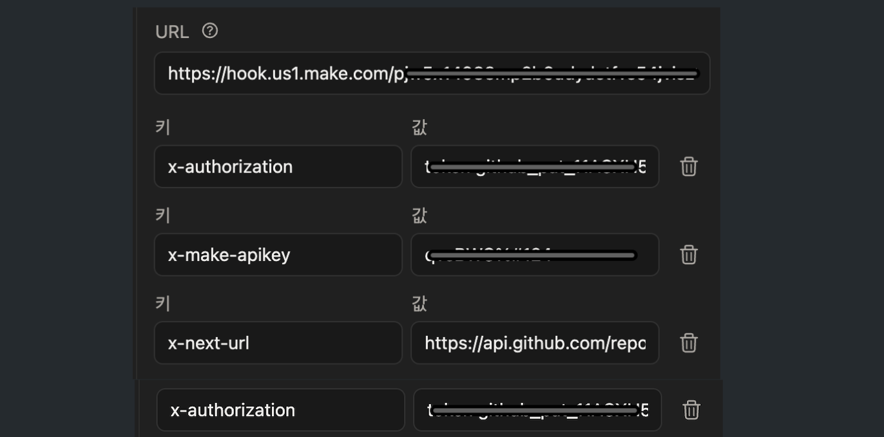
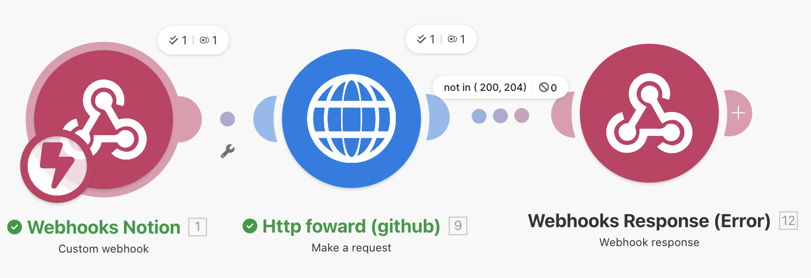

# hans-blog


[](https://github.com/plzhans/hans-blog/actions/workflows/deploy-hugo.yml)
[](https://github.com/plzhans/hans-blog/actions/workflows/notion-sync.yml)

[](https://blog.plzhans.com)


[Hugo](https://gohugo.io) 기반 개인 블로그. Notion에서 작성한 글을 Markdown으로 변환하여 Hugo로 빌드하고 GitHub Pages에 배포합니다.
> 블로그 주소: https://blog.plzhans.com

## 구조

```
hans-blog/
├── hugo/              # Hugo 프로젝트
│   ├── content/       # 변환된 Markdown 콘텐츠
│   └── public/        # 빌드 결과물 (gh-pages 브랜치에 배포)
├── src/
│   └── NotionCli.mjs  # Notion → Hugo Markdown 변환 CLI
├── .github/workflows/ # GitHub Actions 워크플로우
├── .makecom/          # Make.com 시나리오 설정
├── package.json
└── .nvmrc             # Node.js v24.13
```

## 빠른 시작

> 자세한 설치 방법은 [`setup.md`](setup.md)를 참고하세요.
>
> 편집기는 VSCode 기준으로 작업하며, 설정은 [`.vscode/`](.vscode/) 내 파일들을 참고하세요.
>
> 자주 사용하는 명령어는 [`Makefile`](Makefile)에 준비되어 있습니다.

### 주요 명령어

| 명령어 | 설명 |
|---|---|
| `make install` | npm 패키지 설치 |
| `make hugo` | Hugo 빌드 |
| `make notion-database-sync` | Notion 데이터베이스 전체 동기화 |
| `make notion-page-sync [page_id]` | 특정 Notion 페이지 동기화 |

### Hugo 설치

https://gohugo.io/installation/

### Node.js 설치

```bash
nvm install    # .nvmrc 기준 v24.13
nvm use
```

### 패키지 설치

```bash
npm install
```

### Notion 작성글 변환

Notion에서 작성한 글을 Markdown 파일로 변환하여
[`hugo/content/`](hugo/content/) 하위에 생성합니다.

로컬에서 실행할 때 환경변수가 필요합니다.
[`.env.sample`](.env.sample)을 복사하여 `.env` 파일을 만들고 값을 채워주세요.

Notion 데이터베이스의 속성(필드) 이름과 상태값 매핑은
[`notion.yml`](notion.yml)에서 설정할 수 있습니다.

```bash
node src/NotionCli.mjs database sync
```

### Hugo 빌드

Markdown 파일을 테마가 적용된 HTML로 변환합니다.
빌드 결과물은 [`hugo/public/`](hugo/public/)에 생성됩니다.

> 참고: `hugo/public/`은 빌드 결과물이므로 `.gitignore`에 의해 커밋되지 않습니다.

```bash
hugo -s ./hugo --logLevel debug
```

## 배포

### GitHub Pages

Hugo로 빌드된 `hugo/public/` 디렉토리가 `gh-pages` 브랜치에 배포되며, GitHub Pages 설정을 통해 서빙됩니다.

**브랜치 분리 (`master` / `gh-pages`):**

GitHub Pages는 브랜치 기반으로 동작하기 때문에 소스 코드와 빌드 결과물을 같은 브랜치에서 관리할 수 없습니다. 별도 저장소를 사용하거나 브랜치를 분리해야 하며, 이 프로젝트에서는 브랜치를 분리하는 방식을 사용합니다.

- `master` - 소스 코드 (Hugo 프로젝트, NotionCli, GitHub Actions 등)
- `gh-pages` - Hugo 빌드 결과물 (`hugo/public/`)

> 참고: GitLab Pages는 아티팩트 업로드 방식이라 브랜치 분리 없이 배포할 수 있습니다.

**커스텀 도메인 설정:**

GitHub Pages는 기본적으로 `plzhans.github.io/hans-blog` URL을 제공합니다. 커스텀 도메인 `blog.plzhans.com`을 사용하기 위해 다음 설정이 필요합니다:

1. DNS에 CNAME 레코드 추가: `blog.plzhans.com` → `plzhans.github.io`
2. `gh-pages` 브랜치 루트에 `CNAME` 파일이 존재해야 하며, 파일 내용에 커스텀 도메인(`blog.plzhans.com`)이 명시되어야 합니다.

### GitHub Actions

#### 자동 배포

`master` 브랜치에 `hugo/content/` 하위 Markdown 파일 변경이 push되면 자동으로 Hugo 빌드 및 배포가 실행됩니다.

#### Notion Webhook 연동 (Make.com)

`repository_dispatch` API를 통해 외부에서 GitHub Actions를 트리거하여 Notion 페이지를 동기화하고 배포할 수 있습니다.

> 요청 샘플: [`tests/http/github-event.http`](tests/http/github-event.http)

`repository_dispatch` API를 호출하려면 `event_type`, `client_payload` 등의 JSON body를 명시해야 합니다.
그러나 Notion의 자동화 기능은 웹훅 방식이라 요청 body를 직접 지정할 수 없습니다.

이를 해결하기 위해 Notion 웹훅을 [Make.com](https://www.make.com)으로 보내고,
Make.com에서 필요한 JSON body를 구성하여 GitHub `repository_dispatch` API로 전달합니다.



Notion 웹훅 호출 시 헤더에 리다이렉트 URL과 PAT 토큰을 명시하여,
Make.com에는 최소한의 설정만 하고 단순 포워딩 용도로만 사용합니다.

Notion 데이터베이스에 버튼 속성을 추가하고, 버튼 클릭 시 웹훅을 호출하도록 설정합니다. 이를 통해 Notion에서 직접 배포를 트리거할 수 있습니다.
- 시나리오 설정: [`notion-webhook-to-github-action.json`](.makecom/notion-webhook-to-github-action.json)
- Make.com 무료 플랜: 월 1,000 크레딧 제공, 포워드 1회 동작에 2크레딧 소모 (월 약 500회 요청 가능)



## SEO 설정

사이트 검색 최적화를 위해 SEO 설정이 적용되어 있습니다.

> 자세한 내용은 [`docs/seo.md`](docs/seo.md)를 참고하세요.

## 댓글 시스템 (giscus)

[giscus](https://giscus.app/ko)를 사용하여 블로그 포스트에 댓글 기능을 제공합니다.
GitHub Discussions 기반으로, 방문자가 GitHub 계정으로 로그인하여 댓글과 리액션을 남길 수 있습니다.

- 설정: [`hugo/hugo.toml`](hugo/hugo.toml)의 `[params.giscus]` 섹션
- 템플릿: [`hugo/layouts/_default/single.html`](hugo/layouts/_default/single.html)

> 자세한 설정 방법은 [`docs/giscus.md`](docs/giscus.md)를 참고하세요.

### GitHub Secrets 설정

GitHub Actions 워크플로우에서 사용하는 환경변수를 미리 등록해야 합니다.
GitHub 저장소의 **Settings > Secrets and variables > Actions**에서 다음 값을 등록하세요.

| Secret | 설명 |
|---|---|
| `PAT_TOKEN` | GitHub Personal Access Token. Notion 동기화 후 커밋 push 시 Deploy Hugo 워크플로우를 트리거하기 위해 필요. Fine-grained PAT: `Contents: Read and write`, Classic PAT: `repo` |
| `NOTION_API_TOKEN` | Notion Integration API 토큰 |
| `NOTION_DATABASE_ID` | Notion 데이터베이스 ID |

## 기타 참고 사항

### 코드 하이라이트 커스텀

코드 블록의 하이라이트 스타일을 커스텀하기 위해 Hugo의 Chroma CSS 클래스 방식을 사용합니다.

[`hugo/hugo.toml`](hugo/hugo.toml)에서 `noClasses = false` 설정 후, Chroma 스타일 CSS를 생성합니다.

```bash
hugo gen chromastyles --style=monokai > hugo/assets/css/syntax.css
```

생성된 CSS를 [`hugo/assets/css/_extra.scss`](hugo/assets/css/_extra.scss)에서 import 합니다.
> 참고: `_extra.scss`는 테마 기본 스타일 외에 추가 커스텀 스타일을 정의하는 파일입니다.

```scss
@import 'syntax';
```

> 다른 스타일을 적용하려면 `--style` 옵션을 변경하면 됩니다. 사용 가능한 스타일 목록은 [Chroma Style Gallery](https://xyproto.github.io/splash/docs/)에서 확인할 수 있습니다.
