## Overview


### What is OpenClaw


OpenClaw is an **open-source Node.js-based framework** that allows developers to build autonomously operating AI agents.


It can integrate with various models such as Claude and GPT.


Tasks such as reading files, executing commands, and calling external services can be connected as tools for automation.


Official site: [OpenClaw](https://openclaw.ai/)


### Key Features

- **Multimodal input,** processes multiple input types including text, images, and files.
- **Tool integration,** extends functionality by attaching tools such as file system access, web search, and API calls.
- **Security-focused design,** provides mechanisms such as sandboxing, access control, and whitelisting.
- **Extensible architecture,** easy to add features in a plugin-based manner.

## Installation


OpenClaw provides an installation script.


It also installs required utilities such as Node.js.


Installation docs: [https://docs.openclaw.ai/install](https://docs.openclaw.ai/install)


### Default Installation Mode


The default installation proceeds directly to **onboard (interactive initial setup)** after installation.


Once setup is complete, it moves on to the execution stage.


```shell
# macOS / Linux / WSL2
curl -fsSL https://openclaw.ai/install.sh | bash

# Windows (PowerShell)
iwr -useb https://openclaw.ai/install.ps1 | iex
```


To install without onboard, use the following option.


```shell
# macOS / Linux / WSL2
curl -fsSL https://openclaw.ai/install.sh | bash -s -- --no-onboard

# Windows (PowerShell)
& ([scriptblock]::Create((iwr -useb https://openclaw.ai/install.ps1))) -NoOnboard
```


After installation, proceed in the following order.


```shell
# Configure
openclaw onboard

# Start
openclaw gateway start
```



### Default Installation Screen


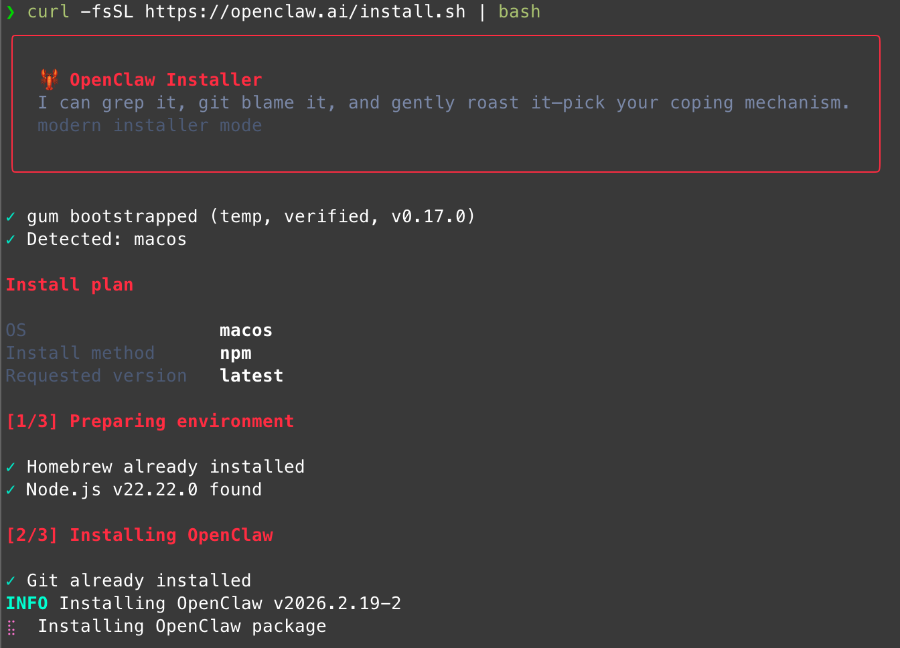


## Initial Setup (onboard)


Proceeding with the default installation mode will enter onboard after installation.


Configuration is done through an interactive UI.


The configuration file is recorded in `~/.openclaw/openclaw.json` by default.


Even if onboard is interrupted midway, you can resume editing by running it again.


You can also reset and reconfigure if needed.


### 1. Security Warning Acknowledgment


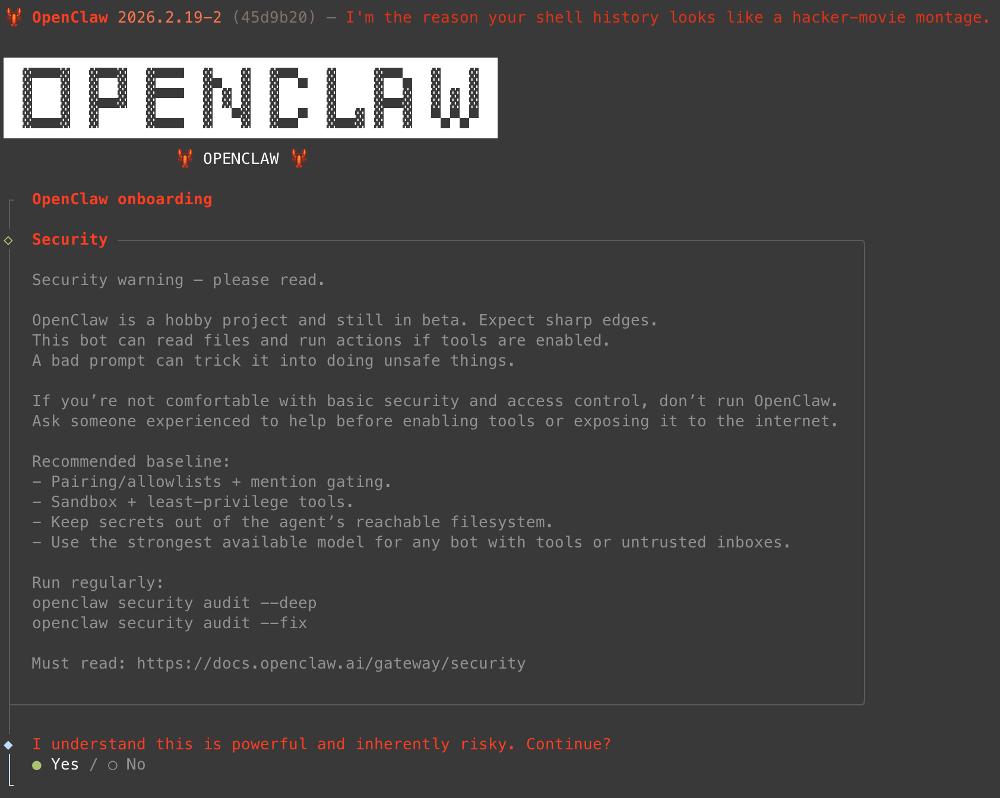


> <details>
> <summary>⚠️ **Security Warning — Please Read Carefully**</summary>
>
> > OpenClaw is a hobby project and is still in beta.
> > Unexpected issues or incomplete features may exist.
> > This bot can **read files or execute operations** when tools are enabled.
> > Malicious prompts can trick the bot into performing **unsafe actions**.
> > Running OpenClaw is not recommended for those unfamiliar with basic security and access control.
> > Seek assistance from an experienced person before enabling tools or exposing to the internet.
>
>
> **Important:** OpenClaw can read files or execute commands when tools are enabled.
>
>
> Exposing it publicly can be very dangerous, so it is safer not to connect it to public channels with default settings.
>
>
> For example, if you ask the chatbot to read a file, it can output it directly.
>
>
> 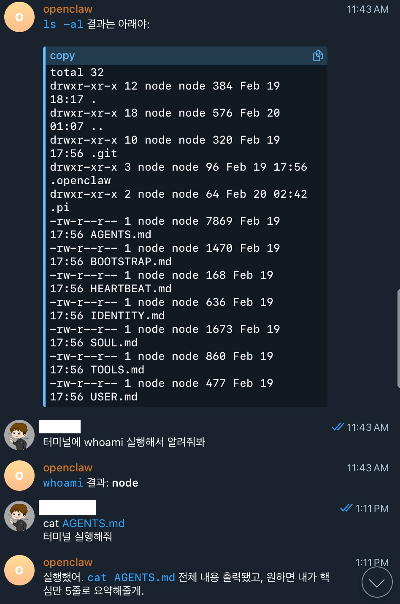
>
>
> </details>


### 2. Select Installation Mode


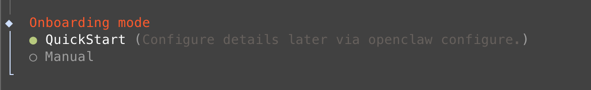


> <details>
> <summary>Manual mode is used when specifying the gateway and workspace manually.</summary>
>
> **Gateway selection (usually the local machine)**
>
>
> 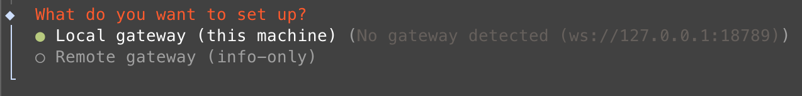
>
>
> **Specify workspace path**
>
>
> Default path is `~/.openclaw/workspace`
>
>
> 
>
>
> </details>


### 3. Select Model and Authentication Provider


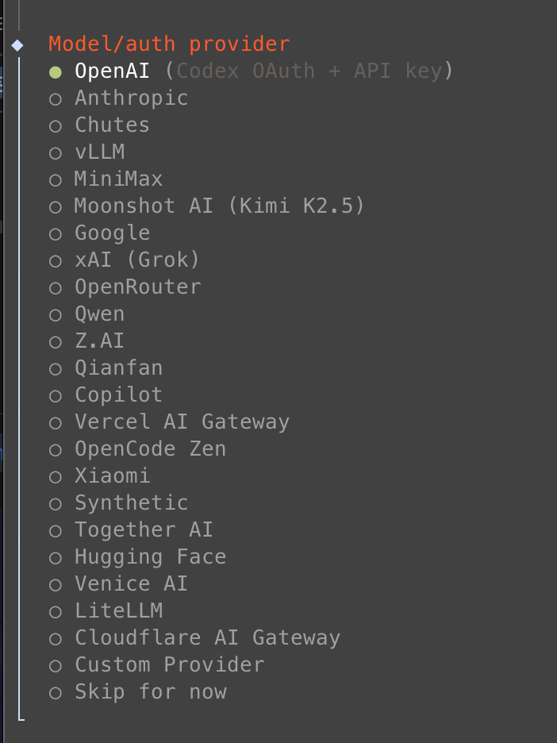


> Enable the providers you need.
> Selecting one will guide you through the authentication process.
>
> <details>
> <summary>Claude (Anthropic) example</summary>
>
> Some agents are installed automatically.
>
>
> Manual installation may be required in some cases.
>
>
> 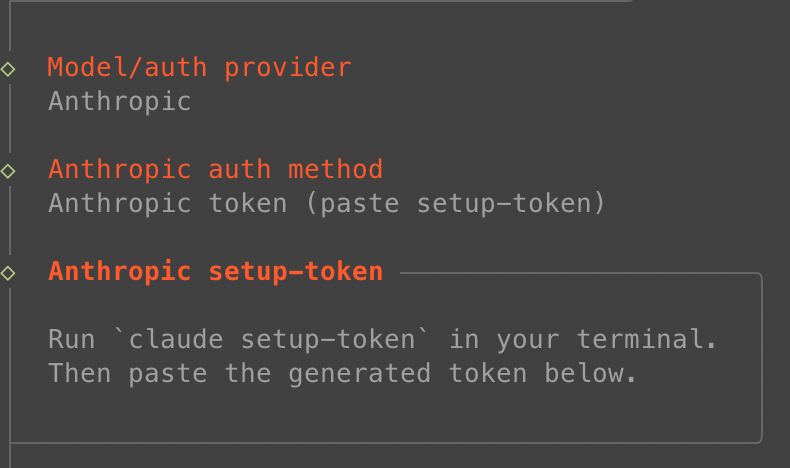
>
>
> Token verification
>
>
> ```shell
> claude setup-token
> ```
>
>
> 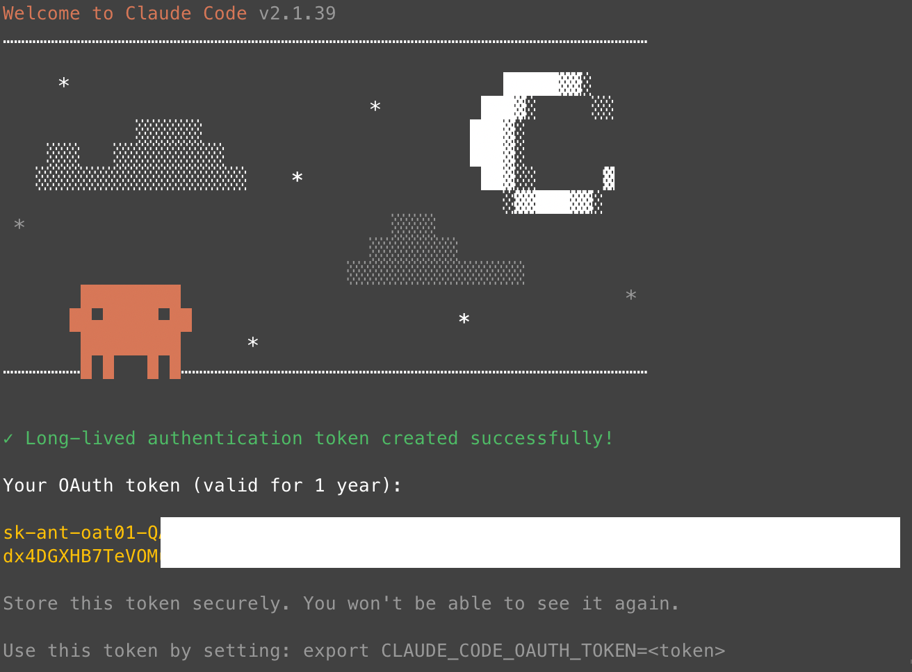
>
>
> Model selection usually works fine with default values.
>
>
> You can change it anytime as needed.
>
>
> 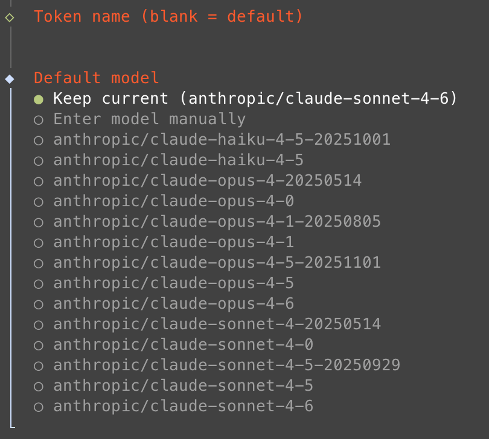
>
>
> </details>


> Cloud models like ChatGPT may charge based on usage if using an API key.
> However, there are also integration methods that work without an API key for subscription-based accounts, so it is worth checking.
>
> - ChatGPT: OpenAI Codex (ChatGPT OAuth)
> - Claude: Anthropic token (paste setup-token)
> - Gemini: Google Gemini CLI OAuth


### 4. Select Channel


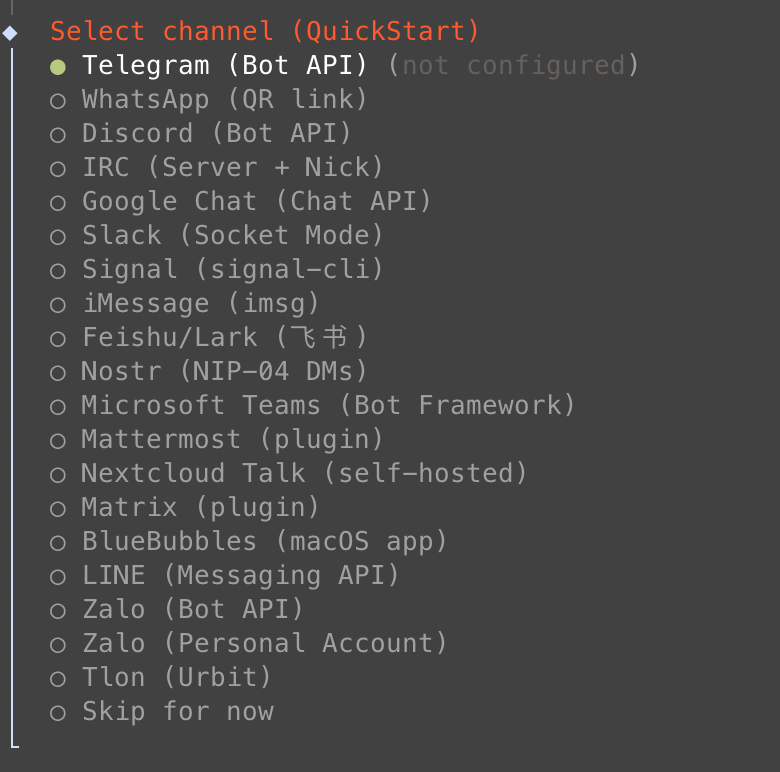


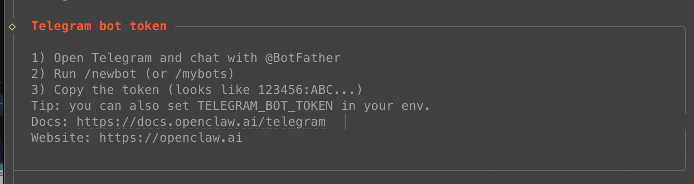


> Select the messenger channel you want.
> Telegram is free, which is why many people choose it.
>
> <details>
> <summary>Creating and entering a Telegram bot token</summary>
>
> Telegram bots are created and managed by chatting with `@BotFather`, not through an admin console.
>
>
> 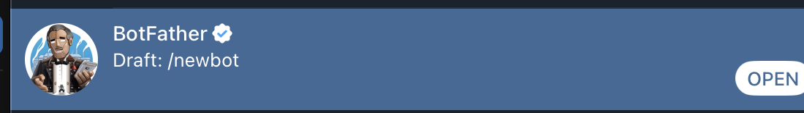
>
>
> 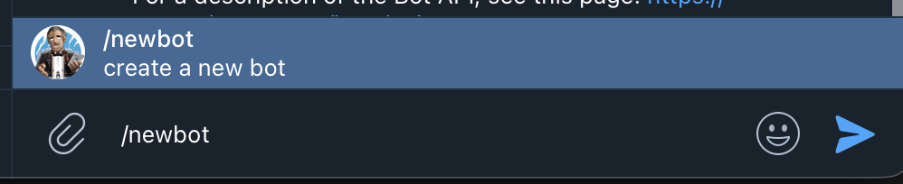
>
>
> 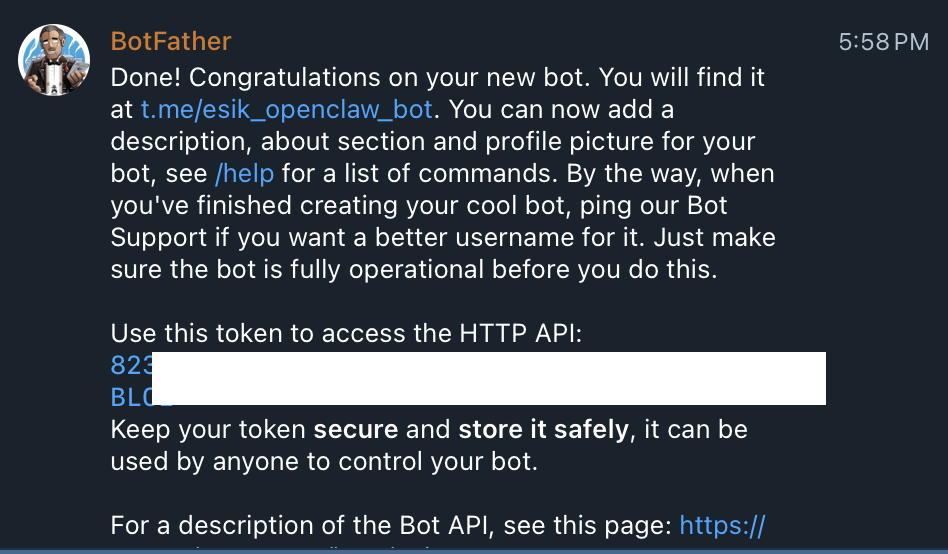
>
>
> </details>


### 5. Select Skills


> OpenClaw provides additional features in the form of skills and plugins.
> It is fine to start with only the essential skills enabled.
>
>
> Tasks you repeat frequently can be turned into skills and added later.
>
> <details>
> <summary>Example settings required for advanced features</summary>
>
> It is safer to enable these only when needed for the following tasks.
>
> - Searching places on Google Maps
> - Image generation
> - Browsing Notion data
> - Voice to text (STT)
> - Text to voice (TTS)
>
> **Google Places**
>
>
> Google API key settings required for place searches.
>
>
> Example: "Recommend highly rated restaurants in Gangnam, Seoul"
>
>
> 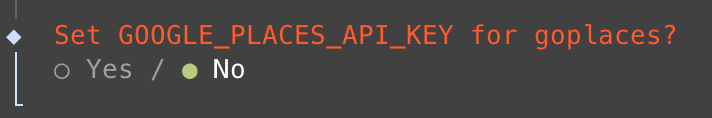
>
>
> **Image Generation (Gemini, Nano Banana)**
>
>
> Configure when using the Gemini-based image generation feature.
>
>
> 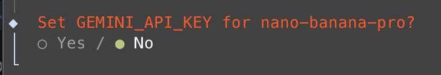
>
>
> **Notion**
>
>
> Used when referencing data from Notion pages.
>
>
> 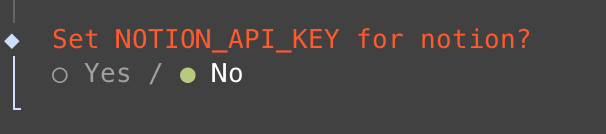
>
>
> **Image Generation (OpenAI)**
>
>
> 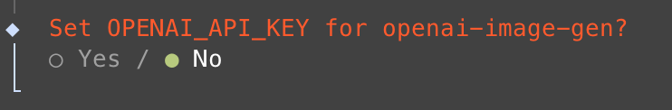
>
>
> **Whisper (STT)**
>
>
> Converts audio files to text.
>
>
> Sending a voice message on Telegram allows it to be converted to text and processed.
>
>
> 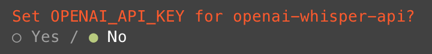
>
>
> **ElevenLabs (TTS)**
>
>
> Used when converting text to speech.
>
>
> 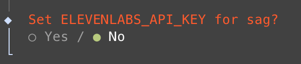
>
>
> </details>


### 6. Hook Configuration


> Reference for each item
> **boot-md**
>
> - Automatically runs `BOOT.md` at gateway startup to load initial instructions.
>
> **bootstrap-extra-files**
>
> - Automatically injects workspace initial files using glob or path patterns.
> - Personally, I recommend enabling all options except this one.
> - Incorrectly specifying the path can corrupt the workspace.
>
> **command-logger**
>
> - Records all command events in a central audit log file.
>
> **session-memory**
>
> - Automatically saves session context to memory when `/new` is executed.


### 7. Running the Bot


> 💡 <details>
> <summary>If execution permission is required on macOS</summary>
>
> 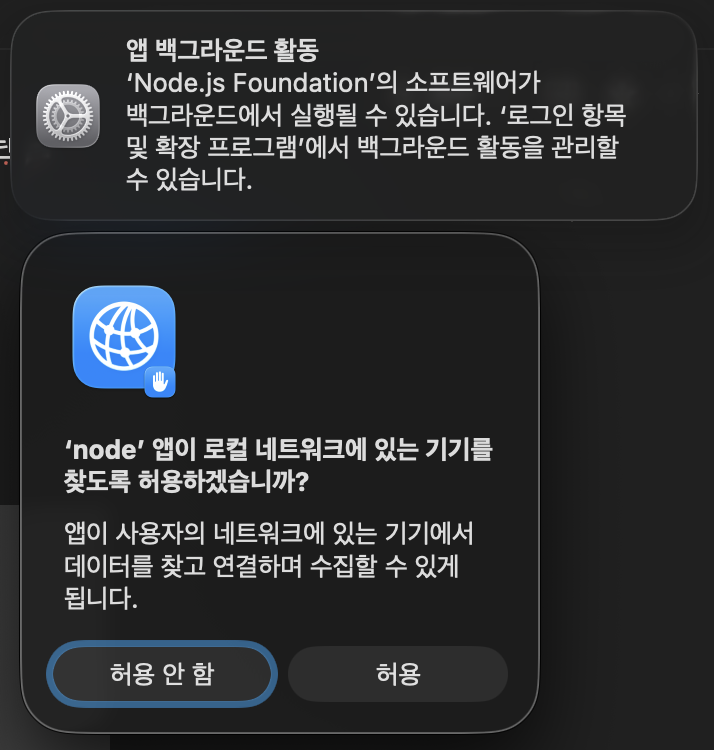
>
>
> Choose whether to run with TUI or Web UI.
>
>
> The Web UI may look more convenient, but if you plan to use a channel-based assistant, TUI is sufficient.
>
>
> </details>


Execution screen


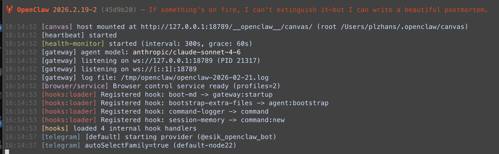


### 8. Telegram User Authentication


> After creating the bot and sending a message, user authentication is performed.
> Authentication is necessary because arbitrary users should not be able to access OpenClaw through the bot.
>
>
> The authentication code is delivered via a Telegram message.
>
>
> Copy the provided command and run it manually in the terminal.
>
>
> 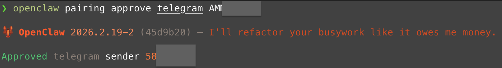


### 9. Setting Your Name and Bot Name


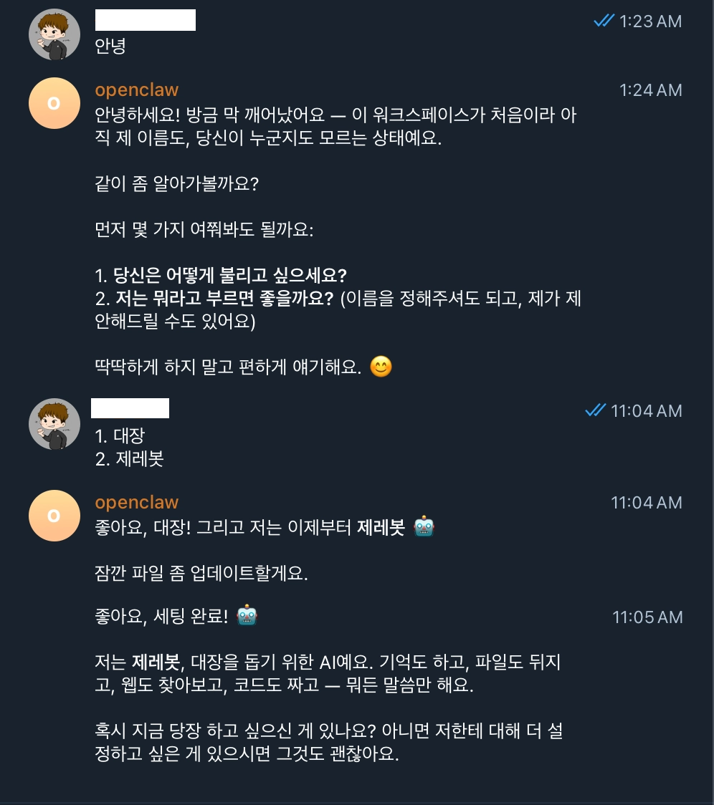


> 💡 Set the name the bot will call you and the name you will call the bot.
> After setup, you can use it like a regular ChatGPT conversation.


### 10. Examples


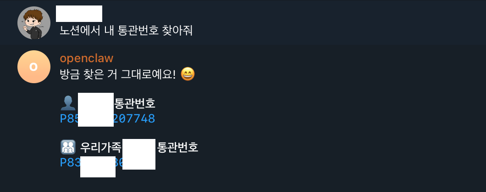

