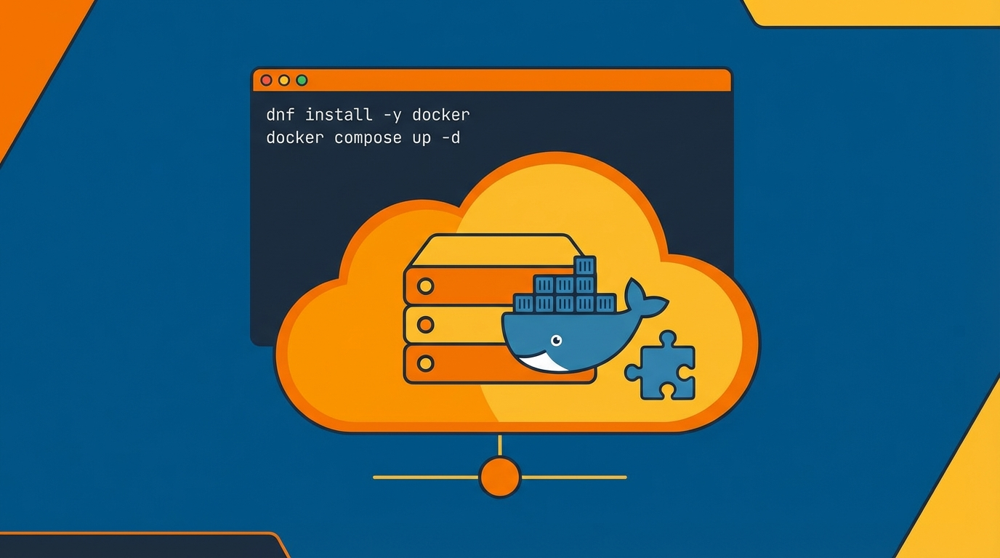

## 개요


Amazon Linux 2023 기반 EC2에서 Docker와 Docker Compose를 동작시키는 최소 설치 절차를 정리한다.


## 패키지 설치


`dnf`는 RHEL 계열(예: Fedora, RHEL, Amazon Linux 2023)에서 사용하는 패키지 매니저다.


Ubuntu/Debian의 `apt-get`이나 CentOS의 `yum`과 같은 역할을 한다.


리포지토리에서 패키지를 내려받아 설치하고 의존성을 자동으로 처리한다.


### 패키지 업데이트


```bash
sudo dnf update -y
```


### Docker 설치


```bash
sudo dnf install -y docker
```


## 기본 설정


### Docker 서비스 활성화


Docker 데몬(dockerd)이 실제로 실행되어야 `docker` 명령이 동작한다.


`enable --now`는 <strong>지금 바로 시작</strong>하고 <strong>재부팅 후에도 자동 시작</strong>되도록 등록한다.


```bash
sudo systemctl enable --now docker
```


### 현재 사용자에게 Docker 권한 부여


기본적으로 Docker 소켓(`/var/run/docker.sock`)은 root 권한이 필요하다.


`docker` 그룹에 사용자를 추가하면 매번 `sudo`를 붙이지 않고도 Docker를 사용할 수 있다.


`newgrp docker`는 <strong>현재 세션에 그룹 변경을 즉시 반영</strong>하기 위한 명령이다.


로그아웃 후 재로그인해도 동일하게 적용된다.


```bash
sudo usermod -aG docker $USER
newgrp docker
```


Docker 실행 확인


```bash
docker version
```


Amazon Linux 2023 환경에서는 Docker 설치만으로 `docker compose`가 함께 제공되는 경우가 있다.


```bash
docker compose version
```


## Docker Compose 별도 설치가 필요한 경우


`docker compose version`이 실패하면 아래 방식으로 CLI 플러그인을 설치한다.


디렉토리 생성


```bash
mkdir -p ~/.docker/cli-plugins
```


설치: ARM64(aarch64)


```bash
curl -SL https://github.com/docker/compose/releases/latest/download/docker-compose-linux-aarch64 \
	-o ~/.docker/cli-plugins/docker-compose
```


x86_64 기준


```bash
curl -SL https://github.com/docker/compose/releases/latest/download/docker-compose-linux-x86_64 \
	-o ~/.docker/cli-plugins/docker-compose
```


실행 권한 추가


```bash
chmod +x ~/.docker/cli-plugins/docker-compose
```


Docker Compose 설치 확인


```bash
docker compose version
```

