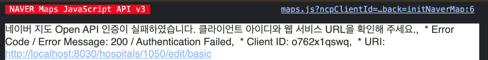

## 네이버 지도 인증 오류


어플리케이션 설정에서 서비스 url을 정상 등록했는데도 불구하고 인증이 실패함.


### 문제: 네이버 지도 인증이 실패 한다

> 네이버 지도 Open API 인증이 실패하였습니다. 클라이언트 아이디와 웹 서비스 URL을 확인해 주세요.,  * Error Code / Error Message: 200 / Authentication Failed,  * Client ID: xxxxx,  * URI: [http://localhost:8030/](http://localhost:8030/hospitals/1050/edit/basic)xxxxx  
> 
>
> 
>
>
> 
>
>

### 원인: 클라이언트 ID 파라메터 이름이 `ncpClientId` 에서 `ncpKeyId` 로 변경 되었다.


참고 문서

- [https://navermaps.github.io/maps.js.ncp/docs/tutorial-2-Getting-Started.html](https://navermaps.github.io/maps.js.ncp/docs/tutorial-2-Getting-Started.html)

### 해결: 파라메터 ID 정상적으로 사용하기


변경 전


```plain text
<!-- 일반 -->
<script type="text/javascript" src="https://oapi.map.naver.com/openapi/v3/maps.js?ncpClientId=YOUR_CLIENT_ID"></script>

<!-- 공공 -->
<script type="text/javascript" src="https://oapi.map.naver.com/openapi/v3/maps.js?govClientId=YOUR_CLIENT_ID"></script>

<!-- 금융 -->
<script type="text/javascript" src="https://oapi.map.naver.com/openapi/v3/maps.js?finClientId=YOUR_CLIENT_ID"></script>
```


변경 후


```plain text
<!-- 개인/일반 통합 -->
<script type="text/javascript" src="https://oapi.map.naver.com/openapi/v3/maps.js?ncpKeyId=YOUR_CLIENT_ID"></scri
```

