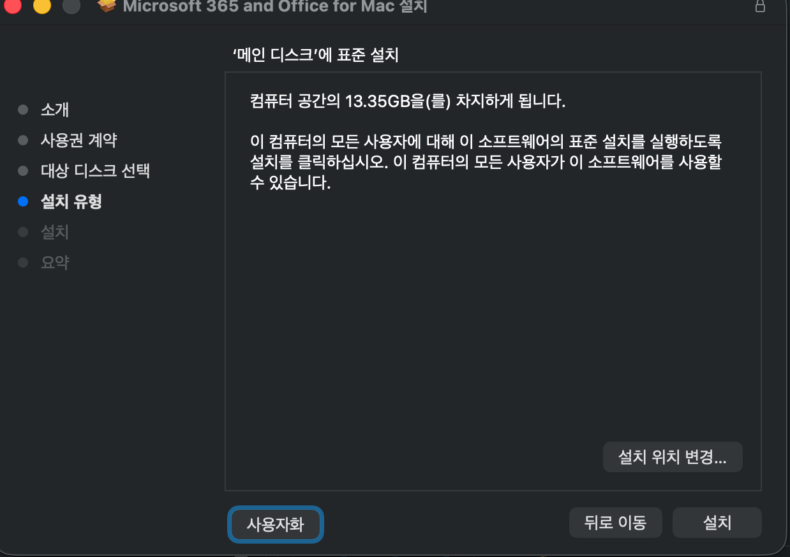
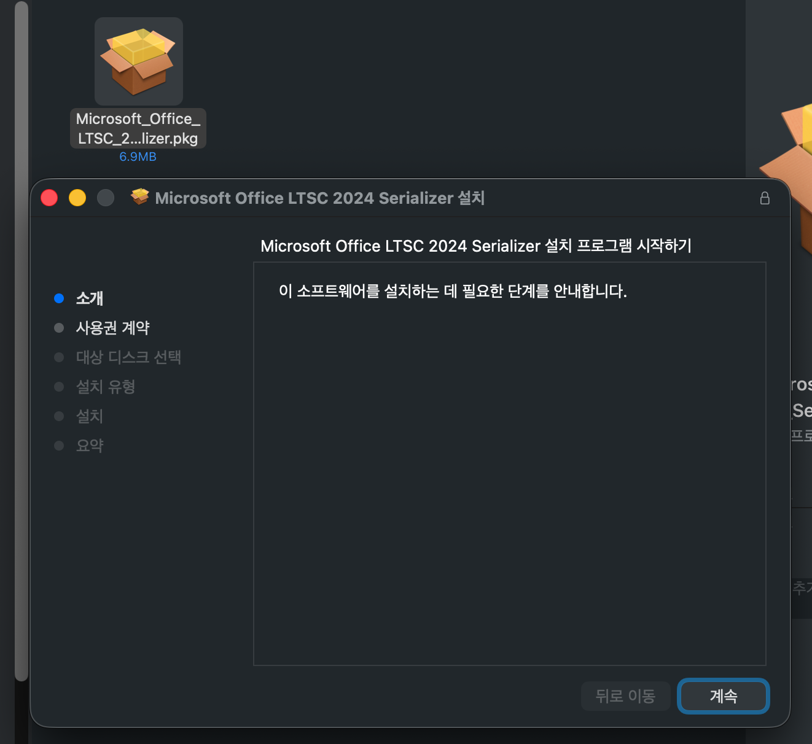
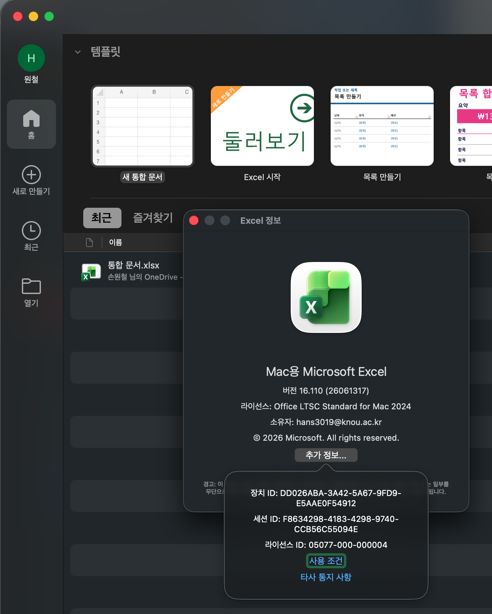

## 概要


Macで Microsoft Office をインストールする際は、ライセンス認証が必要です。  


Microsoft 365 アカウントで認証するか、特定のバージョンをインストールした後にシリアルを入力する方法があります。 


組織にボリュームライセンスがある場合は、VL Serializer で認証するインストール方法をおすすめします。  


出典: [https://github.com/alsyundawy/Microsoft-Office-For-MacOS](https://github.com/alsyundawy/Microsoft-Office-For-MacOS)


---


## インストール手順

1. インストールする Office のバージョンを選択します
    - 例: [**Office LTSC 2021/2024 Suite Installer**](https://go.microsoft.com/fwlink/?linkid=525133)
2. インストールを進めます
    - 必要なアプリのみを選んでインストールできます
3. Office VL Serializer をダウンロードします
    - 例: [Office 2024 LTSC VL Serializer](https://github.com/alsyundawy/Microsoft-Office-For-MacOS/blob/master/DATA/Microsoft_Office_LTSC_2024_VL_Serializer.pkg)
4. Serializer を実行してボリュームライセンスを適用します
5. Office アプリを起動して認証状態を確認します

---


## インストール画面の例


インストール


カスタマイズ





必要なものだけインストール


Serializer のダウンロード





実行および認証確認





---


## オプション


### テレメトリの無効化


```bash
defaults write com.microsoft.Word SendAllTelemetryEnabled -bool FALSE
defaults write com.microsoft.Excel SendAllTelemetryEnabled -bool FALSE
defaults write com.microsoft.Powerpoint SendAllTelemetryEnabled -bool FALSE
defaults write com.microsoft.Outlook SendAllTelemetryEnabled -bool FALSE
defaults write com.microsoft.onenote.mac SendAllTelemetryEnabled -bool FALSE
defaults write com.microsoft.autoupdate2 SendAllTelemetryEnabled -bool FALSE
defaults write com.microsoft.Office365ServiceV2 SendAllTelemetryEnabled -bool FALSE
```


### クラウドログイン機能の無効化


```bash
defaults write com.microsoft.Word UseOnlineContent -integer 0
defaults write com.microsoft.Excel UseOnlineContent -integer 0
defaults write com.microsoft.Powerpoint UseOnlineContent -integer 0
```
