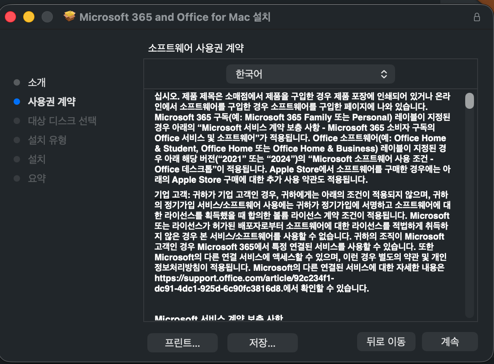

## 개요


Mac에서 Microsoft Office를 설치할 때는 라이선스 활성화가 필요하다.  


Microsoft 365 계정으로 활성화하거나 특정 버전 설치 후 시리얼을 입력하는 방식이 있다. 


조직에 볼륨 라이선스가 있다면 VL Serializer로 인증하는 설치 방식을 권장한다.  


출처: [https://github.com/alsyundawy/Microsoft-Office-For-MacOS](https://github.com/alsyundawy/Microsoft-Office-For-MacOS)


---


## 설치 순서

1. 설치할 Office 버전을 선택한다
    - 예시 : [**Office LTSC 2021/2024 Suite Installer**](https://go.microsoft.com/fwlink/?linkid=525133)
2. 설치를 진행한다
    - 필요한 앱만 선택해 설치할 수 있다
3. Office VL Serializer를 다운로드한다
    - 예시: [Office 2024 LTSC VL Serializer](https://github.com/alsyundawy/Microsoft-Office-For-MacOS/blob/master/DATA/Microsoft_Office_LTSC_2024_VL_Serializer.pkg)
4. Serializer를 실행해 볼륨 라이선스를 적용한다
5. Office 앱을 실행해 인증 상태를 확인한다

---


## 설치 화면 예시


설치





사용자화


필요한 것만 설치


Serializer 다운로드


실행 및 인증 확인


---


## 선택 사항


### 원격 측정 비활성화


```bash
defaults write com.microsoft.Word SendAllTelemetryEnabled -bool FALSE
defaults write com.microsoft.Excel SendAllTelemetryEnabled -bool FALSE
defaults write com.microsoft.Powerpoint SendAllTelemetryEnabled -bool FALSE
defaults write com.microsoft.Outlook SendAllTelemetryEnabled -bool FALSE
defaults write com.microsoft.onenote.mac SendAllTelemetryEnabled -bool FALSE
defaults write com.microsoft.autoupdate2 SendAllTelemetryEnabled -bool FALSE
defaults write com.microsoft.Office365ServiceV2 SendAllTelemetryEnabled -bool FALSE
```


### 클라우드 로그인 기능 비활성화


```bash
defaults write com.microsoft.Word UseOnlineContent -integer 0
defaults write com.microsoft.Excel UseOnlineContent -integer 0
defaults write com.microsoft.Powerpoint UseOnlineContent -integer 0
```

