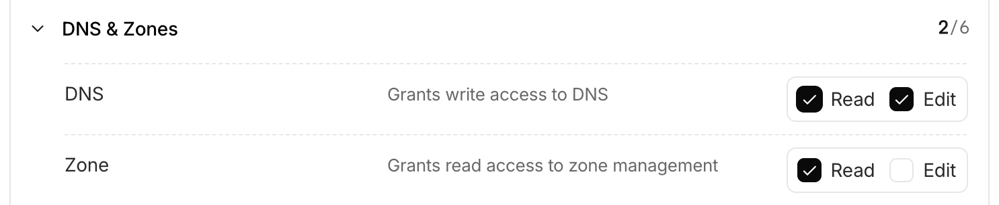
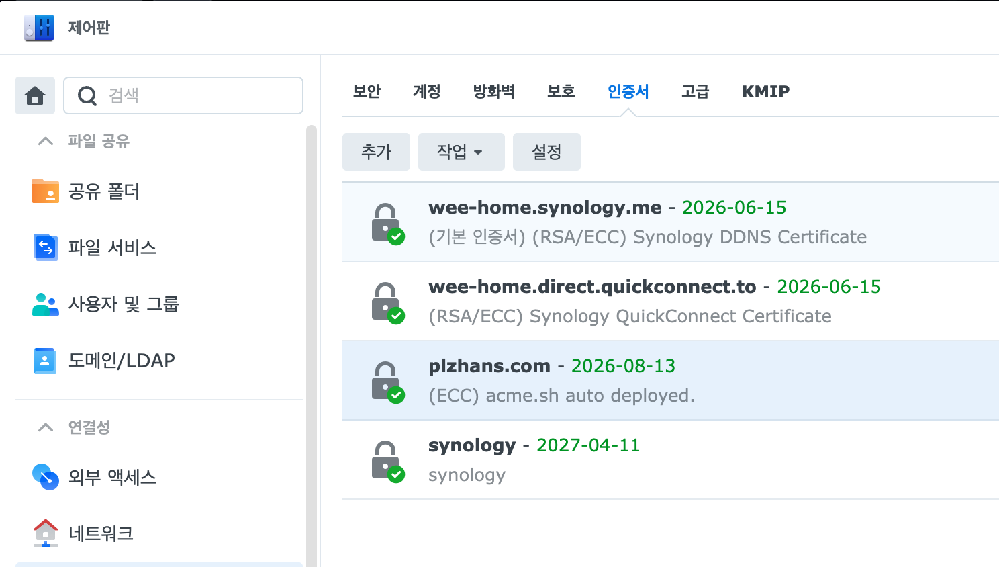

## Overview


Directly exposing DSM to the outside is risky, so using a VPN such as Tailscale, OpenVPN, or WireGuard is recommended.


In an environment where external access is blocked and the domain is matched to a private IP, it is difficult to register a free certificate via the HTTP authentication method.


This article summarizes **how to issue a Let’s Encrypt free SSL certificate with** [**acme.sh<strong>](http://acme.sh/)</strong>**on a Synology NAS (DSM) and automatically install it on DSM**.


---


## Prerequisites

- Domain: e.g.) `plzhans.com`
- DNS: Cloudflare (recommended)
- An account for DSM automatic installation (an account without 2FA is required, see below)

---


## Issuing a Cloudflare API Token (Least Privilege)


For security, create a token that grants only the minimum privileges to a specific domain.


### Minimum Required Permissions

- DNS: Read, Edit
- Zone: Read




---


## Issuing the Certificate ([acme.sh](http://acme.sh/))


### Check with the Test Server First


Repeatedly sending requests to the Production server may get you blocked. Use the test server until you have established a successful cycle.

- `--server letsencrypt_test`
- Issuing requires the `--issue` option

```bash
#!/bin/bash

export CF_Token="cloudflare_api_token"

acme.sh \
  --server letsencrypt_test \
  --log --debug \
  --home ~/ssl \
  --issue \
  --dns dns_cf \
  -d "plzhans.com" \
  -d "*.plzhans.com"
```


### Actual (Production) Issuance


```bash
acme.sh \
  --server letsencrypt \
  --log --debug \
  --home ~/ssl \
  --issue \
  --dns dns_cf \
  -d "plzhans.com" \
  -d "*.plzhans.com"
```


### Verifying the Issuance


```bash
acme.sh \
  --home ~/scripts/ssl \
  --list

# execute result
# Main_Domain	KeyLength	SAN_Domains	CA	Created	Renew
# plzhans.com	"ec-256"	*.plzhans.com	LetsEncrypt.org	2026-05-15T04:59:58Z	2026-07-13T04:59:58Z
```


Notes

- The token information you used is stored in the `account.conf` file
- The domain settings are stored, for example, in `~/ssl/plzhans.com_ecc/plzhans.com.conf`

---


## Installing the Issued Certificate on DSM (deploy-hook)


[acme.sh](http://acme.sh/) supports `synology_dsm` as a deploy-hook.

- If there is no certificate on DSM, the `SYNO_Create="1"` value must be present for it to be created
- If a test certificate has already been issued, you may need to delete it or use the `--force` option

### Removing the Existing Certificate (If Necessary)


```bash
acme.sh --remove --home ~/ssl -d "plzhans.com"
```


### DSM Automatic Installation Script Example


```bash
#!/bin/bash

# syno server
export SYNO_Hostname="localhost"
export SYNO_Scheme="https"
export SYNO_Port="5001"

# syno account
export SYNO_Username='system-script'
export SYNO_Password='secret'

export SYNO_Create="1"

acme.sh \
  --deploy \
  --insecure \
  --home ~/ssl \
  --log --debug \
  --deploy-hook synology_dsm \
  -d "plzhans.com"

# execute result
# ...
# ret='0'
# Success
```


---


## Issue: When Automation Is Blocked by 2FA


If 2FA is applied to the `SYNO_Username` account, it interferes with automation.


Solution

- Create a separate account (an administrator account is required)
- Operate it with minimal security measures for automation
    - No external access
    - Grant only the necessary permissions
- Disable 2FA for that account

DSM verification





---


## FAQ: Hostname/Certificate Matching Problem


If external access is blocked and the primary domain cannot be reached (e.g., `wee-home.synology.me`), an error may occur due to a certificate matching failure. This is because when the command runs, it connects via `https://{Hostname}:{port}`.


Choose one of the three solutions

1. Specify `SYNO_Hostname` as a reachable domain with a valid certificate
2. Specify the domain in the `/etc/hosts` file to bypass the DNS query and connect to `127.0.0.1`
3. Use the `http` method

---


## References

- [https://github.com/acmesh-official/acme.sh/wiki/Synology-NAS-Guide](https://github.com/acmesh-official/acme.sh/wiki/Synology-NAS-Guide)
