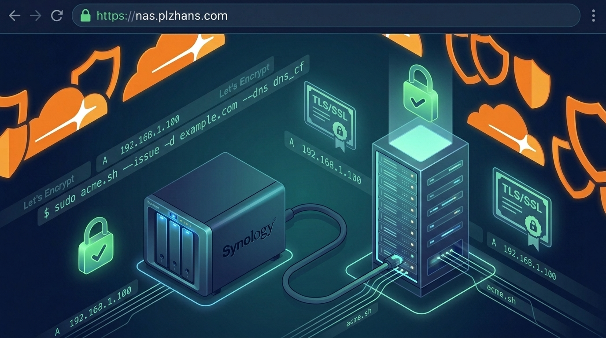

## 개요


DSM을 외부에서 직접 노출하는 방식은 위험하므로 Tailscale, OpenVPN, WireGuard 같은 VPN 사용을 권장한다. 


외부 접근을 차단하고 도메인을 사설 IP로 매칭한 환경에서는 HTTP 인증 방식으로 무료 인증서 등록이 어렵다. 


이 글은 **Synology NAS(DSM)에서** [**acme.sh<strong>](http://acme.sh/)</strong>로 Let’s Encrypt 무료 SSL 인증서를 발급하고 DSM에 자동 설치하는 방법**을 정리한다.


---


## 준비 사항

- 도메인: 예) `plzhans.com`
- DNS: Cloudflare 사용(권장)
- DSM 자동 설치용 계정(2FA 없는 계정 필요, 아래 참고)

---


## Cloudflare API 토큰 발급(최소 권한)


보안을 위해 특정 도메인에 최소 권한만 부여한 토큰을 만든다.


### 최소 필수 권한

- DNS: Read, Edit
- Zone: Read


---


## 인증서 발급([acme.sh](http://acme.sh/))


### 테스트 서버로 먼저 확인


운영(Production) 서버로 반복 요청하면 차단될 수 있다. 성공 사이클을 만들 때까지는 테스트 서버를 사용한다.

- `--server letsencrypt_test`
- 발급에는 `--issue` 옵션이 필요하다

```bash
#!/bin/bash

export CF_Token="cloudflare_api_token"

acme.sh \
  --server letsencrypt_test \
  --log --debug \
  --home ~/ssl \
  --issue \
  --dns dns_cf \
  -d "plzhans.com" \
  -d "*.plzhans.com"
```


### 실제(운영) 발급


```bash
acme.sh \
  --server letsencrypt \
  --log --debug \
  --home ~/ssl \
  --issue \
  --dns dns_cf \
  -d "plzhans.com" \
  -d "*.plzhans.com"
```


### 발급 확인


```bash
acme.sh \
  --home ~/scripts/ssl \
  --list

# execute result
# Main_Domain	KeyLength	SAN_Domains	CA	Created	Renew
# plzhans.com	"ec-256"	*.plzhans.com	LetsEncrypt.org	2026-05-15T04:59:58Z	2026-07-13T04:59:58Z
```


참고

- 사용한 토큰 정보는 `account.conf` 파일에 저장된다
- 도메인 설정은 예) `~/ssl/plzhans.com_ecc/plzhans.com.conf` 에 저장된다

---


## 발급한 인증서 DSM에 설치(deploy-hook)


[acme.sh](http://acme.sh/)는 deploy-hook으로 `synology_dsm`을 지원한다.

- DSM에 인증서가 없는 경우 `SYNO_Create="1"` 값이 있어야 생성된다
- 테스트 인증서가 이미 발급돼 있으면 삭제하거나 `--force` 옵션이 필요할 수 있다

### 기존 인증서 삭제(필요 시)


```bash
acme.sh --remove --home ~/ssl -d "plzhans.com"
```


### DSM 자동 설치 스크립트 예시


```bash
#!/bin/bash

# syno server
export SYNO_Hostname="localhost"
export SYNO_Scheme="https"
export SYNO_Port="5001"

# syno account
export SYNO_Username='system-script'
export SYNO_Password='secret'

export SYNO_Create="1"

acme.sh \
  --deploy \
  --insecure \
  --home ~/ssl \
  --log --debug \
  --deploy-hook synology_dsm \
  -d "plzhans.com"

# execute result
# ...
# ret='0'
# Success
```


---


## 문제 발생: 2FA로 자동화가 막히는 경우


`SYNO_Username` 계정에 2FA가 적용돼 있으면 자동화에 방해된다.


해결책

- 별도의 계정을 생성한다(관리자 계정 필요)
- 자동화용 최소 보안 조치로 운영한다
    - 외부 접근 불가
    - 필요한 권한만 부여
- 해당 계정은 2FA 비활성화

DSM 확인


---


## FAQ: Hostname/인증서 매칭 문제


외부 접속이 차단돼 대표 도메인으로 접근이 불가한 경우(예: `wee-home.synology.me`) 인증서 매칭 실패로 오류가 날 수 있다. 명령이 동작할 때 `https://{Hostname}:{port}`로 접근하기 때문이다.


해결책 3가지 중 하나 선택

1. `SYNO_Hostname`을 실제 접근 가능한 정상 인증서 도메인으로 명시한다
2. `/etc/hosts` 파일에서 도메인을 명시해 DNS 질의를 우회하고 `127.0.0.1`로 연결한다
3. `http` 방식을 사용한다

---


## 참고

- [https://github.com/acmesh-official/acme.sh/wiki/Synology-NAS-Guide](https://github.com/acmesh-official/acme.sh/wiki/Synology-NAS-Guide)
