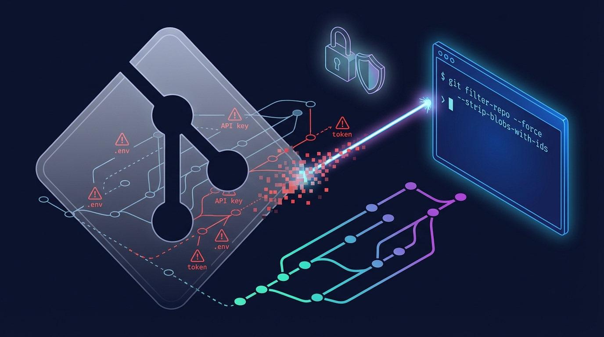

## 개요


**비밀키는 “지웠다”로 끝나지 않는다**


비밀키, 토큰, `.env` 같은 민감 정보는 한 번 커밋되면 `git rm`으로 파일을 지워도 과거 커밋에 그대로 남는다.


올바르게 민감 정보를 정리하려면 커밋 히스토리를 다시 작성해야 한다.


이 작업에 가장 많이 쓰이는 도구가 `git filter-repo`다.


## 처리 절차


**핵심 개념: “제거할 정보를 정의”하고 새 히스토리를 생성한다**


`git filter-repo`는 필터 규칙에 따라 커밋을 다시 쓰는 도구다.


실무에서의 사고 방식은 보통 다음 순서로 정리된다.


> ⚠️ **중요**  
> - 히스토리 재작성 작업이다.  
> - 커밋 SHA가 바뀐다.  
> - 원격에 반영하려면 보통 강제 푸시가 필요하다.  
> - 이미 유출되었을 수 있으니, 히스토리 정리와 별개로 키와 토큰은 반드시 폐기하고 재발급한다.


### 1) 제거 대상을 정의 - 무엇을 삭제할 것인가?

- 파일 단위: `.env`, `id_rsa`, `secrets.yml`
- 디렉토리 단위: `config/keys/`
- 패턴 단위: `*.pem`, `*.p12`, `*.key`

### 2) 재작성 범위 - 어디까지 고칠지를 정의

- 전체 브랜치와 태그까지 전부 정리할지 결정한다
- 특정 브랜치만 정리할지 결정한다

### 3) 재작성 결과를 검증한다

- 히스토리에 더 이상 남지 않았는지 확인한다
- 태그와 브랜치 refs가 의도대로 유지되는지 확인한다

### 4) 원격 반영과 협업자 대응을 정리한다

- 원격 저장소에는 기존 커밋 그래프를 버리고 새 커밋 그래프로 강제 푸시한다
- 이 시점부터 원격은 하드 포크 상태가 되고, 기존 히스토리는 기준이 되지 않는다
- 모든 작업자는 기존 로컬 트리를 유지한 채로는 정상 동기화가 어렵다
- 원칙적으로 재클론해서 새 트리로 동기화한다
- 기존 로컬을 유지해야 한다면, 작업 브랜치를 백업하고 새 원격 기준으로 재정렬한다

> ⚠️ **중요**  
> - 원격 반영은 `git push --force`가 전제다.  
> - 강제 푸시는 원격의 기존 커밋을 새 커밋으로 덮어쓴다.  
> - 따라서 협업자는 기존 트리를 폐기하고, 새 커밋 그래프 기준으로 다시 동기화해야 한다.  
> - 팀이 같은 시점에 동시에 전환하지 않으면, pull과 merge가 뒤틀린 상태로 남는다.  
> - GitHub, GitLab은 저장소 설정에서 브랜치를 보호(Protected branch)할 수 있다.  
> - 브랜치가 보호되면 강제 푸시가 차단되거나, 관리자 권한과 예외 설정이 필요하다.  
> - 작업 전에 보호 규칙을 확인하고, 필요하면 임시로 규칙을 완화한 뒤 작업을 진행한다.


## 예시


### 준비: 작업용 복제본에서 시작한다


원본 작업 디렉토리에서 바로 실행하지 않고 `hans-repo` 같은 작업용 복제본에서 진행하는 흐름이 안전하다.


```bash
git clone --mirror <원본-저장소-URL> hans-repo.git
cd hans-repo.git
```

- `--mirror`는 브랜치와 태그 refs를 모두 포함해서 가져온다.
- 비밀 정보 제거는 일부 브랜치만 정리하는 것보다 전체 refs 정리가 필요한 경우가 많다.

### 1) 파일을 히스토리에서 완전히 제거한다(가장 흔한 케이스)


예: `.env`를 과거 포함 전체에서 제거한다.


```bash
git filter-repo --path .env --invert-paths
```

- `--path .env`는 대상 경로를 지정한다.
- `--invert-paths`는 이 경로를 제거한다는 의미다.

예: 개인키 파일을 제거한다.


```bash
git filter-repo --path id_rsa --invert-paths
```


예: 특정 디렉토리 전체를 제거한다.


```bash
git filter-repo --path config/keys/ --invert-paths
```


### 2) 패턴 기반으로 제거하고 싶을 때


확장자 기반으로 제거하고 싶다면, 제거할 파일을 먼저 식별한 뒤 경로로 제거하는 방식이 통제하기 쉽다.

- 예: `*.pem`, `*.p12`, `*.key`가 어디에 있는지 먼저 찾는다
- 찾은 결과를 기준으로 `--path ... --invert-paths`를 적용한다
> 패턴을 한 번에 지우려는 욕심 때문에 의도치 않은 인증서나 샘플 파일까지 날리는 사고가 흔하다.

### 3) 검증: 정말로 히스토리에서 사라졌는지 확인한다


필터 후에는 전체 히스토리에 흔적이 없는지를 확인해야 한다.


```bash
# 경로가 더 이상 등장하지 않는지 확인한다
git log --all --name-only -- .env

# 출력이 없으면 히스토리에서 제거된 상태다.
git log --all --name-only -- config/keys/
```


### 4) 새 히스토리를 원격에 강제 푸시하고 협업자 동기화


정리된 히스토리를 새 원격으로 올리는 방식이 가장 안전하다.


기존 저장소를 그대로 유지해야 한다면 강제 푸시가 필요하다.


이 시점부터 원격의 커밋 그래프는 이전 그래프와 단절되고, 기존 히스토리는 사실상 폐기된다.


```bash
git push --force --all
git push --force --tags
```

- 협업자 영향
    - 기존 로컬 저장소는 새 원격과 커밋 그래프가 달라진다
    - 단순 `git pull`로는 정상 동기화가 어렵다
    - 원칙적으로 재클론을 수행해 새 트리로 동기화한다
    - 부득이하게 기존 로컬을 유지한다면 작업 브랜치를 백업한 뒤 새 원격을 기준으로 재정렬(rebase 또는 cherry-pick)한다

## 마무리


**왜 filter-repo인가?**


과거에는 `git filter-branch`로 같은 작업을 했다.


다만 `filter-branch`는 느리고 실수 유발 여지가 커서 현재는 `git filter-repo`가 사실상 표준 대체재로 쓰인다.


| 항목          | git filter-branch | git filter-repo |
| ----------- | ----------------- | --------------- |
| 민감 정보 제거 작업 | 가능하지만 번거롭고 위험하다   | 실무에서 가장 흔한 사용처다 |
| 성능          | 느리다               | 빠르다             |
| 안전한 워크플로    | 후처리(정리)가 자주 필요하다  | 작업 흐름이 단순하다     |
| 현재 권장 여부    | 레거시라서 가급적 지양한다    | 권장한다            |

