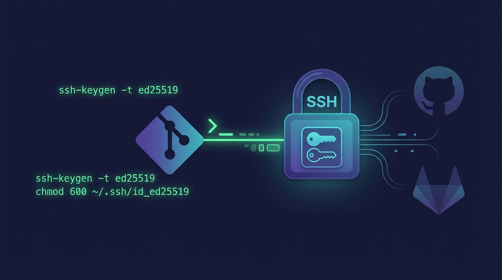

## 概要


Git のリモート接続は主に HTTPS と SSH の 2 方式です。

多くの人はブラウザーでのログインや Web 資格情報に慣れているため、最初は HTTPS を使います。

しかし長期的には SSH のほうが運用負荷が低く、自動化にも向いています。


## HTTPS と SSH の比較


| 比較項目 | HTTPS | SSH |
| ------------- | --------------------------------------- | ----------------------------------------- |
| 認証方式 | ユーザー名とパスワード、または PAT などのトークンで認証 | ローカルの秘密鍵とサーバーに登録した公開鍵で認証 |
| 認証情報の入力頻度 | 環境が変わるたびに再ログインや資格情報の確認が必要 | キーを登録すれば push/pull 時の入力はほぼ不要 |
| 失効とポリシー | トークンの失効や権限ポリシーの影響を強く受ける | キーに有効期限がない構成が多く、障害要因が少ない |
| 複数アカウント/複数ホスト | アカウント×ホストの組み合わせが増えるほどトークン管理が複雑 | `~/.ssh/config` でホスト別エイリアスとキーを分離できる |
| 自動化・デプロイ | CI にトークンをシークレットとして保管し続ける必要がある | デプロイ専用キーで権限範囲を絞りやすい |


### SSH を使う利点

- **認証フローが単純**  
  キー登録後は資格情報の入力や更新作業が大幅に減ります。
- **障害ポイントが少ない**  
  トークン期限や権限ミスによる認証トラブルを避けやすいです。
- **アカウント分離が容易**  
  個人 GitHub と会社 GitLab を併用する環境でも鍵を分けて運用できます。
- **自動化が安全**  
  トークンを URL やログに残す心配がなく、用途別の最小権限キーを発行しやすいです。

### SSH 使用時の注意点

- **初期セットアップが難しく感じられる**  
  キー生成と公開鍵登録は初心者にとって馴染みがなく、`~/.ssh/config` の誤設定で接続先を間違えることがあります。
- **キー管理が必要**  
  秘密鍵が漏洩するとアクセス権を奪われます。パスフレーズを付けないとリスクが高まり、付けると ssh-agent の構成が必要になる場合があります。
- **キーのローテーションが手間**  
  PC の再インストールや廃棄時にはキーの再生成と再登録が必要で、未使用のキーを放置すると攻撃面が広がります。


## SSH の実務フロー

### どのように動作するか

SSH は公開鍵認証方式です。一度キーを発行・登録すれば、OS と SSH クライアントが以降の認証を自動で処理し、ユーザーが資格情報を繰り返し入力する必要はほとんどありません。その代わり、秘密鍵の管理に細心の注意が必要です。

### 事前準備チェックリスト

1. 作業端末で秘密鍵と公開鍵のペアを生成します。
2. 公開鍵を GitHub や GitLab などホスティングサービスに登録します。
3. リモート URL を SSH 形式に切り替えます。
   - HTTPS 例: `https://github.com/plzhans/hans-blog.git`
   - SSH 例: `git@github.com:plzhans/hans-blog.git`

### HTTPS と異なる点

- リモートアクセス時にユーザー名/パスワードを入力しません。秘密鍵を保持していること自体が資格情報です。
- 秘密鍵の漏洩防止に注意します。
  - 可能ならパスフレーズを設定。
  - ファイル権限を最小化。
  - 使わないキーはホスティング側から削除。

## 認証の内部動作

Git は単に `ssh` コマンドを呼び出し、SSH クライアントが設定とキーを読み取り、認証を行った後に Git の通信を開始します。

### フロー概要

1. Git が SSH 形式の URL（例: `git@github.com:org/repo.git`）を検出し、SSH を選択。
2. Git が `ssh` プロセスを起動（内部的には `ssh -T` に近い形）。
3. `ssh` が設定とキー候補を読み込みます。
   - `~/.ssh/config`
   - 既定の鍵ファイル
4. `ssh-agent` が動いていれば、そこに読み込まれたキーを優先使用します（パスフレーズは初回のみ入力）。
5. サーバー側が登録済み公開鍵リストと照合し、チャレンジを送って署名を確認後、Git 通信を開始します。

### 参照される主なファイル

- ユーザー設定: `~/.ssh/config`
- キーディレクトリ: `~/.ssh/`
- macOS / Linux の基本鍵ファイル
  - `~/.ssh/id_ed25519`
  - `~/.ssh/id_rsa`
  - 公開鍵は `.pub` が付く（例: `~/.ssh/id_ed25519.pub`）
- Windows の注意点
  - 複数の `ssh.exe` が共存する場合があるため、Git がどの SSH を使うか把握する。
  - 鍵ファイル自体は通常ユーザープロファイルの `.ssh` に配置。
    - `C:\Users\<USER>\.ssh\id_ed25519`
    - `C:\Users\<USER>\.ssh\config`
- サーバー真正性確認: `~/.ssh/known_hosts`

## SSH キー生成

GitHub は Ed25519 を推奨しています（[GitHub ドキュメント](https://docs.github.com/en/authentication/connecting-to-github-with-ssh/generating-a-new-ssh-key-and-adding-it-to-the-ssh-agent)）。

```shell
# 推奨: Ed25519
ssh-keygen -t ed25519 -C "your_email@example.com"

# Ed25519 非対応の場合のフォールバック
ssh-keygen -t rsa -b 4096 -C "your_email@example.com"
```

> 🔒 **秘密鍵のパーミッションを必ず確認。**  
> 権限が広すぎると OpenSSH が鍵の使用を拒否します。  
>  
> ```shell
> # ディレクトリ
> chmod 700 ~/.ssh
>
> # 秘密鍵
> chmod 600 ~/.ssh/id_ed25519
>
> # 公開鍵
> chmod 644 ~/.ssh/id_ed25519.pub
> ```

## リモートサービスへの鍵登録

GitHub や GitLab では **公開鍵** をアカウント設定に登録して認証します（秘密鍵はローカルに保持）。

**登録手順**

1. 公開鍵の内容をコピー（例: `cat ~/.ssh/id_ed25519.pub`）。
2. 各サービスの SSH Key 設定画面を開く。
   - GitHub: Settings → SSH and GPG keys → New SSH key
   - GitLab: Preferences → SSH Keys
3. 公開鍵を貼り付け、`macbook-2026` や `work-laptop` のようにデバイス名でタイトルを付けて保存。
4. 接続テストで確認。
   - GitHub: `ssh -T git@github.com`
   - GitLab: `ssh -T git@gitlab.com`

> ⚠️ **よくあるミス**  
> - アップロードするのは **公開鍵 (.pub)** です。  
> - 秘密鍵は絶対にアップロードしない。  
> - 複数鍵を運用する場合は、デバイスや用途で名前を統一すると管理しやすい。

## 複数アカウントの運用

個人アカウントと会社アカウントを併用する場合は、次の方法で分離します。

- `~/.ssh/config`
  - 同一ホストでも個人用と業務用でエイリアスを分ける。
  - エイリアスごとに使用する鍵を指定。
- `~/.gitconfig`
  - 上位フォルダー単位で Git 設定を分割。
  - フォルダーごとにコミッター情報を設定。

詳細な構成は以下のドキュメントを参照してください。

> [Git 複数アカウント設定のまとめ  
> ssh config alias vs gitconfig includeIf](../7-git-multi-account-ssh-config-alias-gitconfig-includeif/)
