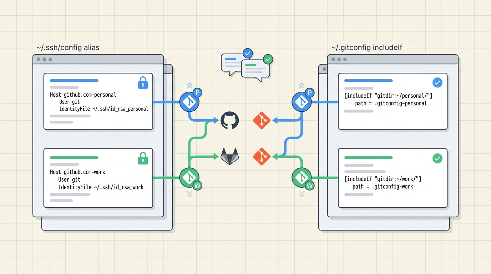

## 개요


여러 계정 환경은 크게 2가지 패턴이 있다.


상황에 맞는 방식을 선택하면 설정 실수와 인증 문제를 줄일 수 있다.


개인적으로는 `~/.gitconfig includeIf` 방식을 추천한다.


언제 쓰나

- GitHub 개인 계정과 GitLab 회사 계정을 같이 쓴다.
- GitHub 계정이 2개 이상이라서 저장소마다 다른 계정으로 push 해야 한다.

---


## ~/.ssh/config로 호스트 별칭(Alias) 분기


<strong>같은 원격저장 호스트에 대해서 여러 계정에 접근</strong>할 때 SSH 레벨에서 "어떤 호스트에 어떤 키를 쓸지"를 고정하는 방식이다.


Git remote URL에 별칭을 쓰기 때문에 저장소마다 계정이 명확해진다.


단점은 기존 원격 URL을 Alias 기반 URL로 변환해서 사용해야 한다.


> git@github.com:user/repo.git 같은 주소를 Alias 기반 URL  
> git@github-personal:user/repo.git 형태로 수동으로 바꿔야 한다.


예시 구성


```javascript
# GitHub 개인 계정
Host github-personal
	HostName github.com
	User git
	IdentityFile ~/.ssh/id_ed25519_github_personal
	IdentitiesOnly yes

# GitLab 회사 계정
Host gitlab-work
	HostName gitlab.com
	User git
	IdentityFile ~/.ssh/id_ed25519_gitlab_work
	IdentitiesOnly yes
```


리모트 URL 예시

- GitHub: `git@github-personal:USER/REPO.git`
- GitLab: `git@gitlab-work:GROUP/REPO.git`

동작 확인

- `ssh -T git@github-personal`
- `ssh -T git@gitlab-work`

> ⚠️ **실수 포인트**  
> - `ssh -T git@github.com`처럼 기본 호스트로 테스트하면 원하지 않는 키가 선택될 수 있다.  
> - 동일 호스트에 여러 계정을 쓰는 경우는 별칭이 필수다.


---


## ~/.gitconfig의 includeIf로 폴더 기준 분기


<strong>디렉토리 기준으로 Git 설정(사용자 이름, 이메일 등)을 자동 분리</strong>하는 방식이다.


SSH 키 분리와 별개로 커밋 작성자 정보와 서명 설정을 안전하게 분리할 때 유용하다.


개인용과 회사용 상위 디렉토리를 분리해서 구성하면 된다.


예시 구성


```javascript
# ~/.gitconfig
[includeIf "gitdir:~/work/"]
	path = ~/.gitconfig-work

[includeIf "gitdir:~/personal/"]
	path = ~/.gitconfig-personal
```


```javascript
# ~/.gitconfig-work
[user]
	name = Your Name
	email = your.name@company.com
```


```javascript
# ~/.gitconfig-personal
[user]
	name = Your Name
	email = your.name@gmail.com
```


---


## 차이점


| 구분    | ~/.ssh/config 호스트 별칭(Alias)                                    | ~/.gitconfig includeIf (폴더 기준)                                            |
| ----- | -------------------------------------------------------------- | ------------------------------------------------------------------------- |
| 목적    | 원격 호스트 접속 시 어떤 SSH 키를 쓸지 고정한다.                                 | 프로젝트 위치에 따라 `user.email`, `user.name`, `signingkey` 같은 Git 설정을 자동으로 분리한다. |
| 적용 범위 | SSH 접속 단위이다. Git remote URL에 지정한 Host 별칭에만 적용된다.               | Git 저장소 단위이다. 저장소 경로가 조건과 맞으면 자동 적용된다.                                    |
| 분기 기준 | remote URL의 호스트 부분이다. 예: github-personal, gitlab-work          | 로컬 디렉토리 경로이다. 예: ~/work/, ~/personal/                                     |
| 바뀌는 것 | SSH가 선택하는 IdentityFile, HostName, User 등이다.                    | 커밋 작성자 정보와 서명 설정 등 Git config 값이다.                                        |
| 장점    | 같은 호스트([github.com](http://github.com/))에 여러 계정 키를 안정적으로 분리한다. | 회사 이메일로 개인 저장소에 커밋하는 실수를 줄인다. 프로젝트를 옮겨도 규칙이 유지된다.                         |
| 단점    | 기존 remote URL을 Alias URL로 수동 변환해야 한다.                          | 폴더 구조를 먼저 정해야 한다. 규칙이 꼬이면 의도와 다른 설정이 적용될 수 있다.                            |
| 추천 상황 | GitHub 계정이 2개 이상이다. GitHub와 GitLab을 동시에 쓴다.                    | 회사 프로젝트와 개인 프로젝트를 폴더로 나눠 관리한다. 커밋 작성자 분리가 중요하다.                           |


> 두 설정은 충돌하지 않는다.  
> - `~/.ssh/config`는 "어떤 키로 접속할지"를 분리한다.  
> - `~/.gitconfig`는 "어떤 사용자로 커밋할지"를 분리한다.

