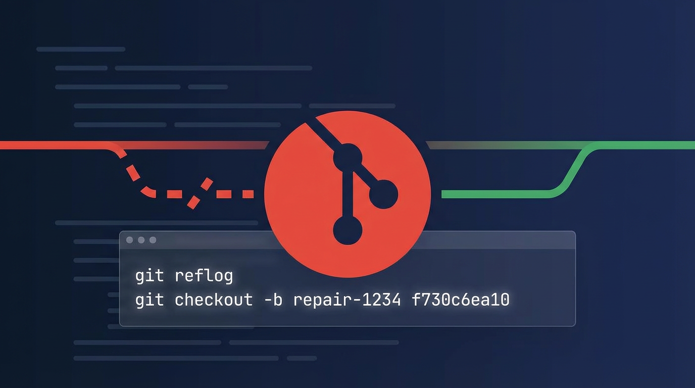
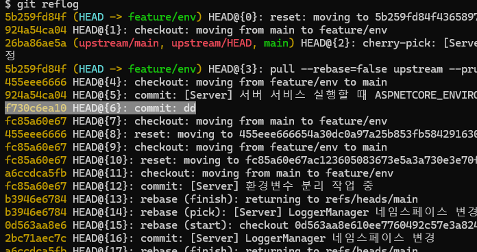
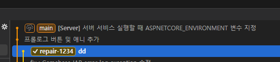

## 目標


別のブランチに**削除した特定のコミット時点に復旧**します。


## 状況


ブランチを削除した後、**該当ブランチで作業していたコミットに再びブランチを復旧**する必要がある場合があります。


---


## 1. reflogで復旧ポイント(コミットハッシュ)を探す


`reflog`はブランチを削除しても**ローカルでHEADが移動した記録**を残しているため、復旧するコミットハッシュを探すのに有用です。


```shell
git reflog
```


### 復旧対象選択


reflog出力から**復旧したい時点のコミットハッシュ**を確認します。





---


## 2. コミットハッシュでブランチを再作成


見つけたコミットハッシュを基準に新しいブランチを作成し、すぐにチェックアウトします。


```shell
# git checkout -b <復旧する新しいブランチ名> <削除したコミットハッシュ>
git checkout -b repair-1234 f730c6ea10
```


---


## 3. 復旧確認


ブランチが正常に生成され、該当コミットに移動したかを確認します。



