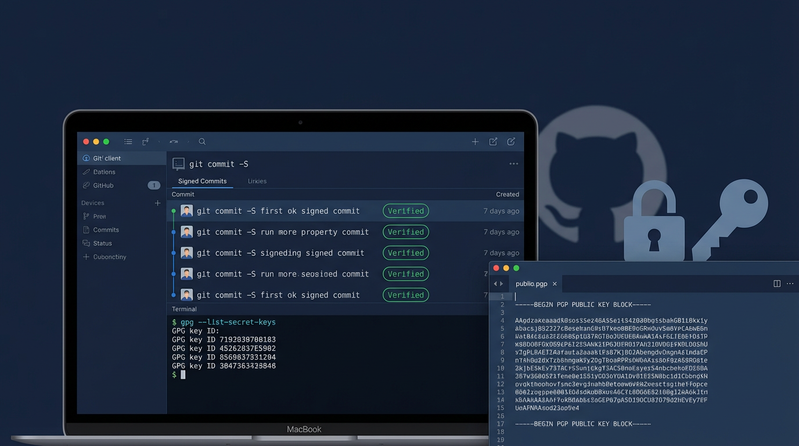
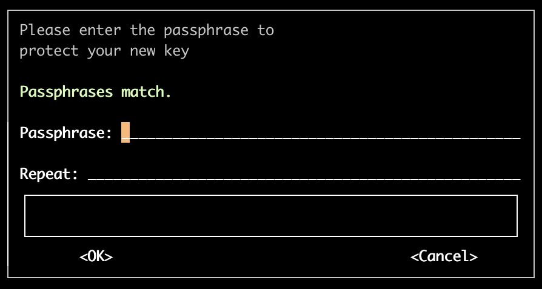
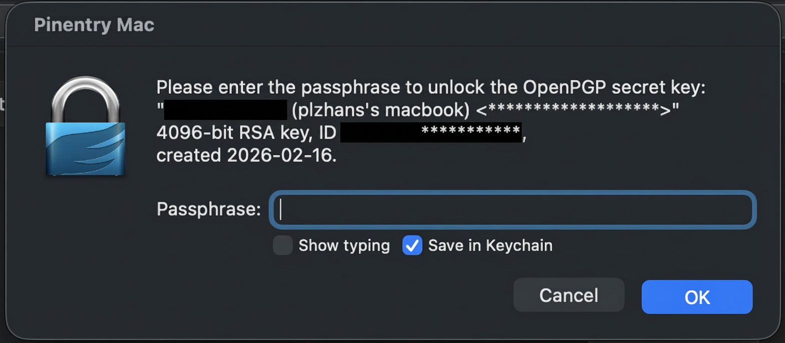
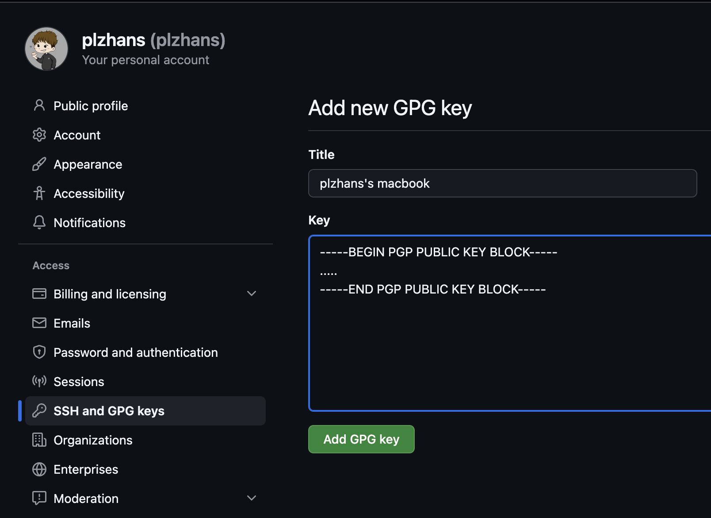
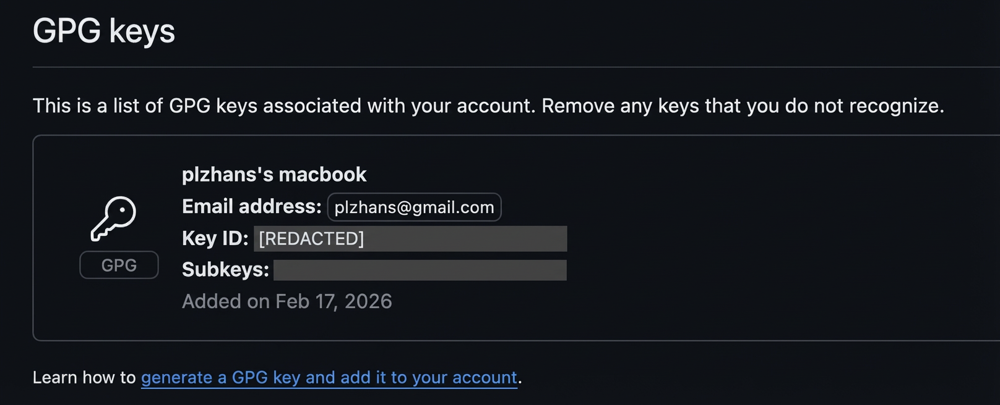
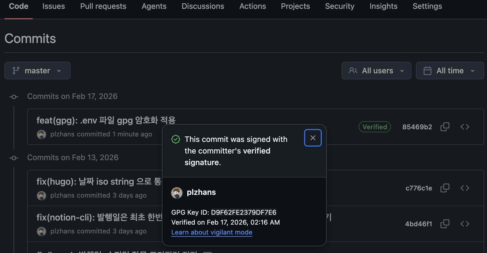

## Overview


Adding a GPG digital signature to Git commits allows you to prove the identity of the commit author and ensure code integrity.


This document introduces the concept of GPG and how it is used in Git.


It provides a step-by-step guide covering everything from GPG key generation to Git configuration and GitHub integration.


## What is GPG?


<strong>GPG (GNU Privacy Guard)</strong> is open source encryption software for data encryption and digital signatures.


It follows the PGP (Pretty Good Privacy) standard and uses public-key cryptography.


**Key Features**

- **Public-key encryption:** Encrypts and decrypts data using a public/private key pair.
- **Digital signatures:** Signs data with a private key. Verifies the author's identity and data integrity.
- **Secure communication:** Enables safe encryption and transmission of emails, files, and more.

### **Git and GPG**


GPG is used in Git to add digital signatures to commits and tags.

- It allows you to prove that a commit was actually authored by you.
- Platforms like GitHub and GitLab display a Verified badge to increase trustworthiness.
- It prevents code tampering and forgery, strengthening project security.
- It protects files by encrypting them.

### Why sign Git commits?


Git commit author information can be set arbitrarily by anyone using `git config user.name` and `user.email`.


Therefore, it is difficult to trust the actual author based on name and email alone.


By signing a commit with your private key before committing and registering your public key in a repository like GitHub, the platform can verify the signature and confirm whether the commit author matches.


## Using GPG


### Installing gnupg


gnupg: Install the package to use GPG (example: Mac)


```shell
brew install gnupg
```


### Key Generation


`gpg --full-generate-key` operates in interactive mode by default. Batch mode is also supported as an option.


```shell
gpg --full-generate-key
```

> Please select what kind of key you want:
> (1) RSA and RSA
> (2) DSA and Elgamal
> (3) DSA (sign only)
> (4) RSA (sign only)
> (9) ECC (sign and encrypt) _default_
> (10) ECC (sign only)
> (14) Existing key from card
> Your selection? 1
>
> RSA keys may be between 1024 and 4096 bits long.
> What keysize do you want? (3072) 4096
>
>
> Requested keysize is 4096 bits
> Please specify how long the key should be valid.
> 0 = key does not expire
> \<n\>  = key expires in n days
> \<n\>w = key expires in n weeks
> \<n\>m = key expires in n months
> \<n\>y = key expires in n years
> Key is valid for? (0) 1y
>
>
> Key is valid for? (0) 1y
> Key expires at 2027년  2월 16일 화요일 17시 14분 10초 KST
> Is this correct? (y/N) y
>
>
> GnuPG needs to construct a user ID to identify your key.
>
>
> Real name: your name
> Email address: your test@email.com
> Not a valid email address
> Email address: test@test.com
> Comment: test
> You selected this USER-ID:
> "your name (test) test@test.com"
>
>




### Verifying Key Generation


```shell
# List secret keys
gpg --list-secret-keys

# List public keys
gpg --list-keys
```


### Other Useful Features


```shell
# Delete secret key
gpg --delete-secret-keys {sec uuid}

# Delete public key
gpg --delete-keys {pub uuid}
```



```shell
# Export secret key
# gpg --armor --export-secret-keys {key_id} > private.asc
gpg --armor --export-secret-keys 7XXXXXXXXXXXXXXXX6 > private.asc

# Export public key
# gpg --armor --export {key_id} > public.asc
gpg --armor --export 7XXXXXXXXXXXXXXXX6 > public.asc
```



```shell
#
gpg --import private.asc

# Set trust
# gpg --edit-key {key_id}
gpg --edit-key 7XXXXXXXXXXXXXXXX6

# Verify registration
gpg --list-secret-keys --keyid-format LONG
```



### (Reference) Troubleshooting


**Cause**

- Recent versions strongly recommend using a key passphrase due to security concerns about key leakage.
- There are workarounds such as batch mode processing. However, it is safer to set a passphrase, even a short one.

**Resolution**: Set a passphrase.



## Git Signing


When committing, you must sign with the private key linked to the GPG public key registered on GitHub.


GitHub will then verify the commit author when a signed commit is pushed.


The "Verified" badge will also appear next to the commit on GitHub.


### Preparing GPG Signing in Git


Choose one of the options A, B, or C below.


### Option A) Manual Signing (use `-S` per commit)


```shell
git commit -S -m "Commit message"
```



### Option B) Global Auto-Signing (all repositories)


```shell
# Register GPG key ID (global)
git config --global user.signingkey 7XXXXXXXXXXXXXXXXXXXXXXXXXXXXXXXXXXXX6

# Auto-sign commits (global)
git config --global commit.gpgsign true

# Verify settings
git config --show-origin commit.gpgsign
```



### Option C) Per-Repository Auto-Signing (specific repositories only)


- `--global` applies to all repositories.
- `--local` applies only to the current repository. Settings are stored in `.git/config`.

```shell
# Navigate to repository
cd /path/to/repo

# Register GPG key ID (local)
git config --local user.signingkey 7XXXXXXXXXXXXXXXXXXXXXXXXXXXXXXXXXXXX6

# Auto-sign commits (local)
git config --local commit.gpgsign true

# Verify settings
git config --show-origin commit.gpgsign
```



### Creating a GPG-Signed Commit


Add a signature when committing using the `-S` option.


```shell
# Create a signed commit
git commit -S -m "Commit message"

# If auto-signing is configured
git commit -m "Commit message"
```


Verify signing: Confirm that the commit was signed correctly.


```shell
# Verify commit signature
git log --show-signature

# Or
git verify-commit HEAD
```


### (Reference) Troubleshooting


**Signing failed and commit could not be completed.**


```plain text
**error: gpg failed to sign the data:**
[GNUPG:] KEY_CONSIDERED 7E7DCEBF62463A41ACD992D8D9F62FE2379DF7E6 2
[GNUPG:] BEGIN_SIGNING H8
[GNUPG:] PINENTRY_LAUNCHED 42114 curses 1.3.2 - xterm-256color NONE - 501/20 0
gpg: signing failed: Inappropriate ioctl for device
[GNUPG:] FAILURE sign 83918950
gpg: signing failed: Inappropriate ioctl for device
**fatal: failed to write commit object**
```


**Cause:** May occur when a passphrase is set on the GPG key.


**Resolution:** The solution varies by OS and environment. On Mac, installing <strong>pinentry-mac</strong> resolved the issue.

>
> 1. Install the package
> `brew install pinentry-mac`
> 2. Add the following to ~/.gnupg/gpg-agent.conf
> `pinentry-program /opt/homebrew/bin/pinentry-mac`
> 3. Add the following to ~/.profile
> `export GPG_TTY=$(tty)`
> 4. Reload the profile
> `source ~/.profile`
> 5. Restart gpg agent
> `gpgconf --kill gpg-agent`
> `gpgconf --launch gpg-agent`
> 6. Commit again: the passphrase input window will appear
>
> 
>
>



## GitHub Signing


### GitHub and GPG


Registering your GPG public key on GitHub allows commit signatures to be verified.


When GitHub checks the signature of a pushed commit, it uses the registered GPG public key to verify whether the signature is valid.


If verification succeeds, a "Verified" badge is displayed next to the commit, proving that the commit was authored by the owner of the registered key.


This provides the following benefits:

- **Identity verification:** Proves that the commit was actually authored by you.
- **Tamper prevention:** Prevents others from making commits under your name.
- **Increased trustworthiness:** Clearly establishes the source of code in open source projects or team collaboration.

### Registration Procedure


Register your GPG public key in the **GPG keys** section of your GitHub personal settings.

- Log in to GitHub and click the profile icon in the upper right.
- Select <strong>Settings</strong>.
- Click <strong>SSH and GPG keys</strong> in the left sidebar.
- In the **GPG keys** section, click the **New GPG key** button.
- Copy the entire public key content and paste it into the input field.
- Click the **Add GPG key** button to complete registration.

Once registered, the new key will appear in the GPG Keys list.


### Looking Up Your GPG Public Key


```shell
gpg --list-secret-keys --keyid-format LONG
```

>
>
> Result
>
>
> [keyboxd]
>
>
> —-
>
>
> pub   rsa4096 2026-02-16 [SC] [expires: 2027-02-16]
> 7XXXXXXXXXXXXXXXXXXXXXXXXXXXXXXXXXXXX6 ← {Key ID}
> uid           [ultimate] Son Won Chul (plzhans's macbook) [plzhans@gmail.com](mailto:plzhans@gmail.com)
> sub   rsa4096 2026-02-16 [E] [expires: 2027-02-16] ← key expiration date
>
>

View the key content.


```shell
# View key: gpg --armor --export {Key ID}
gpg --armor --export 7XXXXXXXXXXXXXXXXXXXXXXXXXXXXXXXXXXXX6
```


### Registering a GPG Key on GitHub








### Pushing to Repository


Push your signed commit to GitHub and the "Verified" badge will appear.


```shell
git push origin main
```


### Verifying Signed Commits and Tags



