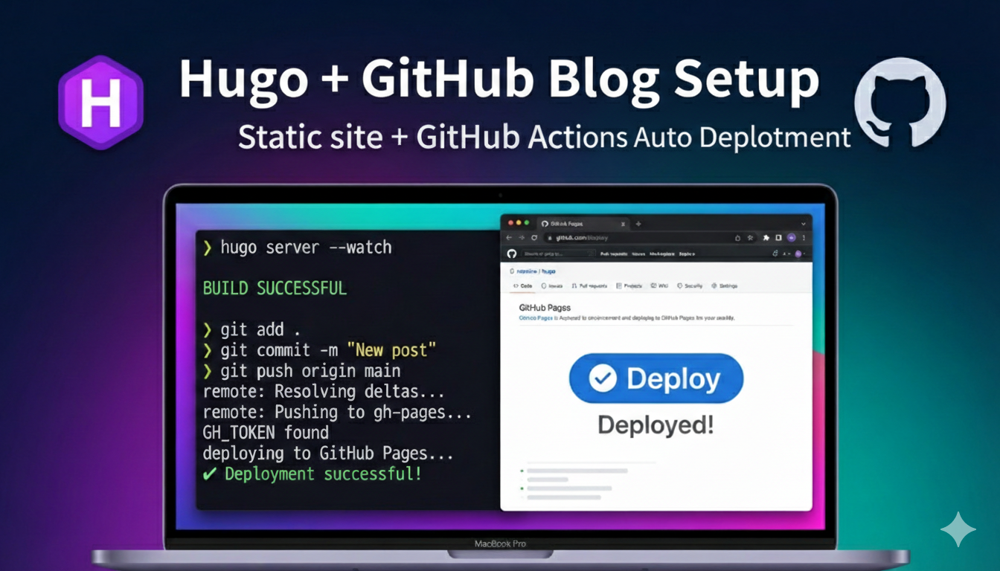

## 서론


기술 관련 내용을 에버노트와 개인 문서에 정리해오다가 노션의 웹사이트 기능을 활용해 블로그로 운영하려고 준비했었다.


하지만 노션은 커스터마이징에 제약이 있었고 커스텀 도메인 사용에도 추가 비용이 발생해서 고민을 좀 하게 되었다.


대안으로 [velog](https://velog.io/)로 전환할지 Markdown으로 다시 작성해 Jekyll로 옮길지 고민했다.


하지만 작성이 편한 노션을 포기할 수 없었다. 결론은 노션으로 작성하고 정적 웹사이트로 배포하자!


## 목표

- md 파일로 작성된 문서를 Hugo로 빌드하고
- GitHub Pages로 배포 자동화 하기

> 💡 **구축 환경**  
> - 테스트 환경: Mac  
> - 배포 환경: GitHub Actions


**Hugo 선택 이유**

- GitHub Star 수가 많고 활발하게 업데이트 중
- 1000개 이상의 페이지를 빌드할 때 Jekyll보다 빠름

**현재 이 블로그는 다음과 같은 흐름으로 운영하고 있다. (소스 참고 :** [**https://github.com/plzhans/hans-blog**](https://github.com/plzhans/hans-blog)**)**


> 노션 작성   
> → 노션 API로 Markdown 변환  
>   
>   
> → Hugo 정적 사이트 빌드  
>   
>   
> → GitHub Pages 배포


## 사전 준비


### Hugo 테마 선택


[Hugo Themes](https://themes.gohugo.io/)에서 테마를 먼저 선택했다.


**선택한 테마:** [m10c](https://themes.gohugo.io/themes/hugo-theme-m10c/)


**테마 선택 기준**

- SEO 최적화 기능 지원
- 다국어 사이트 기능 지원

m10c는 일부 기능이 완벽하게 지원되지 않지만, Hugo의 레이아웃 오버라이드로 보완 가능하다.


### Hugo 설치


**설치 문서:** [Installation Guide](https://gohugo.io/installation/)


**Hugo 문서:** [Documentation](https://gohugo.io/documentation/)


Mac 예시


```shell
# Hugo 설치
brew install hugo

# 설치 확인
hugo --version
```


## Hugo 사이트 만들기


### 프로젝트 초기화


```shell
# 작업 디렉토리 생성
mkdir hugo && cd hugo

# Hugo 사이트 생성
hugo new site .

# 생성 결과 확인
tree
# .
# ├── archetypes
# │   └── default.md
# ├── assets
# ├── content
# ├── data
# ├── hugo.toml
# ├── i18n
# ├── layouts
# ├── static
# └── themes
```


### 테마 설치


Git submodule을 사용해서 테마를 설치한다.


```shell
# Git 저장소 초기화 (필요한 경우)
git init

# 테마 submodule 추가
git submodule add https://github.com/vaga/hugo-theme-m10c.git themes/m10c

# 설치 확인
ls -al themes/m10c
```


### 샘플 콘텐츠 복사 (선택사항)


```shell
# 테마의 샘플 콘텐츠 복사
cp -R themes/m10c/exampleSite/content ./content

# 확인
ls -al ./content/
```


### Hugo 설정


기본 설정 파일인 `hugo.toml`을 테마의 샘플 설정으로 교체한다.


```shell
# 기존 설정 삭제
rm hugo.toml

# 샘플 설정 복사
cp themes/m10c/exampleSite/config.toml ./hugo.toml
```


`hugo.toml` 파일을 열어서 기본 설정을 수정한다.


```toml
baseURL = "https://testblog.plzhans.com"
title = "Test blog"
theme = "m10c"
```


**주의:** `themesDir` 설정은 제거하고, `theme`는 실제 디렉토리 이름과 일치시킨다.


### 로컬 서버 실행


```shell
# 개발 서버 시작
hugo server -D
```


실행 결과 예시:


```javascript
Watching for changes in /Users/plzhans/temp/sample/hugo/...
Start building sites …
hugo v0.154.5+extended+withdeploy darwin/arm64 BuildDate=2026-01-11T20:53:23Z

Built in 2 ms
Environment: "development"
Web Server is available at http://localhost:57264/
Press Ctrl+C to stop
```


브라우저에서 표시된 주소로 접속해서 확인한다.

> http://localhost:57264

## GitHub Pages 배포


### 저장소 생성


GitHub에서 새 저장소를 생성한다.


### 배포 전략 선택


Jekyll과 Hugo 모두 소스와 빌드 결과물을 분리해서 관리한다.


Jekyll은 GitHub Pages가 자동으로 감지해서 배포하지만 Hugo는 GitHub Actions를 통해 직접 배포해야 한다.


배포 전략을 선택할 때 주의할 점은 소스 저장소의 공개/비공개 유무다.


소스 저장소를 비공개로 원할 경우 다음을 유의 바란다.


무료 플랜

- 공개 저장소만 Pages 설정 가능하다.
- 따라서 소스를 비공개 하고 싶은 경우 방법 3을 사용해서 소스 저장소를 비공개하고 배포 저장소만 공개해야 한다.

유료 플랜

- 저장소는 비공개여도 Pages는 공개 가능

### 방법1 : actions/deploy-pages

- 저장소 1개 사용
- GitHub Pages 소스를 GitHub Actions로 설정
- main 브랜치 push → Hugo 빌드 → 결과물 업로드 → 자동 배포

### 방법2: peaceiris/actions-gh-pages

- 저장소 1개 사용
- GitHub Pages를 gh-pages 브랜치에 연결
- main 브랜치 push → Hugo 빌드 → gh-pages 브랜치에 커밋

### 방법3: 배포 저장소 분리

- 저장소 2개 사용 (소스 저장소, 배포 저장소)
- 빌드 결과물을 배포 저장소에 푸시

### 방법4: 배포 결과물 외부에 업로드

- GitHub Pages를 반드시 사용할 필요는 없다.
- 웹 서버가 연결된 디렉토리에 빌드 결과물만 업로드해도 된다.
- 기본적으로 결과물은 `/public` 디렉토리에 생성된다.

> 이 문서에서는 방법1을 사용하여 배포 전략을 수립하였다.


### GitHub Pages 설정


Repository → Settings → Pages → Source를 <strong>GitHub Actions</strong>로 설정


## GitHub Actions 워크플로우 작성


`.github/workflows/deploy-hugo.yml` 파일을 생성한다.


```yaml
name: Deploy Hugo

on:
  push:
    branches: [ master ]
   
permissions:
  contents: read
  pages: write
  id-token: write

concurrency:
  group: pages
  cancel-in-progress: true

env:
  HUGO_BASEURL: https://plzhans.github.io/hugo-sample/

jobs:
  build-and-deploy:
    runs-on: ubuntu-latest
    env:
      HUGO_CACHEDIR: /tmp/hugo_cache

    steps:
      - name: Checkout
        uses: actions/checkout@v4
        with:
          submodules: recursive
          fetch-depth: 1

      - name: Setup Hugo
        uses: peaceiris/actions-hugo@v3
        with:
          hugo-version: "latest"
          extended: true

      - name: Cache Hugo
        uses: actions/cache@v4
        with:
          path: $ env.HUGO_CACHEDIR 
          key: $ runner.os -hugomod-$ hashFiles('**/go.sum') 
          restore-keys: |
            $ runner.os -hugomod-

      - name: Build
        run: hugo --minify --gc --cleanDestinationDir --baseURL "$HUGO_BASEURL"

      - uses: actions/upload-pages-artifact@v3
        with:
          path: ./public

      - uses: actions/deploy-pages@v4
```


## Git 배포


```shell
# 원격 저장소 추가
git remote add origin git@github.com:plzhans/hugo-sample.git

# .gitignore 설정
echo "/public/" >> .gitignore

# 전체 파일 커밋
git add . 
git commit -m "first commit"

# 브랜치 생성 및 푸시
git branch -M master
git push -u origin master
```


## 배포 확인


GitHub Actions 탭에서 워크플로우 실행을 확인하고, Settings → Pages에서 배포된 URL을 확인한다.


**예시 주소:** [https://plzhans.github.io/hugo-sample/](https://plzhans.github.io/hugo-sample/)


## 주의사항


**baseURL 설정**


`hugo.toml`의 `baseURL` 또는 빌드 시 `--baseURL` 옵션이 정확하지 않으면 CSS와 이미지 경로가 잘못되어 오류가 발생한다.


이 가이드에서는 GitHub Actions 워크플로우의 환경 변수 `HUGO_BASEURL`에 배포 주소를 설정했다.


## 관련 글

- 커스텀 도메인 설정 : [Github pages 커스텀 도메인 사용하기](https://www.notion.so/2fd22a0f7e838086b859fdca16a463fa)
- (준비중) 노션에서 작성한 글 배포 자동화하여 Github pages 배포하기
