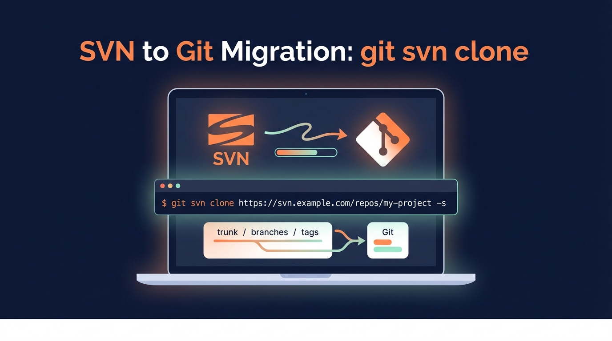

## 概要


この記事では、SVN リポジトリを Git へ移行する際に `git svn clone` コマンドをどう組み立てるかを説明します。


**対象読者**

- まだ SVN を運用しているが、段階的に Git へ移行したい開発者
- SVN の trunk・branches・tags 構造を Git のブランチやタグへ写したい開発者

## Git のインストール

- Windows: [Git for Windows](https://gitforwindows.org/)
- macOS: [Git - Downloads for macOS](https://git-scm.com/download/mac)

### Git を入れれば git svn も必ず使えますか?

必ずしもそうではありません。

配布パッケージによっては `git svn` が含まれていません。

### インストールリンク

- Windows: [Git for Windows ダウンロード](https://gitforwindows.org/)
- macOS: [git-scm macOS ダウンロード](https://git-scm.com/download/mac)

インストール直後に確認します。


```bash
git svn --version
```


### git svn がない場合の導入

- Windows: Git for Windows を入れたのに見当たらないときは、_Git SVN_ コンポーネントが除外されていないか確認して再インストールします。
- macOS: [Homebrew](https://brew.sh/) で `git-svn` を追加します。

## SVN → Git


### 基本コマンド


```bash
git svn clone [svn パス] --authors-file=[authors パス] -s [gitディレクトリ]
```


### オプションの意味


**svn パス**

SVN リポジトリのルート URL を指定します。

例:


```bash
https://svn.example.com/repos/my-project
```


**--authors-file=[authors パス]**

SVN の author 文字列を Git のコミット著者形式へマッピングするファイルです。

省略すると著者情報が期待どおりにならなかったり、移行中に警告が出る場合があります。

authors ファイルの典型的な形式:


```plain text
svnUser1 = 洪吉童 <hong@example.com>
svnUser2 = 孫元哲 <hans3019@knou.ac.kr>
```


著者一覧の取り出し方は環境次第ですが、多くは SVN ログから抽出して整理します。

**-s オプション**

`-s` は `--stdlayout` の短縮です。

SVN リポジトリが標準レイアウトのときに使います。

標準レイアウトとは次の構造を指します。

- `trunk`
- `branches`
- `tags`

`-s` を付けると git svn は以下のように扱います。

- trunk → デフォルトブランチの履歴
- branches → リモートブランチ
- tags → タグ

標準レイアウトでない場合は `-s` を使わず、次のように明示的に各パスを指定します。


```bash
git svn clone [svn パス] --authors-file=[authors パス] \
  --trunk=TrunkDir --branches=BranchesDir --tags=TagsDir \
  [gitディレクトリ]
```


**gitディレクトリ**

Git に変換したリポジトリを作成するローカルパスです。

存在しない場合はディレクトリを作成してからクローンします。

実行例


```bash
git svn clone https://svn.example.com/repos/my-project \
  --authors-file=./authors.txt \
  -s \
  my-project-git
```


### 移行後に確認する項目


**ブランチ確認**


```bash
cd my-project-git
git branch -a
```


`remotes` ネームスペースが作成され、SVN ブランチが並びます。

**タグ確認**


```bash
git tag
```


SVN のタグが Git のタグとして変換されているはずです。

## 注意点


### 著者マッピング

authors ファイルのフォーマットを守ってください。


```shell
# {svn id} = {git_user_name} <git_user_email>
svnUser1 = 洪吉童 <hong@example.com>
```


### クローンに非常に時間がかかる

SVN の全履歴を取得するため、リビジョンが多いと時間がかかります。

実行前に以下を確認します。

- ネットワーク遅延
- SVN サーバーの応答性能
- リビジョン範囲: 必要であれば特定リビジョンから取得するオプションを検討します。
- 省電力設定: デスクトップで実行する場合はスリープを防ぎます。

### SVN ブランチ名が Git で見慣れない

`git svn` は SVN ブランチを `remotes` 配下に取り込みます。

移行後に必要なブランチだけローカル Git ブランチとして作成し、名前を整理します。

### まとめ

SVN が標準レイアウトであれば、

`git svn clone ... -s` だけで trunk・branches・tags を一度に移行できます。

authors マッピングを正確に用意すれば、

コミット著者情報まで問題なく Git へ持って来られます。
