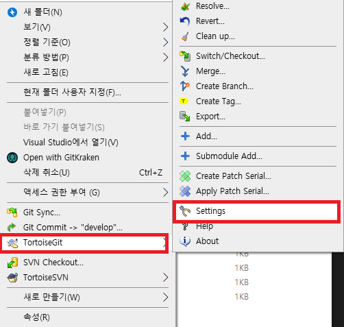
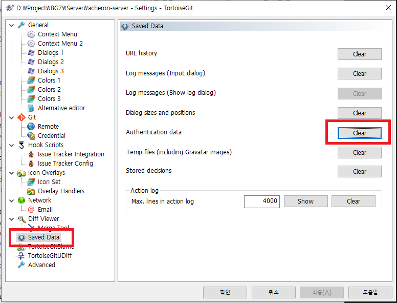

## 개요

Git 서버 주소가 바뀌었거나 계정을 변경했는데도 인증 실패가 반복되는 경우가 있습니다.

원인은 TortoiseGit이 Windows 자격 증명 또는 자체 저장소에 이전 인증 정보를 저장해 두기 때문입니다.

이 글에서는 TortoiseGit에서 저장된 인증 정보를 초기화하는 방법을 정리합니다.

## 증상

- `Authentication failed` 오류가 계속 발생한다
- 같은 저장소에서 계정이 바뀌었는데도 이전 계정으로 인증을 시도한다

## 원인

- Git 서버를 GitHub에서 GitLab로 바꿨다
- HTTP(S) URL 또는 사용자명이 바뀌었다

## 해결책

### TortoiseGit에서 인증 정보 초기화하기

아래 절차는 저장된 인증 데이터를 지워서 다음 Pull 또는 Push에서 다시 로그인 입력 창이 뜨게 만드는 방법입니다.

1. Windows 탐색기에서 Git 작업 폴더로 이동합니다.
2. 폴더에서 마우스 오른쪽 버튼을 클릭합니다.
3. **TortoiseGit → Settings** 로 이동합니다.

    

4. 왼쪽 메뉴에서 **Saved Data** 를 선택합니다.
5. **Authentication data** 영역에서 **Clear** 를 클릭합니다.

    이 작업으로 기존에 저장된 인증 정보가 삭제됩니다.

    

6. 다시 `Pull` 또는 `Push` 를 실행합니다.
7. 아이디와 비밀번호 또는 토큰을 다시 입력합니다.
    > 참고
    > GitLab은 보통 비밀번호 대신 Personal Access Token을 사용합니다.
    > 2FA를 사용 중이면 토큰을 준비한 뒤 입력합니다.

### 삭제가 안 되는 경우 점검

- 저장소 URL이 여러 개로 저장되어 있으면 다른 URL의 인증 데이터가 남아 있을 수 있습니다.
- Windows 자격 증명 관리자에도 관련 항목이 남아 있을 수 있습니다.
    - 제어판에서 **자격 증명 관리자 → Windows 자격 증명** 에서 Git 관련 항목을 확인합니다.
