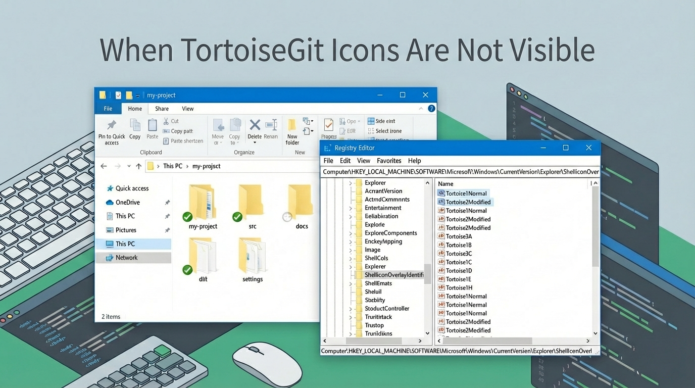
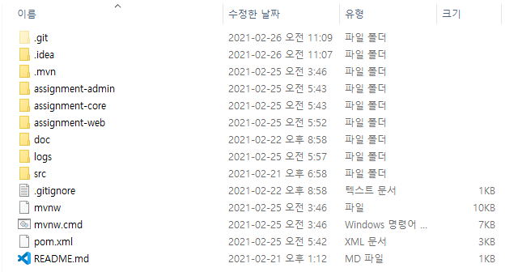
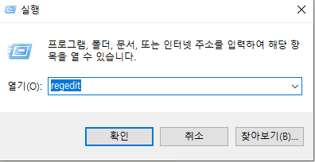
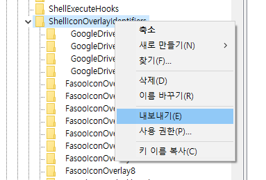
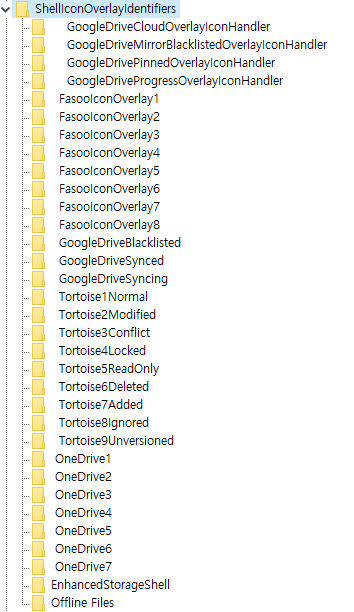
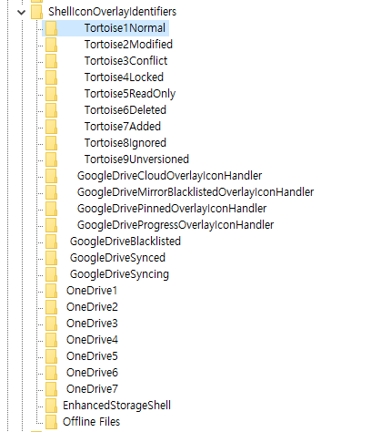
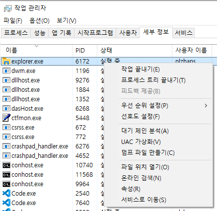
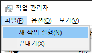
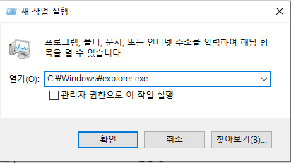
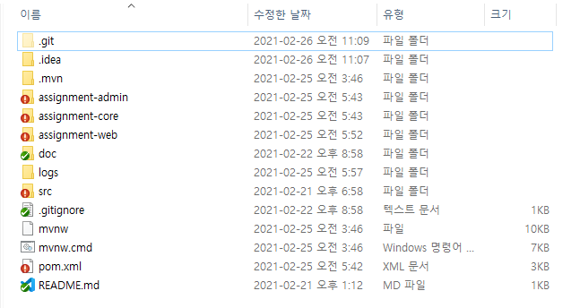

> 💡 Windows 탐색기 상태 아이콘이 안 보이면  
> 오버레이 핸들러 등록 개수 제한과 우선순위 충돌을 의심한다  
>   
>   
> 레지스트리에서 TortoiseGit 항목을 상단으로 올리면 해결된다

## 문제 요약

- Windows 탐색기에서 TortoiseGit 상태 아이콘이 표시되지 않는다
- 아이콘 오버레이를 사용하는 프로그램이 많을 때 자주 발생한다

## 증상

파일과 폴더에 정상적으로 떠야 하는 Git 상태 아이콘이 보이지 않는다

## 원인

- Windows 탐색기는 아이콘 오버레이 핸들러를 무한정 표시하지 않는다
- `ShellIconOverlayIdentifiers`에 등록된 항목 중 일부만 사용된다
- 탐색기 오버레이 참조 개수가 약 15개로 제한된다고 알려져 있다
- 다른 프로그램이 오버레이를 많이 등록하면 TortoiseGit 항목이 선택 목록에서 밀릴 수 있다

## 해결 방법

1) 레지스트리 편집기 실행

- 시작 → 실행 → `regedit`

2) 대상 경로로 이동

아래 경로로 이동한다

> HKEY_LOCAL_MACHINE\SOFTWARE\Microsoft\Windows\CurrentVersion\Explorer\ShellIconOverlayIdentifiers

3) 변경 전 백업

- 만일에 대비해서 수정 전에 백업한다
- `ShellIconOverlayIdentifiers` 우클릭 → 내보내기

> ⚠️ 키 삭제는 되돌리기 어렵다. 백업 파일로 복구할 수 있게 먼저 내보내기를 해둔다

4) 우선순위 조정

목표는 TortoiseGit 항목이 목록 상단 쪽에 오도록 만드는 것이다

- TortoiseGit 관련 키 이름 앞에 공백 또는 숫자를 붙인다
- 표시할 필요가 없는 오버레이 항목은 삭제를 검토한다
- 제한 개수 안에 들어오도록 정리한다

수정 전

수정 후

## 적용 방법

Explorer 재시작

재부팅 없이도 Explorer를 재시작하면 적용된다

- 작업 관리자에서 `Windows Explorer` 작업을 끝낸다

    

- `C:\Windows\explorer.exe`를 실행해서 다시 띄운다

    

    

### 확인

- 탐색기에서 새로 고침 `F5`
- Git 상태 아이콘이 정상 표시되는지 확인한다

    

