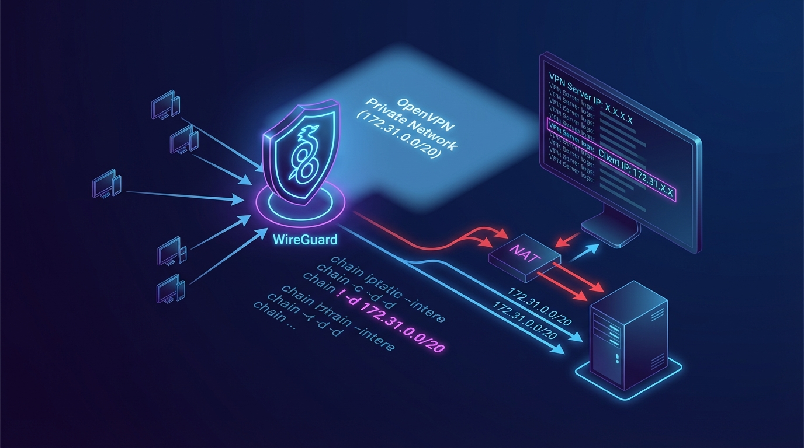

## 概要


WireGuard(wg-easy)のデフォルトの NAT(MASQUERADE)設定のため、内部網(例:OpenVPN プライベート網)へリクエストを送ると、最終サーバーでは VPN サーバー IP がリクエスト IP として見えます。


特定の帯域を MASQUERADE の対象から除外すると、OpenVPN クライアントのプライベート IP がそのままリクエスト IP として伝わります。


wg-easy のデフォルトフック(PostUp / PostDown)には、次のような NAT ルールが含まれています。

- `POSTROUTING` チェーンで `-j MASQUERADE` を適用します。
- この設定が有効になると、VPN クライアントのトラフィックが外部へ出るときに、送信元 IP が VPN サーバー IP に変換されます。
- そのため、OpenVPN プライベート網のような内部帯域へアクセスするときも、最終サーバーのログには VPN サーバー IP が残ります。

---


## 解決方法:iptables


ポイントは、<strong>MASQUERADE の適用から特定の宛先帯域を除外する</strong>ことです。

- `iptables` の NAT ルールに `! -d {除外する帯域}` を追加します。
- すると、その宛先へ向かうトラフィックは SNAT(MASQUERADE)なしで転送されます。
- 結果として、最終サーバーは <strong>OpenVPN クライアントのプライベート IP をリクエスト IP として認識</strong>します。
> ポイント  
> - 既存:`-A POSTROUTING -s {vpnCidr} -o {device} -j MASQUERADE`   
> - 変更:`-A POSTROUTING -s {vpnCidr} ! -d {excludeCidr} -o {device} -j MASQUERADE`

## 解決方法:wg-easy を使用している場合


wg-easy を使用しているなら、下記のメニューでフックを修正します。

- wg-easy 管理パネル
- **Hooks** メニュー
- PostUp / PostDown スクリプト

### 設定例


### 既存設定


PostUp


```plain text
iptables -t nat -A POSTROUTING -s ipv4Cidr -o device -j MASQUERADE; iptables -A INPUT -p udp -m udp --dport port -j ACCEPT; iptables -A FORWARD -i wg0 -j ACCEPT; iptables -A FORWARD -o wg0 -j ACCEPT; ip6tables -t nat -A POSTROUTING -s ipv6Cidr -o device -j MASQUERADE; ip6tables -A INPUT -p udp -m udp --dport port -j ACCEPT; ip6tables -A FORWARD -i wg0 -j ACCEPT; ip6tables -A FORWARD -o wg0 -j ACCEPT;
```


PostDown


```plain text
iptables -t nat -D POSTROUTING -s ipv4Cidr -o device -j MASQUERADE; iptables -D INPUT -p udp -m udp --dport port -j ACCEPT; iptables -D FORWARD -i wg0 -j ACCEPT; iptables -D FORWARD -o wg0 -j ACCEPT; ip6tables -t nat -D POSTROUTING -s ipv6Cidr -o device -j MASQUERADE; ip6tables -D INPUT -p udp -m udp --dport port -j ACCEPT; ip6tables -D FORWARD -i wg0 -j ACCEPT; ip6tables -D FORWARD -o wg0 -j ACCEPT;
```


### 変更設定


例として `172.31.0.0/20` の帯域を <strong>MASQUERADE の除外対象</strong>とします。

- OpenVPN プライベート網(最終サーバーが配置されている内部網)が `172.31.0.0/20` なら、この帯域へ向かうリクエストは SNAT を行いません。

PostUp


```plain text
iptables -t nat -A POSTROUTING -s ipv4Cidr ! -d 172.31.0.0/20 -o device -j MASQUERADE; iptables -A INPUT -p udp -m udp --dport port -j ACCEPT; iptables -A FORWARD -i wg0 -j ACCEPT; iptables -A FORWARD -o wg0 -j ACCEPT; ip6tables -t nat -A POSTROUTING -s ipv6Cidr -o device -j MASQUERADE; ip6tables -A INPUT -p udp -m udp --dport port -j ACCEPT; ip6tables -A FORWARD -i wg0 -j ACCEPT; ip6tables -A FORWARD -o wg0 -j ACCEPT;
```


PostDown


```plain text
iptables -t nat -D POSTROUTING -s ipv4Cidr ! -d 172.31.0.0/20 -o device -j MASQUERADE; iptables -D INPUT -p udp -m udp --dport port -j ACCEPT; iptables -D FORWARD -i wg0 -j ACCEPT; iptables -D FORWARD -o wg0 -j ACCEPT; ip6tables -t nat -D POSTROUTING -s ipv6Cidr -o device -j MASQUERADE; ip6tables -D INPUT -p udp -m udp --dport port -j ACCEPT; ip6tables -D FORWARD -i wg0 -j ACCEPT; ip6tables -D FORWARD -o wg0 -j ACCEPT;
```


### 全体構造で見る


以下は、変更ポイントがどこに入るのかを一目で見るための形です。

> # IPv4 NAT(指定帯域を除外)  
> iptables -t nat -A POSTROUTING -s {{ipv4Cidr}} **! -d 172.31.0.0/20** -o {{device}} -j MASQUERADE;  
>   
> # WireGuard ポート許可(UDP)  
> iptables -A INPUT -p udp -m udp --dport {{port}} -j ACCEPT;  
>   
> # フォワーディング許可(VPN → 外部)  
> iptables -A FORWARD -i wg0 -j ACCEPT;  
>   
> # フォワーディング許可(外部 → VPN)  
> iptables -A FORWARD -o wg0 -j ACCEPT;  
>   
> # IPv6 NAT  
> ip6tables -t nat -A POSTROUTING -s {{ipv6Cidr}} -o {{device}} -j MASQUERADE;  
>   
> # IPv6 WireGuard ポート許可  
> ip6tables -A INPUT -p udp -m udp --dport {{port}} -j ACCEPT;  
>   
> # IPv6 フォワーディング許可(VPN → 外部)  
> ip6tables -A FORWARD -i wg0 -j ACCEPT;  
>   
> # IPv6 フォワーディング許可(外部 → VPN)  
> ip6tables -A FORWARD -o wg0 -j ACCEPT;
