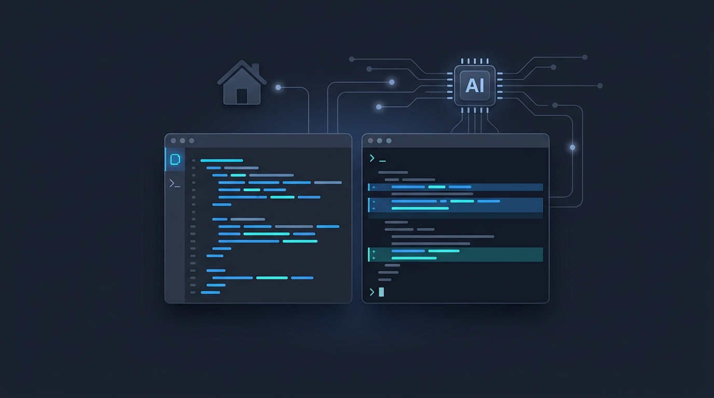

## 概要


Claude Codeは、ターミナルでコード作成、ファイル編集、コマンド実行を支援する開発用CLIツールです。


便利な開発フローを提供しますが、Claude APIやサブスクリプションベースの環境を継続的に使用するとコストが発生します。


個人プロジェクトや繰り返しの実験環境では、このコストが負担になることがあります。


この記事では、Claude Codeの使用フローを維持しながら、実際のモデル実行をOllamaローカルLLMに置き換える方法を整理します。


最新のOllamaは、Claude CLIが使用するAPIパスと互換性のあるコントローラーを提供しているため、別途プロキシなしでClaude Codeのリクエストを直接受け取ることができます。


主要な設定は、Claude互換APIアドレスの指定、認証値の設定、モデル名のマッピングです。


モデル選択は、環境変数、Ollamaモデルエイリアス、CLIの`--model`パラメータ方式で処理できます。


互換APIのないツールを併用したり、複数のモデルプロバイダーをまとめる必要がある場合は、LiteLLMのようなプロキシを選択的に使用します。


## インストール


インストール過程は大きく4つのステップで進めます。


### ローカルLLMランタイムのインストール


まず、ローカルでモデルを実行できるランタイムをインストールします。代表的にOllamaを使用できます。


```bash
curl -fsSL https://ollama.com/install.sh | sh
```


インストール後、サービスが正常に実行されているか確認します。


```bash
ollama --version
```


### 使用するモデルのダウンロード


Claude Codeの代替用途として使用するモデルをダウンロードします。コード作成やコマンド理解が必要なタスクであれば、Qwen Coder系やLlama系のモデルを優先的に検討できます。


```bash
ollama pull qwen2.5-coder:7b
```


モデルが正常に実行されるか簡単にテストします。


```bash
ollama run qwen2.5-coder:7b
```


## Claudeツール連携


### Claude互換APIエンドポイントの準備


Claude CodeやVS CodeのClaude拡張機能でローカルLLMを使用するには、Claude CLIが呼び出すAPIパスと互換性のあるエンドポイントが必要です。


以前は、OllamaのデフォルトAPIパスがClaudeツールで期待されるAPI構造と異なっていました。


そのため、別途変換APIを自作するか、LiteLLMのようなプロキシをフロントに置いてClaude形式のリクエストをローカルLLM呼び出しに変換する構成が必要でした。


しかし、最新のOllamaでは、Claude CLIが使用するAPIパスと同一に動作する互換APIコントローラーを内蔵で提供しています。


したがって、最新のOllamaを使用すれば、別途プロキシを構成しなくてもClaude CodeのリクエストをそのままOllamaに送ることができます。


構成方式がシンプルになり、ローカルLLMをClaude開発ツールのフローに統合しやすくなります。


逆に、使用するツールがClaude互換APIをサポートしていなかったり、Ollamaが提供していないAPI形式を要求する場合は、プロキシ構成が必要です。


この場合、LiteLLMのようなツールを使用してリクエストとレスポンスの形式を変換します。


まとめると、最新のOllamaを基準としては、`Claudeツール → Ollama Claude互換API`構造を優先的に使用します。


Ollamaが提供するClaude互換APIを使用できないツールの場合は、`ツール → LiteLLMまたは変換プロキシ → 当該ツールが要求するモデルAPI`構造を選択します。


### APIパスの変更


Claude互換APIエンドポイントを使用する際は、APIアドレスと認証値を先に合わせます。


この設定は、どのモデルを使用するかとは別に、ClaudeツールがどのAPIサーバーにリクエストを送るかを決定する部分です。


| 環境変数               | 説明                                                                 |
| -------------------- | ------------------------------------------------------------------ |
| ANTHROPIC_BASE_URL   | Claude APIの代わりにOllamaのClaude互換APIアドレスを指定します。                      |
| ANTHROPIC_AUTH_TOKEN | 認証トークン方式が必要なゲートウェイやプロキシ環境で使用します。                                   |
| ANTHROPIC_API_KEY    | APIキー方式が必要な環境で使用します。ローカルOllamaではダミー値を使用できます。                      |


ローカルOllamaに直接接続するシンプルな構成は、通常以下のように設定します。


```bash
export ANTHROPIC_BASE_URL=http://localhost:11434
export ANTHROPIC_API_KEY=dummy-key
```


`ANTHROPIC_AUTH_TOKEN`と`ANTHROPIC_API_KEY`は、使用するゲートウェイや互換API実装方式に応じて選択します。


ローカルOllamaに直接接続する構成であれば、通常`ANTHROPIC_API_KEY`にダミー値を指定する程度で十分です。


### モデル選択の問題


APIアドレスと認証値を合わせたら、次にモデル名を合わせる必要があります。


Claude CLIやVS CodeのClaude関連設定で、リクエスト先をOllamaのClaude互換APIに変更し、実際の実行モデルはローカルにインストールされたOllamaモデルを指定します。


Claude CLIは基本的にClaudeモデル名やモデルaliasを基準にリクエストを送ります。


例えば、OllamaにはClaudeモデル名と同一のモデルが存在しません。


したがって、Claudeツールが送信するモデル名を、Ollamaにインストールされたローカルモデル名と合わせる必要があります。


実際の環境では、使用するClaude CLIのバージョンやVS Code拡張機能の設定方式によって、環境変数名やAPIパスが異なる場合があります。


LiteLLMのようなプロキシは、旧バージョンのOllamaを使用する場合や、複数のモデルプロバイダーを1つのエンドポイントにまとめる必要がある場合にのみ選択的に使用します。


モデル選択の問題は、代表的に以下の3つの方式で整理できます。


CASE 1 : 環境変数で制御する


最初に検討すべき方式は、環境変数でClaude CodeのAPIアドレス、認証値、モデル選択を制御することです。


Ollamaモデル名を任意にコピーせず、Claudeツールがリクエストする対象とモデル名を直接指定できます。


モデル選択に主に使用する環境変数は以下の通りです。


| 環境変数                           | 説明                                                                                                      |
| ------------------------------ | --------------------------------------------------------------------------------------------------------- |
| ANTHROPIC_MODEL                | 現在のセッションで使用するデフォルトモデルを指定します。                                                                            |
| ANTHROPIC_DEFAULT_SONNET_MODEL | Sonnet系aliasが呼び出された際に使用するモデルを指定します。                                                                     |
| ANTHROPIC_DEFAULT_OPUS_MODEL   | Opus系aliasが呼び出された際に使用するモデルを指定します。                                                                       |
| ANTHROPIC_DEFAULT_HAIKU_MODEL  | Haiku系aliasや高速な補助タスクに使用するモデルを指定します。                                                                     |
| ANTHROPIC_SMALL_FAST_MODEL     | 以前、高速な補助タスクモデルを指定する際に使用していた値です。最新の構成ではANTHROPIC_DEFAULT_HAIKU_MODELを優先的に使用します。                            |


```bash
# デフォルトセッションモデル
export ANTHROPIC_MODEL=qwen2.5-coder:7b

# Sonnet系aliasモデル
export ANTHROPIC_DEFAULT_SONNET_MODEL=qwen2.5-coder:7b

# Opus系aliasモデル
export ANTHROPIC_DEFAULT_OPUS_MODEL=qwen2.5-coder:14b

# Haiku系aliasモデル
export ANTHROPIC_DEFAULT_HAIKU_MODEL=qwen2.5-coder:3b
```


このように設定すると、Claudeツールが内部的にモデルaliasを区別して呼び出す際に、それぞれ異なるOllamaモデルを使用できます。


例えば、通常のコード修正やリファクタリングは`qwen2.5-coder:7b`で処理し、簡単な要約や高速な補助タスクは`qwen2.5-coder:3b`で処理するという形です。


従来の`ANTHROPIC_SMALL_FAST_MODEL`は、高速な補助タスクモデルを指定する際に使用されていた値です。


最新のドキュメントでは、`ANTHROPIC_DEFAULT_HAIKU_MODEL`を使用する方式に整理されています。


したがって、新規に構成する場合は`ANTHROPIC_DEFAULT_HAIKU_MODEL`を優先的に使用し、旧バージョンのClaude Codeで必要な場合にのみ`ANTHROPIC_SMALL_FAST_MODEL`を併せて確認します。


環境変数方式は設定の意図が明確です。


ローカルにインストールされたOllamaモデル名をそのまま使用するため、別途モデルエイリアスを作成する必要がありません。


複数のターミナルで異なるモデルの組み合わせをテストすることも容易です。


CASE 2 : Ollamaを使用する場合に同一のモデル名を合わせる


環境変数でモデル名を制御することが難しい場合や、ツールがClaudeモデル名を固定で呼び出す場合は、Ollama側で同一のモデル名を合わせる方式を使用できます。


例えば、Claudeツールが`claude-3-5-sonnet`を固定で呼び出す場合、Ollamaで同じ名前のモデルエイリアスを作成します。


実際の実行モデルはQwen Coderを使用しつつ、外部に公開される名前のみClaudeモデル名と合わせる方式です。


```bash
ollama cp qwen2.5-coder:7b claude-3-5-sonnet
```


これにより、Claudeツールは既存のモデル名をそのままリクエストします。


Ollamaは同じ名前で登録されたローカルモデルを検索して実行します。


ツールのモデル選択UIや設定を変更することが難しい場合に有用です。


欠点は、モデルエイリアスが増えると管理する名前が多くなる点です。


したがって、個人開発環境では環境変数方式を優先的に使用し、モデル名を直接制御できない場合にのみOllamaエイリアス方式を使用することをお勧めします。


CASE 3 : CLI実行時にmodelパラメータを直接指定する


一回限りでモデルを切り替えて実行する必要がある場合は、Claude CLI実行時に`--model`パラメータを直接指定できます。


この方式は、環境変数を変更せずに特定の実行でのみ異なるモデルを使用したい場合に有用です。


```bash
claude --model qwen2.5-coder:7b
```


例えば、普段は環境変数でデフォルトモデルを指定しておき、特定のタスクでのみ大きなモデルを使用したい場合は、以下のように実行します。


```bash
claude --model qwen2.5-coder:14b
```


`--model`パラメータは、その実行セッションにのみ適用されます。


複数のターミナルで異なるモデルを同時にテストする際にも使用できます。


ただし、繰り返し同じモデルを使用する予定であれば、環境変数で指定する方が管理しやすいです。


## まとめ


Claude CodeとVS Code Claude環境は、開発者がすでに慣れ親しんだツール使用フローを提供します。


この環境でモデル実行部分のみをローカルLLMに置き換えれば、Claudeインフラコストを削減しながらも同様の開発ワークフローを維持できます。


ただし、ローカルLLMはモデルサイズとハードウェア性能に応じてレスポンス品質と速度が変わります。


複雑なリファクタリングや長期コンテキストが必要なタスクは、Claudeよりも品質が低くなる可能性があります。


したがって、コスト削減が重要な繰り返しタスクや個人プロジェクトから適用することが現実的です。
