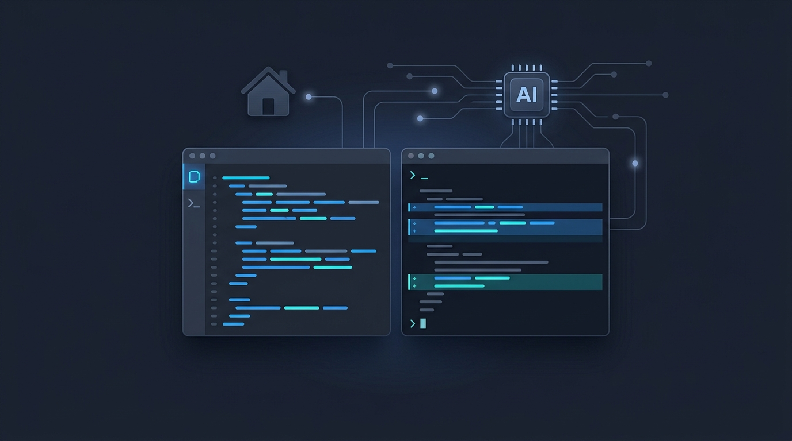

## 概要


Claude Codeは、ターミナルでのコード作成、ファイル編集、コマンド実行を支援する開発用CLIツールです。


便利な開発フローを提供しますが、Claude APIやサブスクリプションベースの環境を使い続けるとコストが発生します。


個人プロジェクトや繰り返しの実験環境では、このコストが負担になることがあります。


この記事では、Claude Codeの使用フローを維持しつつ、実際のモデル実行をOllamaローカルLLMに置き換える方法を整理します。


最新のOllamaは、Claude CLIが使用するAPIパスと互換性のあるコントローラーを提供しているため、別途プロキシを用意しなくてもClaude Codeのリクエストを直接受け取ることができます。


中心となる設定は、Claude互換APIアドレスの指定、認証値の設定、モデル名のマッピングです。


モデル選択は、環境変数、Ollamaモデルエイリアス、CLIの`--model`パラメータという方式で処理できます。


互換APIを持たないツールを併用する場合や、複数のモデルプロバイダーをまとめる必要がある場合は、LiteLLMのようなプロキシを選択的に使用します。


## インストール


インストール作業は大きく4つのステップで進めます。


### ローカルLLMランタイムのインストール


まず、ローカルでモデルを実行できるランタイムをインストールします。代表的なものとしてOllamaを使用できます。


```bash
curl -fsSL https://ollama.com/install.sh | sh
```


インストール後、サービスが正常に動作しているか確認します。


```bash
ollama --version
```


### 使用するモデルのダウンロード


Claude Codeの代替用途として使用するモデルをダウンロードします。コード作成やコマンド理解が必要な作業であれば、Qwen Coder系やLlama系のモデルをまず検討できます。


```bash
ollama pull qwen2.5-coder:7b
```


モデルが正常に動作するか簡単にテストします。


```bash
ollama run qwen2.5-coder:7b
```


## Claudeツールとの連携


### Claude互換APIエンドポイントの準備


Claude CodeやVS CodeのClaude拡張機能でローカルLLMを使用するには、Claude CLIが呼び出すAPIパスと互換性のあるエンドポイントが必要です。


以前は、OllamaのデフォルトAPIパスがClaudeツールが期待するAPI構造と異なっていました。


そのため、別途変換APIを自作するか、LiteLLMのようなプロキシを前段に置いて、Claude形式のリクエストをローカルLLM呼び出しに変換する構成が必要でした。


しかし、最新のOllamaでは、Claude CLIが使用するAPIパスと同じように動作する互換APIコントローラーが標準で提供されています。


したがって、最新のOllamaを使用すれば、別途プロキシを構成しなくてもClaude Codeのリクエストをそのまま Ollamaへ送信できます。


構成方法がシンプルになり、ローカルLLMをClaude開発ツールのフローに組み込みやすくなります。


逆に、使用するツールがClaude互換APIをサポートしていない場合や、Ollamaが提供しないAPI形式を要求する場合はプロキシ構成が必要です。


この場合は、LiteLLMのようなツールを使ってリクエストとレスポンスの形式を変換すればよいです。


まとめると、最新のOllamaを基準にすると`Claudeツール → Ollama Claude互換API`という構造をまず使用します。


Ollamaが提供するClaude互換APIを使用できないツールであれば、`ツール → LiteLLMまたは変換プロキシ → そのツールが要求するモデルAPI`という構造を選択します。


### APIパスの変更


Claude互換APIエンドポイントを使用する際は、まずAPIアドレスと認証値を合わせます。


この設定は、どのモデルを使用するかとは別に、Claudeツールがどのサーバーにリクエストを送るかを決める部分です。


| 環境変数                 | 説明                                                    |
| -------------------- | ----------------------------------------------------- |
| ANTHROPIC_BASE_URL   | Claude APIの代わりに、OllamaのClaude互換APIアドレスを指定します。 |
| ANTHROPIC_AUTH_TOKEN | トークン認証方式が必要なゲートウェイやプロキシ環境で使用します。 |
| ANTHROPIC_API_KEY    | APIキー方式が必要な環境で使用します。ローカルOllamaではダミー値を使用できます。 |


ローカルOllamaに直接接続するシンプルな構成は、通常以下のように設定します。


```bash
export ANTHROPIC_BASE_URL=http://localhost:11434
export ANTHROPIC_API_KEY=dummy-key
```


`ANTHROPIC_AUTH_TOKEN`と`ANTHROPIC_API_KEY`は、使用するゲートウェイや互換API実装方式に応じて選択します。


ローカルOllamaに直接つながる構成であれば、通常は`ANTHROPIC_API_KEY`にダミー値を指定する程度で十分です。


### モデル選択の問題


APIアドレスと認証値を合わせたら、次にモデル名を合わせる必要があります。


Claude CLIやVS CodeのClaude関連設定では、リクエスト先をOllamaのClaude互換APIに変更し、実際に実行するモデルはローカルにインストールされたOllamaモデルに指定します。


Claude CLIは基本的に、Claudeモデル名やモデルエイリアスを基準にリクエストを送ります。


例えば、OllamaにはClaudeモデル名と同一のモデルは存在しません。


したがって、Claudeツールが渡すモデル名を、Ollamaにインストールされたローカルモデル名と合わせる必要があります。


実際の環境では、使用するClaude CLIのバージョンやVS Code拡張機能の設定方式によって、環境変数名やAPIパスが異なる場合があります。


LiteLLMのようなプロキシは、旧バージョンのOllamaを使用する場合や、複数のモデルプロバイダーを1つのエンドポイントにまとめる必要がある場合にのみ、選択的に使用すればよいです。


モデル選択の問題は、代表的に以下の3つの方式で整理できます。


CASE 1: 環境変数で制御する


まず検討すべき方式は、環境変数でClaude CodeのAPIアドレス、認証値、モデル選択を制御することです。


Ollamaのモデル名を任意にコピーすることなく、Claudeツールがリクエストする対象とモデル名を直接指定できます。


モデル選択に主に使用する環境変数は以下の通りです。


| 環境変数                           | 説明                                                                              |
| ------------------------------ | ------------------------------------------------------------------------------- |
| ANTHROPIC_MODEL                | 現在のセッションで使用するデフォルトモデルを指定します。 |
| ANTHROPIC_DEFAULT_SONNET_MODEL | Sonnet系エイリアスが呼び出されたときに使用するモデルを指定します。 |
| ANTHROPIC_DEFAULT_OPUS_MODEL   | Opus系エイリアスが呼び出されたときに使用するモデルを指定します。 |
| ANTHROPIC_DEFAULT_HAIKU_MODEL  | Haiku系エイリアスや高速な補助作業に使用するモデルを指定します。 |
| ANTHROPIC_SMALL_FAST_MODEL     | 以前、高速な補助作業モデルを指定する際に使われていた値です。最新の構成では ANTHROPIC_DEFAULT_HAIKU_MODEL を優先して使用します。 |


```bash
# デフォルトセッションモデル
export ANTHROPIC_MODEL=qwen2.5-coder:7b

# Sonnet系エイリアスモデル
export ANTHROPIC_DEFAULT_SONNET_MODEL=qwen2.5-coder:7b

# Opus系エイリアスモデル
export ANTHROPIC_DEFAULT_OPUS_MODEL=qwen2.5-coder:14b

# Haiku系エイリアスモデル
export ANTHROPIC_DEFAULT_HAIKU_MODEL=qwen2.5-coder:3b
```


このように設定すると、Claudeツールが内部でモデルエイリアスを区別して呼び出す際、それぞれ異なるOllamaモデルを使用できます。


例えば、一般的なコード修正やリファクタリングは`qwen2.5-coder:7b`で処理し、簡単な要約や高速な補助作業は`qwen2.5-coder:3b`で処理する、といった形です。


従来の`ANTHROPIC_SMALL_FAST_MODEL`は、高速な補助作業モデルを指定する際に使われていた値です。


最新のドキュメントでは、`ANTHROPIC_DEFAULT_HAIKU_MODEL`を使用する方式に整理されています。


したがって、新たに構成する場合は`ANTHROPIC_DEFAULT_HAIKU_MODEL`を優先して使用し、旧バージョンのClaude Codeで必要な場合にのみ`ANTHROPIC_SMALL_FAST_MODEL`も併せて確認します。


環境変数方式は設定の意図が明確です。


ローカルにインストールされたOllamaのモデル名をそのまま使用するため、別途モデルエイリアスを作る必要がありません。


複数のターミナルで異なるモデルの組み合わせをテストするのも容易です。


CASE 2: Ollama使用時に同一のモデル名を合わせる


環境変数でモデル名を制御しにくい場合や、ツールがClaudeモデル名を固定で呼び出す場合は、Ollama側で同一のモデル名を合わせる方式を使用できます。


例えば、Claudeツールが`claude-3-5-sonnet`を固定で呼び出す場合、Ollamaで同じ名前のモデルエイリアスを作成します。


実際に実行されるモデルはQwen Coderですが、外部に公開される名前だけをClaudeモデル名に合わせる方式です。


```bash
ollama cp qwen2.5-coder:7b claude-3-5-sonnet
```


こうすると、Claudeツールは既存のモデル名をそのままリクエストします。


Ollamaは同じ名前で登録されたローカルモデルを見つけて実行します。


ツールのモデル選択UIや設定を変更しにくい場合に有用です。


欠点は、モデルエイリアスが増えると管理すべき名前が多くなることです。


したがって、個人の開発環境では環境変数方式を優先して使用し、モデル名を直接制御できない場合にのみOllamaエイリアス方式を使用するのがよいでしょう。


CASE 3: CLI実行時にmodelパラメータを直接指定する


一時的にモデルを変更して実行したい場合は、Claude CLI実行時に`--model`パラメータを直接指定できます。


この方式は、環境変数を変更せずに特定の実行でのみ異なるモデルを使いたいときに有用です。


```bash
claude --model qwen2.5-coder:7b
```


例えば、普段は環境変数でデフォルトモデルを指定しておき、特定の作業でのみより大きいモデルを使用したい場合は、以下のように実行します。


```bash
claude --model qwen2.5-coder:14b
```


`--model`パラメータは、その実行セッションにのみ適用されます。


複数のターミナルで異なるモデルを同時にテストする際にも使用できます。


ただし、繰り返し同じモデルを使用する予定であれば、環境変数で指定するほうが管理しやすいです。


## まとめ


Claude CodeとVS Code Claude環境は、開発者がすでに慣れているツール使用フローを提供します。


この環境でモデル実行部分だけをローカルLLMに置き換えれば、Claudeインフラのコストを削減しながらも、似たような開発ワークフローを維持できます。


ただし、ローカルLLMはモデルサイズとハードウェア性能によって応答品質と速度が変わります。


複雑なリファクタリングや長いコンテキストが必要な作業では、Claudeより品質が低くなることがあります。


したがって、コスト削減が重要な繰り返し作業や個人プロジェクトから適用するのが現実的です。


## 関連記事

- [OpenClawの構築](../95-openclaw-setup/)
- [OpenClawノードモードのインストールとリモートインフラ接続方法](../107-openclaw-node-mode-remote-infra-setup/)
- [Ollamaのインストールとローカル LLMサーバー構築方法](../112-ollama-local-llm-server-setup/)
