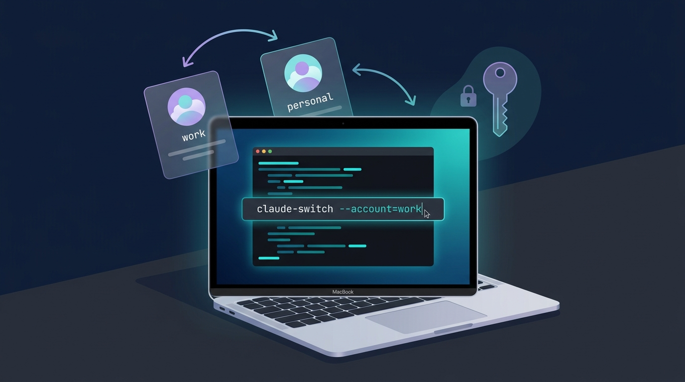
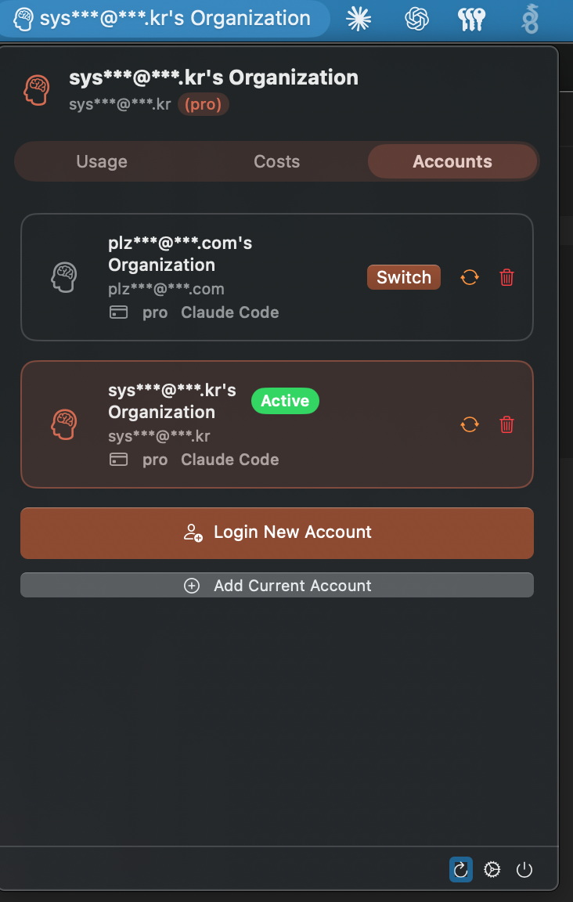
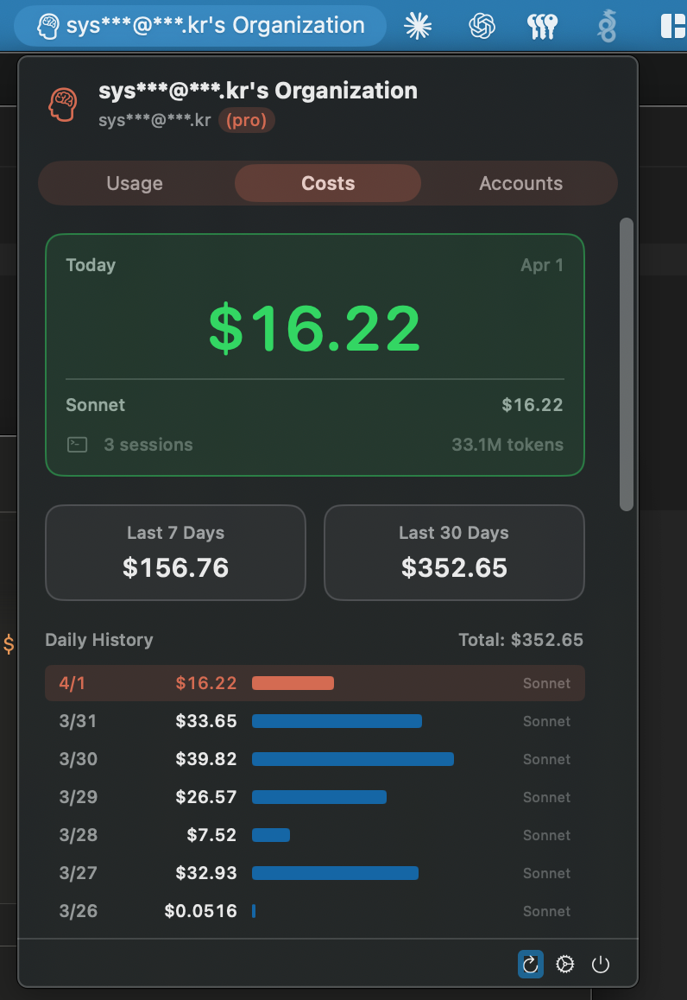
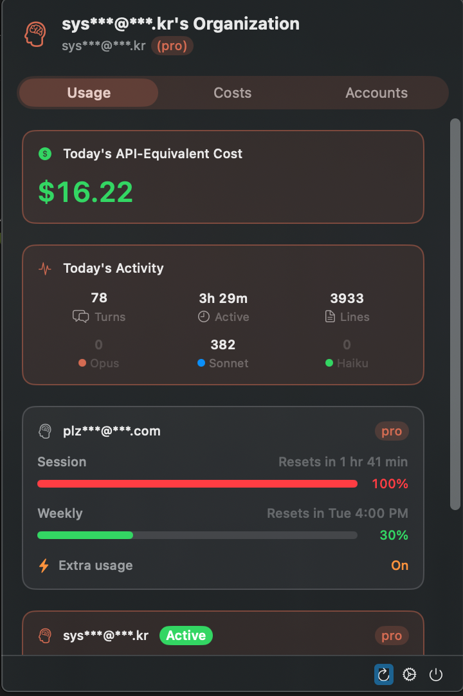

## Overview


Claude Code stores account credentials in an OS-specific secure store.


On macOS, it is stored in Keychain as a `Claude Code-credentials` entry, while Linux and Windows use the `.claude/.credentials.json` file in the user's home directory.

If you switch between multiple Claude accounts frequently, repeatedly logging out and logging back in through the browser breaks your workflow.

This post summarizes how to quickly switch between Claude Code accounts.


There are two main approaches.


Personally, for simple testing, a direct script-based approach is sufficient.


If you switch frequently or prefer a GUI environment, using a dedicated tool like CCSwitcher is more reliable.


## CASE 1: Directly Controlling macOS Keychain Credentials


```bash
# 현재 Claude Code 인증 정보 백업
security find-generic-password -s "Claude Code-credentials" -w > ~/.claude-creds-work.json

# 기존 Keychain 항목 삭제
security delete-generic-password -s "Claude Code-credentials" 2>/dev/null

# 백업한 인증 정보를 Keychain에 다시 등록
security add-generic-password -s "Claude Code-credentials" -a "$USER" -w "$(cat ~/.claude-creds-work.json)"
```


The commands above save the currently logged-in Claude Code credentials to a file, then replace the Keychain entry. If you separate the files by account, such as `~/.claude-creds-personal.json` and `~/.claude-creds-work.json`, you can switch quickly.


### Automation Script


```bash
# Claude switch account
claude-switch() {
  local account=$1
  local creds_file=~/".claude-creds-${account}.json"
  
  if [ ! -f "$creds_file" ]; then
    echo "❌ 계정 파일 없음: $creds_file"
    return 1
  fi
  
  # Keychain 업데이트
  security delete-generic-password -s "Claude Code-credentials" 2>/dev/null
  security add-generic-password -s "Claude Code-credentials" -a "$USER" -w "$(cat $creds_file)"
  
  echo "✅ Claude 계정 전환 완료: $account"
}

# 사용법: claude-switch personal / claude-switch work
```


## CASE 2: Using a Dedicated Tool


If controlling Keychain directly feels burdensome, it's a good idea to use a dedicated account-switching tool.

- Terminal-based: [claudini](https://github.com/kimrgrey/claudini)
- macOS GUI-based: [CCSwitcher](https://github.com/XueshiQiao/CCSwitcher)

`claudini` is suitable if you want to switch Claude Code accounts from the terminal. Similar to the script-based approach, it can be used mainly via CLI.


`CCSwitcher` is a GUI tool that lets you switch accounts by selecting them from the macOS menu bar. If you frequently move between multiple accounts, it's more convenient than managing your own scripts.


### CCSwitcher Is Recommended on macOS











## Conclusion


When using multiple Claude Code accounts, the key is to keep the credentials separated per account and swap in the appropriate one when needed.


On macOS, since Claude Code credentials are stored in Keychain, you can back them up and swap them directly using the `security` command.


This approach has a simple structure and requires no additional tools.


However, since you have to manage the credential files yourself, you need to pay attention to file permissions and where they're stored.


If you need to switch accounts frequently, it's better to use a dedicated tool.


If you work mainly in the terminal, you can use `claudini`, and if you want GUI-based switching on macOS, `CCSwitcher` is the most convenient.


Credentials should be treated with the same care as account access privileges. Don't upload backup files to external storage, and make sure only the users who need access can read them.
