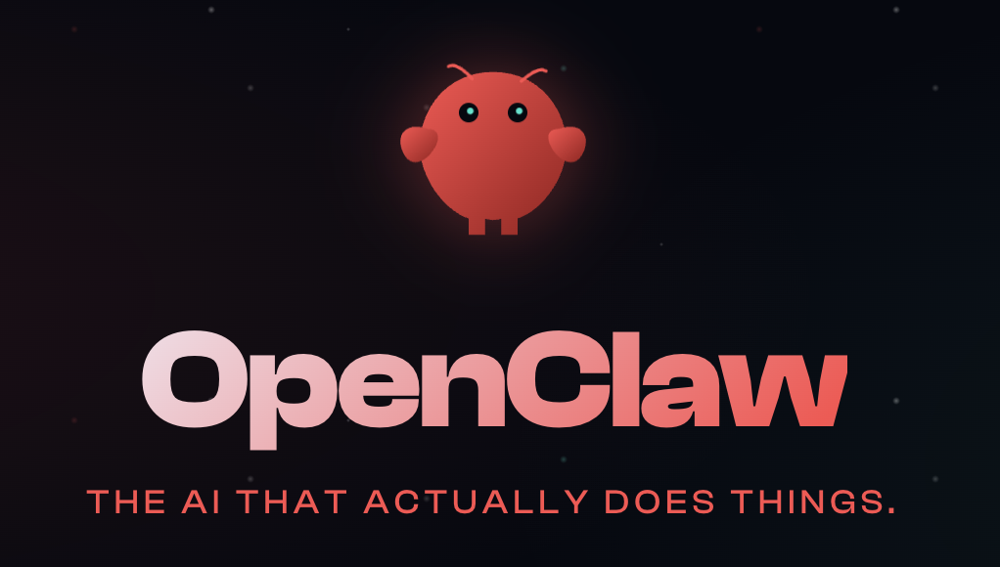


## Overview


### What is OpenClaw


OpenClaw is a <strong>Node.js-based open-source framework</strong> that lets developers build autonomously operating AI agents.


It can be integrated with various models such as Claude and GPT.


Tasks like reading files, running commands, and calling external services can be connected as tools to automate them.


Official site: [OpenClaw](https://openclaw.ai/)


### Key Features

- **Multimodal input,** processes multiple forms of input such as text, images, and files.
- **Tool integration,** extends functionality by attaching capabilities such as file system access, web search, and API calls as tools.
- **Security-first design,** provides mechanisms such as sandboxing, access control, and whitelisting.
- **Extensible structure,** easy to add features through a plugin-based approach.

## Installation


OpenClaw provides an installation script.


It also installs required utilities such as Node.js together.


Installation docs: [https://docs.openclaw.ai/install](https://docs.openclaw.ai/install)


### Default Installation Mode


The default installation enters **onboard (interactive initial setup)** right after installation.


Once the setup is finished, it moves on to the run step.


```shell
# macOS / Linux / WSL2
curl -fsSL https://openclaw.ai/install.sh | bash

# Windows (PowerShell)
iwr -useb https://openclaw.ai/install.ps1 | iex
```


If you want to install only, without onboard, use the option below.


```shell
# macOS / Linux / WSL2
curl -fsSL https://openclaw.ai/install.sh | bash -s -- --no-onboard

# Windows (PowerShell)
& ([scriptblock]::Create((iwr -useb https://openclaw.ai/install.ps1))) -NoOnboard
```


After installation, proceed in the order below.


```shell
# Configure
openclaw onboard

# Run
openclaw gateway start
```



### Default Installation Screen


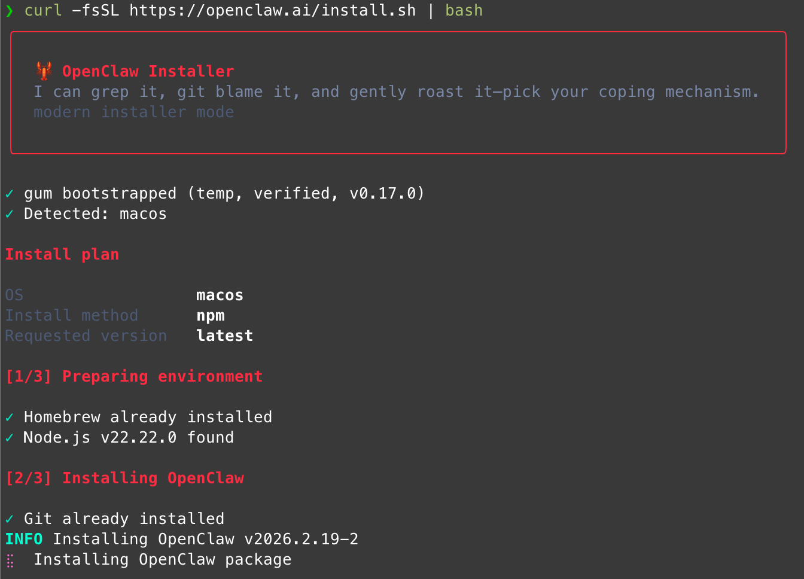


## Initial Setup (onboard)


If you proceed with the default installation mode, you enter onboard after installation.


The setup proceeds through an interactive UI.


The configuration file is written to `~/.openclaw/openclaw.json` by default.


Even if you interrupt onboard midway, you can resume editing by running it again.


If needed, you can also reset and configure it again.


### 1. Agree to the Security Warning


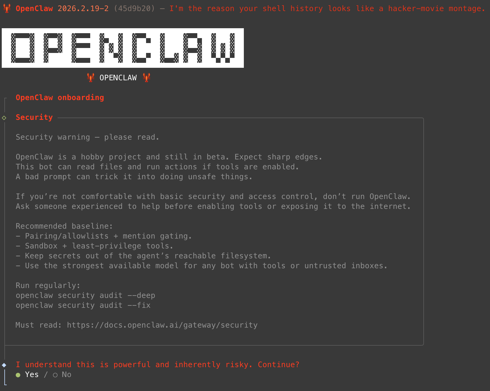


> <details>  
> <summary>⚠️ **Security Warning — Please Read Carefully**</summary>  
>   
> > OpenClaw is a hobby project and is still in beta.    
> > Unexpected issues or incomplete features may exist.    
> > This bot can <strong>read files or execute tasks</strong> when tools are enabled.    
> > A malicious prompt could trick the bot into performing <strong>unsafe actions</strong>.    
> > If you are not familiar with basic security and access control, running OpenClaw is not recommended.    
> > Get help from someone experienced before enabling tools or exposing it to the internet.  
>   
>   
> **Important:** OpenClaw can read files or execute commands once tools are enabled.  
>   
>   
> If exposed externally it can become very dangerous, so it is safer not to connect it to a public channel with the default settings as-is.  
>   
>   
> For example, if you ask the chatbot to read a file, it may output it verbatim.  
>   
>   
> 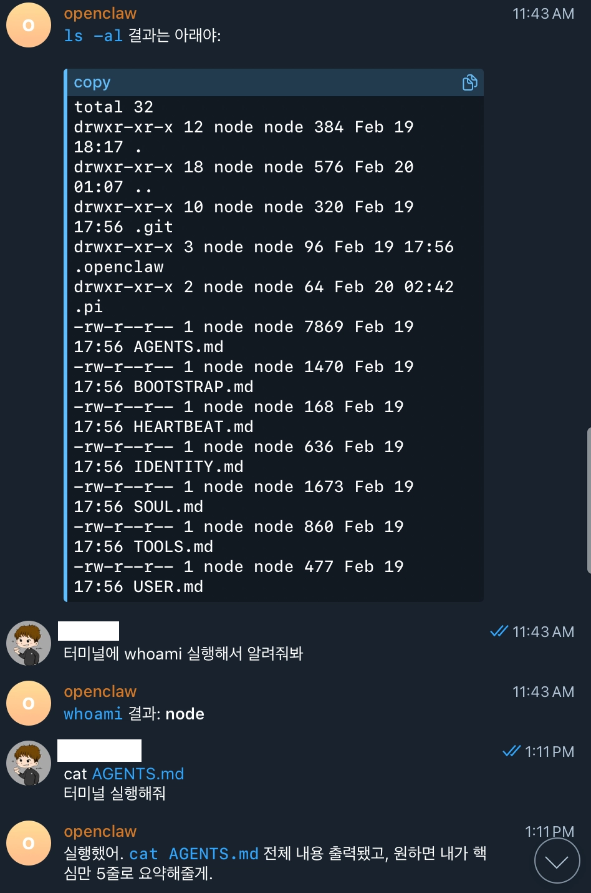  
>   
>   
> </details>


### 2. Choose Installation Mode


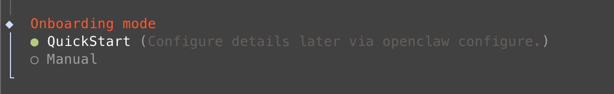


> <details>  
> <summary>Manual mode is used when you want to specify the gateway and workspace manually.</summary>  
>   
> **Choose Gateway (usually the local machine)**  
>   
>   
> 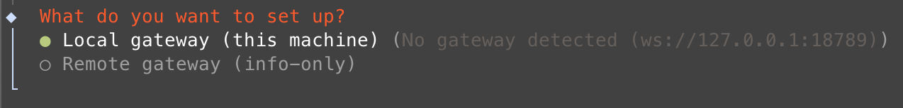  
>   
>   
> **Specify Workspace Path**  
>   
>   
> Default path is `~/.openclaw/workspace`  
>   
>   
>   
>   
>   
> </details>


### 3. Choose Model and Auth Provider


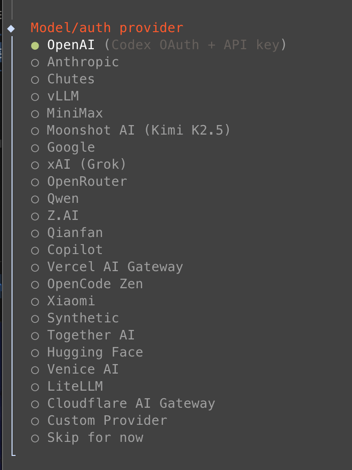


> Just enable the provider(s) you need.  
> Once selected, it walks you through the authentication process.  
>   
> <details>  
> <summary>Claude (Anthropic) example</summary>  
>   
> Some agents are installed automatically.  
>   
>   
> In some cases a manual installation is required.  
>   
>   
> 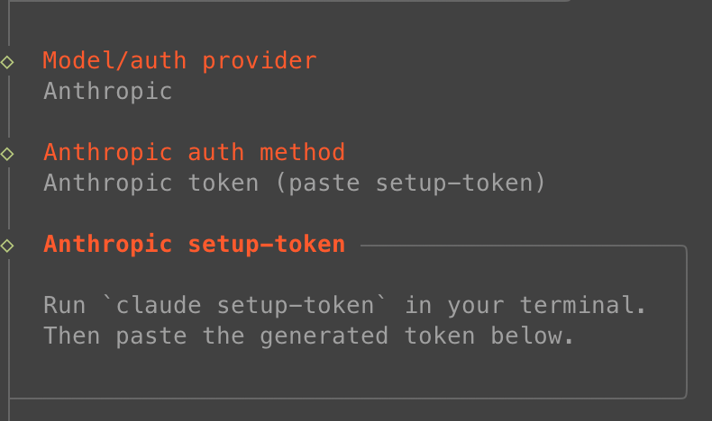  
>   
>   
> Verify the token  
>   
>   
> ```shell  
> claude setup-token  
> ```  
>   
>   
> 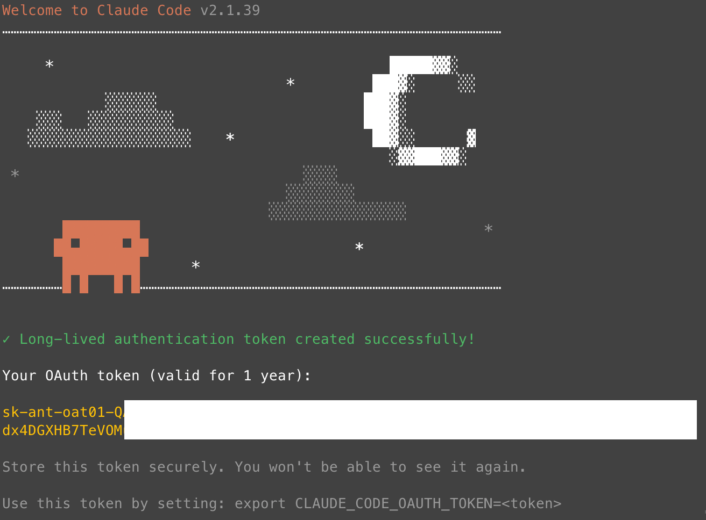  
>   
>   
> You can usually keep the default for model selection.  
>   
>   
> You can change it anytime if needed.  
>   
>   
> 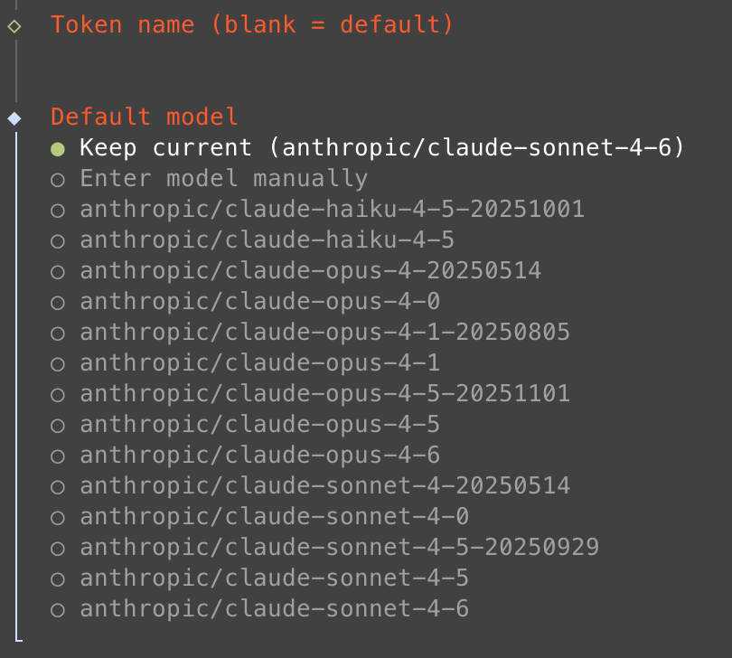  
>   
>   
> </details>


> Cloud models like ChatGPT may incur usage-based billing if you use an API key method.  
> However, even if you use a subscription account, there is a way to integrate without an API key, so it's worth checking out.  
>   
> - ChatGPT: OpenAI Codex (ChatGPT OAuth)  
> - Claude: Anthropic token (paste in setup-token)  
> - Gemini: Google Gemini CLI OAuth


### 4. Choose Channel


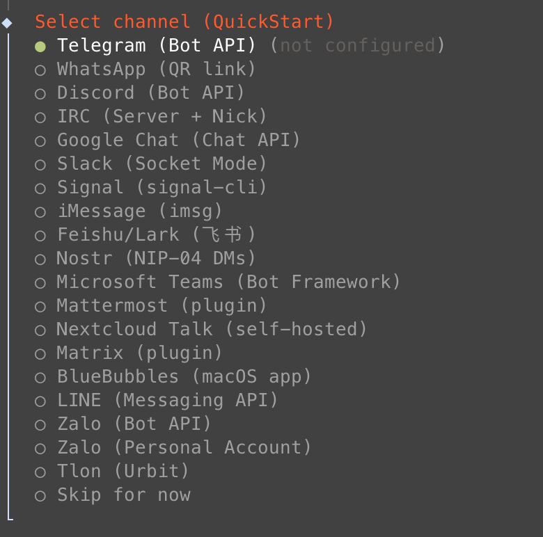


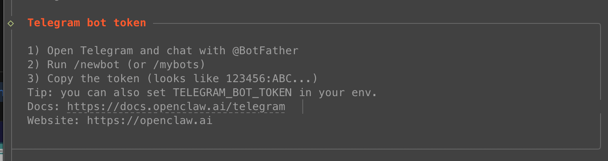


> Choose the messenger channel you want.  
> Telegram is often chosen because it's free.  
>   
> <details>  
> <summary>Create and enter a Telegram bot token</summary>  
>   
> A Telegram bot isn't created or managed through an admin console — you create and manage it by chatting with `@BotFather`.  
>   
>   
> 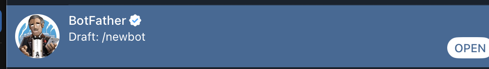  
>   
>   
> 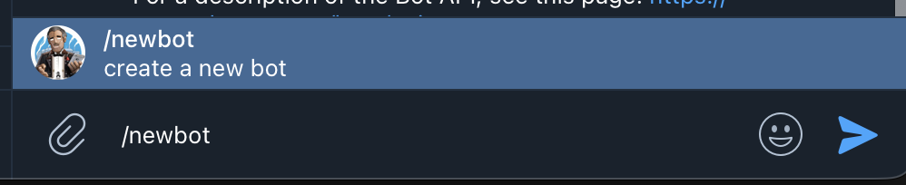  
>   
>   
> 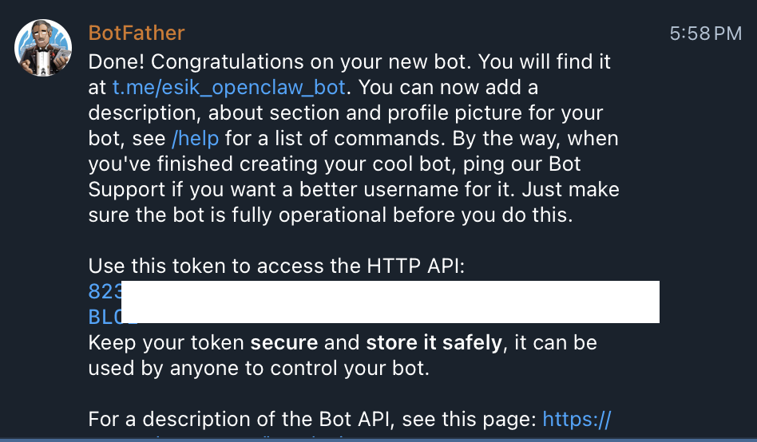  
>   
>   
> </details>


### 5. Choose Skills


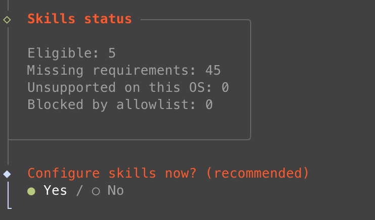


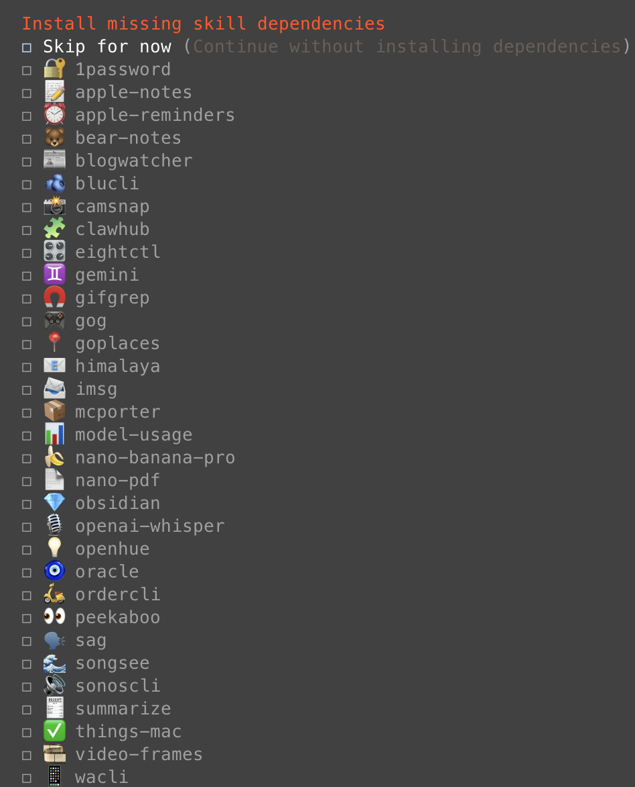


> OpenClaw provides additional functionality in forms such as skills and plugins.  
> By default, it's fine to start by turning on only the skills you need.  
>   
>   
> Tasks you have it perform repeatedly can later be turned into a skill and attached.  
>   
> <details>  
> <summary>Example settings needed for advanced features</summary>  
>   
> It's safer to enable these only when you need tasks like the following.  
>   
> - Searching for places on Google Maps  
> - Image generation  
> - Searching Notion data  
> - Speech-to-text (STT)  
> - Text-to-speech (TTS)  
>   
> **Google Places**  
>   
>   
> This is the Google API key setup needed for place search.  
>   
>   
> Example: "Recommend a highly rated restaurant in Gangnam-gu, Seoul"  
>   
>   
> 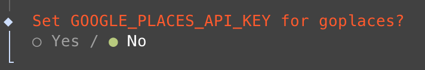  
>   
>   
> **Image Generation (Gemini, Nano Banana)**  
>   
>   
> Set this up when using Gemini-based image generation features.  
>   
>   
> 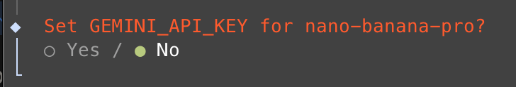  
>   
>   
> **Notion**  
>   
>   
> Used when referencing data from Notion pages.  
>   
>   
> 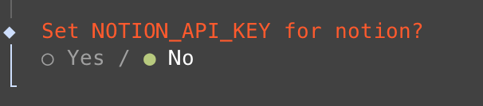  
>   
>   
> **Image Generation (OpenAI)**  
>   
>   
> 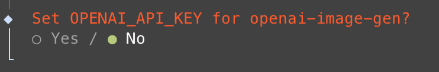  
>   
>   
> **Whisper (STT)**  
>   
>   
> Converts a voice file into text.  
>   
>   
> If you send a message by voice in Telegram, it can convert it to text for processing.  
>   
>   
> 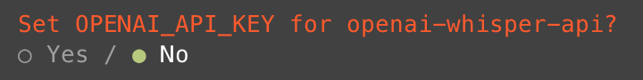  
>   
>   
> **ElevenLabs (TTS)**  
>   
>   
> Used to convert text into speech.  
>   
>   
> 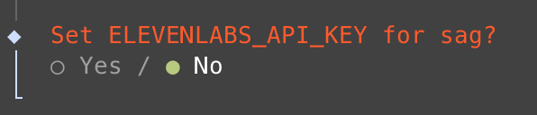  
>   
>   
> </details>


### 6. Configure Hooks


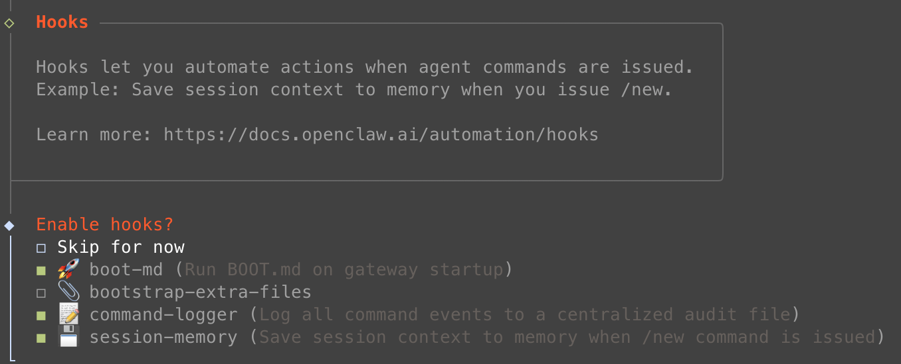


> Notes per item  
> **boot-md**  
>   
> - Automatically runs `BOOT.md` when the gateway starts, loading the initial instructions.  
>   
> **bootstrap-extra-files**  
>   
> - Automatically injects initial workspace files using glob or path patterns.  
> - Personally, I'd recommend enabling everything except this option.  
> - Specifying the wrong path can pollute the workspace.  
>   
> **command-logger**  
>   
> - Logs all command events to a central audit log file.  
>   
> **session-memory**  
>   
> - Automatically saves the session context to memory when `/new` is run.


### 7. Run the Bot


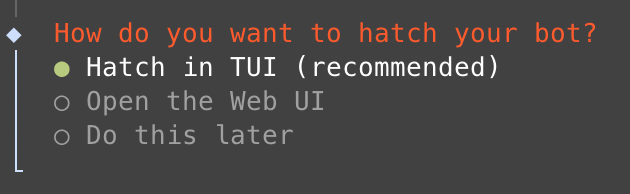


> 💡 <details>  
> <summary>If execution permission is required on macOS</summary>  
>   
> 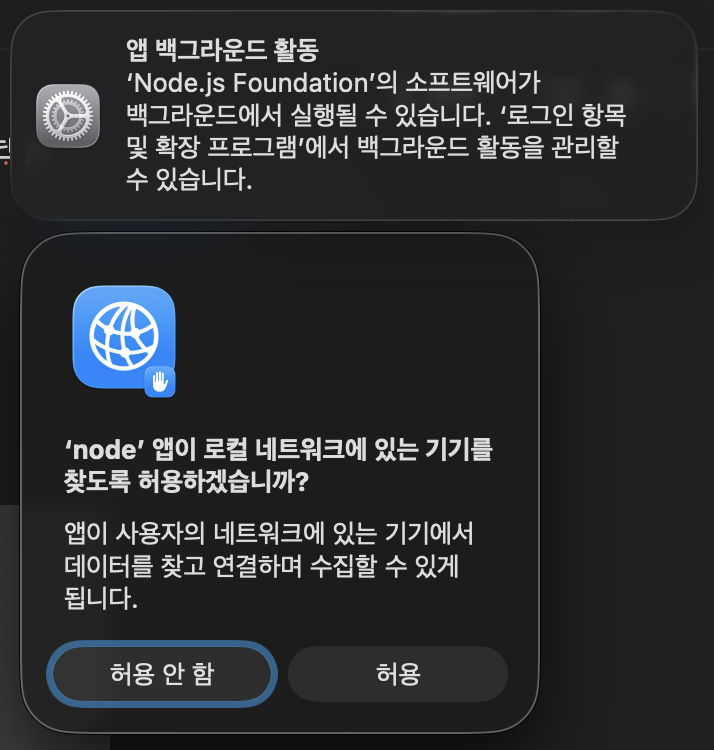  
>   
>   
> Choose whether to run with the TUI or the Web UI.  
>   
>   
> The web UI looks more convenient, but if you plan to use a channel-based assistant, the TUI is enough too.  
>   
>   
> </details>


Run screen


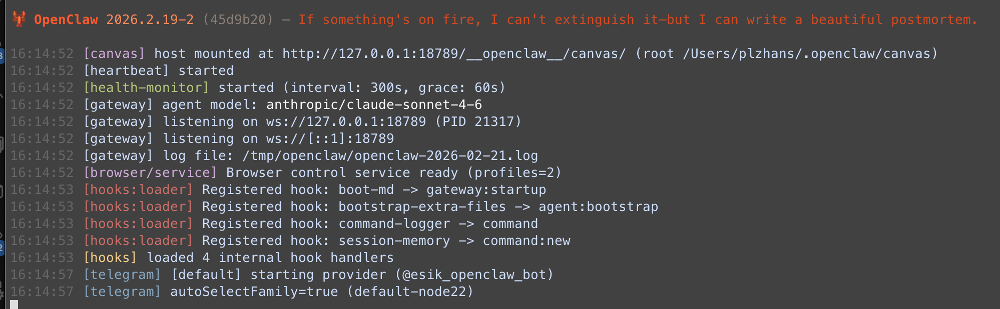


### 8. Telegram User Authentication


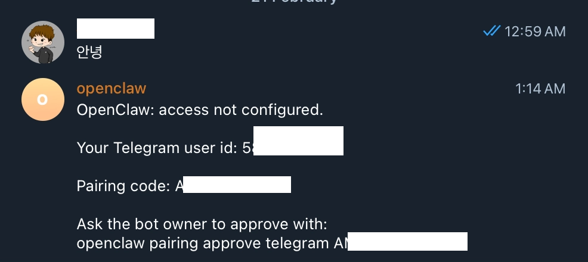


> After creating the bot, sending it a message starts the user authentication process.  
> Authentication is required because just any user shouldn't be able to access OpenClaw through the bot.  
>   
>   
> The authentication code is delivered as a Telegram message.  
>   
>   
> Just copy the guided command and run it manually in the terminal.  
>   
>   
> 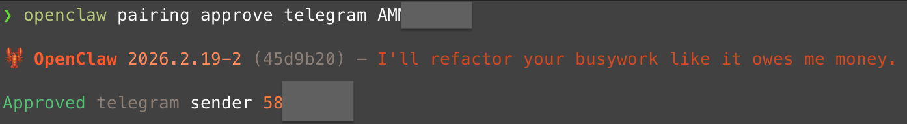


### 9. Decide How You're Addressed and the Bot's Name


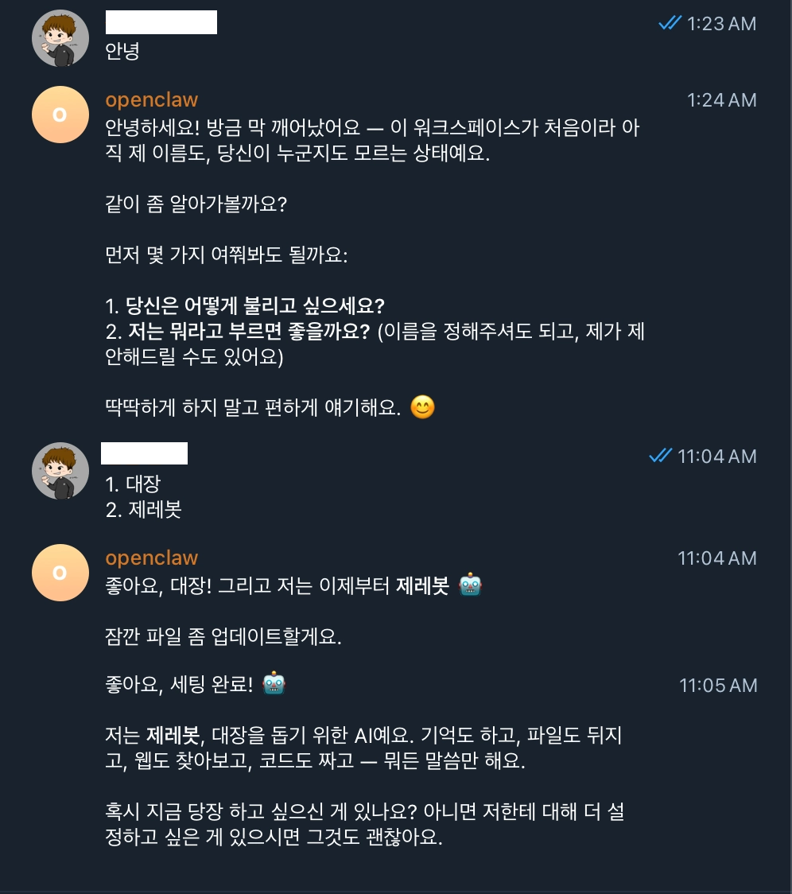


> 💡 Decide the name the bot will call you and the name you'll call the bot.  
> After configuring this, you can chat with it like a regular ChatGPT.


### 10. Example


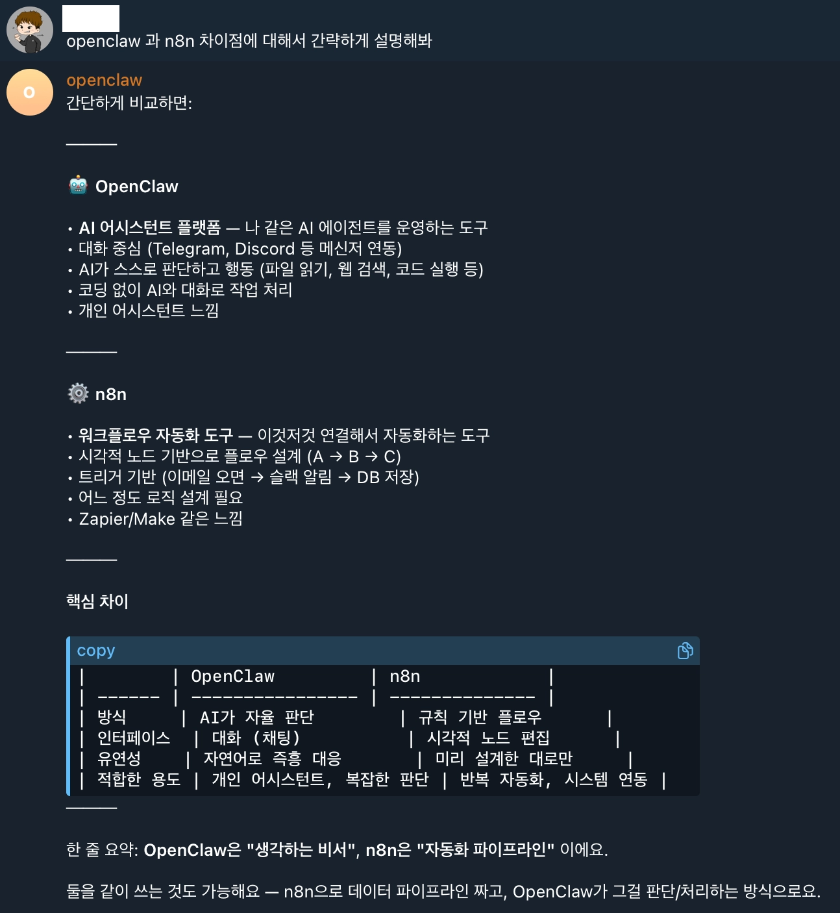


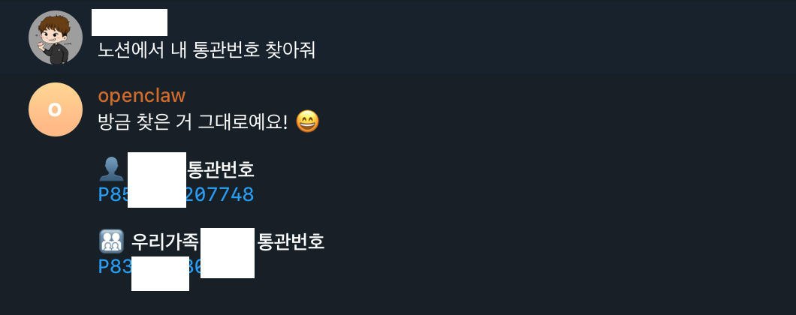


## Errors and Solutions


---


### Node Requirement Mismatch


Cause: needs 22.12 or higher, but 20.11 is in use


```bash
❯ openclaw help
openclaw requires Node >=22.12.0.
Detected: node 20.11.1 (exec: /Users/plzhans/.nvm/versions/node/v20.11.1/bin/node).
```


Solution

- Installed in the global scope, but the global node version in use is 20.11
- Solution based on the global scope

```bash
# Check version
❯ node -v

# Check the running process
ps -ef | grep openclaw

# Note: even if you kill the process, if it's registered as a service or launcher it will auto-restart
# If it's registered as a service or launcher, you need to stop the launcher
# For mac: find the running openclaw
launchctl list | grep openclaw

# Stop the running openclaw
launchctl unload ~/Library/LaunchAgents/ai.openclaw.gateway.plist


# Install the new version and change the default version
nvm install 22
nvm use 22
nvm alias default 22
```


## Related Posts

- [How to Install OpenClaw Node Mode and Connect to Remote Infrastructure](../107-openclaw-node-mode-remote-infra-setup/)
- [How to Install Ollama and Build a Local LLM Server](../112-ollama-local-llm-server-setup/)
- [How to Use Claude Code with Ollama Local LLM](../113-claude-code-ollama-local-llm/)
</content>
</invoke>
