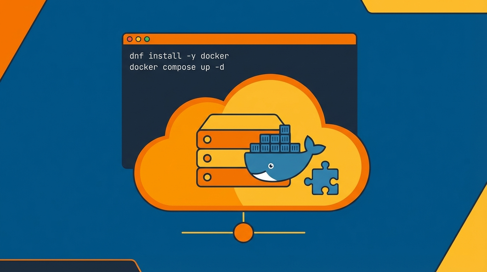

## 概要


Amazon Linux 2023ベースのEC2でDockerとDocker Composeを動作させるための最小限のインストール手順をまとめます。


## パッケージのインストール


`dnf`はRHEL系(例:Fedora、RHEL、Amazon Linux 2023)で使用されるパッケージマネージャーです。


Ubuntu/Debianの`apt-get`やCentOSの`yum`と同じ役割を果たします。


リポジトリからパッケージをダウンロードしてインストールし、依存関係を自動的に処理します。


### パッケージの更新


```bash
sudo dnf update -y
```


### Dockerのインストール


```bash
sudo dnf install -y docker
```


## 基本設定


### Dockerサービスの有効化


Dockerデーモン(dockerd)が実際に実行されていないと、`docker`コマンドは動作しません。


`enable --now`は<strong>今すぐ起動</strong>し、<strong>再起動後も自動起動</strong>するように登録します。


```bash
sudo systemctl enable --now docker
```


### 現在のユーザーにDocker権限を付与


デフォルトでは、Dockerソケット(`/var/run/docker.sock`)にはroot権限が必要です。


`docker`グループにユーザーを追加すると、毎回`sudo`を付けなくてもDockerを使用できます。


`newgrp docker`は<strong>現在のセッションにグループ変更を即座に反映</strong>するためのコマンドです。


ログアウト後に再ログインしても同様に適用されます。


```bash
sudo usermod -aG docker $USER
newgrp docker
```


Dockerの動作確認


```bash
docker version
```


Amazon Linux 2023環境では、Dockerのインストールだけで`docker compose`が一緒に提供される場合があります。


```bash
docker compose version
```


## Docker Composeを別途インストールする必要がある場合


`docker compose version`が失敗した場合は、以下の方法でCLIプラグインをインストールします。


ディレクトリの作成


```bash
mkdir -p ~/.docker/cli-plugins
```


インストール:ARM64(aarch64)


```bash
curl -SL https://github.com/docker/compose/releases/latest/download/docker-compose-linux-aarch64 \
	-o ~/.docker/cli-plugins/docker-compose
```


x86_64の場合


```bash
curl -SL https://github.com/docker/compose/releases/latest/download/docker-compose-linux-x86_64 \
	-o ~/.docker/cli-plugins/docker-compose
```


実行権限の追加


```bash
chmod +x ~/.docker/cli-plugins/docker-compose
```


Docker Composeのインストール確認


```bash
docker compose version
```


## よくある問題


### permission denied while trying to connect to the Docker daemon socket


`usermod -aG docker`は実行したものの、現在のシェルにグループが反映されていない状態です。


```bash
# 現在のシェルが認識しているグループを確認
id -nG
```


リストに`docker`がなければ、`newgrp docker`で現在のシェルに反映します。`newgrp`はそのシェルにのみ適用されるため、新しくSSHセッションを開くか、ログアウト後に再接続すれば以降は自動的に適用されます。


### no matching manifest for linux/arm64/v8


ARM64インスタンスでamd64専用イメージを実行したときに発生します。A1やGraviton系でよく遭遇します。


まず、そのイメージがarm64に対応しているか確認します。


```bash
docker manifest inspect {イメージ名} | grep architecture
```


選択肢は3つあります。

- arm64に対応したタグを使用する。ほとんどの公式イメージはマルチアーキテクチャに対応しています。
- `docker buildx`で自分でマルチアーキテクチャイメージをビルドする。
- `--platform linux/amd64`でエミュレーション実行する。QEMUエミュレーションが必要でパフォーマンス低下が大きいため、一時的な対処としてのみ使用します。

### 再起動後にコンテナが起動しない


`systemctl enable --now docker`はDockerデーモンのみを自動起動します。コンテナには別途再起動ポリシーを指定する必要があります。


```bash
docker run -d --restart unless-stopped {イメージ名}
```


Composeを使う場合は、サービスに`restart: unless-stopped`を指定します。


## 運用前に整理しておくとよいこと


### コンテナログ容量の制限


デフォルトの`json-file`ドライバーは、ログを無制限に蓄積します。これはEC2のディスクが一杯になるよくある原因です。


```bash
# /etc/docker/daemon.json
{
  "log-driver": "json-file",
  "log-opts": {
    "max-size": "10m",
    "max-file": "3"
  }
}
```


設定後、デーモンを再起動します。すでに実行中のコンテナには適用されないため、再作成する必要があります。


```bash
sudo systemctl restart docker
```


### Docker Composeのバージョン固定


先ほど使用した`releases/latest`のアドレスは、ダウンロードする時点によって異なるバージョンを取得します。再現可能な環境が必要な場合は、バージョンを固定します。


```bash
# リリースページで確認したバージョンを指定します
COMPOSE_VERSION={使用するバージョン}

curl -SL https://github.com/docker/compose/releases/download/${COMPOSE_VERSION}/docker-compose-linux-aarch64 \
	-o ~/.docker/cli-plugins/docker-compose

chmod +x ~/.docker/cli-plugins/docker-compose
docker compose version
```


### ディスクの整理


```bash
# 使用量の確認
docker system df

# 未使用リソースの整理
docker system prune

# 未使用イメージまで整理
docker system prune -a
```


`prune -a`は、実行中でないコンテナが参照しているイメージまで削除します。運用サーバーでは、削除対象を確認してから実行してください。
