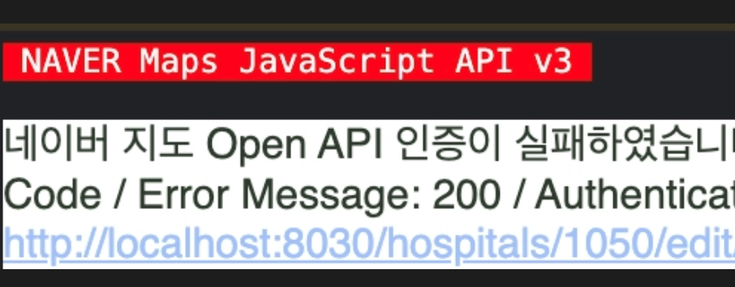
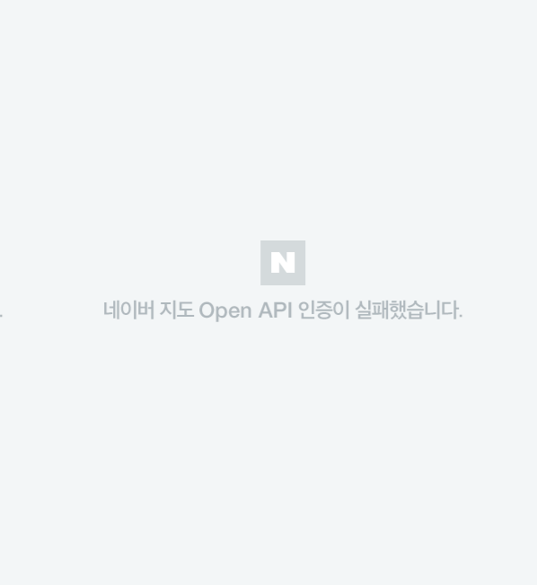

## Naver Map Authentication Error


Authentication fails despite correctly registering the service URL in the application settings.


### Problem: Naver Map Authentication Fails

> 네이버 지도 Open API 인증이 실패하였습니다. 클라이언트 아이디와 웹 서비스 URL을 확인해 주세요.,  * Error Code / Error Message: 200 / Authentication Failed,  * Client ID: xxxxx,  * URI: [http://localhost:8030/](http://localhost:8030/hospitals/1050/edit/basic)xxxxx
>
>
> 
>
>
> 
>
>

### Cause: The Client ID Parameter Name Changed from `ncpClientId` to `ncpKeyId`


Reference Documentation

- [https://navermaps.github.io/maps.js.ncp/docs/tutorial-2-Getting-Started.html](https://navermaps.github.io/maps.js.ncp/docs/tutorial-2-Getting-Started.html)

### Solution: Use the Correct Parameter ID


Before Change


```plain text
<!-- General -->
<script type="text/javascript" src="https://oapi.map.naver.com/openapi/v3/maps.js?ncpClientId=YOUR_CLIENT_ID"></script>

<!-- Public/Government -->
<script type="text/javascript" src="https://oapi.map.naver.com/openapi/v3/maps.js?govClientId=YOUR_CLIENT_ID"></script>

<!-- Finance -->
<script type="text/javascript" src="https://oapi.map.naver.com/openapi/v3/maps.js?finClientId=YOUR_CLIENT_ID"></script>
```


After Change


```plain text
<!-- Personal/General Unified -->
<script type="text/javascript" src="https://oapi.map.naver.com/openapi/v3/maps.js?ncpKeyId=YOUR_CLIENT_ID"></scri
```
