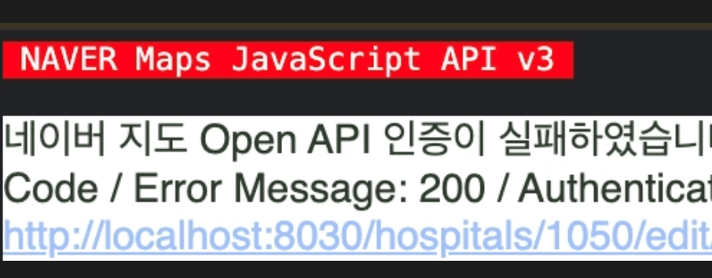
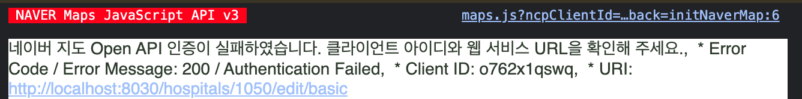
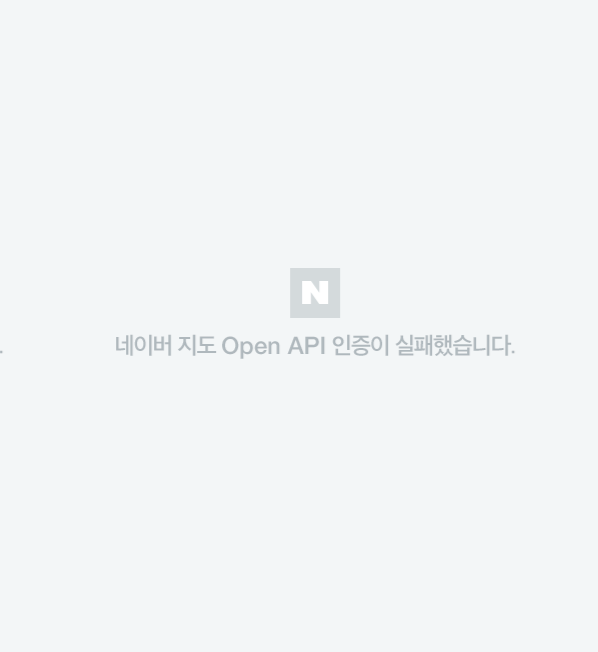

## Naver Map Authentication Error


Even though the service URL was correctly registered in the application settings, authentication still fails.


### Problem: Naver Map authentication fails

> Naver Map Open API authentication failed. Please check the client ID and web service URL.,  * Error Code / Error Message: 200 / Authentication Failed,  * Client ID: xxxxx,  * URI: [http://localhost:8030/](http://localhost:8030/hospitals/1050/edit/basic)xxxxx  
> 
>
> 
>
>
> 
>
>

### Cause: The client ID parameter name changed from `ncpClientId` to `ncpKeyId`


Reference document

- [https://navermaps.github.io/maps.js.ncp/docs/tutorial-2-Getting-Started.html](https://navermaps.github.io/maps.js.ncp/docs/tutorial-2-Getting-Started.html)

### Solution: Use the correct parameter ID


Before the change


```plain text
<!-- 일반 -->
<script type="text/javascript" src="https://oapi.map.naver.com/openapi/v3/maps.js?ncpClientId=YOUR_CLIENT_ID"></script>

<!-- 공공 -->
<script type="text/javascript" src="https://oapi.map.naver.com/openapi/v3/maps.js?govClientId=YOUR_CLIENT_ID"></script>

<!-- 금융 -->
<script type="text/javascript" src="https://oapi.map.naver.com/openapi/v3/maps.js?finClientId=YOUR_CLIENT_ID"></script>
```


After the change


```plain text
<!-- 개인/일반 통합 -->
<script type="text/javascript" src="https://oapi.map.naver.com/openapi/v3/maps.js?ncpKeyId=YOUR_CLIENT_ID"></script>
```


## Why Did It Change


The consoles that were previously separated for public institutions and financial institutions have been integrated into a single console for individuals/general businesses. The parameters were also consolidated into one to match.


| Category    | Previous Parameter     | After Change     |
| ----- | ----------- | -------- |
| Individual/General | ncpClientId | ncpKeyId |
| Public Institution  | govClientId | ncpKeyId |
| Financial Institution  | finClientId | ncpKeyId |


It has been announced that the existing consoles for public institutions and financial institutions will be discontinued. If you were using those consoles, you need to issue a new key from the integrated console.


> ⚠️ Since different documents were updated at different times, some pages still refer to the old parameter name. It is more reliable to check the script loading method based on the Maps JavaScript API v3 Getting Started documentation.


## Web Service URL Registration Rules


If the same error occurs even after fixing the parameter, check the web service URL registered in the console.


**Only the host domain should be registered; the port number and URI must be excluded.**


| Incorrect Registration                                          | Correct Registration                                |
| ----------------------------------------------- | ------------------------------------- |
| [http://localhost:8080](http://localhost:8080/) | [http://localhost](http://localhost/) |
| [http://127.0.0.1/main](http://127.0.0.1/main)  | [http://127.0.0.1](http://127.0.0.1/) |


If the URI shown in the earlier error message was in the form `http://localhost:8030/hospitals/...`, also check whether the registered value includes a port or path.


## Checklist

1. Check whether the parameter in the loading URL is `ncpKeyId`.
2. Check whether the key was issued from the integrated console. Authentication fails if you continue to use a key from the old console.
3. Remove the port number and path from the registered web service URL.
4. The previous script may be cached, so clear the browser cache and check again.

## Reference

- [Maps Troubleshooting - NAVER Cloud Platform User Guide](https://guide.ncloud-docs.com/docs/maps-troubleshoot)
