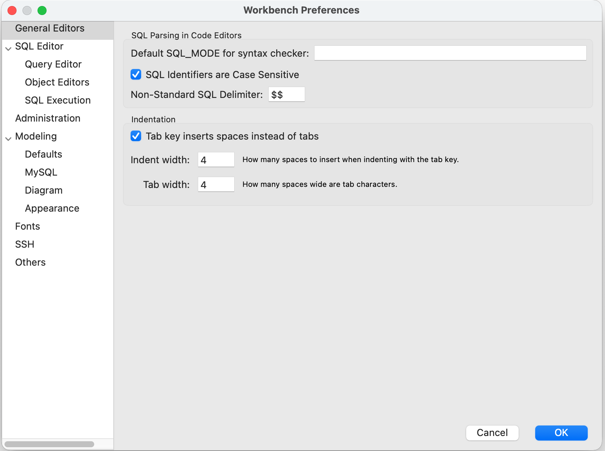
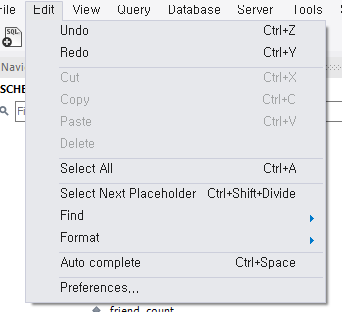
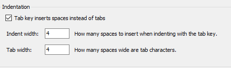

## 개요


SQL 스크립트를 여러 사람이 함께 관리할 때는 들여쓰기 규칙을 맞추는 것이 중요합니다. 탭과 공백이 섞이면 코드 정렬이 깨지고 Git diff에서 불필요한 변경 사항이 많이 생길 수 있습니다.


개발 환경에서는 보통 탭 대신 공백 4칸을 사용하는 정책을 많이 사용합니다. MySQL Workbench도 6.2.4 이후 버전부터 탭 입력을 공백으로 변환하는 설정을 제공합니다.


## 설정


MySQL Workbench에서 탭을 공백으로 바꾸려면 Preferences 메뉴로 이동합니다.


```plain text
Edit -> Preferences
```





Preferences 창에서 `General Editors` 항목을 선택한 뒤 `Indentation` 설정을 변경합니다.


```plain text
General Editors -> Indentation

Tab key inserts spaces instead of tabs: 체크
Indent width: 4
Tab width: 4
```





설정을 저장한 뒤 SQL 편집창에서 탭 키를 입력하면 탭 문자가 아니라 공백 4칸이 입력됩니다. 바로 적용되지 않는 경우에는 열려 있는 편집창을 닫았다가 다시 열거나 MySQL Workbench를 재시작합니다.


프로시저 에디터에서는 설정이 동일하게 적용되지 않을 수 있습니다. 이 경우 SQL 편집창에서 작성한 뒤 프로시저에 반영하거나 별도 에디터에서 포맷을 맞춘 뒤 붙여넣는 방식으로 처리합니다.


참고 문서: [MySQL Workbench General Editors Preferences](https://dev.mysql.com/doc/workbench/en/wb-preferences-general-editors.html)

