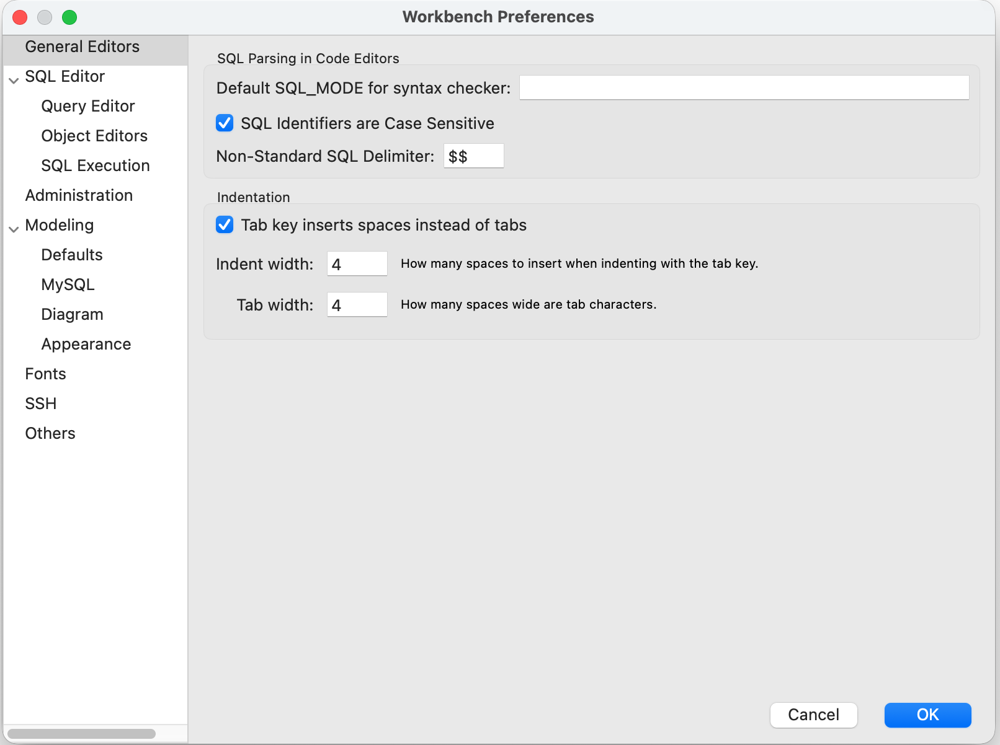
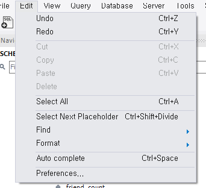
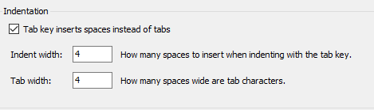

## 개요


SQL 스크립트를 여러 사람이 함께 관리할 때는 들여쓰기 규칙을 맞추는 것이 중요합니다. 탭과 공백이 섞이면 코드 정렬이 깨지고 Git diff에서 불필요한 변경 사항이 많이 생길 수 있습니다.


개발 환경에서는 보통 탭 대신 공백 4칸을 사용하는 정책을 많이 사용합니다. MySQL Workbench도 6.2.4 이후 버전부터 탭 입력을 공백으로 변환하는 설정을 제공합니다.


## 설정


MySQL Workbench에서 탭을 공백으로 바꾸려면 Preferences 메뉴로 이동합니다.


```plain text
Edit -> Preferences
```





Preferences 창에서 `General Editors` 항목을 선택한 뒤 `Indentation` 설정을 변경합니다.


```plain text
General Editors -> Indentation

Tab key inserts spaces instead of tabs: 체크
Indent width: 4
Tab width: 4
```





설정을 저장한 뒤 SQL 편집창에서 탭 키를 입력하면 탭 문자가 아니라 공백 4칸이 입력됩니다. 바로 적용되지 않는 경우에는 열려 있는 편집창을 닫았다가 다시 열거나 MySQL Workbench를 재시작합니다.


프로시저 에디터에서는 설정이 동일하게 적용되지 않을 수 있습니다. 이 경우 SQL 편집창에서 작성한 뒤 프로시저에 반영하거나 별도 에디터에서 포맷을 맞춘 뒤 붙여넣는 방식으로 처리합니다.


참고 문서: [MySQL Workbench General Editors Preferences](https://dev.mysql.com/doc/workbench/en/wb-preferences-general-editors.html)


## 이미 탭이 들어간 파일 정리하기


이 설정은 앞으로 입력하는 탭에만 적용됩니다. 이미 저장된 SQL 파일 안의 탭 문자는 그대로 남아 있습니다.


명령줄에서 한 번에 바꾸려면 `expand`를 사용합니다.


```bash
# 파일 하나 변환
expand -t 4 old.sql > new.sql

# 디렉터리 전체 변환 (실행 전 백업 권장)
find . -name "*.sql" -exec bash -c 'expand -t 4 "$1" > "$1.tmp" && mv "$1.tmp" "$1"' _ {} \;
```


Windows에서 작업한다면 VS Code로 파일을 열고 명령 팔레트에서 `Convert Indentation to Spaces`를 실행하는 방법도 있습니다.


## .editorconfig로 팀 규칙 고정하기


Workbench의 Preferences는 그 PC에만 적용됩니다. 팀원마다 쓰는 편집기가 다르다면 저장소 루트에 `.editorconfig`를 두는 편이 확실합니다.


```plain text
# .editorconfig
root = true

[*.sql]
indent_style = space
indent_size = 4
end_of_line = lf
insert_final_newline = true
trim_trailing_whitespace = true
```


VS Code, IntelliJ, Vim 등 대부분의 편집기가 이 파일을 인식합니다. 다만 **MySQL Workbench는** **`.editorconfig`****를 읽지 않습니다.** Workbench 쪽은 앞에서 설명한 Preferences 설정으로 따로 맞춰야 합니다.


## 들여쓰기가 diff에 미치는 영향


탭과 공백이 섞이면 로직은 그대로인데 들여쓰기만 바뀐 줄이 diff에 잔뜩 잡힙니다. 리뷰할 때 실제 변경점이 묻히고 `git blame`도 엉뚱한 커밋을 가리키게 됩니다.


이미 섞여버린 파일을 정리한다면 <strong>들여쓰기 정리만 하는 커밋을 따로 분리</strong>하는 편이 좋습니다. 기능 변경과 섞이면 리뷰가 어려워집니다.


```bash
git commit -m "chore: SQL 들여쓰기를 공백 4칸으로 통일"
```


공백 변경을 무시하고 보고 싶을 때는 아래 옵션을 사용합니다.


```bash
# 공백 변경을 무시한 diff
git diff -w

# 공백 변경을 무시한 blame
git blame -w
```

