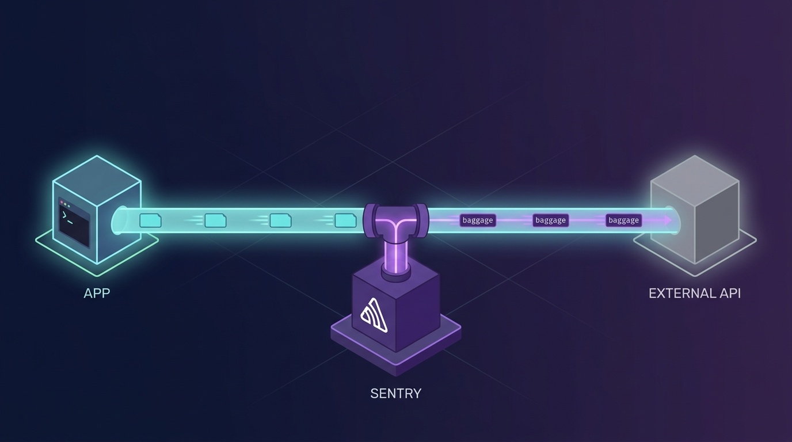

## Overview


Turning Sentry on doesn't just bring error collection with it. Distributed tracing comes on as well, and from that point every outgoing request carries trace headers.


There is no such line in your app code. Nothing shows up in the logs either. So when something goes wrong, no amount of reading the code will reveal it.


This article covers what those headers are, how to see them, and how to narrow the range they attach to.


Plenty of places use Sentry to track errors and bugs. It is a tool that collects exceptions thrown in an application and shows you when, where and how often they happened. A few lines are all it takes to wire up, and since it works regardless of language or framework, it is common to install it by default.

- [Sentry Docs - Sentry Basics](https://docs.sentry.io/product/sentry-basics/)

The part that attaches headers is not error collection. When you turn Sentry on, distributed tracing comes along with it. That is the part putting a header on every outgoing request.


## What the feature is for


This header exists for distributed tracing. When a single request passes through several services, it is there so that journey can be seen as one.


Say service A calls B and B calls C. Without the header, all three leave separate records. You may know that A's response was slow, but you cannot tell that C was the cause. When the header carries a trace_id, the records from all three merge into the same trace.


The Sentry docs describe the purpose like this.

> track software performance and measure throughput & latency, while seeing the impact of errors across multiple systems

The two headers play different roles.

- sentry-trace points at a position. It takes the form <trace_id>-<span_id>-<sampled>. It tells you which point of which trace this request is.
- baggage carries context. It is a standard header defined by the W3C, and Sentry puts the values used for dynamic sampling into it. Things like sentry-environment and sentry-release.

```plain text
sentry-trace: 41c74c2ea9f2bfb184f86939de5b97aa-399b3e5cc8b83494-1
baggage:      sentry-trace_id=41c74c2ea9f2bfb184f86939de5b97aa,
              sentry-environment=production,
              sentry-release=1.4.2,
              sentry-sample_rate=0.2
```


Passing the sampling decision made by the first service down to the ones after it is also baggage's job.

> a sampling decision is made in the originating service and passed to subsequent services

If a trace discarded up front were recorded further down, you would be left with half a record. So the decision is carried along in the value.


### Isn't it unnecessary with a single server?


It is meaningless without a receiving side. The receiving side here means a service that sends data to the same Sentry organization.


That said, there are cases where it is useful even with one server. If you have put Sentry in the browser, your frontend and backend are already two. Work that passes through a queue or a worker is the same.


On the other hand, it is almost never useful on requests going out to someone else's service. The public data portal has no reason to receive our trace_id. Yet the default for the server SDK is to attach it to every outgoing request. tracePropagationTargets, covered later, is the tool for narrowing that default.


## What goes out


To see what goes out, build the receiving side yourself. Spin up a throwaway server, send a request to it from a process with Sentry enabled, and print the headers it receives.


```javascript
// print-headers.js
const Sentry = require('@sentry/node');
const http = require('http');

Sentry.init({
  dsn: process.env.SENTRY_DSN,
  environment: 'production',
  release: '1.4.2',
  tracesSampleRate: 0,
});

// A throwaway server that prints whatever reaches it.
const server = http.createServer((req, res) => {
  console.log(req.headers);
  res.end('ok');
  server.close();
});

server.listen(0, '127.0.0.1', () => {
  const { port } = server.address();
  fetch(`http://127.0.0.1:${port}/`, { headers: { Accept: 'application/json' } });
});
```


Run it with node print-headers.js and you get this.


```plain text
accept: application/json

sentry-trace: 6406c1516309404d89d3d094f704f600-8cb266148716b50a
baggage: sentry-environment=production,
         sentry-release=<release>,
         sentry-public_key=<public key>,
         sentry-trace_id=6406c1516309404d89d3d094f704f600,
         sentry-org_id=<org id>,
         sentry-sample_rand=0.730917246418646
```


The only header our code passed was Accept. The two lines below it were added by Sentry. Sentry wraps the HTTP layer during initialization and attaches trace headers to every request that goes out afterwards. That line appears nowhere in the app code.


## How it gets attached


There is no line in the code that adds a header, yet the header goes out. The mechanism that makes this possible differs by platform. Comparing three of them shows why this kind of thing is particularly hard to find on Node.


### Node.js and NestJS — it swaps the module out


The Sentry Node SDK hooks the module loader. For CommonJS that is require-in-the-middle, and for ESM it is import-in-the-middle. The official docs put it this way.

> all packages are wrapped under the hood by import-in-the-middle to aid instrumenting them

So when your code imports http, what comes back is not the original but the http that Sentry has wrapped. The call site is unchanged, but http.request is already a different function. The header is attached inside it.


This is why you are told to put Sentry.init() before any other import. A module that is already loaded cannot be caught by the hook. Set registerEsmLoaderHooks to false and the tracing instrumentation goes off along with the hooks.


NestJS works the same way. You put Sentry.init() in instrument.ts and import it first at the top of main.ts. A comment in the docs nails down that order.


```typescript
// Import this first!
import "./instrument";

// Now import other modules
import { NestFactory } from "@nestjs/core";
```


There is no registration point anywhere in the code. That is why reading the code never reveals the header.


### Java — framework interceptors or bytecode injection


The default approach is to slot into the place the framework already provides. With Spring and Spring Boot, enabling the integration attaches the headers to outgoing requests automatically.

> The Java SDK will attach the sentry-trace and baggage headers to all outgoing requests by default.

Not every client is automatic, though. For OkHttp you add the interceptor yourself.


```kotlin
private val client = OkHttpClient.Builder()
  .addInterceptor(SentryOkHttpInterceptor())
  .eventListener(SentryOkHttpEventListener())
  .build()
```


There is also a path that leaves your code untouched: attaching sentry-opentelemetry-agent with -javaagent.


```shell
java -javaagent:/path/to/sentry-opentelemetry-agent.jar -jar app.jar
```


The docs describe what the agent does like this.

> dynamically injects bytecode into your application / Inject tracing information into outgoing requests and produced messages

With the agent, no trace is left in the code, just as with Node. Instead, -javaagent is visible in the launch command.


### .NET — it inserts a handler into the HttpClient pipeline


A DelegatingHandler called SentryHttpMessageHandler is placed into the HttpClient handler chain. The header is attached as the request passes through that handler.


DI takes care of the inserting. The SDK registers an IHttpMessageHandlerBuilderFilter implementation as a singleton.


```c#
// Sentry.Extensions.Logging/Extensions/DependencyInjection/ServiceCollectionExtensions.cs
services.AddSingleton<IHttpMessageHandlerBuilderFilter, SentryHttpMessageHandlerBuilderFilter>();
```


That filter puts the handler into every HttpClient created through IHttpClientFactory.


```c#
// Injects Sentry's HTTP handler into HttpClientFactory
handlerBuilder.AdditionalHandlers.Add(
    new SentryHttpMessageHandler(hub)
);
```


So a client obtained through IHttpClientFactory gets it automatically, while one you build yourself with new HttpClient() does not. You can turn it off with the DisableSentryHttpMessageHandler option.


### In summary


Only on Node does the standard module itself get replaced. In the others, some trace is left somewhere that someone put it into the pipeline. A dependency, a DI registration, a launch command — there is always a thread to follow.


The mechanism differs but the result is the same. sentry-trace and baggage ride along on outgoing requests. And all three can narrow the targets with tracePropagationTargets.


### References

- [Sentry Docs - Node ESM install and loader hooks](https://docs.sentry.io/platforms/javascript/guides/node/install/esm/)
- [Sentry Docs - NestJS](https://docs.sentry.io/platforms/javascript/guides/nestjs/)
- [Sentry Docs - Java Trace Propagation](https://docs.sentry.io/platforms/java/tracing/trace-propagation/)
- [Sentry Docs - Java OkHttp Integration](https://docs.sentry.io/platforms/java/tracing/instrumentation/okhttp/)
- [Sentry Docs - Java OpenTelemetry Agent](https://docs.sentry.io/platforms/java/opentelemetry/setup/agent/)
- [sentry-dotnet - SentryHttpMessageHandlerBuilderFilter.cs](https://github.com/getsentry/sentry-dotnet/blob/main/src/Sentry.Extensions.Logging/SentryHttpMessageHandlerBuilderFilter.cs)

## It attaches even with tracing off


There is one more thing worth noting. This header is attached even when tracesSampleRate is 0. It marks the trace as excluded from sampling and propagates it anyway. The assumption that it doesn't matter because tracing is off is wrong.


## Narrowing the targets


Turning Sentry off is not the answer. Narrow the targets that get trace headers instead. The tracePropagationTargets option does that job.


The official docs state the server-side default like this.

> On the server, all outgoing requests will be propagated by default.
- [Sentry Docs - Distributed Tracing: Trace Propagation](https://docs.sentry.io/platforms/javascript/guides/node/tracing/trace-propagation/)
- [Sentry Docs - Configuration Options: tracePropagationTargets](https://docs.sentry.io/platforms/javascript/guides/node/configuration/options/#tracePropagationTargets)

Give it a list and the headers attach only to matching addresses. Put in your own domain and localhost and you're done.


```typescript
Sentry.init({
  dsn: process.env.SENTRY_DSN,
  environment: 'production',
  release: '1.4.2',
  tracesSampleRate: 0,
  // Without this the SDK attaches trace headers to every outgoing request.
  tracePropagationTargets: [
    /^https?:\/\/(localhost|127\.0\.0\.1)(:\d+)?\//,
    /^https?:\/\/([a-z0-9-]+\.)*plzhans\.com(:\d+)?\//,
  ],
});
```


Anchor your regular expressions at both ends. Leave them loose and an address that merely brushes past a fragment will match. Something like https://example.com/?ref=plzhans.com does exactly that.


Once applied, check again with the print-headers.js from earlier. Send to an address that isn't in the target list and sentry-trace and baggage are gone.


Error collection is unaffected. This option deals only with trace headers, so captureException keeps working as before.


## Wrapping up


Instrumentation tools change your requests quietly. The code shows one header line while three go out on the wire. That fact is not in the logs, so no amount of reading the code will show it. When you want to know what goes out, building the receiving side yourself and printing it is the fastest way.


If you turn Sentry on for a server that calls external APIs, it is better to configure tracePropagationTargets along with it. It prevents incidents like this one, and it also stops your release version and commit hash from going out to other people's servers.


There is a case where an external API rejected requests outright because of this header. I've written it up in the article below.

- [data.go.kr API 400 Error - It Rejects Any Header Containing environment](../130-data-go-kr-400-invalid-request-parameter-error/) — the case where data.go.kr rejected environment=
