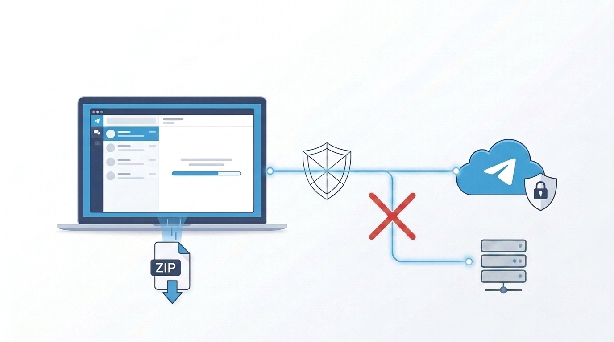
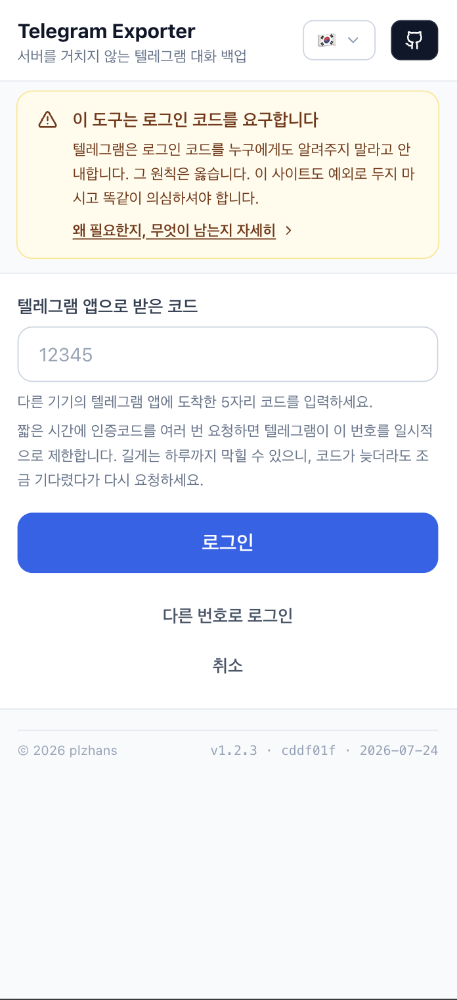
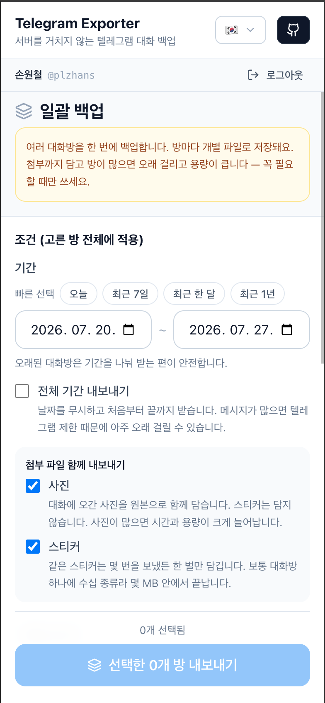
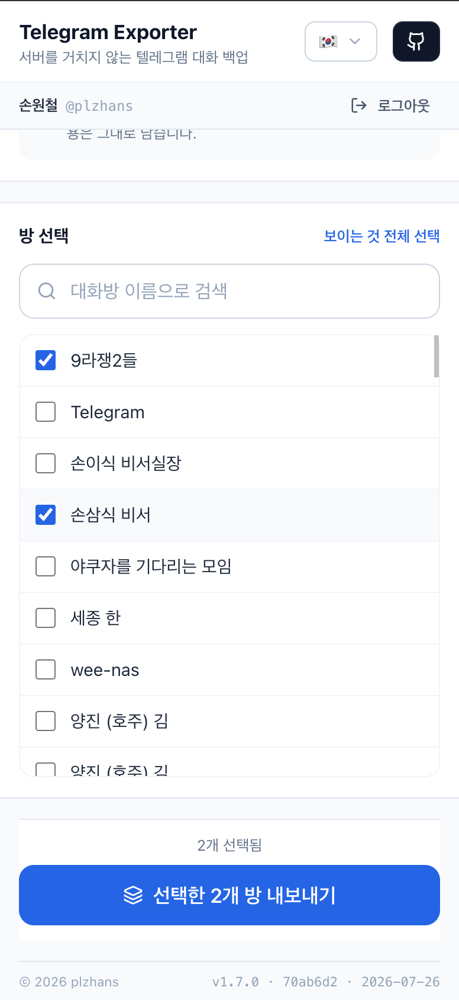

## 개요


텔레그램 대화 기록을 통째로 백업하고 싶을 때 설치도 가입도 없이 쓸 수 있는 도구를 만들었다.


브라우저에서 바로 로그인한 뒤 원하는 대화방을 골라 zip으로 내려받는다.


무엇보다 **중간에 우리 서버가 없다.** 브라우저가 텔레그램과 직접 붙기 때문에 전화번호와 로그인 코드가 외부로 나가지 않는다.

- 바로 쓰기: [https://telegram-exporter.plzhans.com](https://telegram-exporter.plzhans.com/)
- zip 다운로드: [https://github.com/plzhans/telegram-chat-exporter/releases/latest/download/telegram-exporter.zip](https://github.com/plzhans/telegram-chat-exporter/releases/latest/download/telegram-exporter.zip)

이 글에서 다루는 내용

- 봇 API로는 과거 대화를 못 읽는다. 그래서 사람 계정으로 로그인하는 방식을 썼다.
- 설치 없이 브라우저만으로 백업한다. 로컬 zip을 받아 `index.html`을 열어도 된다.
- 내보낸 zip을 풀면 인터넷 없이도 대화를 그대로 다시 볼 수 있다.
- 여러 방을 한 번에 고르거나 이름 익명 처리도 할 수 있다.

구현 세부와 소스는 깃허브에 전부 공개돼 있다.


[https://github.com/plzhans/telegram-chat-exporter](https://github.com/plzhans/telegram-chat-exporter)


사이트 배포는 GitHub Actions로 자동화돼 있다. 코드를 올리면 빌드 후 GitHub Pages로 바로 반영된다.


---


## 사용법


설치가 필요 없다.


[사이트](https://telegram-exporter.plzhans.com/)에 접속하거나 [릴리스 zip](https://github.com/plzhans/telegram-chat-exporter/releases/latest/download/telegram-exporter.zip)을 받아 `index.html`을 더블클릭하면 된다.


흐름은 이렇다.


**시작 방법을 고른다.**


**로그인한다.**


전화번호를 넣으면 텔레그램이 로그인 코드를 보낸다. 그 코드를 입력한다. 2FA를 켜뒀다면 비밀번호까지 넣는다.





**대화를 확인한다.**


방을 열면 스티커와 사진까지 그대로 보인다. 달력을 누르면 원하는 날짜로 바로 점프한다.


**범위를 정해 내보낸다.**


기간을 고르면 진행률과 취소 버튼이 뜨면서 zip이 만들어진다.


완료되면 `telegram-<방이름>-<날짜>.zip`이 떨어진다. 압축을 풀고 `index.html`을 열면 대화가 그대로 재현된다. 인터넷도 이 도구도 필요 없다.


> 💡 내보낼 때 대화자를 **이름 그대로<strong> 둘 수도, </strong>익명 처리** 할 수도 있다. 기본은 이름 그대로다.  
> 익명을 켜면 이름은 A·B·C, 회원번호는 1·2·3 으로 바뀐다.  
> 프로필 사진과 대화방 이름도 가려져, 파일을 남에게 그대로 건네도 누가 누구인지 드러나지 않는다.


### 여러 방을 한 번에


한 방씩 내보내는 것 말고 여러 방을 골라 한꺼번에 내보낼 수도 있다. 대화방마다 파일이 따로 떨어진다. 통째로 백업할 때 편하다. 다만 첨부까지 담으면 방이 많을수록 시간이 걸리고 용량도 커진다.


고른 방 전체에 같은 설정이 한꺼번에 적용된다. 어떤 방을 백업할지 고르고 시작하면 방마다 하나씩 순서대로 zip으로 떨어진다.








---


## 왜 만들었나


세 가지 요구가 동시에 걸려 있었다.


### 봇으로는 안 된다


텔레그램에는 두 종류의 API가 있다. 흔히 쓰는 <strong>Bot API</strong>와 텔레그램 앱들이 실제로 쓰는 <strong>MTProto 클라이언트 API</strong>다.


백업을 하려면 지난 메시지 기록을 읽어야 한다. 그런데 Bot API는 **과거 메시지 히스토리를 읽지 못한다.** 개인 대화방은 봇이 접근조차 못 한다. 결국 사람 계정으로 붙는 MTProto가 유일한 길이다.


### 아무것도 설치하지 않고 써야 한다


MTProto를 다루는 도구는 대개 Python이나 Node 스크립트다. 런타임을 깔고 터미널을 열어야 한다는 뜻이다. 백업 한 번 하자고 개발 환경을 세팅하는 셈이다.


브라우저에서 돌리면 그 단계가 통째로 사라진다. `web.telegram.org`가 실제로 쓰는 방식(WebSocket)을 그대로 가져왔다. 그래서 중간에 뭔가를 중계해 줄 릴레이 서버도 필요 없다.


### 자격증명을 아무에게도 넘기지 않아야 한다


이게 핵심이다. 이 도구는 사용자의 <strong>전화번호와 로그인 코드</strong>를 요구한다. 텔레그램은 로그인 코드를 두고 "누구에게도 공유하지 말라"고 못 박는다. 그 경고는 옳다.


이걸 "서비스"로 만들면 그 전화번호와 코드가 누군가의 서버를 거쳐 간다. 그런데 서버가 아예 없으면 거쳐 갈 곳도 없다. 사용자는 이 사실을 개발자 도구에서 직접 확인할 수 있다. 브라우저의 CSP(`connect-src`)가 텔레그램 WebSocket 말고는 어떤 연결도 막기 때문이다. 설령 이 코드가 악의적이어도 아무것도 밖으로 빼낼 수 없다.


---


## 어떻게 서버 없이 동작하는가


Bot API가 아니라 MTProto 클라이언트 API를 쓴다. 이걸 브라우저에서 돌리는 건 `web.telegram.org`가 이미 하고 있는 일이다.


핵심은 <strong>WebSocket</strong>이다.


```plain text
wss://*.web.telegram.org/apiws
```


WebSocket 연결은 CORS 정책을 적용받지 않는다. 덕분에 브라우저에서 텔레그램 서버로 곧장 붙는다. 프록시나 릴레이 서버가 필요 없다. 백엔드가 0줄이라는 뜻이다. 배포물은 HTML·JS·CSS 정적 파일뿐이다. 아무 정적 호스팅에나 올리면 끝난다.


---


## GramJS를 쓴 이유, 그리고 `2.26.21`에 고정한 이유


브라우저에서 MTProto를 다루려면 라이브러리가 필요했다. `telegram`(GramJS)을 골랐다.


재밌는 건 이 패키지가 <strong>아카이브(보관)된 상태</strong>라는 점이다. 유지보수는 `teleproto`라는 포크로 넘어갔다. 그런데도 GramJS를 쓴다. **teleproto가 Node 지향 포크라서 브라우저 지원을 걷어냈기** 때문이다.

- GramJS는 `crypto.subtle`(WebCrypto)를 쓴다. teleproto는 Node `crypto`만 쓴다.
- GramJS는 브라우저에서 기본 전송이 WSS다. teleproto는 raw TCP다.
- 브라우저 번들 크기도 GramJS가 훨씬 작다(gzip 234KB 대 455KB).

teleproto로 가면 전송 계층을 직접 갈아끼워야 한다. 순수 JS 암호도 감수해야 한다. 특히 2FA의 PBKDF2-SHA512가 눈에 띄게 느려진다. 그래서 아카이브된 리스크를 안고서라도 GramJS에 남았다.


### 함정: patch 버전 하나가 플랫폼 전체를 바꾼다


여기서 진짜 시간을 잡아먹은 이슈가 있다. GramJS는 **Node 빌드와 브라우저 빌드를 같은 패키지 이름 아래** 담아 둔다. 그리고 npm의 `dist-tag`로 둘을 구분한다.


`dist-tag`는 npm이 특정 버전에 붙이는 <strong>라벨</strong>일 뿐이다. 버전 순서와는 아무 상관이 없다. `latest`도 "가장 최신"이라는 뜻이 아니다. 그냥 <strong>npm의 기본 라벨</strong>이다. `npm install telegram`이 가져오는 게 바로 이 `latest`다.

- `latest` → `2.26.22` → `CryptoFile.js`가 `require("crypto")`. Node 전용이다.
- `browser` → **`2.26.21`** → `require("./crypto/crypto")`. WebCrypto를 쓴다.

브라우저에서 `latest`를 쓰면 인증 키 교환 도중에 이렇게 죽는다.


```plain text
a.default.randomBytes is not a function
```


그래서 `package.json`에 캐럿(`^`) 없이 **정확히** 고정했다.


```json
"telegram": "2.26.21"
```


> 💡 여기서 patch 버전은 "얼마나 바뀌었나"가 아니라 "어느 플랫폼을 겨냥한 빌드인가"를 뜻한다. `^`를 붙이거나 `pnpm update`를 돌리면 `2.26.22`(Node 빌드)로 올라간다. 그러면 앱이 아예 안 뜬다. Dependabot도 이 패키지의 major·minor·patch를 전부 무시하게 해뒀다. 대신 보안 업데이트 신호만은 살려 뒀다.


---


## 신뢰 모델: "믿지 말고 확인해라"


처음 이 도구를 보는 사람에게 이 사이트는 "낯선 웹페이지가 내 전화번호와 로그인 코드를 달라고 하는" 상황이다. 의심하는 게 정상이다. 그래서 이 프로젝트는 그 의심에 <strong>검증 가능한 답</strong>을 주는 걸 최우선으로 삼았다.


### 브라우저가 CSP로 강제한다


`connect-src`가 텔레그램 WebSocket에만 열려 있다.


```plain text
default-src 'none'; script-src 'self'; style-src 'self' 'unsafe-inline';
img-src 'self' data: blob:; font-src 'self';
connect-src wss://*.web.telegram.org wss://*.web.telegram.org:443;
form-action 'none'; base-uri 'none'; frame-ancestors 'none'
```


코드가 악의적이어도 전화번호나 코드나 메시지를 다른 서버로 보낼 수 없다. 누구나 개발자 도구 → Network 탭에서 확인할 수 있다. 화면에 보이는 `connect-src` 문장은 <strong>방금 주입된 CSP에서 그대로 뽑아낸 값</strong>이다. 손으로 적으면 애널리틱스를 켜고 끌 때마다 값이 어긋난다. 그 문장이 곧 이 앱의 신뢰 근거라서 코드로 뽑아냈다.


### 번들에 `eval`이 없다


Node 폴리필을 `buffer` 하나로 좁혔다. 덕분에 `script-src 'self'`가 `unsafe-eval` 없이 성립한다. `crypto`를 폴리필하면 crypto-browserify가 딸려 온다. 그게 asn1.js → `vm` → `eval`로 이어져 CSP를 건드린다. 브라우저 빌드는 WebCrypto를 쓰니 애초에 필요가 없다.


### 세션은 localStorage에 넣지 않는다


"이 탭에서 로그인 유지"를 켜면 세션 문자열은 **sessionStorage에만** 들어간다. 세션 문자열은 곧 인증 키 그 자체다. 명시적으로 지울 때까지 남는 저장소에 넣으면 공용 PC나 공용 브라우저 프로필에서 계정을 통째로 넘겨주는 꼴이다.


여기에 <strong>유휴 만료(기본 60분)</strong>를 더 얹었다. 탭이 살아 있는 동안엔 1분마다 만료 시각을 밀어 준다. 자리를 뜨면 그대로 만료된다. 다만 이게 "브라우저를 닫으면 반드시 지워진다"를 보장하진 않는다. 세션 복원이나 탭 복제로 sessionStorage가 되살아나기 때문이다. TTL은 노출 창을 좁힐 뿐 없애지는 못한다. 확실한 방법은 로그아웃이다. 계정에서 세션 자체를 끊어 준다.


### 세션을 식별할 수 있게 만든다


텔레그램 활성 세션 목록에 `Telegram Exporter (browser)`로 뜬다. 백업이 끝난 뒤 어떤 세션을 끊어야 할지 사용자가 바로 안다. 앱 안의 "로그아웃 + 세션 종료" 버튼은 `auth.LogOut`을 호출해 계정에서 이 세션을 지운다.


---


## 긴 대화 기록을 내보낼 때 부딪힌 실전 문제들


오래된 대화방을 통째로 내보내는 건 여러 군데에서 깨진다. 각각을 이렇게 처리했다.


### FLOOD_WAIT로 죽지 않기


긴 히스토리를 훑으면 텔레그램이 수백 초짜리 rate limit을 건다. GramJS의 `floodSleepThreshold`는 기본값이 60초다. 그보다 긴 제한이 오면 잠들지 않고 예외를 던진다. 한 시간짜리 작업이 90초 대기 하나에 날아가는 셈이다. 그래서 내보내는 동안엔 이 값을 <strong>15분</strong>으로 올렸다가 끝나면 되돌린다.


### 오래된 것부터 훑기


텔레그램 기본은 최신순이다. 그대로 받으면 파일이 역순으로 쌓여 읽을 수 없다. 그렇다고 메모리에 모아 뒤집으면 스트리밍의 의미가 없다. 그래서 `reverse: true`로 **가장 오래된 메시지부터** 훑는다. 요청 사이에는 `waitTime: 1`(1초) 간격을 둔다. 이게 없으면 큰 방에서 곧바로 FLOOD_WAIT에 걸린다.


### 메모리에 다 쌓지 않기


File System Access API(`showSaveFilePicker`)가 있으면 압축한 청크를 **디스크로 바로 흘려보낸다.<strong> 없으면(Firefox나 Safari) 모아서 Blob으로 내려받고 그렇다고 화면에 알린다. 이 피커는 사용자 제스처가 있어야 뜬다. 그래서 </strong>클릭 핸들러의 맨 처음**에 부른다. 내보내기가 시작된 뒤에 부르면 제스처가 이미 소모돼 거부당한다.


### "멈춘 것처럼 보이는" 문제


FLOOD_WAIT 대기 중에는 GramJS가 조용히 잠든다. 그래서 숫자가 안 움직인다. 8초 넘게 진행이 없으면 "멈춘 게 아니라 rate limit 대기 중"이라고 표시한다. 이게 없으면 사용자는 정상 동작을 실패로 오해하고 탭을 닫는다.


### 시작 전에 규모를 알려주기


요청 두 번으로 "전체 몇 개인지, 언제부터 언제까지인지"를 먼저 보여준다. 기본 내보내기 범위는 <strong>최근 30일</strong>이다. 전체 범위를 기본값으로 두면 클릭 한 번에 몇 시간짜리 작업이 시작되기 때문이다.


---


## 내보낸 결과물


zip 하나가 떨어진다.


```plain text
telegram-<chat-name>-<date>.zip
├── index.html         압축 풀고 처음 여는 파일. 대화 그 자체처럼 읽힌다
├── messages.jsonl     한 줄에 한 메시지. 기계가 다시 읽는 원본 형태
├── messages.txt       사람이 읽는 형태. 오래된 것부터 시간순
├── attachments.jsonl  첨부의 종류와 크기
└── meta.json          방 정보, 메시지 수, 내보낸 시각
```


`index.html`은 **파일 하나로 완결된다.<strong> 스타일이 전부 인라인이라 인터넷이 없어도 열리고 이 도구가 없어도 열린다. 그리고 </strong>스크립트가 없다.** 증거로 제시하는 문서에 코드가 들어 있으면 "그때 그렇게 렌더된 것뿐"이라는 여지가 생기기 때문이다. 언제 열어도 같은 것을 보여준다.


압축은 <strong>fflate의 동기 스트리밍 API</strong>를 쓴다. JSZip이나 fflate의 비동기 API는 blob URL로 Web Worker를 띄운다. 그러려면 CSP에 `worker-src blob:`을 열어야 한다. 동기 API는 메인 스레드를 잡는다. 그래서 200개 메시지마다 이벤트 루프에 제어를 돌려준다. 덕분에 진행 표시와 취소 버튼이 계속 살아 있다.


---


## 앞으로


아직 안 된 것들이다.

- **문서·영상 등 나머지 첨부 다운로드.** 이미지와 이모티콘(스티커)은 이미 저장된다. 문서 파일이나 영상처럼 그 외 첨부는 종류와 크기만 남고 본문 파일은 아직 받지 않는다. `upload.getFile` 청크를 조립해야 한다. 진행 상황은 [이슈 #26](https://github.com/plzhans/telegram-chat-exporter/issues/26)에서 추적한다.
- **중단 후 재개.** `offset_id`를 IndexedDB에 저장하면 연결이 끊겨도 이어받을 수 있다.

---


돌이켜보면 이 프로젝트에서 내린 결정은 대부분 하나의 질문으로 수렴했다. **"사용자가 이걸 어떻게 직접 검증할 수 있나?"** 서버를 없앤 것도 CSP를 신뢰 근거로 삼은 것도 세션을 식별 가능하게 만든 것도 마찬가지다. 공유 api_id를 숨기지 않기로 한 것까지 전부 그 질문의 답이었다. 자격증명을 다루는 도구에서 "믿어달라"는 말은 가장 약한 보증이다. 브라우저가 대신 강제해 주는 규칙이 훨씬 강하다.

