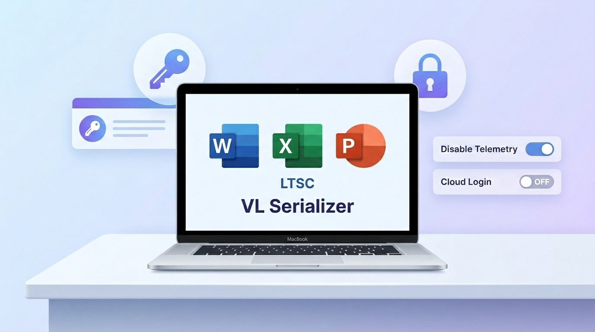
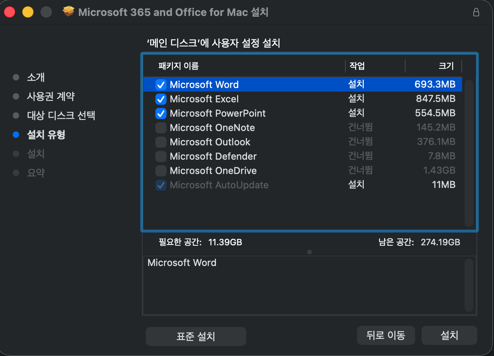

## Overview


License activation is required when installing Microsoft Office on Mac.


You can activate with a Microsoft 365 account or install a specific version and enter a serial key.


If your organization has a volume license, the VL Serializer installation method is recommended.


Source: [https://github.com/alsyundawy/Microsoft-Office-For-MacOS](https://github.com/alsyundawy/Microsoft-Office-For-MacOS)


---


## Installation Steps

1. Choose the Office version to install
    - Example: [**Office LTSC 2021/2024 Suite Installer**](https://go.microsoft.com/fwlink/?linkid=525133)
2. Proceed with the installation
    - You can select and install only the apps you need
3. Download the Office VL Serializer
    - Example: [Office 2024 LTSC VL Serializer](https://github.com/alsyundawy/Microsoft-Office-For-MacOS/blob/master/DATA/Microsoft_Office_LTSC_2024_VL_Serializer.pkg)
4. Run the Serializer to apply the volume license
5. Launch an Office app to verify the activation status

---


## Installation Screenshots


Installation


Customization


Install only what you need





Download the Serializer


Run and verify activation


---


## Optional Settings


### Disable Telemetry


```bash
defaults write com.microsoft.Word SendAllTelemetryEnabled -bool FALSE
defaults write com.microsoft.Excel SendAllTelemetryEnabled -bool FALSE
defaults write com.microsoft.Powerpoint SendAllTelemetryEnabled -bool FALSE
defaults write com.microsoft.Outlook SendAllTelemetryEnabled -bool FALSE
defaults write com.microsoft.onenote.mac SendAllTelemetryEnabled -bool FALSE
defaults write com.microsoft.autoupdate2 SendAllTelemetryEnabled -bool FALSE
defaults write com.microsoft.Office365ServiceV2 SendAllTelemetryEnabled -bool FALSE
```


### Disable Cloud Sign-in Features


```bash
defaults write com.microsoft.Word UseOnlineContent -integer 0
defaults write com.microsoft.Excel UseOnlineContent -integer 0
defaults write com.microsoft.Powerpoint UseOnlineContent -integer 0
```
