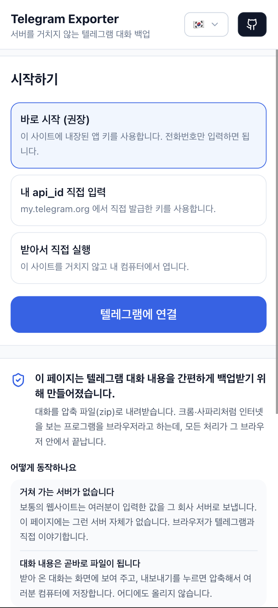
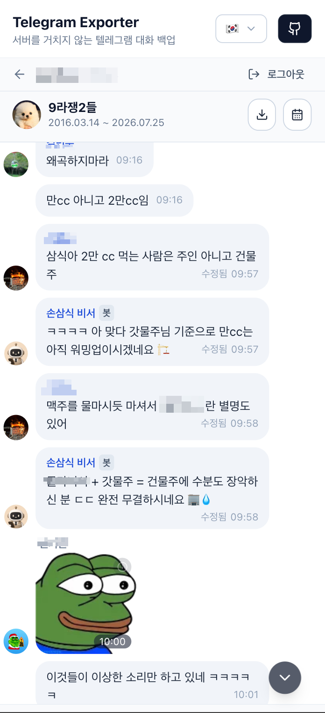
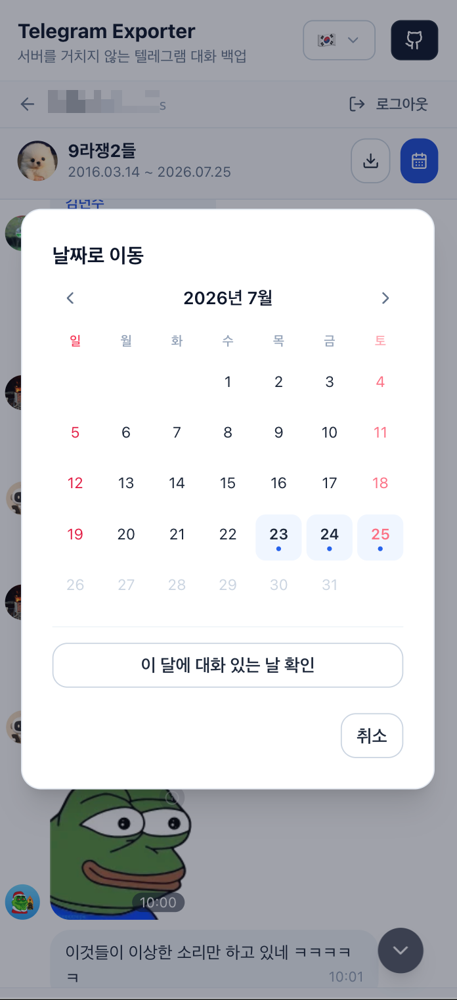
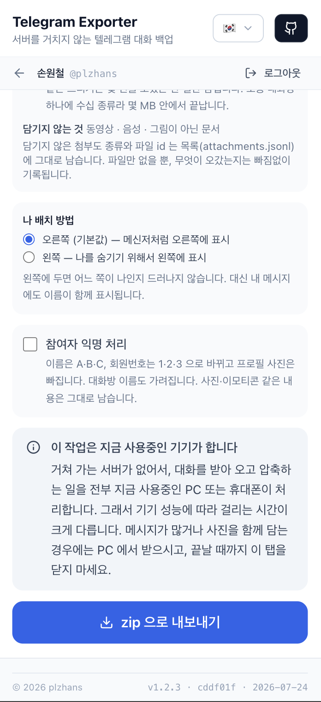
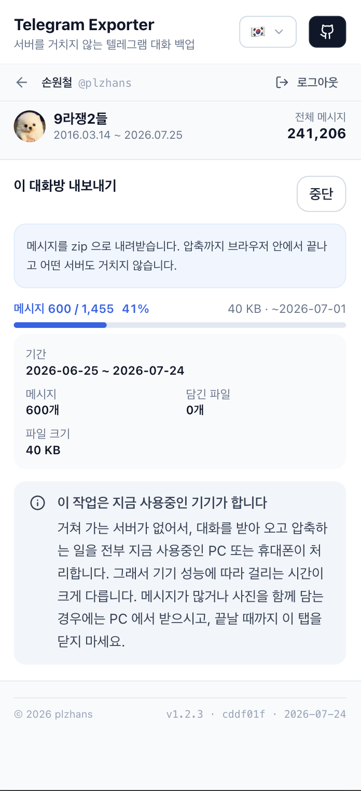
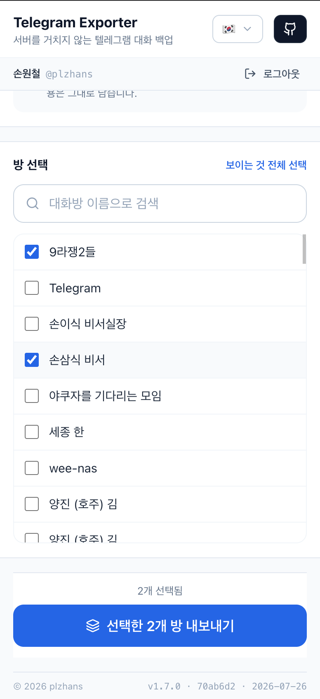

## 概要


テレグラムのトーク履歴を丸ごとバックアップしたいとき、インストールも会員登録もなしで使えるツールを作りました。


ブラウザ上でそのままログインした後、好きなトークルームを選んでzipとしてダウンロードします。


何より**間に私たちのサーバーが存在しません。**ブラウザがテレグラムと直接つながるため、電話番号やログインコードが外部に漏れることはありません。

- すぐに使う: [https://telegram-exporter.plzhans.com](https://telegram-exporter.plzhans.com/)
- zipダウンロード: [https://github.com/plzhans/telegram-chat-exporter/releases/latest/download/telegram-exporter.zip](https://github.com/plzhans/telegram-chat-exporter/releases/latest/download/telegram-exporter.zip)

テレグラム公式のエクスポート機能も、全体バックアップやトークルームごとのエクスポートにきちんと対応しています。


このツールはそれを置き換えるためではなく、<strong>公式エクスポートが使いにくい部分</strong>を補うために作りました。


違いは次のとおりです。

- <strong>日付期間を指定</strong>して、必要な区間だけをエクスポートできます。
- **選んだ特定のトークルームだけ**を選んでエクスポートできます。複数のトークルームをまとめて選ぶこともできます。
- エクスポート結果は<strong>会話の吹き出し形式</strong>で表示されます。オフラインでもそのまま見返せます。
- <strong>匿名化処理</strong>をオンにできます。名前・会員番号・プロフィール写真を隠したままファイルを残せます。
- <strong>ソースコードはすべて公開</strong>されています。コードを直接確認し、そのままビルドできます。
- <strong>HTMLファイルベース</strong>なので、PC・モバイルのブラウザさえあればどこでも使えます。

インストール不要でブラウザからすぐに使えますし、ローカルにzipをダウンロードして`index.html`を開いてもかまいません。


間に私たちのサーバーが存在しないため、電話番号やログインコードが外部に送られることはありません。


実装の詳細とソースコードはすべてGitHubで公開されています。


[https://github.com/plzhans/telegram-chat-exporter](https://github.com/plzhans/telegram-chat-exporter)


サイトのデプロイはGitHub Actionsで自動化されています。コードをプッシュするとビルド後、すぐにGitHub Pagesへ反映されます。


---


## 使い方


インストールは不要です。


[サイト](https://telegram-exporter.plzhans.com/)にアクセスするか、[リリースzip](https://github.com/plzhans/telegram-chat-exporter/releases/latest/download/telegram-exporter.zip)をダウンロードして`index.html`をダブルクリックするだけです。


流れは次のとおりです。


**開始方法を選びます。**





**ログインします。**


電話番号を入力すると、テレグラムがログインコードを送ってきます。そのコードを入力します。2FAを有効にしている場合はパスワードも入力します。


**トーク内容を確認します。**


トークルームを開くと、スタンプや写真もそのまま表示されます。カレンダーをクリックすると、目的の日付にすぐジャンプできます。








**範囲を指定してエクスポートします。**


期間を選ぶと、進捗率とキャンセルボタンが表示され、zipが作成されます。








完了すると`telegram-<チャット名>-<日付>.zip`が生成されます。解凍して`index.html`を開くと、会話がそのまま再現されます。インターネットもこのツールも必要ありません。


> 💡 エクスポート時に、会話の参加者を**名前のまま<strong>にすることも、</strong>匿名化**することもできます。デフォルトは名前のままです。  
> 匿名化をオンにすると、名前はA・B・C、会員番号は1・2・3に変わります。  
> プロフィール写真とトークルーム名も隠されるため、ファイルを他人にそのまま渡しても誰が誰か分かりません。


### 複数のトークルームを一度に


1つずつエクスポートするだけでなく、複数のトークルームを選んで一度にエクスポートすることもできます。トークルームごとに別々のファイルが生成されます。まとめてバックアップする際に便利です。ただし添付ファイルまで含めると、トークルームが多いほど時間がかかり、容量も大きくなります。


選んだすべてのトークルームに、同じ設定が一括で適用されます。どのトークルームをバックアップするか選んで開始すると、トークルームごとに順番にzipとして出力されます。





---


## なぜ作ったのか


公式のエクスポート機能で、全体・トークルームごとのバックアップはすでに可能です。


私が困っていたのは別のところでした。

- 特定の期間だけを切り出したいとき
- いくつかのトークルームだけを選んで素早く残したいとき
- エクスポートしたファイルを会話のように読み返したいとき
- 証拠・共有用に名前と顔を隠したいとき

この4つをブラウザ上でそのまま実現することが目標でした。


インストールも会員登録も不要で、結果はzip1つにまとまります。


### 個人アカウントで接続する必要がある


テレグラムには2種類のAPIがあります。よく使われる<strong>Bot API</strong>と、テレグラムアプリが実際に使用している<strong>MTProtoクライアントAPI</strong>です。


バックアップするには過去のメッセージ履歴を読み取る必要があります。しかしBot APIは**過去のメッセージ履歴を読み取れません。**個人のトークルームにはボットがアクセスすらできません。結局、個人アカウントとして接続するMTProtoが唯一の方法です。


### 何もインストールせずに使える必要がある


MTProtoを扱うツールは、たいていPythonやNodeのスクリプトです。つまりランタイムをインストールし、ターミナルを開く必要があるということです。バックアップを一度取るためだけに開発環境を構築することになります。


ブラウザ上で動かせば、その手順が丸ごと不要になります。`web.telegram.org`が実際に使っている方式(WebSocket)をそのまま採用しました。そのため、間を中継するリレーサーバーも必要ありません。


### 認証情報を誰にも渡してはいけない


これが核心です。このツールはユーザーの<strong>電話番号とログインコード</strong>を要求します。テレグラムはログインコードについて「誰にも共有しないように」と明言しています。その警告は正しいものです。


これを「サービス」として作ると、その電話番号とコードは誰かのサーバーを経由します。しかしサーバーが存在しなければ、経由する場所自体がありません。ユーザーはこの事実を開発者ツールで直接確認できます。ブラウザのCSP(`connect-src`)がテレグラムのWebSocket以外のあらゆる接続をブロックしているからです。たとえこのコードが悪意あるものだったとしても、何も外部に持ち出すことはできません。


---


## サーバーなしでどう動作するのか


Bot APIではなくMTProtoクライアントAPIを使用します。これをブラウザで動かすというのは、`web.telegram.org`がすでにやっていることです。


鍵となるのは<strong>WebSocket</strong>です。


```plain text
wss://*.web.telegram.org/apiws
```


WebSocket接続はCORSポリシーの対象外です。おかげでブラウザからテレグラムのサーバーに直接接続できます。プロキシやリレーサーバーは不要です。つまりバックエンドのコードは0行です。デプロイ物はHTML・JS・CSSの静的ファイルだけです。どんな静的ホスティングにアップロードしても、それで完了です。


---


## GramJSを使った理由、そして`2.26.21`に固定した理由


ブラウザでMTProtoを扱うにはライブラリが必要でした。`telegram`(GramJS)を選びました。


興味深いのは、このパッケージが<strong>アーカイブ(保管)された状態</strong>だという点です。メンテナンスは`teleproto`というフォークに引き継がれています。それでもGramJSを使っています。**teleprotoはNode志向のフォークで、ブラウザサポートを取り除いてしまった**からです。

- GramJSは`crypto.subtle`(WebCrypto)を使用します。teleprotoはNodeの`crypto`しか使いません。
- GramJSはブラウザでのデフォルトの通信方式がWSSです。teleprotoはraw TCPです。
- ブラウザ用バンドルサイズもGramJSの方がはるかに小さいです(gzip圧縮で234KB対455KB)。

teleprotoに移行すると、トランスポート層を自分で入れ替える必要があります。純粋なJS実装の暗号処理も受け入れる必要があります。特に2FAのPBKDF2-SHA512が目に見えて遅くなります。そのため、アーカイブされたリスクを抱えてでもGramJSに留まりました。


### 落とし穴:patchバージョン1つがプラットフォーム全体を変える


ここに、本当に時間を食ったissueがあります。GramJSは**Node向けビルドとブラウザ向けビルドを同じパッケージ名の下に**まとめています。そして両者をnpmの`dist-tag`で区別しています。


`dist-tag`は、npmが特定のバージョンに付ける<strong>ラベル</strong>にすぎません。バージョンの新旧とは何の関係もありません。`latest`も「最も新しい」という意味ではありません。単なる<strong>npmのデフォルトラベル</strong>です。`npm install telegram`が取得するのは、まさにこの`latest`です。

- `latest` → `2.26.22` → `CryptoFile.js`が`require("crypto")`を使用。Node専用です。
- `browser` → **`2.26.21`** → `require("./crypto/crypto")`。WebCryptoを使用します。

ブラウザで`latest`を使うと、認証キー交換の途中でこのように落ちます。


```plain text
a.default.randomBytes is not a function
```


そのため`package.json`ではキャレット(`^`)を付けず、**正確に**バージョンを固定しました。


```json
"telegram": "2.26.21"
```


> 💡 ここでのpatchバージョンは「どれだけ変更されたか」ではなく「どのプラットフォーム向けのビルドか」を意味します。`^`を付けたり`pnpm update`を実行したりすると`2.26.22`(Nodeビルド)に上がってしまいます。そうなるとアプリがまったく起動しなくなります。Dependabotもこのパッケージのmajor・minor・patchをすべて無視するよう設定しました。代わりにセキュリティアップデートの通知だけは生かしてあります。


---


## 信頼モデル:「信じるな、確認せよ」


このツールを初めて見る人にとって、このサイトは「見知らぬWebページが自分の電話番号とログインコードを要求してくる」状況です。疑うのが当然の反応です。そのためこのプロジェクトでは、その疑いに対して<strong>検証可能な答え</strong>を示すことを最優先にしました。


### ブラウザがCSPで強制する


`connect-src`はテレグラムのWebSocketに対してのみ開かれています。


```plain text
default-src 'none'; script-src 'self'; style-src 'self' 'unsafe-inline';
img-src 'self' data: blob:; font-src 'self';
connect-src wss://*.web.telegram.org wss://*.web.telegram.org:443;
form-action 'none'; base-uri 'none'; frame-ancestors 'none'
```


コードが悪意あるものだったとしても、電話番号やコード、メッセージを他のサーバーに送ることはできません。誰でも開発者ツールのNetworkタブで確認できます。画面に表示される`connect-src`の文字列は、<strong>まさに注入されたCSPからそのまま抜き出した値</strong>です。手書きにすると、アナリティクスをオン・オフするたびに値がずれてしまいます。その文字列こそがこのアプリの信頼の根拠であるため、コードから抽出しています。


### バンドルに`eval`が含まれていない


Nodeのポリフィルは`buffer`1つだけに絞りました。おかげで`unsafe-eval`なしで`script-src 'self'`が成立します。`crypto`をポリフィルすると、crypto-browserifyが引き込まれます。それがasn1.js → `vm` → `eval`とつながり、CSPに引っかかります。ブラウザビルドはWebCryptoを使うため、そもそも不要です。


### セッションはlocalStorageに保存しない


「このタブでログインを維持」をオンにすると、セッション文字列は**sessionStorageにのみ**保存されます。セッション文字列は事実上、認証キーそのものです。明示的に削除するまで残るストレージに保存すると、共用PCや共用ブラウザプロファイルでアカウントを丸ごと渡してしまうことになります。


これに加えて<strong>アイドル失効(デフォルト60分)</strong>を設けました。タブが生きている間は、1分ごとに失効時刻を先延ばしします。席を離れるとそのまま失効します。ただし、これは「ブラウザを閉じれば必ず消える」ことを保証するものではありません。セッション復元やタブの複製によってsessionStorageが復活することがあるためです。TTLは露出する時間の幅を狭めるだけで、なくすことはできません。確実な方法はログアウトです。アカウント側でセッション自体を切断してくれます。


### セッションを識別できるようにする


テレグラムのアクティブセッション一覧に`Telegram Exporter (browser)`として表示されます。バックアップが終わった後、どのセッションを切断すればよいかユーザーがすぐに分かります。アプリ内の「ログアウト+セッション終了」ボタンは`auth.LogOut`を呼び出し、アカウントからこのセッションを削除します。


---


## 長いトーク履歴のエクスポートで直面した実践的な問題


古いトークルームを丸ごとエクスポートすると、あちこちで問題が発生します。それぞれ次のように対処しました。


### FLOOD_WAITで落ちないようにする


長い履歴を読み込むと、テレグラムが数百秒単位のrate limitをかけてきます。GramJSの`floodSleepThreshold`のデフォルト値は60秒です。それより長い制限が来ると、スリープせずに例外を投げます。1時間かかる作業が、たった90秒の待機1つで台無しになるわけです。そのためエクスポート中はこの値を<strong>15分</strong>に引き上げ、終わったら元に戻します。


### 古いものから読み込む


テレグラムのデフォルトは新しい順です。そのまま受け取るとファイルが逆順に積み上がり、読めなくなります。かといってメモリに全部集めてから反転させると、ストリーミングの意味がなくなります。そこで`reverse: true`を使い、**最も古いメッセージから**読み込みます。リクエストの間には`waitTime: 1`(1秒)の間隔を設けています。これがないと、大きなトークルームでは即座にFLOOD_WAITにかかってしまいます。


### メモリに全部溜め込まない


File System Access API(`showSaveFilePicker`)がある場合、圧縮したチャンクを**ディスクへ直接ストリーミングします。<strong>ない場合(FirefoxやSafari)はまとめてBlobとしてダウンロードし、その旨を画面に通知します。このピッカーはユーザーのジェスチャーがないと表示されません。そのため</strong>クリックハンドラの一番最初**で呼び出します。エクスポートが開始された後に呼び出すと、ジェスチャーがすでに消費されており拒否されます。


### 「止まったように見える」問題


FLOOD_WAITの待機中は、GramJSが静かにスリープします。そのため数字が動きません。8秒以上進捗がない場合は「止まっているのではなく、rate limit待機中」と表示します。これがないと、ユーザーは正常な動作を失敗と誤解してタブを閉じてしまいます。


### 開始前に規模を知らせる


2回のリクエストで「全体で何件あるか、いつからいつまでか」を先に表示します。デフォルトのエクスポート範囲は<strong>直近30日</strong>です。全範囲をデフォルトにすると、ワンクリックで数時間かかる作業が始まってしまうためです。


---


## エクスポート結果物


zipファイルが1つ生成されます。


```plain text
telegram-<chat-name>-<date>.zip
├── index.html         압축 풀고 처음 여는 파일. 대화 그 자체처럼 읽힌다
├── messages.jsonl     한 줄에 한 메시지. 기계가 다시 읽는 원본 형태
├── messages.txt       사람이 읽는 형태. 오래된 것부터 시간순
├── attachments.jsonl  첨부의 종류와 크기
└── meta.json          방 정보, 메시지 수, 내보낸 시각
```


`index.html`は**ファイル1つで完結します。<strong>スタイルはすべてインライン化されているため、インターネットがなくても、このツールがなくても開けます。そして</strong>スクリプトが含まれていません。**証拠として提示する文書にコードが含まれていると、「その時たまたまそう描画されただけ」という余地が生まれてしまうためです。いつ開いても同じものが表示されます。


圧縮には<strong>fflateの同期ストリーミングAPI</strong>を使用します。JSZipやfflateの非同期APIはblob URLでWeb Workerを起動します。そのためにはCSPで`worker-src blob:`を開く必要があります。同期APIはメインスレッドを占有します。そのため200メッセージごとにイベントループへ制御を返しています。おかげで進捗表示とキャンセルボタンが動き続けます。


---


## 今後


まだできていないことです。

- **文書・動画など残りの添付ファイルのダウンロード。** 画像と絵文字(スタンプ)はすでに保存されています。文書ファイルや動画のようなその他の添付ファイルは、種類とサイズだけが残り、本体ファイルはまだ取得していません。`upload.getFile`のチャンクを組み立てる必要があります。進捗状況は[issue #26](https://github.com/plzhans/telegram-chat-exporter/issues/26)で追跡しています。
- **中断後の再開。** `offset_id`をIndexedDBに保存すれば、接続が切れても続きから受け取れるようになります。

---


振り返ってみると、このプロジェクトで下した決定のほとんどは、1つの問いに収束します。**「ユーザーはこれをどうやって自分で検証できるか?」**サーバーをなくしたことも、CSPを信頼の根拠にしたことも、セッションを識別可能にしたことも同じです。共有api_idを隠さないことにしたことまで、すべてその問いへの答えでした。認証情報を扱うツールにおいて「信じてください」という言葉は、最も弱い保証です。ブラウザが代わりに強制してくれるルールの方が、はるかに強力です。
