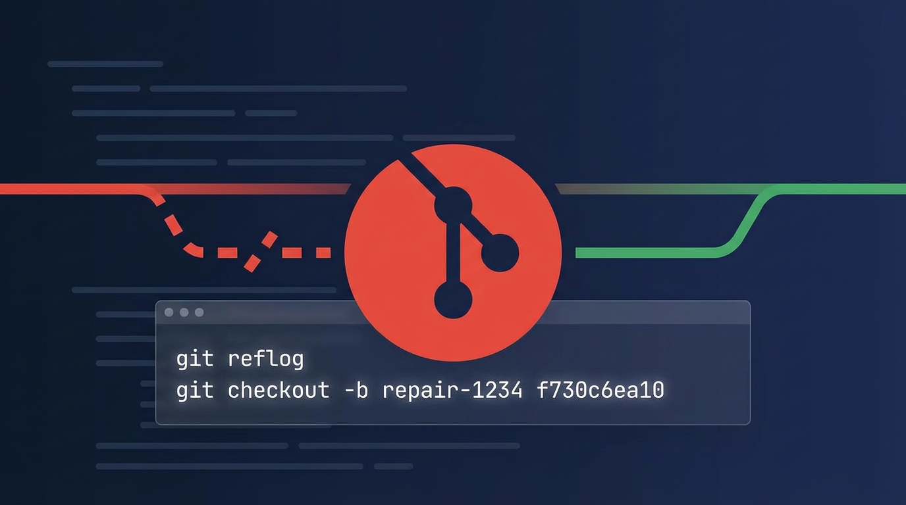
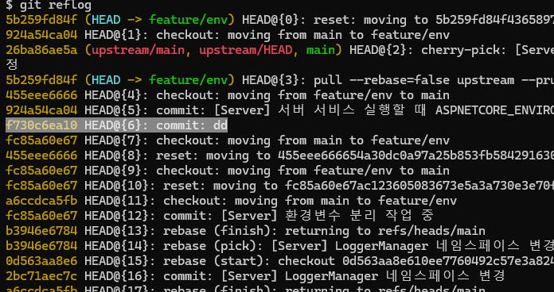
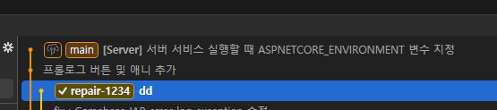

## 목표


별도의 브랜치에 <strong>삭제한 특정 커밋 시점으로 복구</strong>합니다.


## 상황


브랜치를 삭제한 뒤, <strong>해당 브랜치에서 작업했던 커밋으로 다시 브랜치를 복구</strong>해야 하는 경우가 있습니다.


---


## 1. reflog로 복구 지점(커밋 해시) 찾기


`reflog`는 브랜치를 삭제했더라도 <strong>로컬에서 HEAD가 이동했던 기록</strong>을 남겨두기 때문에, 복구할 커밋 해시를 찾는 데 유용합니다.


```shell
git reflog
```


### 복구 대상 선택


reflog 출력에서 <strong>복구하려는 시점의 커밋 해시</strong>를 확인합니다.





---


## 2. 커밋 해시로 브랜치 다시 만들기


찾아낸 커밋 해시를 기준으로 새 브랜치를 생성하고 바로 체크아웃합니다.


```shell
# git checkout -b <복구할 새 브랜치이름> <삭제한 커밋해시>
git checkout -b repair-1234 f730c6ea10
```


---


## 3. 복구 확인


브랜치가 정상적으로 생성되고 해당 커밋으로 이동했는지 확인합니다.





---


## reflog에 기록이 없을 때


`reflog`는 이 컴퓨터에서 HEAD가 움직인 기록입니다. 따라서 아래 경우에는 도움이 되지 않습니다.

- 해당 브랜치를 이 컴퓨터에서 한 번도 체크아웃한 적이 없는 경우
- 저장소를 새로 클론한 경우
- reflog 항목이 이미 만료된 경우

### reflog 보관 기간


reflog는 무기한 남지 않습니다. `git gc`가 동작할 때 아래 설정에 따라 정리됩니다.


```shell
# 도달 가능한 커밋의 reflog 보관 기간 (기본 90일)
git config --get gc.reflogExpire

# 도달 불가능한 커밋의 reflog 보관 기간 (기본 30일)
git config --get gc.reflogExpireUnreachable
```


삭제한 브랜치의 커밋은 보통 도달 불가능 상태가 되므로 <strong>기본값 기준 30일</strong>이 실질적인 복구 한계입니다.


### dangling 커밋 직접 찾기


reflog에서 보이지 않는다면 객체 저장소를 직접 확인합니다.


```shell
git fsck --lost-found

# Result
# dangling commit f730c6ea10ffc0d1f2f8b0e9a1c3d5b7e9f10234
# dangling blob 8a9f2c1b...
```


찾은 커밋의 내용을 확인한 뒤 브랜치로 되살립니다.


```shell
# 커밋 내용 확인
git show f730c6ea10

# 브랜치 생성 (체크아웃 없이)
git branch repair-1234 f730c6ea10
```


주의) `git gc --prune`이 해당 객체까지 정리한 뒤라면 로컬에서는 복구할 수 없습니다.


## 원격에 있던 브랜치를 지운 경우


원격 브랜치를 지웠고 로컬에도 기록이 없다면 로컬 reflog로는 찾을 수 없습니다. 이때는 다른 팀원의 로컬 저장소에 해당 커밋이 남아 있는지 확인하는 편이 빠릅니다.


복구한 브랜치를 다시 원격에 올릴 때는 아래처럼 실행합니다.


```shell
git push -u origin repair-1234
```


## 정리

- 삭제 직후라면 `git reflog`로 충분합니다.
- 시간이 지나 reflog에서 사라졌다면 `git fsck --lost-found`로 dangling 커밋을 찾습니다.
- 하지만 `gc`가 객체까지 정리했다면 로컬 복구는 불가능하므로, 중요한 작업 브랜치는 지우기 전에 태그를 달아두는 편이 안전합니다.

```shell
# 삭제 전에 안전장치를 남겨두는 방법
git tag backup/feature-1234 feature-1234
```

