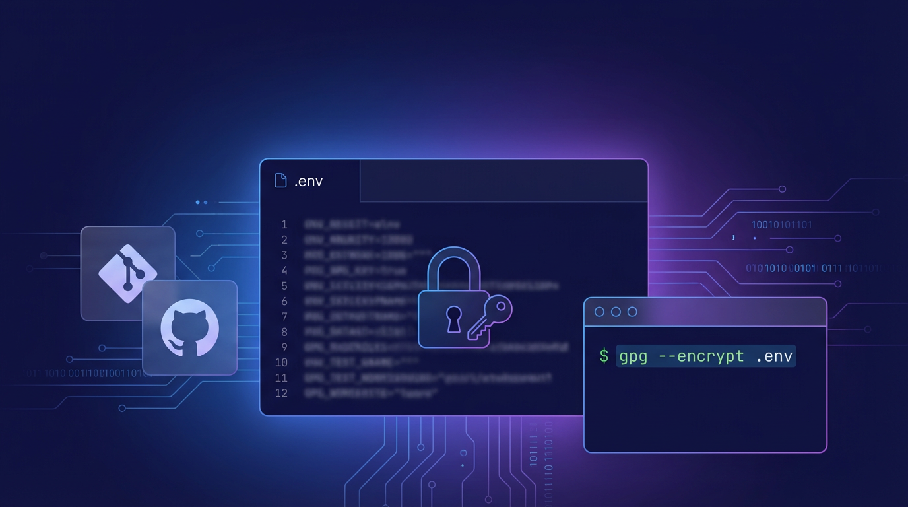

# Overview


There are cases where you need to commit application configuration files or environment variable definition files to Git.


Sometimes a development environment password gets committed carelessly, or a production environment password ends up included in a commit.


This post summarizes <strong>how to encrypt and hide the contents of a file that contains secret information when committing it</strong>.


There are several common approaches, but here we'll cover only <strong>the approach of using GPG directly</strong>.


### Commonly recommended methods for encrypting file contents

- gpg
- age
- git-crypt (Git filter-based encryption)
- sops (+age)

# Why GPG?


Many people already use GPG for signing GitHub commits/tags.


The advantage is that you can extend the same key to file encryption as well.


For installation/key generation, refer to [Signing Commits with GPG in Git](../88-github-gpg-commit-signing/).


If your only goal is file encryption, age may feel simpler.


# Encrypting/Decrypting Files


**Prerequisite:** You must have a GPG key already issued before proceeding with the steps below.


## Things to check first (important)

- If a file has <strong>already been included in a past commit</strong>, adding it to `.gitignore` **still leaves the secret value viewable in past commits.**
- To remove it completely, you must <strong>revoke/reissue</strong> the secret value and <strong>rewrite</strong> the git commits.
    - `git filter-repo` or BFG Repo-Cleaner
    - force push (if needed)

## Exclude the original file from Git


```shell
# Add .env to .gitignore
echo ".env" >> .gitignore

# If it's already being tracked, remove it from the index
# (keep the local file, only remove it from Git tracking)
git rm --cached .env
```


## Encrypting the file


### Notes

- `gpg --encrypt` doesn't update an existing file in place — it <strong>creates a new output file each time</strong>.
- If the file already exists, it will ask whether to overwrite it. Use the `--yes` option to auto-confirm.

Example `.env` file:


Create an encrypted `.env` file from a `.env` file that contains secrets.


```shell
# Encrypt with the specified recipient's key to create .env.enc
gpg --encrypt -r plzhans@gmail.com --output .env.enc .env

# If you need to automate overwriting as well
# gpg --yes --encrypt -r plzhans@gmail.com --output .env.enc .env
```


## Decrypting the file


Create a `.env` file containing secrets from the `.env.enc` file.


```shell
gpg --decrypt .env.enc > .env
```


# Miscellaneous


## Setting a default recipient

- Useful when specifying `-r` every time is cumbersome.
- `default-recipient`: used by default when the `-r` option is not given
- `encrypt-to`: always included regardless of the `-r` option
- Configuration file: `~/.gnupg/gpg.conf`

```shell
# Default key
default-key {pub uuid}

# Default recipient
default-recipient {pub uuid}

# Recipient to always include (only if needed)
#encrypt-to {pub uuid}
```
