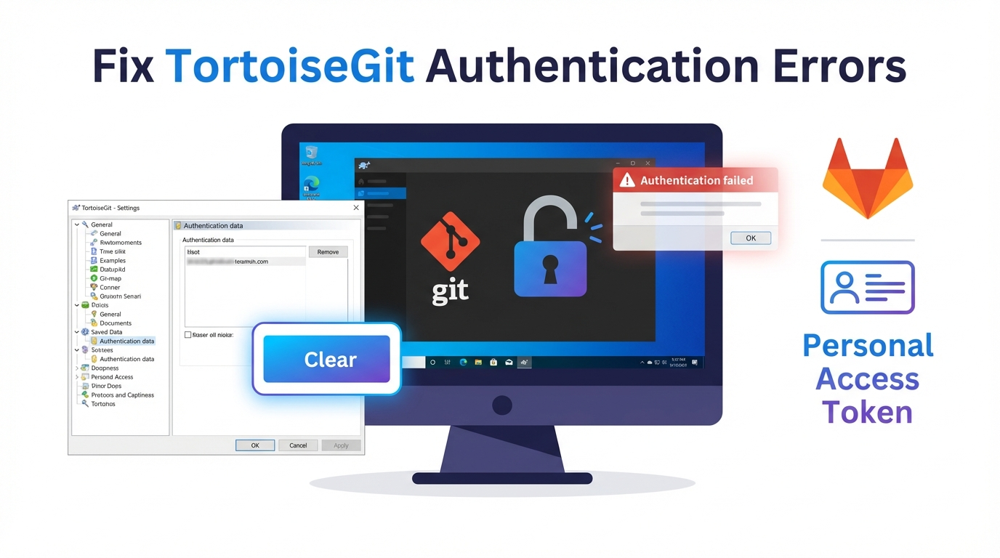
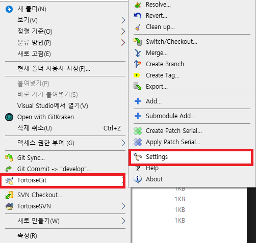
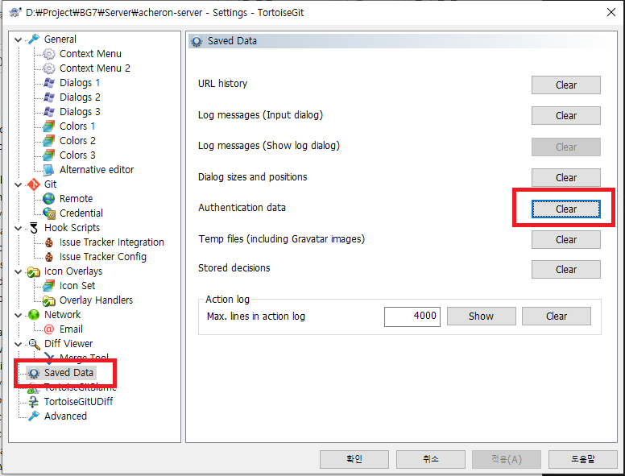

## 개요


Git 서버 주소가 바뀌었거나 계정을 변경했는데도 인증 실패가 반복되는 경우가 있습니다.


원인은 TortoiseGit이 Windows 자격 증명 또는 자체 저장소에 이전 인증 정보를 저장해 두기 때문입니다.


이 글에서는 TortoiseGit에서 저장된 인증 정보를 초기화하는 방법을 정리합니다.


## 증상

- `Authentication failed` 오류가 계속 발생한다
- 같은 저장소에서 계정이 바뀌었는데도 이전 계정으로 인증을 시도한다

## 원인

- Git 서버를 GitHub에서 GitLab로 바꿨다
- HTTP(S) URL 또는 사용자명이 바뀌었다

## 해결책


### TortoiseGit에서 인증 정보 초기화하기


아래 절차는 저장된 인증 데이터를 지워서 다음 Pull 또는 Push에서 다시 로그인 입력 창이 뜨게 만드는 방법입니다.

1. Windows 탐색기에서 Git 작업 폴더로 이동합니다.
2. 폴더에서 마우스 오른쪽 버튼을 클릭합니다.
3. **TortoiseGit → Settings** 로 이동합니다.

    

4. 왼쪽 메뉴에서 **Saved Data** 를 선택합니다.
5. **Authentication data** 영역에서 **Clear** 를 클릭합니다.

    이 작업으로 기존에 저장된 인증 정보가 삭제됩니다.


    

6. 다시 `Pull` 또는 `Push` 를 실행합니다.
7. 아이디와 비밀번호 또는 토큰을 다시 입력합니다.
    > 참고  
    > GitLab은 보통 비밀번호 대신 Personal Access Token을 사용합니다.  
    > 2FA를 사용 중이면 토큰을 준비한 뒤 입력합니다.

### 삭제가 안 되는 경우 점검

- 저장소 URL이 여러 개로 저장되어 있으면 다른 URL의 인증 데이터가 남아 있을 수 있습니다.
- Windows 자격 증명 관리자에도 관련 항목이 남아 있을 수 있습니다.
    - 제어판에서 **자격 증명 관리자 → Windows 자격 증명** 에서 Git 관련 항목을 확인합니다.

## Windows 자격 증명 관리자에서 직접 지우기


TortoiseGit의 Clear로 지워지지 않는 인증 정보는 Windows가 따로 보관하고 있는 경우가 많습니다.

1. 제어판 → 사용자 계정 → <strong>자격 증명 관리자</strong>로 이동합니다.
2. **Windows 자격 증명** 탭을 선택합니다.
3. `git:https://github.com`, `git:https://gitlab.com` 처럼 `git:`으로 시작하는 항목을 찾습니다.
4. 항목을 펼친 뒤 <strong>제거</strong>를 클릭합니다.

명령으로 먼저 확인하고 싶다면 아래를 사용합니다.


```powershell
cmdkey /list | findstr git
```


## 어떤 credential helper가 쓰이는지 확인


인증 정보를 실제로 보관하는 주체는 Git에 설정된 credential helper입니다. 어디에 저장되는지 모르면 엉뚱한 곳을 계속 지우게 되므로 설정값부터 확인합니다.


```shell
git config --show-origin --get credential.helper
```

- `manager` : Git Credential Manager가 관리합니다. 자체 계정 선택 창을 띄우므로 Windows 자격 증명과 함께 확인해야 합니다.
- `wincred` : Windows 자격 증명 관리자에 저장합니다.
- 값이 비어 있으면 저장하지 않고 매번 입력을 요구합니다.

특정 호스트의 자격 증명만 지우려면 아래처럼 실행합니다.


```shell
printf "protocol=https\nhost=github.com\n\n" | git credential reject
```


## 새로 입력할 값 준비


GitHub와 GitLab 모두 보안을 위해 계정 비밀번호 대신 토큰을 사용합니다.
지우기 전에 미리 발급해두면 인증 창이 떴을 때 바로 입력할 수 있습니다.

- GitHub : Settings → Developer settings → Personal access tokens
- GitLab : User Settings → Access Tokens

clone과 push를 하려면 저장소 읽기와 쓰기 권한을 부여합니다. 필요 이상으로 넓은 권한은 주지 않는 편이 안전합니다.


## 반복된다면 SSH 전환을 고려합니다


HTTP(S) 인증 정보를 계속 손봐야 한다면 원격 주소를 SSH로 바꾸는 방법이 있습니다. 키를 한 번 등록하면 토큰 만료나 자격 증명 캐시 문제에서 벗어날 수 있습니다.


```shell
# 현재 원격 주소 확인
git remote -v

# SSH 주소로 변경
git remote set-url origin git@github.com:{계정명}/{저장소명}.git
```


키 생성과 등록 절차는 [Git SSH 키로 원격 저장소 접속하기: 키 생성부터 등록까지](../13-git-ssh-key-setup-and-remote-access/) 글에서 확인합니다.

