## Overview


Garage is a CLI-first project. Still, building a layout and wiring buckets to keys goes much faster on a screen.


Garage has no official web console, and several third-party UIs exist. This post covers the simplest of them, garage-webui.


We start from a running Garage instance and add one more service to the compose file.


Installing Garage itself and configuring it from the CLI is covered in the previous post.

- [Installing and Configuring Garage - S3-Compatible Object Storage with Docker](../134-garage-docker-install-s3-object-storage/)

## Installation


### Adding the webui service


Add a single `webui` service to the compose file from the previous post. The finished file is in the repository. [sample/docker/garage-webui](https://github.com/plzhans/hans-blog/tree/master/sample/docker/garage-webui)


```yaml
# docker-compose.yml

services:
  garage:
    image: dxflrs/garage:v2.4.1
    container_name: garage
    restart: unless-stopped
    ports:
      - "3900:3900"     # S3 API, signed requests only
    # - "3901:3901"     # RPC, only needed to join other nodes
      - "3902:3902"     # static website hosting, public read
    # - "3903:3903"     # admin API, reached by webui over the compose network
    env_file:
      - .env
    volumes:
      - ./garage.toml:/etc/garage.toml:ro
      - ./meta:/var/lib/garage/meta
      - ./data:/var/lib/garage/data

  webui:
    image: khairul169/garage-webui:1.1.0
    container_name: garage-webui
    restart: unless-stopped
    depends_on:
      - garage
    ports:
      - "3909:3909"
    environment:
      API_BASE_URL: "http://garage:3903"
      S3_ENDPOINT_URL: "http://garage:3900"
      API_ADMIN_KEY: "${GARAGE_ADMIN_TOKEN}"
      AUTH_USER_PASS: "${AUTH_USER_PASS}"
    volumes:
      - ./garage.toml:/etc/garage.toml:ro
```


### Adding a login


Generate an account and a password hash.


```bash
# htpasswd -nBC 10 {id}
htpasswd -nBC 10 admin
```


It prompts twice and prints `account:hash` on the last line. Copy that whole line.


```plain text
New password:
Re-type new password:
admin:$2y$10$H9W.......yn6ze54n2
```


Paste it into .env.


```bash
# htpasswd -nBC 10 admin
AUTH_USER_PASS=admin:$2y$10$H9W.......yn6ze54n2
```


### Restarting


Environment variables are baked in when the container is created, so the container has to be recreated after a change.


```bash
docker compose up -d --force-recreate

[+] Restarting 2/2
 ✔ Container garage-webui  Started                                                                                                                                                                                                        0.7s
 ✔ Container garage        Started
```


## WEB UI


### Access


ex) http://192.168.0.10:3909


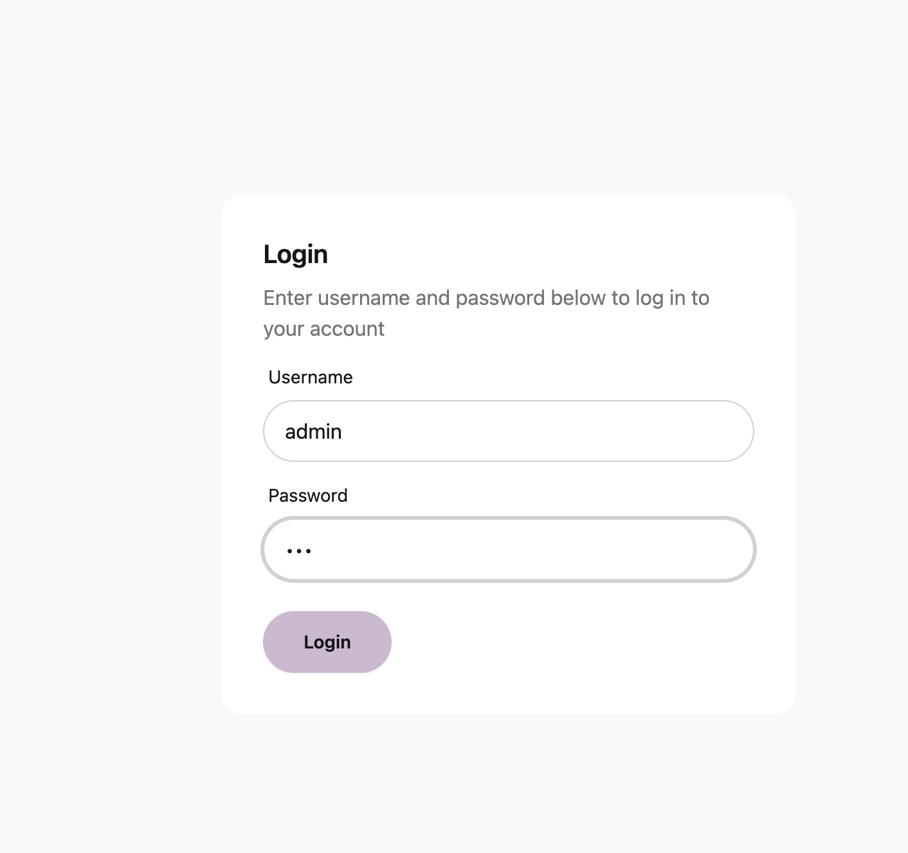


### Dashboard


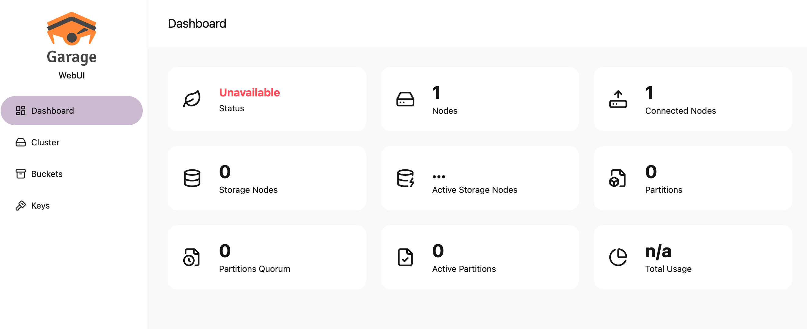


### Creating the cluster


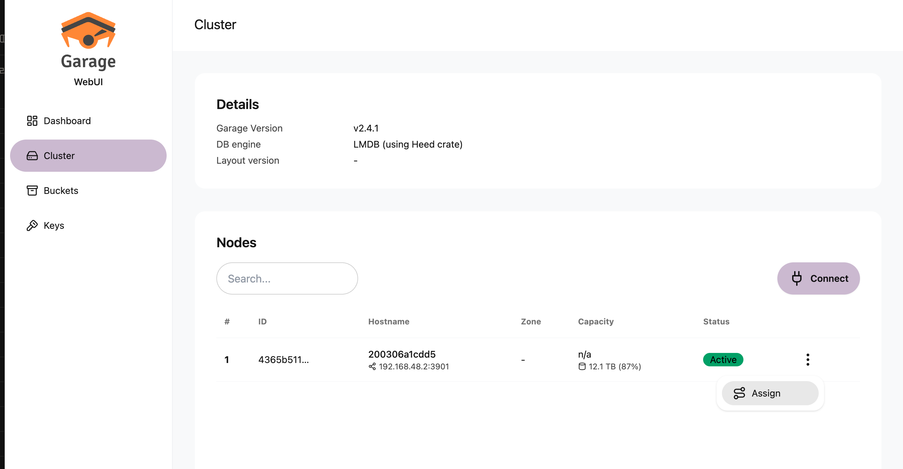


Node Assign


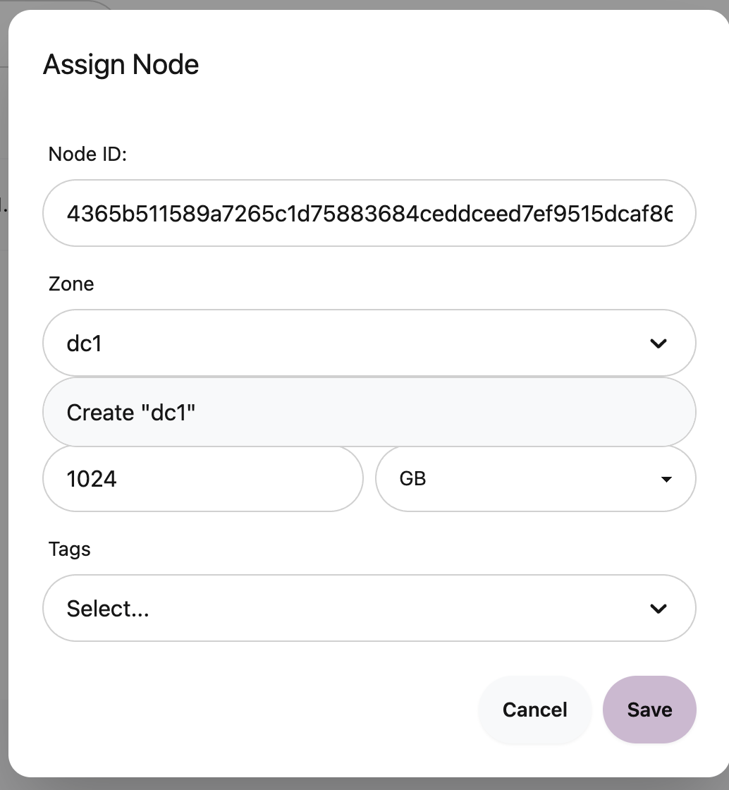


Node Apply


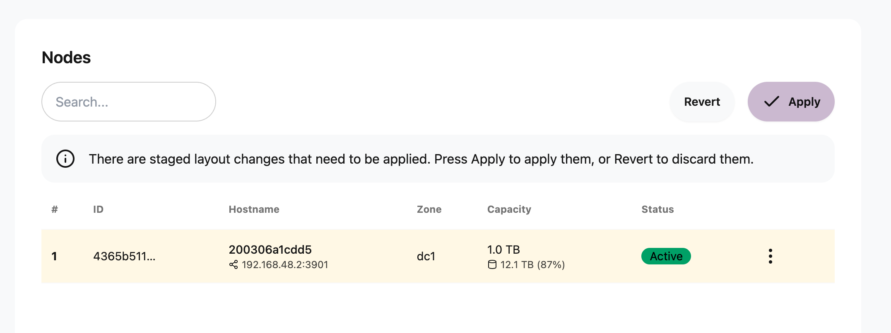


Done


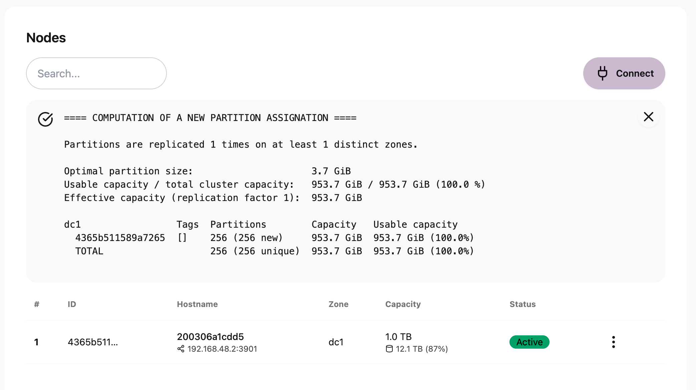


## Creating a bucket


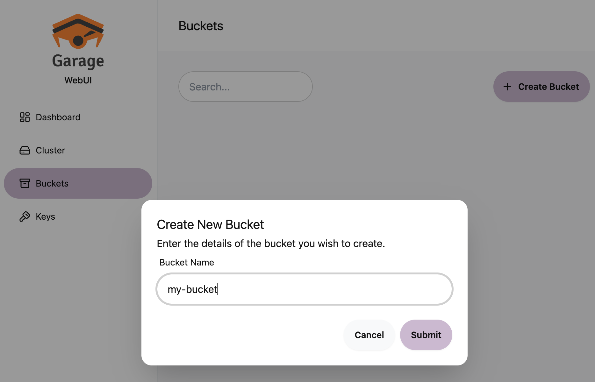


## Granting access to a bucket


### Creating a key


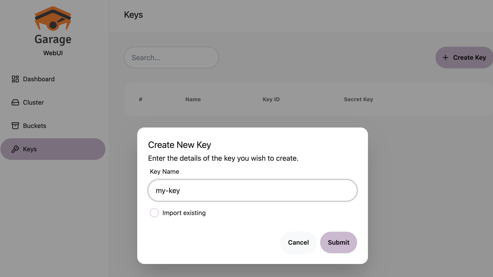


### Moving to the bucket


Go to the Manage tab


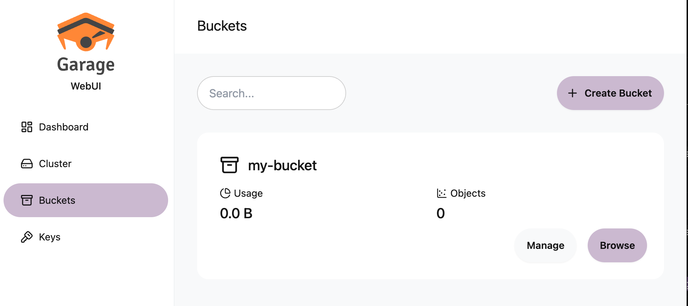


Attach permissions


Grant the key whatever it needs under Permissions.


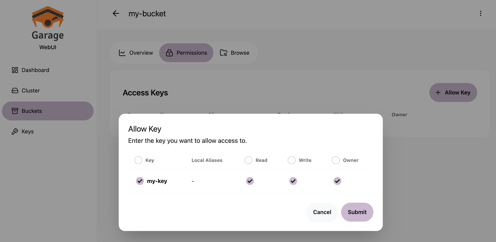


## Extra options


### Allowing static website hosting


Turn on Website Access Enabled in the bucket settings.


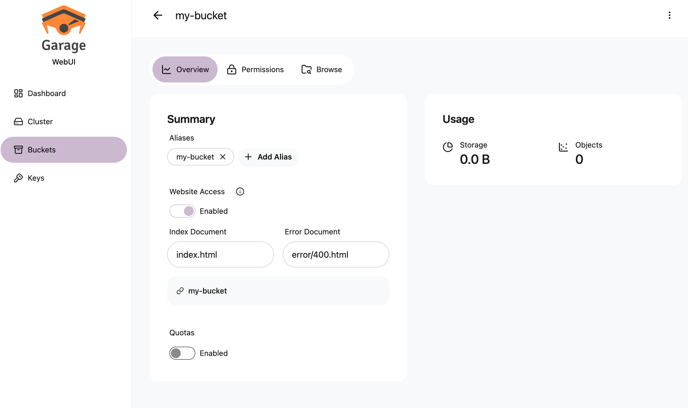


## Wrapping up


The same work simply moved from the terminal to a browser. Assign and Apply are still two steps, and keys and buckets are still created separately and joined by permissions. The webui is a wrapper around the admin API, so nothing here is confusing once you know the Garage concepts. Come at it the other way, screen first, and you get stuck in ways like assigning a node and never applying the layout.

Two things are worth keeping in mind. This is a third-party console rather than an official one, so its release cycle is not tied to Garage itself. And **authentication is off by default.** Without `AUTH_USER_PASS`, anyone who can reach port 3909 is an administrator. There is no reason to leave that open even on an internal network.

Changing the password means generating a new hash and recreating the container. In production it is easier to move authentication to a reverse proxy in front, or to stop publishing the port entirely and reach it only over a VPN.
