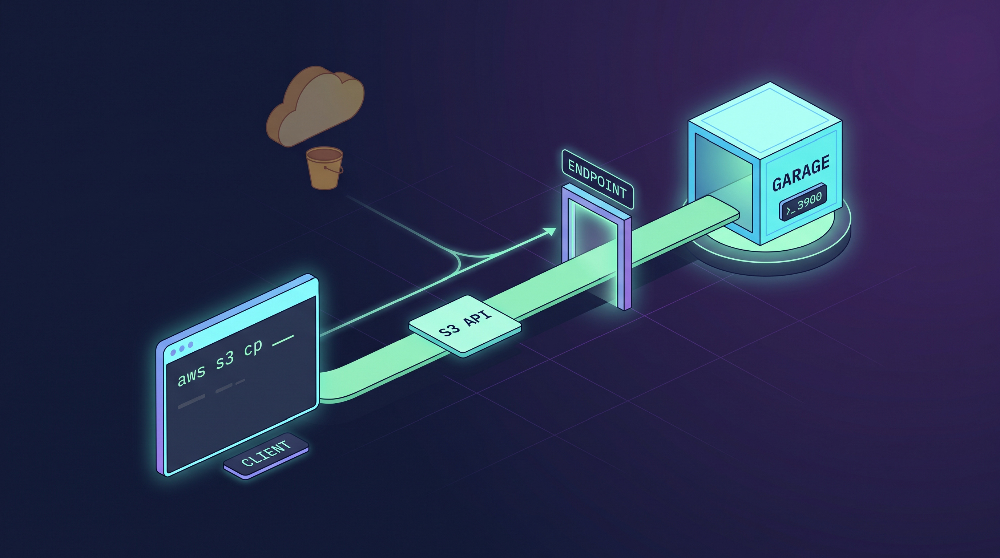

## 概要


AWS S3 を使っていると、いつかこう思う瞬間があります。ファイルを数個置いておくだけで毎月お金がかかり、データは他人のアカウントの中にあります。家では NAS が遊んでいるのに、そこに S3 の代わりになるものを載せられないでしょうか。


その位置に収まるのが Garage です。Rust で書かれた S3 互換オブジェクトストレージで、バイナリ 1 つ、25MB の Docker イメージで完結します。もともとは複数の地域に散らばったノードをまとめて使うために作られたものですが、単一ノードでも問題なく動きます。


ただし S3 の感覚のまま触ると、何か所かで詰まります。設定ファイルがなければ起動すらせず、バケットを作る前にやるべきことがもう 1 つあり、公開読み取りを有効にする方法がまったく異なります。この記事では、その地点を 1 つずつ押さえながら、コンテナを起動してオブジェクトを出し入れするところまで進みます。


### Garage とは


フランスの非営利ホスティング団体 Deuxfleurs が作った S3 互換オブジェクトストレージです。プロジェクト自身の紹介文が「データセンターの外でも動かせるほど信頼できる S3 オブジェクトストア」で、設計の意図はこの一行に入っています。専用のバックボーンがなく回線も遅い、家やオフィスのサーバーを複数まとめて使う状況を前提に作られています。


特徴を 3 つ挙げるとこうなります。外部データベースなしにバイナリ 1 つで動きます。ノードごとにゾーンを指定して、レプリカを地理的に分散させます。そして S3 API を実装しているので、既存の SDK やツールがそのままつながります。


Rust で書かれており、ライセンスは AGPL-3.0 です。

- メインリポジトリ: [git.deuxfleurs.fr/Deuxfleurs/garage](https://git.deuxfleurs.fr/Deuxfleurs/garage)
- GitHub ミラー: [deuxfleurs-org/garage](https://github.com/deuxfleurs-org/garage)

### この記事で扱うこと

- Docker Compose で Garage v2.4.1 を起動する
- `garage.toml` の必須項目と省略できる項目
- シークレットを `.env` に分離する
- レイアウトの割り当て。バケットより先にやるべき作業
- バケットとアクセスキーの作成、権限の付与
- `aws` CLI でのオブジェクトのアップロードとダウンロード

すべてターミナルから CLI だけで進めます。Web コンソール、ドメイン接続、HTTPS、静的ウェブホスティングはそれぞれ別に扱うだけの主題なので、続く記事に回します。


### S3 と違う 3 つの点


コマンドを打つ前に知っておくと迷いが減ります。Garage は S3 API を模していますが、内部モデルは異なります。その違いが表れるのが 3 か所です。


**ACL とバケットポリシーがありません。** `PutBucketAcl`、`PutBucketPolicy`、`PutObjectAcl` はいずれも実装されていません。公式ドキュメントはこう書いています。

> Garage implements none of them, and has its own system instead, built around a per-access-key-per-bucket logic.

権限はアクセスキー単位でのみ存在します。そのため「このオブジェクトだけ公開」や「`public/` 配下だけ公開」といったことはできません。公開と非公開を分けるにはバケットを分ける必要があります。


**ノードに役割を与えないとクラスタが動き出しません。** S3 はバケットを作れば終わりですが、Garage では「このノードがどれだけの容量をどのゾーンで受け持つか」を人が決める必要があります。これをレイアウトと呼び、組む前はバケットすら作れません。


**TLS を提供しません。** 設定の構造体に証明書の項目がそもそもありません。3 つのエンドポイントはすべて平文 HTTP で開きます。HTTPS は前段にリバースプロキシを置くか、トンネルを使って解決します。


## インストール


Docker と Docker Compose がインストールされている必要があります。インストールは下の記事で扱っています。

- [Amazon Linux 2023 ARM64 EC2 で Docker と Docker Compose をインストールする](../97-amazon-linux-2023-arm64-ec2-docker-docker-compose-install/)

### docker-compose の構成


この記事に出てくる設定ファイルは、そのままリポジトリにあります。[sample/docker/garage](https://github.com/plzhans/hans-blog/tree/master/sample/docker/garage)


```yaml
# docker-compose.yml
services:
  garage:
    image: dxflrs/garage:v2.4.1
    container_name: garage
    restart: unless-stopped
    ports:
      - "3900:3900"     # S3 API, signed requests only
    # - "3901:3901"     # RPC, only needed to join other nodes
    # - "3902:3902"     # static website hosting, public read
    # - "3903:3903"     # admin API
    env_file:
      - .env
    volumes:
      - ./garage.toml:/etc/garage.toml:ro
      - ./meta:/var/lib/garage/meta
      - ./data:/var/lib/garage/data
```


### 必須の設定ファイル


garage は設定ファイルがないと起動しません。


イメージの中に設定ファイルが含まれていないため、自分でマウントする必要があります。


```toml
# garage.toml

# required, no defaults
metadata_dir = "/var/lib/garage/meta"
data_dir     = "/var/lib/garage/data"

# 1 for single node, 3 is the recommended cluster setting
replication_factor = 1

rpc_bind_addr = "[::]:3901"

# db_engine   = "lmdb"              # default since v0.9
# rpc_public_addr = "127.0.0.1:3901"  # advertised to other nodes, multi-node only
# rpc_secret is injected as GARAGE_RPC_SECRET

[s3_api]
api_bind_addr = "[::]:3900"
s3_region     = "garage"          # required, no default
# root_domain = ".s3.garage.localhost"   # enables vhost-style, path-style works without it

[admin]
api_bind_addr = "[::]:3903"
# admin_token is injected as GARAGE_ADMIN_TOKEN

# whole section optional, root_domain required once it exists
# [s3_web]
# bind_addr   = "[::]:3902"
# root_domain = ".web.garage.localhost"
# index       = "index.html"
```


`replication_factor` は単一ノードなら `1` にします。デフォルト値がないため、省略すると `The option replication_factor is required.` で起動が止まります。


ドキュメントが勧める 3 にすると、ノードが 3 台つながるまで書き込みがすべて拒否されます。


`[s3_api]` の `root_domain` を省略しても、デフォルトのドメインができるわけではありません。**vhost-style のリクエスト自体が無効になります。**


ドメインを設定するとドメインの前にサブドメインとして付き、省略すると既存のホストの後ろのパスにバケットが付きます。


ex) domain → `mybucket.s3.plzhans.com`


ex) no domain → `http://192.168.0.10:3900/mybucket`


シークレット 2 つは `garage.toml` に直接書かず `.env` に入れます。どちらの値も openssl で作ります。


```plain text
# openssl rand -hex 32
GARAGE_RPC_SECRET=

# openssl rand -base64 32
GARAGE_ADMIN_TOKEN=
```


meta と data は起動時に必要なので、あらかじめ作っておきます。


```bash
mkdir data meta
```


### 起動


```bash
docker compose up -d
docker compose logs -f
```


## 初期構成 - レイアウトとバケット、アクセスキー


ここからは CLI でレイアウトを組み、バケットとキーを作ります。同じ作業をブラウザで行いたい場合は、下の記事を参照してください。

- [garage-webui のインストール - Garage のクラスタとバケットをブラウザから管理する](../135-garage-webui-install-docker-compose/)

### 状態の確認


```bash
docker compose exec garage /garage status
```


Zone が空です。


```plain text
2026-09-23T09:33:06.972398Z  INFO garage_net::netapp: Connected to 127.0.0.1:3901, negotiating handshake...
2026-09-23T09:33:07.014538Z  INFO garage_net::netapp: Connection established to 6409899f54d1d72f
==== HEALTHY NODES ====
ID                Hostname      Address          Tags  Zone  Capacity          DataAvail  Version
6409899f54d1d72f  ee6cfc6c37ff  172.26.0.2:3901              NO ROLE ASSIGNED             v2.4.1
```


### レイアウトの割り当て - zone と capacity


```bash
# docker compose exec garage /garage layout assign -z {zone name} -c <disk size> <node_id>
docker compose exec garage /garage layout assign -z dc1 -c 1024G 6409899f54d1d72f
```


ステージングされた状態です。


```plain text
2026-09-23T09:33:57.157611Z  INFO garage_net::netapp: Connected to 127.0.0.1:3901, negotiating handshake...
2026-09-23T09:33:57.199700Z  INFO garage_net::netapp: Connection established to 6409899f54d1d72f
Role changes are staged but not yet committed.
Use `garage layout show` to view staged role changes,
and `garage layout apply` to enact staged changes.
```


適用します。


```bash
docker compose exec garage /garage layout apply --version 1
```


```plain text
2026-09-23T09:36:41.403866Z  INFO garage_net::netapp: Connected to 127.0.0.1:3901, negotiating handshake...
2026-09-23T09:36:41.445720Z  INFO garage_net::netapp: Connection established to 6409899f54d1d72f
==== COMPUTATION OF A NEW PARTITION ASSIGNATION ====

Partitions are replicated 1 times on at least 1 distinct zones.

Optimal partition size:                     3.7 GiB
Usable capacity / total cluster capacity:   953.7 GiB / 953.7 GiB (100.0 %)
Effective capacity (replication factor 1):  953.7 GiB

dc1                 Tags  Partitions        Capacity   Usable capacity
  6409899f54d1d72f  []    256 (256 new)     953.7 GiB  953.7 GiB (100.0%)
  TOTAL                   256 (256 unique)  953.7 GiB  953.7 GiB (100.0%)


New cluster layout with updated role assignment has been applied in cluster.
Data will now be moved around between nodes accordingly.
```


作成完了です。状態をもう一度確認します。


```bash
docker compose exec garage /garage layout show
```


### バケットの作成


```bash
docker compose exec garage /garage bucket create mybucket
```


作成完了です。


```plain text
2026-09-23T09:38:56.805982Z  INFO garage_net::netapp: Connected to 127.0.0.1:3901, negotiating handshake...
2026-09-23T09:38:56.847685Z  INFO garage_net::netapp: Connection established to 6409899f54d1d72f
==== BUCKET INFORMATION ====
Bucket:          9db3bec13c42ac19396bac4cac65fa3e02d7d3f13aa900039194570362d766a1
Created:         2026-09-23 09:38:56.848 +00:00

Size:            0 B (0 B)
Objects:         0

Website access:  false

Global alias:    mybucket

==== KEYS FOR THIS BUCKET ====
Permissions  Access key    Local aliases
```


### アクセスキーの作成


```bash
docker compose exec garage /garage key create my-app-key
```


作成完了です。


```plain text
2026-09-23T09:40:14.566030Z  INFO garage_net::netapp: Connected to 127.0.0.1:3901, negotiating handshake...
2026-09-23T09:40:14.607746Z  INFO garage_net::netapp: Connection established to 6409899f54d1d72f
==== ACCESS KEY INFORMATION ====
Key ID:              GK05...
Key name:            my-app-key
Secret key:          5f98a...
Created:             2026-09-23 09:40:14.608 +00:00
Validity:            valid
Expiration:          never

Can create buckets:  false

==== BUCKETS FOR THIS KEY ====
Permissions  ID  Global aliases  Local aliases
```


アクセスキーにバケットの権限を追加します。


```bash
docker compose exec garage /garage bucket allow --read --write mybucket --key my-app-key
```


登録完了です。


```plain text
2026-09-23T09:41:35.840001Z  INFO garage_net::netapp: Connected to 127.0.0.1:3901, negotiating handshake...
2026-09-23T09:41:35.882581Z  INFO garage_net::netapp: Connection established to 6409899f54d1d72f
==== BUCKET INFORMATION ====
Bucket:          9db3bec13c42ac19396bac4cac65fa3e02d7d3f13aa900039194570362d766a1
Created:         2026-09-23 09:38:56.848 +00:00

Size:            0 B (0 B)
Objects:         0

Website access:  false

Global alias:    mybucket

==== KEYS FOR THIS BUCKET ====
Permissions  Access key                              Local aliases
RW           GK05...                      my-app-key
```


## API テスト


ここで `aws` CLI を使って実際にオブジェクトを入れてみます。Garage は別のマシンからアクセスするのが自然なので、エンドポイントをアドレスで指定します。下の `192.168.0.10` は例なので、Garage が動いているマシンのアドレスに置き換えてください。


```bash
export AWS_ACCESS_KEY_ID=GK...
export AWS_SECRET_ACCESS_KEY=...
export AWS_REGION=garage
export AWS_EC2_METADATA_DISABLED=true
```


`AWS_EC2_METADATA_DISABLED` は有効にしておくとよいです。有効にしないと、CLI が EC2 メタデータサービスを探して一瞬止まることがあります。


### リージョンが一致しないと署名が通らない


`AWS_REGION` を忘れたり別の値にしたりすると、こうなります。


```javascript
An error occurred (AuthorizationHeaderMalformed) when calling the ListBuckets operation:
Authorization header malformed, unexpected scope: '20260923/us-east-1/s3/aws4_request',
expected: '20260923/garage/s3/aws4_request'
```


接続はできていて、署名で弾かれています。幸いエラーが期待するスコープをそのまま教えてくれるので、`garage.toml` の `s3_region` に合わせれば解決します。


### 出し入れ


リージョンを合わせると、まず一覧が返ってきます。


```bash
aws --endpoint-url http://192.168.0.10:3900 s3 ls
```


```javascript
2026-09-23 18:38:56 mybucket
```


ファイルを 1 つアップロードします。


```bash
echo "hello garage" > hello.txt
aws --endpoint-url http://192.168.0.10:3900 s3 cp hello.txt s3://mybucket/test/hello.txt
```


```javascript
upload: ./hello.txt to s3://mybucket/test/hello.txt
```


確認します。


```bash
aws --endpoint-url http://192.168.0.10:3900 s3api head-object \
  --bucket mybucket --key test/hello.txt
```


```json
{
    "AcceptRanges": "bytes",
    "LastModified": "2026-09-23T09:45:12+00:00",
    "ContentLength": 13,
    "ETag": "\"d719760daa49cdebc41dfdd40474cb37\"",
    "ContentType": "text/plain",
    "Metadata": {}
}
```


`ContentType` は CLI が拡張子から推測して送った値です。`ETag` は内容の MD5 ですが、これは単一アップロードの場合で、マルチパートでアップロードすると計算方法が変わります。


ダウンロードして元のファイルと比較すれば、往復が壊れていないことを確認できます。


```bash
aws --endpoint-url http://192.168.0.10:3900 s3 cp s3://mybucket/test/hello.txt roundtrip.txt
diff hello.txt roundtrip.txt
```


## バケットのアドレス方式 - path-style と vhost-style


### ここでは path-style が既定


上のコマンドが追加設定なしでそのまま通ったのには理由があります。`root_domain` を省略したため、Garage は Host ヘッダを見ずにパスからバケットを探します。


```javascript
http://192.168.0.10:3900/mybucket/test/hello.txt
                         ^^^^^^^^ bucket
```


### vhost-style に切り替える


AWS が path-style を旧方式として押し出していることもあり、最近の SDK はホスト名にバケットを入れる vhost-style を既定にしています。


```bash
# garage.toml

# ...

[s3_api]
# ...
root_domain = ".s3.plzhans.com"
```


設定ファイルは起動時にしか読まれないので、再起動するだけで済みます。


```bash
docker compose restart garage
```


最終的なパスです。`mybucket.s3.plzhans.com` が Garage のホストに解決される必要があるため、ワイルドカードの DNS レコードが必要です。


```bash
http://mybucket.s3.plzhans.com:3900/test/hello.txt
       ^^^^^^^^ bucket
```


---


## 主なコマンド


**状態確認**


```bash
docker compose exec garage /garage status
docker compose exec garage /garage stats
docker compose exec garage /garage health
```


**レイアウト**


```bash
docker compose exec garage /garage layout show
docker compose exec garage /garage layout assign -z dc1 -c 500G <node_id>
docker compose exec garage /garage layout apply --version 1
docker compose exec garage /garage layout revert
```


**キー**


```bash
docker compose exec garage /garage key create my-app-key
docker compose exec garage /garage key list
docker compose exec garage /garage key info my-app-key
docker compose exec garage /garage key delete my-app-key
```


**バケット**


```bash
docker compose exec garage /garage bucket create mybucket
docker compose exec garage /garage bucket list
docker compose exec garage /garage bucket info mybucket
docker compose exec garage /garage bucket allow --read --write mybucket --key my-app-key
docker compose exec garage /garage bucket deny --write mybucket --key my-app-key
docker compose exec garage /garage bucket website --allow mybucket
docker compose exec garage /garage bucket alias mybucket s3.plzhans.com
docker compose exec garage /garage bucket delete mybucket
```


---


## FAQ


### s3_region は AWS のリージョンではない


`s3_region` を見ると「どのリージョンに作るのか」と読めます。そうではありません。


AWS においてリージョンは 3 つの役割を兼ねています。データが物理的に置かれる場所、エンドポイントのアドレス、そして SigV4 の署名スコープです。Garage にはリージョンという概念がありません。クラスタが 1 つあるだけです。しかし S3 プロトコルを模すには、署名にリージョン文字列が必ず入る必要があります。`s3_region` はその宣言であり、3 つの役割のうち署名スコープだけが残った抜け殻です。値が何であれデータは動きません。


Garage において物理的な位置は、レイアウトのゾーンが決めます。


### s3_region を指定しないとエラーが出る


```javascript
garage | Error: TOML decode error: TOML parse error at line 14, column 1
garage |    |
garage | 14 | [s3_api]
garage |    | ^^^^^^^^
garage | missing field `s3_region`
```


エラーが `[s3_api]` の行を指しているため、セクション自体が間違っていると思いがちです。実際にはその中のフィールドが 1 つ抜けているだけです。設定ドキュメントには `s3_region` のデフォルト値が `"garage"` と書かれていますが、これは慣例的に使う値という意味であって、省略すれば補ってくれるという意味ではありません。ソースでは `pub s3_region: String` とデフォルト値なしで宣言されています。


ドキュメントに「default」と書かれた値を信じて消すと、こうなります。`metadata_dir` · `data_dir` · `rpc_bind_addr` · `replication_factor` · `s3_region` の 5 つはすべて埋める必要があります。


---


## まとめ


Garage は S3 API を話しますが、S3 ではありません。


この 3 つを知って始めれば、あとはすんなり進みます。

- バケットを作る前にノードへ役割を与える必要がある
- 権限はアクセスキー単位でしか存在しない。
- 設定ファイルがなければ起動すらしない。

バイナリ 1 つに設定ファイル 1 枚、必須項目は 5 つだけです。Docker Compose ファイル 15 行で S3 互換ストレージができ、`aws` CLI がそのままつながります。


ここまでが土台です。実際に使うにはドメインを付けて HTTPS をかぶせる必要がありますが、Garage 自身は TLS を行わないため前段が必要になります。


公開ファイルをウェブに出すのも S3 API ではなく別のエンドポイントが担当します。


### 参考

- [Garage 公式ドキュメント](https://garagehq.deuxfleurs.fr/documentation/quick-start/)
- [Garage 設定リファレンス](https://garagehq.deuxfleurs.fr/documentation/reference-manual/configuration/)
- [Garage S3 互換性リスト](https://garagehq.deuxfleurs.fr/documentation/reference-manual/s3-compatibility/)
- [dxflrs/garage on Docker Hub](https://hub.docker.com/r/dxflrs/garage)
- [この記事の設定ファイル - sample/docker/garage](https://github.com/plzhans/hans-blog/tree/master/sample/docker/garage)
