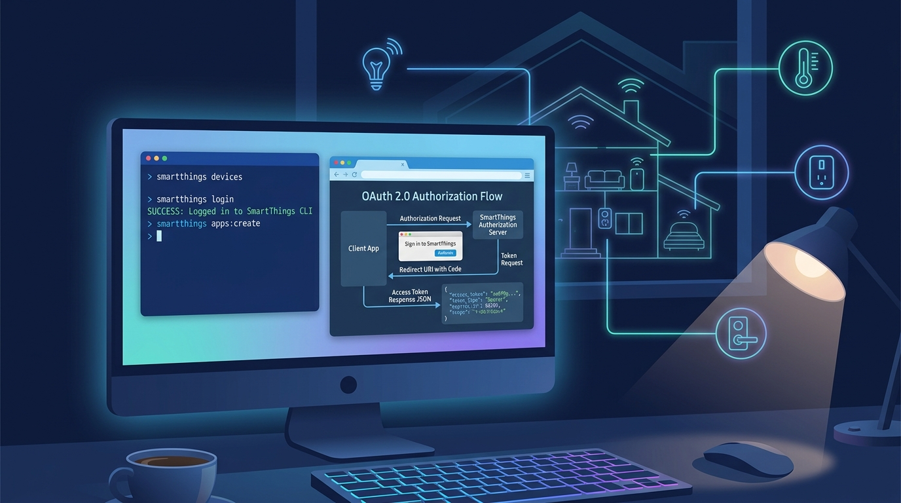

## 概要


SmartThings は Samsung Electronics が提供する IoT プラットフォームです。


照明、エアコン、TV、センサー、プラグ、ドアロックなどのスマートホームデバイスを、1つのアカウントと Location 単位で接続・制御できます。


SmartThings API を使用すると、SmartThings アプリでのみ行っていた操作を、外部サービスや個人サーバーからも自動化できます。


例えば、登録済みデバイスの一覧取得、デバイス状態の確認、電源制御、温度設定、自動化条件の構成などの操作を REST API または SmartThings CLI で処理できます。


この記事では、SmartThings API 連携のための基本的な準備手順をまとめます。全体の流れは以下のとおりです。

1. SmartThings アカウントとデバイスを準備します。
2. SmartThings CLI をインストールします。
3. CLI ログインによりアカウント認証を完了します。
4. API 呼び出しに必要なアプリまたはトークンを作成します。
5. デバイス一覧と権限スコープを確認します。
6. 外部アプリケーションから SmartThings API を呼び出します。

個人的なテストや簡単な自動化であれば、Personal Access Token（PAT）ですぐに始めることができます。


ただし、長期的に運用するサービスやユーザー認証が必要なアプリには、OAuth ベースの連携が適しています。


## インストール


SmartThings API 連携を始めるには、まず SmartThings CLI をインストールします。


CLI は SmartThings API をターミナルから使用できるようにする公式ツールです。


アプリ作成、認証、デバイス一覧取得、コマンド実行などの操作を CLI で処理できます。


### macOS で Homebrew によるインストール


macOS では Homebrew を使用する方法が最も簡単です。


```bash
# SmartThings Community formula を信頼
brew trust --formula smartthingscommunity/smartthings/smartthings-prerelease

# SmartThings CLI をインストール
brew install smartthingscommunity/smartthings/smartthings

# インストール確認
smartthings --version
```


`brew trust` は SmartThings Community タブが提供する formula を信頼済みとして登録する手順です。その後、`brew install` で SmartThings CLI をインストールします。


インストールが完了したら、`smartthings --version` コマンドで正常にインストールされたことを確認します。バージョン情報が表示されれば、CLI を使用する準備が整った状態です。


### Windows でのインストール


Windows では SmartThings CLI の実行ファイルをダウンロードして使用する方法が適しています。


[GitHub リリースページ](https://github.com/SmartThingsCommunity/smartthings-cli/releases)から Windows 用の圧縮ファイルをダウンロードし、実行ファイルを `PATH` に含まれるディレクトリに配置します。

1. SmartThings CLI の [GitHub リリースページ](https://github.com/SmartThingsCommunity/smartthings-cli/releases)に移動します。
2. Windows 用の圧縮ファイルをダウンロードします。
3. 圧縮を解凍します。
4. `smartthings.exe` ファイルを任意のディレクトリにコピーします。
5. そのディレクトリを Windows 環境変数 `PATH` に追加します。
6. PowerShell またはコマンドプロンプトを新しく開き、インストールを確認します。

```powershell
smartthings --version
```


`smartthings --version` コマンドがバージョン情報を出力すれば、インストールは完了です。コマンドが見つからないというエラーが出る場合は、`smartthings.exe` があるパスが `PATH` に正しく登録されているか確認してください。


### Node.js 環境で npm によるインストール


Node.js がすでにインストールされている開発環境であれば、npm で SmartThings CLI をインストールできます。この方法は Windows、macOS、Linux で共通して使用できます。


```bash
npm install -g @smartthings/cli

smartthings --version
```


npm 方式は Node.js ベースの開発環境で便利です。逆に Node.js の依存関係を追加したくない場合は、OS 別の実行ファイルや Homebrew によるインストール方法がよりシンプルです。


### Linux でのインストール


Linux では SmartThings CLI のリリースファイルをダウンロードし、実行権限を付与してからシステムパスに配置します。ディストリビューションに関係なく使用できる一般的なインストール手順です。


```bash
# インストールディレクトリの作成
mkdir -p ~/bin

# SmartThings CLI Linux 用ファイルのダウンロードと解凍
# 実際のファイル名と URL は [GitHub リリースページ](https://github.com/SmartThingsCommunity/smartthings-cli/releases)の最新バージョンに合わせて変更してください。
tar -xzf smartthings-linux-x64.tar.gz

# 実行ファイルの移動
mv smartthings ~/bin/

# 実行権限の付与
chmod +x ~/bin/smartthings

# PATH の登録
echo 'export PATH="$HOME/bin:$PATH"' >> ~/.bashrc
source ~/.bashrc

# インストール確認
smartthings --version
```


シェルとして zsh を使用している場合は、`~/.bashrc` の代わりに `~/.zshrc` に PATH を登録します。


```bash
echo 'export PATH="$HOME/bin:$PATH"' >> ~/.zshrc
source ~/.zshrc
```


サーバー環境では `/usr/local/bin` に配置することで、すべてのユーザーアカウントから使用することもできます。


```bash
sudo mv smartthings /usr/local/bin/
sudo chmod +x /usr/local/bin/smartthings

smartthings --version
```


## アプリ作成と認証


OAuth ベースの連携を準備するには、SmartThings CLI でアプリを作成します。


```bash
smartthings apps:create
```


コマンドを実行すると、アプリ名、説明、権限スコープ、リダイレクト URL などの情報を入力する手順が進行します。


この過程で、API 呼び出しに使用するアプリ情報を登録します。


```bash
smartthings apps:create
✔ What kind of app do you want to create? (Currently, only OAuth-In apps are
supported.) OAuth-In App

More information on writing SmartApps can be found at
  https://developer.smartthings.com/docs/connected-services/smartapp-basics

✔ Display Name test-app
✔ Description test
✔ Icon Image URL (optional)
✔ Target URL (optional)

More information on OAuth 2 Scopes can be found at:
  https://www.oauth.com/oauth2-servers/scope/

To determine which scopes you need for the application, see documentation for the individual endpoints you will use in your app:
  https://developer.smartthings.com/docs/api/public/

✔ Select Scopes. r:devices:*, w:devices:*, x:devices:*, r:hubs:*, r:locations:*,
w:locations:*, x:locations:*, r:scenes:*, x:scenes:*, r:rules:*, w:rules:*, r:installedapps,
w:installedapps
✔ Add or edit Redirect URIs. Add Redirect URI.
✔ Redirect URI (? for help) https://httpbin.org/get
✔ Add or edit Redirect URIs. Finish editing Redirect URIs.
✔ Choose an action. Finish and create OAuth-In SmartApp.
Basic App Data:
───────────────────────────────────────────────────────────────
 Display Name     test-app
 App Id           72b65205-14ef-48cb-94eb-xxxxxxxxxxxx
 App Name         testapp-91735007-4498-4b3a-96f0-xxxxxxxxxxxx
 Description      test
 Single Instance  true
 Classifications  CONNECTED_SERVICE
 App Type         API_ONLY
───────────────────────────────────────────────────────────────


OAuth Info (you will not be able to see the OAuth info again so please save it now!):
───────────────────────────────────────────────────────────────
 OAuth Client Id      19c1fcbf-988c-4bc0-bccf-xxxxxxxxxxxx
 OAuth Client Secret  1b95dfcf-2227-4b98-9547-xxxxxxxxxxxx
───────────────────────────────────────────────────────────────
```


## API の使用


### API 連携方式の選択


SmartThings API を呼び出す方式は大きく2つあります。

- Personal Access Token（PAT）
    - 個人テストやシンプルな自動化に適しています。
    - トークンの生成が簡単です。
    - 必要な権限スコープを直接選択して発行します。
    - 長期運用サービスには適さない場合があります。
- OAuth アプリ
    - 外部アプリケーションまたはユーザー認証ベースのサービスに適しています。
    - ユーザーが権限を承認する構造で動作します。
    - アクセストークンとリフレッシュトークンベースで運用できます。
    - 配布用サービスであれば、この方式を優先的に検討します。

### OAuth 認証とトークン発行


この方式は開発用です。本番環境では、自分で管理する HTTPS コールバック URL を使用することが安全です。


このステップは `smartthings apps:create` で OAuth Client ID と OAuth Client Secret を発行した後に進めます。


Web サーバーを別途構築しない場合は、Redirect URI に一時的なコールバック URL を登録します。


```plain text
https://httpbin.org/get
```


認証 URL の `redirect_uri` とトークンリクエストの `redirect_uri` は、アプリ作成時に登録した値と完全に一致する必要があります。


```plain text
https://api.smartthings.com/oauth/authorize?response_type=code&client_id=<client-id>&redirect_uri=https%3A%2F%2Fhttpbin.org%2Fget&scope=<scope>
```


承認後、リダイレクトされた URL から `code` の値をコピーして、トークン発行リクエストに使用します。


```bash
curl -X POST "https://api.smartthings.com/oauth/token" \
  -H "Content-Type: application/x-www-form-urlencoded" \
  -u "<client-id>:<client-secret>" \
  -d "grant_type=authorization_code" \
  -d "code=<authorization-code>" \
  -d "redirect_uri=https://httpbin.org/get"
```


SmartThings API を実際に使用する際は、Samsung SmartThings 公式 API ドキュメントを基準に、エンドポイント、権限スコープ（scope）、リクエスト/レスポンス形式を確認する必要があります。


公式ドキュメントでは、Devices、Locations、Scenes、Rules、Installed Apps などの主要リソース別 API が提供されています。デバイス制御を実装する際は、まずデバイス一覧を取得し、各デバイスの capability と command 構造を確認してから、コマンド API を呼び出す流れで進めます。


参考ドキュメントは以下のリンクを使用してください。

- [SmartThings Public API ドキュメント](https://developer.smartthings.com/docs/api/public/)
- [SmartThings 開発者ドキュメント](https://developer.smartthings.com/docs/)
- [SmartThings CLI ドキュメント](https://developer.smartthings.com/docs/sdks/cli/)

簡単なテストは `curl` や Postman で始めるのがおすすめです。その後、実際のサービスや自動化スクリプトに適用する際は、必要な権限のみを scope として選択し、トークンを安全に保管してください。


```bash
curl -X GET "https://api.smartthings.com/v1/devices" \
  -H "Authorization: Bearer <access-token>"
```


上記のリクエストは、アカウントに接続されているデバイスの一覧を取得します。レスポンスからデバイス ID と capability 情報を確認した後、ステータス取得やコマンド実行 API に拡張できます。


## CLI の使用


インストール済みの CLI を直接使用してデバイスを制御する場合に使用します。


ログイン


```bash
smartthings login
```


コマンドを実行すると、ブラウザベースの認証手順が進行します。


Samsung アカウントでログインし、権限リクエストを承認すると、CLI から SmartThings アカウントのリソースにアクセスできるようになります。


ログインが完了したら、以下のコマンドで登録済みの Location を確認します。


```bash
smartthings locations
```


連携済みのデバイス一覧は以下のコマンドで確認します。


```bash
smartthings devices
```


特定のデバイスの詳細情報が必要な場合は、デバイス ID を指定します。


```bash
smartthings devices <device-id>
```


## まとめ


この時点で発行される OAuth Client ID と Client Secret は再度確認できないため、必ず別途保管してください。


Web サーバーを運用しないテスト環境では、`https://httpbin.org/get` のような一時的な Redirect URI を使用できます。


ただし、アプリ作成時に登録した Redirect URI と認証 URL、トークン発行リクエストに使用する `redirect_uri` の値はすべて同一である必要があります。


トークン発行が完了したら、SmartThings Public API ドキュメントを基準に、必要なエンドポイントと scope を確認します。


一般的な流れは、デバイス一覧取得、capability 確認、ステータス取得、コマンド実行の順です。


CLI はインストール確認や簡単なデバイス一覧取得に便利です。


実際のサービスや自動化スクリプトでは、API ドキュメントを基準に必要な権限のみを選択し、トークンと Client Secret を安全に管理することが重要です。
