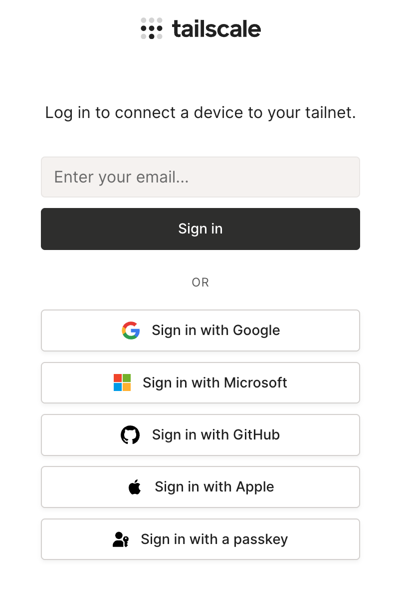
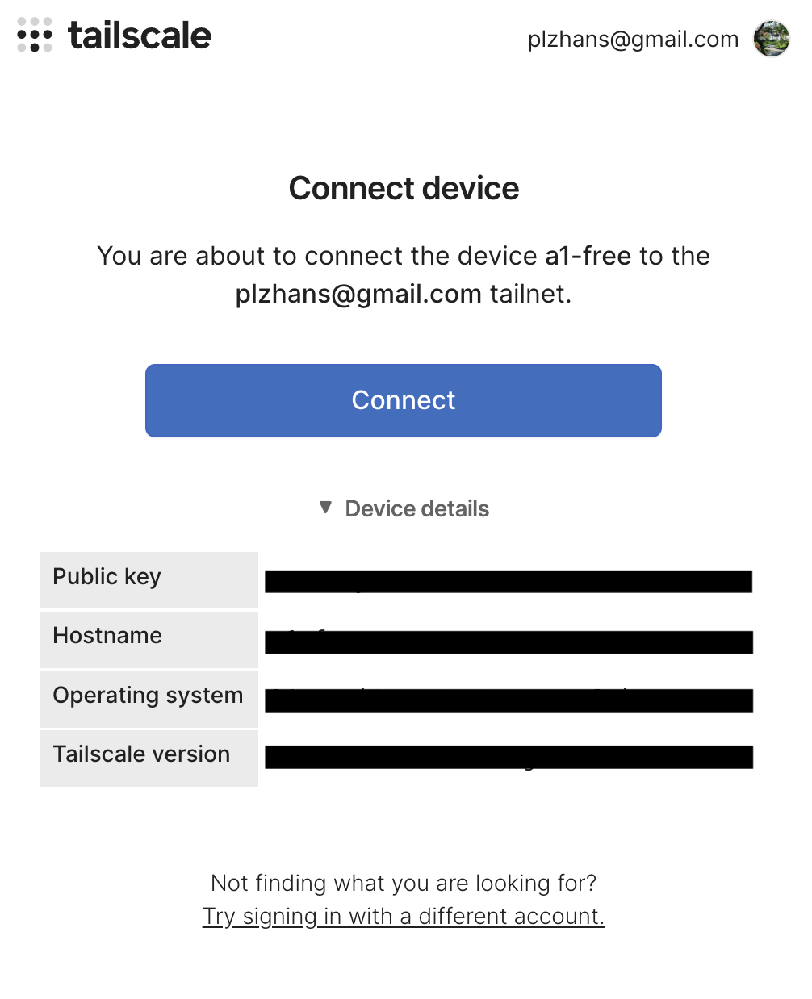
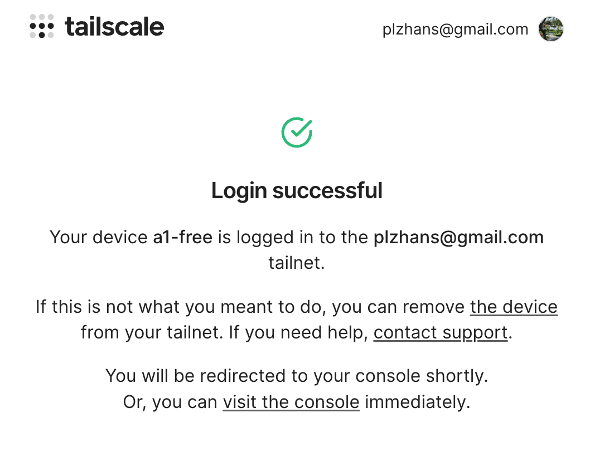
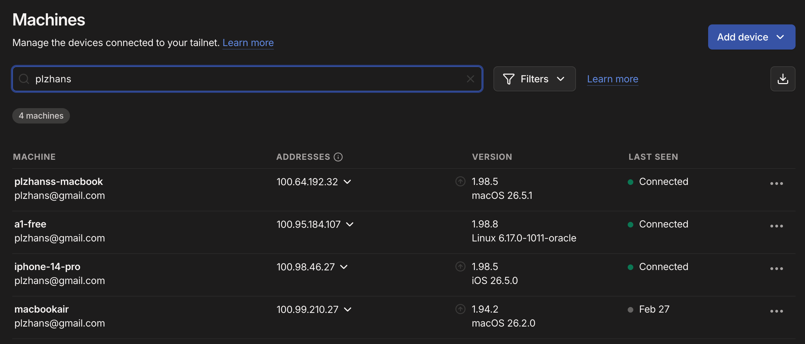
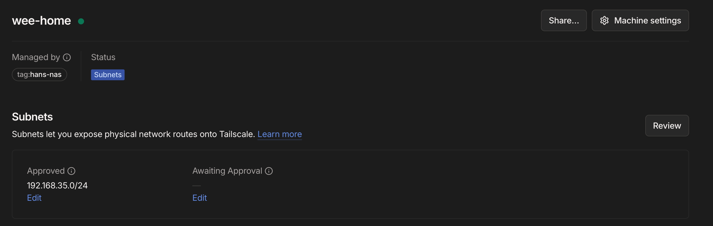

## Overview


Tailscale is a VPN service that connects multiple devices as if they were on a single private network. Even if your Linux servers, NAS, laptops, and smartphones are in different locations, they can be connected as though they are on the same internal network.


Typical server access requires opening inbound ports from the outside to the server. This approach requires router port forwarding, firewall rules, and public IP configuration, and misconfiguration can directly expose the server to the internet.


Tailscale works the opposite way by using outbound connections from devices. This allows it to work in most environments without opening any ports. However, in corporate networks or environments where security appliances heavily restrict outbound traffic, it may be affected by outbound firewall policies.


The way it works is simple. Install the Tailscale client on each device and register it to the same account's tailnet. Registered devices receive a unique tailnet IP and communicate directly via P2P whenever possible. In NAT or firewall environments where direct connections are difficult, communication is relayed through Tailscale's relay server called DERP.


Tailscale also provides device name-based domains.


Similar to an nginx reverse proxy, you can connect to internal services using addresses in the format `https://{device}.{tailnet}.ts.net`.


Serve mode provides a proxy accessible only within the tailnet, while Funnel mode is used to expose services to the internet.


## Installation


### Using the Install Script


```bash
curl -fsSL https://tailscale.com/install.sh | sudo sh
```


### Starting the Service


Enable and start immediately with --now


```bash
sudo systemctl enable --now tailscaled
```


## Running


### Device Registration


Connect the current machine to the specified account's Tailscale network


ex) https://login.tailscale.com/a/xxxxxxxxxxxxx


```bash
sudo tailscale up

# Result
# To authenticate, visit:
#
#         https://login.tailscale.com/a/xxxxxxxxxxxxx
```


### Account Authentication


Log in to your Tailscale account





### Device Connection


Click the Connect button to access the service








### Device Registration Complete


The device is registered, but the --accept-routes option is set to false, meaning routing between peers has not been established.


```bash
# Result
# Success.
# Some peers are advertising routes but --accept-routes is false
```


Check status


```bash
ubuntu@a1-free:~$ tailscale status

# result
# xx.xx.184.107  a1-free           plzhans@        linux    -
# xx.xx.46.27    iphone-14-pro     plzhans@        iOS      -
# xx.xx.192.32   plzhanss-macbook  plzhans@        macOS    -
# xx.xx.23.68    wee-home          tagged-devices  linux    -

# Health check:
#     - Some peers are advertising routes but --accept-routes is false
```


## VPN Communication


There are roughly 3 methods available.

1. Use tailnet internal IP
2. Communicate between VPN device nodes through routing via accept-routes
3. Communicate between VPN device nodes using Serve mode
4. Allow anyone on the internet to connect using Funnel mode (HTTP / HTTPS only)

## VPN: tailnet IP Method


Once connected to the tailnet, a private IP dedicated to the tailnet is automatically assigned.


This is automatically set up during the default installation.

- Since it uses tun mode, it is assumed that a tailscale0 virtual router has been created internally.




## VPN: accept-routes Method


Since internal communication does not go through Tailscale infrastructure, there are no traffic limitations.


### Tailscale Configuration

1. Go to the console: [https://login.tailscale.com/admin](https://login.tailscale.com/admin)
2. Check Subnet




### Machine Configuration

1. Accept Tailscale peer routing

From now on, routing information will be fetched and synchronized from the Tailscale admin.


```bash
tailscale set --accept-routes=true
```

1. Check routing

If the NAS private IP is 192.168.35.x:


```bash
ip route show table all | grep 192.168.35

# Result
# 192.168.35.0/24 dev tailscale0 table 52
```

1. Verify connection to other devices

Since Tailscale uses a P2P approach, connections are affected by outbound policies rather than inbound policies between devices.


Typically, hole punching is attempted first, and if it fails, it falls back to relay.


```bash
nc -vz 192.168.35.3 1022

# Result
# Connection to 192.168.35.3 1022 port [tcp/*] succeeded!
```


## VPN: Serve Mode


Accessible via {device-name}.tailnet.ts.net


Traffic is limited because it uses Tailscale servers.


Reference: [https://tailscale.com/docs/reference/tailscale-cli/serve](https://tailscale.com/docs/reference/tailscale-cli/serve)


```bash
# Client -> xxxxx.tailnet.ts.net:443 -> xxxxx:3000
sudo tailscale serve --https=443 / http://127.0.0.1:3000

# Client -> xxxxx.tailnet.ts.net:80 -> xxxxx:3000
sudo tailscale serve --http=80 / http://127.0.0.1:3000

# Client -> xxxxx.tailnet.ts.net:1111 -> xxxxx:2222
sudo tailscale serve --tcp=1111 tcp://127.0.0.1:2222
```


## VPN: Funnel Mode


Accessible via https://{device-name}.tailnet.ts.net


Traffic is limited because it uses Tailscale servers.


Reference: [https://tailscale.com/docs/reference/tailscale-cli/funnel](https://tailscale.com/docs/reference/tailscale-cli/funnel?utm_source=chatgpt.com)


```bash
# Client -> xxxxx.tailnet.ts.net:443 -> xxxxx:3000
sudo tailscale funnel 3000

# Result
# Available on the internet:
# https://xxxxx.<tailnet>.ts.net
# |-- / proxy http://127.0.0.1:3000
```


## Notes


### When Using the Built-in Tailscale Package on Synology DSM


As of the time of writing (2006.07.03), the built-in tailnet package does not activate the tun server.


Solution: Force enable


```bash
# Enable tun
sudo /var/packages/Tailscale/target/bin/tailscale configure-host

# Restart
sudo synosystemctl restart pkgctl-Tailscale.service
```


Since it may be lost after a restart or update, register it in the DSM Task Scheduler.

- Control Panel -> Task Scheduler -> Create -> Triggered Task -> User-Defined Script
    - User: root
    - Event: Boot-up
    - User-Defined Script

        ```bash
        /var/packages/Tailscale/target/bin/tailscale configure-host
        synosystemctl restart pkgctl-Tailscale.service
        ```
