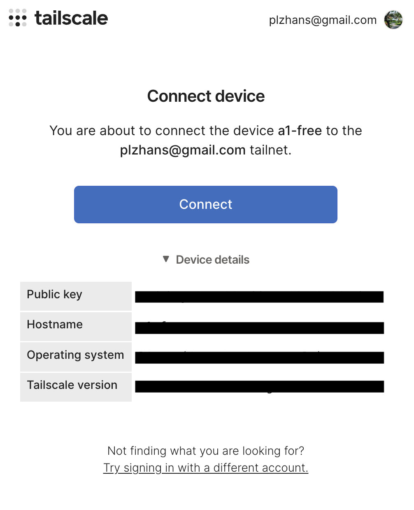
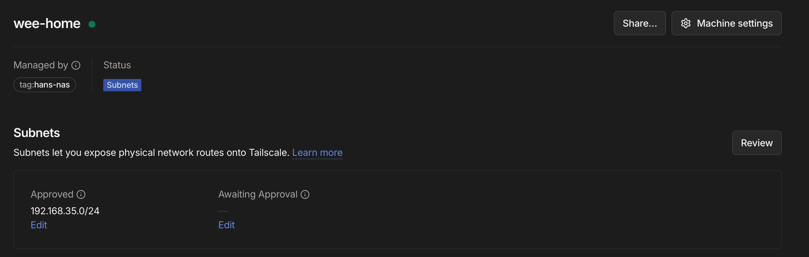

## Overview


Tailscale is a VPN service that ties multiple devices together as if they were on a single private network. Even when a Linux server, NAS, laptop, and smartphone are in different locations, they can be connected as though they were on the same internal network.


A typical server connection requires opening an inbound port from the outside into the server. This approach requires router port forwarding, firewall permissions, and a public IP, and if misconfigured it can expose the server directly to the internet.


Tailscale instead uses outbound connections that go from the device to the outside. This means it can be used in most environments without opening any additional ports. However, in a corporate network or environment with security equipment that strongly restricts outbound traffic, it may still be affected by the firewall's outbound policy.


The way it works is simple. You install the Tailscale client on each device and register it to the tailnet of the same account. A registered device receives a unique tailnet IP, and devices communicate directly with each other via P2P whenever possible. In NAT or firewall environments where a direct connection is difficult, communication is relayed through DERP, Tailscale's relay server.


Tailscale also provides device-name-based domains.


Like an nginx reverse proxy, you can connect to an internal service using an address in the form `https://{device}.{tailnet}.ts.net`.


Serve mode provides a proxy that is only accessible within the tailnet, and Funnel mode is used when you need to expose a service to the internet.


## Installation


### Using the Install Script


```bash
curl -fsSL https://tailscale.com/install.sh | sudo sh
```


### Starting the Service


Enable it with `enable` and start it immediately with `--now`


```bash
sudo systemctl enable --now tailscaled
```


## Running


### Registering the Device


Connect the current machine to the Tailscale network of the specified account


e.g.) https://login.tailscale.com/a/xxxxxxxxxxxxx


```bash
sudo tailscale up

# Result
# To authenticate, visit:
# 
#         https://login.tailscale.com/a/xxxxxxxxxxxxx
```


### Account Authentication


Log in to your Tailscale account


### Connecting the Device


Click the Connect button to access the service





### Device Registration Complete


The device has been registered, but the `--accept-routes` option is false, which means routing between peers has not been set up


```bash
# Result
# Success.
# Some peers are advertising routes but --accept-routes is false
```


Check status


```bash
ubuntu@a1-free:~$ tailscale status

# result
# xx.xx.184.107  a1-free           plzhans@        linux    -                            
# xx.xx.46.27    iphone-14-pro     plzhans@        iOS      -                                  
# xx.xx.192.32   plzhanss-macbook  plzhans@        macOS    -                           
# xx.xx.23.68    wee-home          tagged-devices  linux    -                            

# Health check:
#     - Some peers are advertising routes but --accept-routes is false
```


## VPN Communication


There are broadly 3 methods.

1. Using the internal tailnet IP
2. Communicating between VPN device nodes via routing with accept-routes
3. Communicating between VPN device nodes using serve mode
4. Allowing anyone on the internet to connect using funnel mode (however, only HTTP / HTTPS)

## VPN: Tailnet IP Method


When connected to the tailnet, a tailnet-only private IP is assigned by default


It is installed automatically during the basic installation

- Assumes a tailscale0 virtual router has been created internally, since tune mode is used


## VPN: accept-routes Method


Since it communicates internally without using Tailscale's infrastructure, there is no restriction on traffic


### Tailscale Configuration

1. Go to the console: [https://login.tailscale.com/admin](https://login.tailscale.com/admin)
2. Check the subnet




### Machine Configuration

1. Accept tailscale peer routing

From now on, routing information is retrieved from the Tailscale admin and synced


```bash
tailscale set --accept-routes=true
```

1. Check the routing

If the NAS's private IP is 192.168.35.x


```bash
ip route show table all | grep 192.168.35

# Result
# 192.168.35.0/24 dev tailscale0 table 52
```

1. Verify connection to other devices

Since tailscale uses a P2P method, it is affected by the outbound policy between devices, not the inbound policy.


Hole punching is usually attempted first, and if it fails, it falls back to relay.


```bash
nc -vz 192.168.35.3 1022

# Result
# Connection to 192.168.35.3 1022 port [tcp/*] succeeded!
```


## VPN: Serve Mode


Accessible via {device-name}.tailnet.ts.net


Since it uses Tailscale's servers, there is a traffic limit


Reference: [https://tailscale.com/docs/reference/tailscale-cli/serve](https://tailscale.com/docs/reference/tailscale-cli/serve)


```bash
# Client -> xxxxx.tailnet.ts.net:443 -> xxxxx:3000
sudo tailscale serve --https=443 / http://127.0.0.1:3000

# Client -> xxxxx.tailnet.ts.net:80 -> xxxxx:3000
sudo tailscale serve --http=80 / http://127.0.0.1:3000

# Client -> xxxxx.tailnet.ts.net:1111 -> xxxxx:2222
sudo tailscale serve --tcp=1111 tcp://127.0.0.1:2222
```


## VPN: Funnel Mode


Accessible via https://{device-name}.tailnet.ts.net


Since it uses Tailscale's servers, there is a traffic limit


Reference: [https://tailscale.com/docs/reference/tailscale-cli/funnel](https://tailscale.com/docs/reference/tailscale-cli/funnel?utm_source=chatgpt.com)


```bash
# Client -> xxxxx.tailnet.ts.net:443 -> xxxxx:3000
sudo tailscale funnel 3000

# Result
# Available on the internet:
# https://xxxxx.<tailnet>.ts.net
# |-- / proxy http://127.0.0.1:3000
```


## Notes


### When Using the Tailscale Package Built into Synology DSM


As of the writing date (2006.07.03), the built-in tailnet package does not enable the tune server


Solution: force it on


```bash
# Enable tune
sudo /var/packages/Tailscale/target/bin/tailscale configure-host

# Restart
sudo synosystemctl restart pkgctl-Tailscale.service
```


Since it may be reset after a restart or update, register it in the DSM Task Scheduler

- Control Panel → Task Scheduler → Create → Triggered Task → User-defined script
    - User: root
    - Event: Boot-up
    - User-defined script

        ```bash
        /var/packages/Tailscale/target/bin/tailscale configure-host
        synosystemctl restart pkgctl-Tailscale.service
        ```


## Related Posts

- [How to Install WireGuard and Configure Client Access](../116-wireguard-install-client-setup/)
- [Keeping the OpenVPN Client IP with wg-easy WireGuard MASQUERADE Exception Settings](../98-wg-easy-wireguard-masquerade-exclude-openvpn-client-ip/)
