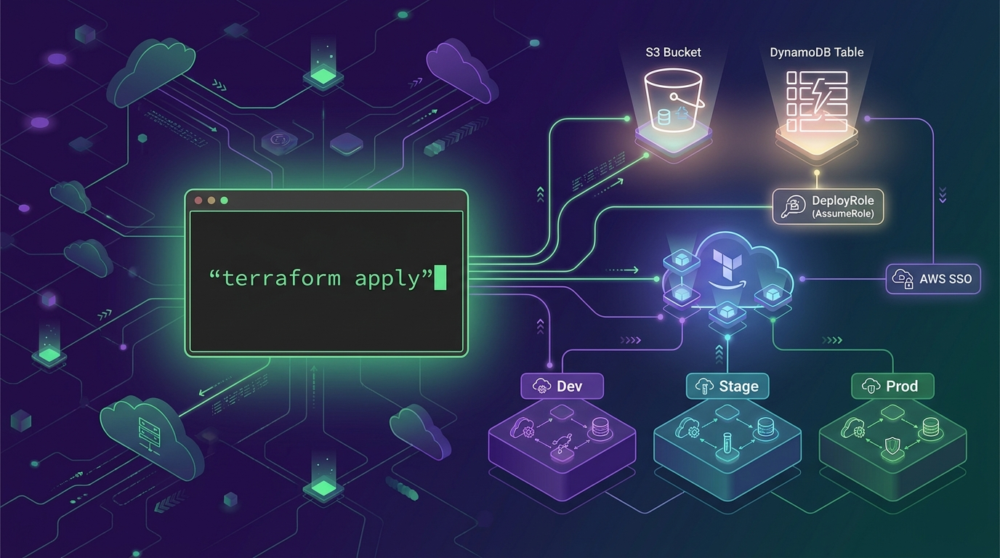

## 개요


Terraform은 HCL로 인프라를 선언하고 `plan`과 `apply`로 변경을 적용하는 IaC 도구다. 팀 단위 운영에서는 <strong>원격 상태(remote state)</strong>와 <strong>AssumeRole 기반 자격증명</strong>을 함께 구성하는 패턴이 일반적이다.


### Terraform이란?

- 서버, 네트워크, 권한 같은 인프라를 코드(HCL)로 선언하고 동일한 방식으로 재현한다
- `plan`으로 변경 사항을 미리 확인하고 `apply`로 실제 리소스를 생성/수정한다
- state 파일로 “현재 인프라 상태”를 추적해서, 코드와 실제 리소스의 차이를 관리한다

> ✅ 권장 흐름은 init → fmt → validate → plan → apply 순서다.


---


## 설치


### macOS

- Homebrew 확인: `brew --version`
- Terraform 설치
    - `brew tap hashicorp/tap`
    - `brew install hashicorp/tap/terraform`
- 설치 확인: `terraform version`
- 자동완성(선택): `terraform -install-autocomplete`

### Linux


배포판 패키지 설치 또는 바이너리 설치 중 하나를 선택한다.


- `sudo apt-get update`
- `sudo apt-get install -y gnupg software-properties-common`
- `wget -O- https://apt.releases.hashicorp.com/gpg | gpg --dearmor | sudo tee /usr/share/keyrings/hashicorp-archive-keyring.gpg >/dev/null`
- `echo "deb [signed-by=/usr/share/keyrings/hashicorp-archive-keyring.gpg] https://apt.releases.hashicorp.com $(lsb_release -cs) main" | sudo tee /etc/apt/sources.list.d/hashicorp.list`
- `sudo apt-get update && sudo apt-get install -y terraform`
- 설치 확인: `terraform version`



- [https://developer.hashicorp.com/terraform/downloads](https://developer.hashicorp.com/terraform/downloads) 에서 Linux amd64 또는 arm64 다운로드
- 압축 해제 후 PATH에 배치: `sudo install terraform /usr/local/bin/terraform`
- 설치 확인: `terraform version`



### Windows


- PowerShell 관리자 권한 실행
- `winget install Hashicorp.Terraform`



- `choco install terraform`



- [https://developer.hashicorp.com/terraform/downloads](https://developer.hashicorp.com/terraform/downloads) 에서 Windows amd64 zip 다운로드
- terraform.exe를 원하는 폴더에 배치 후 PATH에 폴더를 추가
- 설치 확인: `terraform version`



---


## 기본 사용 흐름(명령어 기준)


### 1) 프로젝트 초기화

- `terraform init`

provider 플러그인과 backend 구성을 초기화한다.


### 2) 포맷/검증

- `terraform fmt -recursive`
- `terraform validate`

### 3) 변경 사항 확인

- `terraform plan -out tfplan`

plan을 파일로 저장하면 apply 시 동일한 변경만 적용한다.


### 4) 적용

- `terraform apply tfplan`

### 5) 삭제(주의)

- `terraform destroy`

운영 환경은 파괴 범위가 크므로, 모듈/스택 단위로 분리 운영하는 편이 안전하다.


### 6) 상태 조회/디버깅

- `terraform state list`
- `terraform state show <address>`
- `terraform console` (표현식/locals 확인)

> 🧩 리소스를 이미 생성한 상태에서 Terraform으로 관리에 편입하려면 `terraform import`를 사용한다.


---


## 프로젝트 구조 권장안

- `main.tf` 리소스 정의
- `variables.tf` 입력 변수
- `outputs.tf` 출력
- `versions.tf` provider/terraform 버전 고정
- `backend.tf` 원격 상태 backend(팀 운영 시)
- `env/` 또는 `workspaces/` 환경 분리(선호하는 한 방식으로 일관성 유지)
    - 예) `env/dev`, `env/prod`

---


## 변수와 값 주입

- 변수 선언: `variable "region" { type = string }`
- 값 주입 우선순위는 상황마다 달라 혼동이 생기기 쉬우므로, 팀에서는 보통 아래 조합이 운영이 편하다.
    - `.tfvars` 파일로 환경별 값 관리
    - 민감정보는 SSM/Secrets Manager 또는 CI의 Secret로 주입(코드에 하드코딩 금지)

예시

- `terraform plan -var-file="env/prod/terraform.tfvars"`

---


## AWS 자격증명 설정(AWS Provider)


Terraform AWS provider는 AWS SDK 방식으로 자격증명을 읽는다. 운영 리스크를 줄이려면 **profile + AssumeRole** 조합을 우선 고려한다.


> 🔎 **AWS SSO와 AssumeRole은 대체 관계가 아니라 역할이 다르다.**  
> SSO는 "사람이 로그인해서 임시 자격증명을 받는 방식"이고, AssumeRole은 "어떤 자격증명을 기반으로 다른 Role 권한으로 전환하는 방식"이다.  
> 실무에서는 보통 **SSO로 로그인 → (필요 시) AssumeRole로 배포 Role 전환** 조합을 많이 쓴다.


### 방법 A. AWS CLI profile 사용

- profile 생성: `aws configure --profile tf`
- Terraform에서 사용
    - 환경변수: `export AWS_PROFILE=tf`
    - provider에 명시
        - `provider "aws" { profile = "tf" region = "ap-northeast-2" }`

### 방법 B. 환경변수 직접 설정

- `export AWS_ACCESS_KEY_ID=...`
- `export AWS_SECRET_ACCESS_KEY=...`
- `export AWS_DEFAULT_REGION=ap-northeast-2`

> ⚠️ 장기 Access Key를 개발 PC에 고정 저장하는 방식은 운영 리스크가 크다. 가능하면 SSO 또는 AssumeRole을 우선 사용한다.


### 방법 C. AWS SSO

- `aws configure sso --profile tf-sso`
- `aws sso login --profile tf-sso`
- `export AWS_PROFILE=tf-sso`

**언제 쓰나**

- 사람(개발자/운영자)이 콘솔/CLI에 로그인할 때
- 장기 Access Key 없이 임시 자격증명으로 작업하고 싶을 때

**특징**

- SSO 로그인 후 profile에 임시 자격증명이 저장/캐시된다
- 조직 계정/권한 체계를 IAM User 대신 SSO로 관리할 때 유리하다

### 방법 D. AssumeRole 권장 패턴


권한이 강한 계정 키를 만들지 않고 배포 전용 Role을 만들어 STS로 AssumeRole을 사용한다.

- `export AWS_PROFILE=source`
- `export AWS_ROLE_ARN=arn:aws:iam::<account-id>:role/terraform-deploy`
- `export AWS_REGION=ap-northeast-2`

**언제 쓰나**

- 배포 전용 Role로 권한을 "승격" 또는 "분리"해서 적용하고 싶을 때(특히 prod)
- 계정 분리(Dev/Prod, Shared Services) 환경에서 다른 계정의 Role로 전환해야 할 때

**특징**

- STS로 Role을 Assume해서 <strong>짧은 수명의 임시 자격증명</strong>을 얻는다
- 누가 어떤 Role로 배포했는지 추적이 쉬워지고 권한을 좁히기 좋다

> ✅ 실무 추천: <strong>SSO(profile)로 로그인한 뒤, Terraform 실행은 배포 Role(AssumeRole)로만 수행</strong>하면 권한 관리와 감사가 깔끔해진다.


---


## State 공유를 위한 Backend(원격 저장소)


팀 작업에서는 로컬 state 대신 원격 backend를 둬서 state를 공유하는 방식이 안전하다. backend 선택은 사용하는 인프라/플랫폼에 따라 달라진다.


### AWS 예시: S3 + DynamoDB

- S3: state 파일 저장
- DynamoDB: state lock(동시 실행 방지)

> 📝 DynamoDB는 필수는 아니다. 혼자서만 Terraform을 실행하고 동시에 `apply`가 돌 일이 없다면 S3만으로도 운영할 수 있다.  
> 다만 팀/CI처럼 여러 실행 주체가 섞이면 동시 `apply`로 state가 꼬일 수 있으므로 DynamoDB lock을 함께 두는 방식이 실무에서 가장 안전하다.


backend 예시


```hcl
terraform {
  backend "s3" {
    bucket         = "my-tf-state-bucket"
    key            = "prod/app/terraform.tfstate"
    region         = "ap-northeast-2"
    dynamodb_table = "my-tf-lock"
    encrypt        = true
  }
}
```


> 💡 팀 공유 목적이라면 state를 로컬에 두지 말고 원격 backend를 기본으로 둔다. AWS에서는 S3 + DynamoDB 조합이 실무에서 가장 흔한 선택이다.


---


## 실무에서 자주 쓰는 state 공유 방식(대안)


### 1) Terraform Cloud/Enterprise(권장: SaaS/조직 표준이 있을 때)

- backend를 Terraform Cloud로 두고 state/lock을 관리한다
- 장점: 협업, state 버전관리, 정책(OPA/Sentinel), Run 기록, 변수/시크릿 관리가 편하다
- 단점: 비용과 벤더 의존이 생길 수 있다

### 2) GitOps + 자동 실행(Atlantis 등)

- PR 기반으로 `plan`을 자동 실행하고 승인 후 `apply`를 수행한다
- state는 S3 같은 원격 backend에 두고, 실행은 CI/봇이 담당한다
- 장점: 변경 이력과 승인 흐름이 명확하다
- 주의: 개발 PC에서 임의 apply를 막고 실행 주체를 한 곳으로 통일하는 편이 안전하다

### 3) 기타 remote backend

- GCP: GCS
- Azure: Azure Blob Storage
- 온프레미스: HTTP backend, S3 호환 오브젝트 스토리지(MinIO 등)

> ✅ 정리: 팀 협업에서는 "원격 state + lock"을 먼저 고정하고, 그 다음 "apply를 어디서 실행할지(개인 PC vs CI/봇)"를 정하는 방식이 운영이 편하다.


---


## Terraform 실행에 필요한 IAM 권한(최소 권한 접근)


필요 권한은 생성하는 리소스 종류에 따라 달라진다. 아래는 AWS 기준으로 최소 권한 설계 시 자주 쓰는 기준이다.


### 공통

- AssumeRole 사용 시: `sts:AssumeRole`
- 조회 전용 권한: 각 서비스의 Describe/List/Get 계열
- 태그 사용 시
    - `tag:GetResources`
    - `tag:TagResources`
    - `tag:UntagResources`

### 원격 상태 S3 권한 예시


state 버킷 하나만 접근하도록 제한한다.

- `s3:GetObject`
- `s3:PutObject`
- `s3:DeleteObject`
- `s3:ListBucket`

대상 리소스는 아래로 제한한다.

- `arn:aws:s3:::my-tf-state-bucket`
- `arn:aws:s3:::my-tf-state-bucket/*`

### Lock DynamoDB 권한 예시

- `dynamodb:GetItem`
- `dynamodb:PutItem`
- `dynamodb:DeleteItem`
- `dynamodb:UpdateItem`
- `dynamodb:DescribeTable`

대상 테이블 ARN으로 제한한다.


### 리소스별 권한 예시


VPC와 보안그룹을 만든다면

- `ec2:CreateVpc` `ec2:DeleteVpc` `ec2:DescribeVpcs`
- `ec2:CreateSubnet` `ec2:DeleteSubnet` `ec2:DescribeSubnets`
- `ec2:CreateSecurityGroup` `ec2:AuthorizeSecurityGroupIngress` `ec2:DeleteSecurityGroup`

IAM Role과 정책을 다룬다면

- `iam:CreateRole` `iam:DeleteRole`
- `iam:AttachRolePolicy` `iam:DetachRolePolicy`
- `iam:PassRole`

> 🔒 `iam:PassRole`은 특히 위험하다. 필요한 Role ARN으로 Resource 제한을 걸어야 한다.


### 최소 권한 설계 기준

- 배포 계정은 AssumeRole 기반으로 운영한다
- state용 S3와 DynamoDB는 리소스 단위로 제한한다
- `iam:PassRole`은 대상 Role을 최대한 좁힌다
- 실행 Role과 사람 계정을 분리한다

---


## 운영 팁(자주 놓치는 포인트)

- `terraform plan -out tfplan`을 습관화한다
- provider/terraform 버전을 `versions.tf`로 고정한다
- 모듈은 버전 태그로 고정한다(레포를 직접 참조하면 변경 영향이 커진다)
- secrets는 코드에 넣지 않는다
- CI에서는 OIDC 기반 AssumeRole을 우선 검토한다
- workspace를 쓴다면 용도를 명확히 한다(환경 분리인지, 임시 실험인지)

---


## 빠른 시작


### [main.tf](http://main.tf/) 뼈대


```hcl
terraform {
  required_providers {
    aws = {
      source  = "hashicorp/aws"
      version = "~> 5.0"
    }
  }
}

provider "aws" {
  region = "ap-northeast-2"
}
```


### 실행

- `terraform init`
- `terraform plan`
- `terraform apply`
