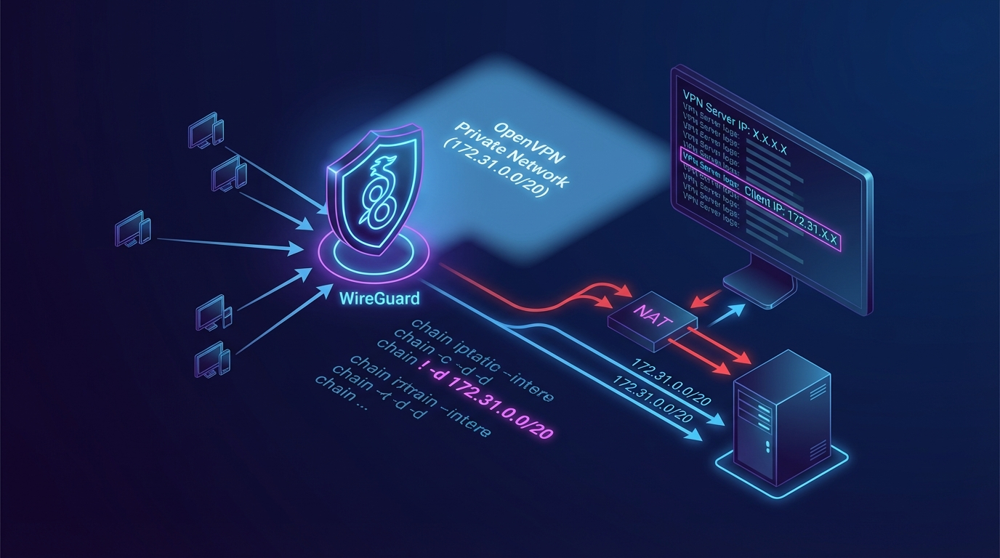

## Summary


Because of WireGuard(wg-easy)'s default NAT (MASQUERADE) setting, when a request is sent to an internal network (e.g., an OpenVPN private network), the final server sees the VPN server IP as the request IP.


By excluding a specific range from the MASQUERADE target, the OpenVPN client's private IP is passed through as the request IP as-is.


The default wg-easy hooks (PostUp / PostDown) include the following NAT rule.

- `-j MASQUERADE` is applied in the `POSTROUTING` chain.
- When this setting is active, the source IP is translated to the VPN server IP whenever VPN client traffic goes out.
- So even when accessing an internal range such as an OpenVPN private network, the VPN server IP is what remains in the final server's logs.

---


## Solution: iptables


The key is to <strong>exclude a specific destination range from the MASQUERADE application</strong>.

- Add `! -d {range to exclude}` to the `iptables` NAT rule.
- Then traffic heading to that destination is forwarded without SNAT (MASQUERADE).
- As a result, the final server <strong>recognizes the OpenVPN client's private IP as the request IP</strong>.
> Key point  
> - Before: `-A POSTROUTING -s {vpnCidr} -o {device} -j MASQUERADE`   
> - After: `-A POSTROUTING -s {vpnCidr} ! -d {excludeCidr} -o {device} -j MASQUERADE`

## Solution: When Using wg-easy


If you're using wg-easy, edit the hooks in the menu below.

- wg-easy admin panel
- **Hooks** menu
- PostUp / PostDown scripts

### Configuration Example


### Existing Configuration


PostUp


```plain text
iptables -t nat -A POSTROUTING -s ipv4Cidr -o device -j MASQUERADE; iptables -A INPUT -p udp -m udp --dport port -j ACCEPT; iptables -A FORWARD -i wg0 -j ACCEPT; iptables -A FORWARD -o wg0 -j ACCEPT; ip6tables -t nat -A POSTROUTING -s ipv6Cidr -o device -j MASQUERADE; ip6tables -A INPUT -p udp -m udp --dport port -j ACCEPT; ip6tables -A FORWARD -i wg0 -j ACCEPT; ip6tables -A FORWARD -o wg0 -j ACCEPT;
```


PostDown


```plain text
iptables -t nat -D POSTROUTING -s ipv4Cidr -o device -j MASQUERADE; iptables -D INPUT -p udp -m udp --dport port -j ACCEPT; iptables -D FORWARD -i wg0 -j ACCEPT; iptables -D FORWARD -o wg0 -j ACCEPT; ip6tables -t nat -D POSTROUTING -s ipv6Cidr -o device -j MASQUERADE; ip6tables -D INPUT -p udp -m udp --dport port -j ACCEPT; ip6tables -D FORWARD -i wg0 -j ACCEPT; ip6tables -D FORWARD -o wg0 -j ACCEPT;
```


### Updated Configuration


As an example, we set the `172.31.0.0/20` range as the <strong>MASQUERADE exclusion target</strong>.

- If the OpenVPN private network (the internal network where the final server resides) is `172.31.0.0/20`, requests going to this range will not be SNATed.

PostUp


```plain text
iptables -t nat -A POSTROUTING -s ipv4Cidr ! -d 172.31.0.0/20 -o device -j MASQUERADE; iptables -A INPUT -p udp -m udp --dport port -j ACCEPT; iptables -A FORWARD -i wg0 -j ACCEPT; iptables -A FORWARD -o wg0 -j ACCEPT; ip6tables -t nat -A POSTROUTING -s ipv6Cidr -o device -j MASQUERADE; ip6tables -A INPUT -p udp -m udp --dport port -j ACCEPT; ip6tables -A FORWARD -i wg0 -j ACCEPT; ip6tables -A FORWARD -o wg0 -j ACCEPT;
```


PostDown


```plain text
iptables -t nat -D POSTROUTING -s ipv4Cidr ! -d 172.31.0.0/20 -o device -j MASQUERADE; iptables -D INPUT -p udp -m udp --dport port -j ACCEPT; iptables -D FORWARD -i wg0 -j ACCEPT; iptables -D FORWARD -o wg0 -j ACCEPT; ip6tables -t nat -D POSTROUTING -s ipv6Cidr -o device -j MASQUERADE; ip6tables -D INPUT -p udp -m udp --dport port -j ACCEPT; ip6tables -D FORWARD -i wg0 -j ACCEPT; ip6tables -D FORWARD -o wg0 -j ACCEPT;
```


### Viewed as the Full Structure


Below is a view of the full setup so you can see where the change point fits in at a glance.

> # IPv4 NAT (excluding the specified range)  
> iptables -t nat -A POSTROUTING -s {{ipv4Cidr}} **! -d 172.31.0.0/20** -o {{device}} -j MASQUERADE;  
>   
> # Allow WireGuard port (UDP)  
> iptables -A INPUT -p udp -m udp --dport {{port}} -j ACCEPT;  
>   
> # Allow forwarding (VPN → outside)  
> iptables -A FORWARD -i wg0 -j ACCEPT;  
>   
> # Allow forwarding (outside → VPN)  
> iptables -A FORWARD -o wg0 -j ACCEPT;  
>   
> # IPv6 NAT  
> ip6tables -t nat -A POSTROUTING -s {{ipv6Cidr}} -o {{device}} -j MASQUERADE;  
>   
> # Allow IPv6 WireGuard port  
> ip6tables -A INPUT -p udp -m udp --dport {{port}} -j ACCEPT;  
>   
> # Allow IPv6 forwarding (VPN → outside)  
> ip6tables -A FORWARD -i wg0 -j ACCEPT;  
>   
> # Allow IPv6 forwarding (outside → VPN)  
> ip6tables -A FORWARD -o wg0 -j ACCEPT;

## Related Posts

- [How to Install WireGuard and Set Up Client Connections](../116-wireguard-install-client-setup/)
- [Installing Tailscale on Linux - Building a Secure Remote VPN](../111-tailscale-linux-install-secure-remote-vpn/)
