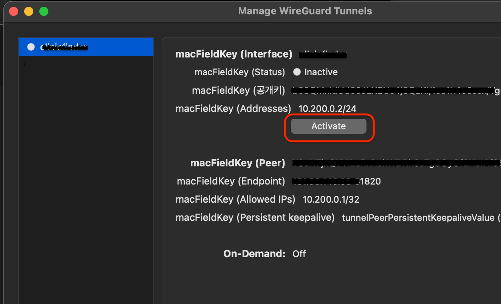
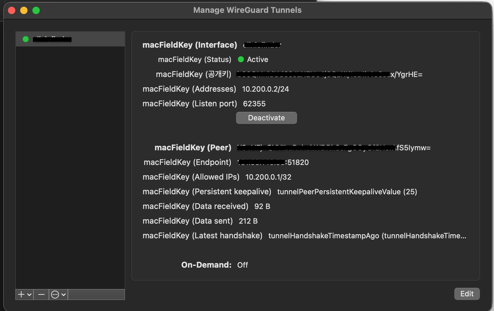

## 概要


WireGuardは、簡潔な設定と軽量なパフォーマンスでpeer-to-peer VPNを構成できるツールです。


この記事では、LinuxサーバーにWireGuardをインストールし、サーバーキー・ファイアウォール・サービスを整えたうえで、Macクライアントから接続するまでの一連の流れをまとめます。


サーバーキーの生成、wg0の設定、UDP 51820ポートの開放、クライアントPeerの登録、接続確認までを順番に扱うため、同じ手順で設定できます。


## サーバーのインストール


システムサービスとして動作するため、rootで進めてください。


### 基本インストール


```bash
apt install wireguard
```


インストール確認


```bash
wg --version
```


### サーバーキーの生成


```bash
mkdir -p /etc/wireguard
wg genkey | tee /etc/wireguard/server.key | wg pubkey | tee /etc/wireguard/server.pub

# 権限設定
chmod 600 /etc/wireguard/server.key
```


### 環境設定


設定ファイルをあらかじめ作成します。


```bash
touch /etc/wireguard/wg0.conf
chmod 600 /etc/wireguard/wg0.conf
```


設定ファイルにインターフェースを設定

- サーバーキーを登録
- SaveConfigが有効になっている場合、このファイルを編集した後にサーバーを停止すると、サーバーの状態で上書きされてしまいます
- SaveConfigモードで使用する場合は、`wg set`などで制御する必要があります

```bash
# /etc/wireguard/wg0.conf
[Interface]
Address = 10.200.0.1/24
ListenPort = 51820
PrivateKey = {server key contents}
SaveConfig = false
```


### Inbound設定(ファイアウォール設定)


Peer to Peerではありますが、最初のハンドシェイクのためにUDPサーバーポートを開放しておく必要があります。


さらにiptablesを使用している場合は、ポートも開放する必要があります。


```bash
iptables -I INPUT 1 -p udp --dport 51820 -j ACCEPT

# ubuntu 24
# netfilter-persistent save

# Result
# run-parts: executing /usr/share/netfilter-persistent/plugins.d/15-ip4tables save
# run-parts: executing /usr/share/netfilter-persistent/plugins.d/25-ip6tables save
```


## サーバーの実行


サービスの登録と起動


```bash
systemctl enable wg-quick@wg0
systemctl start wg-quick@wg0
```


wgの確認


```bash
wg

# Result
# interface: wg0
#  public key: Y9oH7jnQVVILuRnhekWDRh9s7gCOyOf2HerAfS5Iymw=
#  private key: (hidden)
```


インターフェースの確認


```bash
ip addr show wg0

# Result
# 3: wg0: <POINTOPOINT,NOARP,UP,LOWER_UP> mtu 8920 qdisc noqueue state UNKNOWN group default qlen 1000
#     link/none 
#     inet 10.200.0.1/24 scope global wg0
#       valid_lft forever preferred_lft forever
```


## クライアントのインストール


### ユーザークライアントキーの生成(ローカルクライアント作業)

- ユーザーの秘密鍵はサーバー上で生成しても構いませんが、生成後にサーバーに残しておいてはいけません
- サーバーは公開鍵のテキストさえ分かれば十分です
- 生成した秘密鍵は、クライアントに移動した後に削除してください

ローカルのMacにインストールする場合、wgがなければインストールが必要です。


```bash
brew install wireguard-tools
```


### キーの生成


```bash
# ディレクトリを作成して移動
mkdir -p ~/.wireguard
cd ~/.wireguard

# キー生成: wg genkey | tee {KeyName}.key | wg pubkey > {KeyName}.pub
wg genkey | tee user.key | wg pubkey > user.pub
```


### 重要!サーバーへのユーザーキー登録


wg0.confファイルにpeer情報を登録します。

- Peerは複数設定できます
- AllowedIPs宛てに送られたリクエストは、該当のPeerに転送されます

```bash
# /etc/wireguard/wg0.conf append

# plzhans
[Peer]
PublicKey = {public key contents}
AllowedIPs = 10.200.0.2/32
```


サーバーの再起動


```bash
systemctl restart wg-quick@wg0
```


## クライアントからサーバーへの接続


peer to peer通信の特性だと理解し、サーバーの設定を逆にすればよいです。


### WireGuardクライアントの設定


インストール確認


```bash
wg --version
wg-quick --version
```


### ユーザークライアントの接続(ローカルクライアント作業)

- Endpoint : External public ip
- PersistentKeepalive : Keep alive time

```bash
# ~/.wireguard/xx-server.conf

[Interface]
PrivateKey = {user private key contents}
Address = 10.200.0.2/24

[Peer]
PublicKey = {server key contents}
Endpoint = {server public IP}:51820
AllowedIPs = 10.200.0.1/32
PersistentKeepalive = 25
```


### クライアントの実行


```bash
sudo wg-quick up ~/.wireguard/xx-server.conf

# stop
sudo wg-quick down ~/.wireguard/xx-server.conf
```


### クライアントの状態確認

- この部分が表示されれば最終的に接続完了です: latest handshake: 5 seconds ago

```bash
wg

# Result
# interface: utun12
#   public key: b69QMnldUd60JLXEUc4j8QzKI/1su1h4e6scx/YgrHE=
#   private key: (hidden)
#   listening port: 64874

# peer: Y9oH7jnQVVILuRnhekWDRh9s7gCOyOf2HerAfS5Iymw=
#   endpoint: 161.33.140.98:51820
#   allowed ips: 10.200.0.1/32
#   latest handshake: 5 seconds ago
#   transfer: 92 B received, 180 B sent
#   persistent keepalive: every 25 seconds
```


### クライアントGUIツールを使用する場合


作成したクライアントconfファイルをimportします。


import


登録確認





接続確認





## 社内サーバーへの接続確認


### VPN IPでのSSHアクセス確認


```bash
nc -vz 10.200.0.1 22
Connection to 10.200.0.1 port 22 [tcp/ssh] succeeded!
```


## IPルーティング


次に、ローカルクライアントからVPNサーバーを経由して内部ネットワークにアクセスできるよう設定する必要があります(MASQUERADEを使用)。


以下の内容を前提とします。

- サーバーのプライベートネットワーク: 10.200.0.0/24
- サーバーのネットワークインターフェース: enp0s6

```bash
# /etc/wireguard/wg0.conf append
[Interface]
...

# IP FORWARD
PostUp = sysctl -w net.ipv4.ip_forward=1
PostUp = iptables -t nat -A POSTROUTING -s 10.200.0.0/24 -o enp0s6 -j MASQUERADE
PostUp = iptables -I FORWARD 1 -i %i -j ACCEPT
PostUp = iptables -I FORWARD 1 -o %i -j ACCEPT

PostDown = iptables -t nat -D POSTROUTING -s 10.200.0.0/24 -o enp0s6 -j MASQUERADE
PostDown = iptables -D FORWARD -i %i -j ACCEPT
PostDown = iptables -D FORWARD -o %i -j ACCEPT
```


## まとめ


サーバーのインストールからクライアント接続確認までを終えたら、VPN IPを使ってSSHなどの内部サービスにアクセスできるようになります。


Peerを追加する際は、公開鍵とAllowedIPsだけをサーバーに登録し、秘密鍵はクライアントにのみ保管しておけば問題ありません。


GUIクライアントを使えば、作成したconfファイルをimportするだけで同じように接続できます。


SaveConfigオプションとファイアウォールのUDPポートは運用中によくミスが起きやすい部分なので、設定前にもう一度確認しておくことをおすすめします。


## 関連記事

- [Tailscale Linuxインストール - 安全なリモートVPN構成](../111-tailscale-linux-install-secure-remote-vpn/)
- [wg-easy WireGuardのMASQUERADE除外設定でOpenVPNクライアントIPを維持する](../98-wg-easy-wireguard-masquerade-exclude-openvpn-client-ip/)
