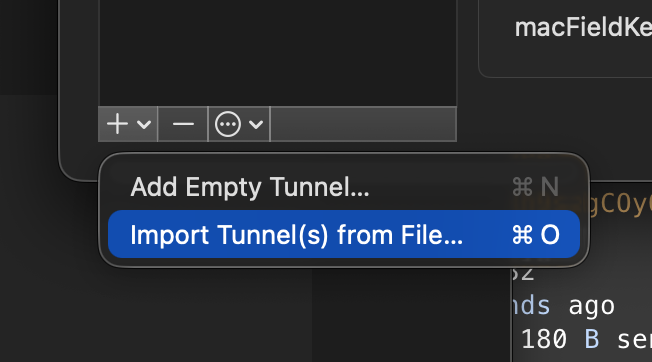
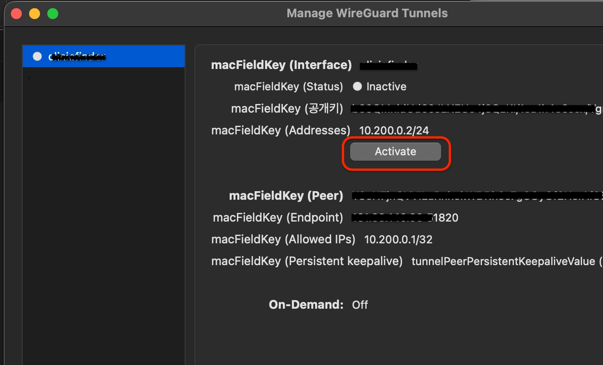
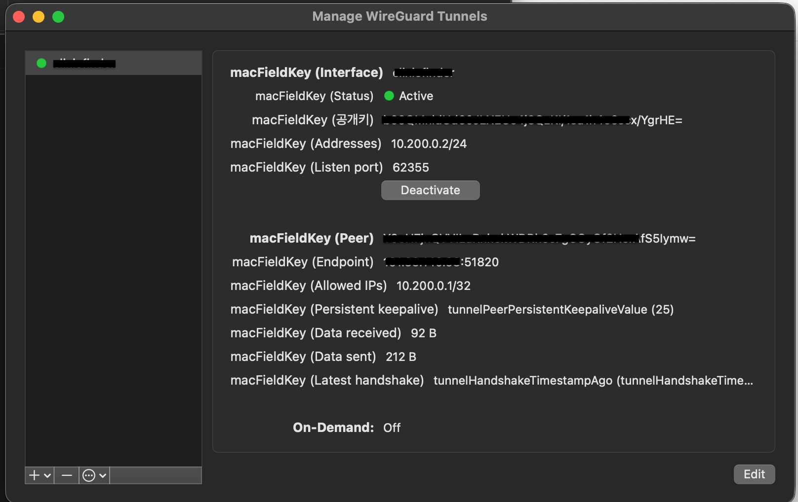

## 개요


WireGuard는 간결한 설정과 가벼운 성능으로 peer-to-peer VPN을 구성할 수 있는 도구다.


이 글에서는 Linux 서버에 WireGuard를 설치하고 서버 키·방화벽·서비스를 맞춘 뒤 Mac 클라이언트로 접속하는 전체 흐름을 정리한다.


서버 키 생성과 wg0 설정 UDP 51820 포트 개방 클라이언트 Peer 등록 연결 확인까지 순서대로 다루므로 동일한 절차를 따라 설정할 수 있다.


## 서버 설치


시스템 서비스로 동작하기 때문에 root로 진행할 것 


### 기본 설치


```bash
apt install wireguard
```


설치 확인


```bash
wg --version
```


### 서버 키 생성


```bash
mkdir -p /etc/wireguard
wg genkey | tee /etc/wireguard/server.key | wg pubkey | tee /etc/wireguard/server.pub

# 권한 설정
chmod 600 /etc/wireguard/server.key
```


### 환경 설정


설정 파일 미리 생성


```bash
touch /etc/wireguard/wg0.conf
chmod 600 /etc/wireguard/wg0.conf
```


설정 파일에 인터페이스 설정

- 서버키 등록
- SaveConfig 가 활성화 되어 있으면 해당 파일을 편집하고 서버를 중단 시키면 서버 상태가 덮어 씌워짐
- SaveConfig 모드로 사용하는 경우 sg set등으로 제어 해야함

```bash
# /etc/wireguard/wg0.conf
[Interface]
Address = 10.200.0.1/24
ListenPort = 51820
PrivateKey = {server key contents}
SaveConfig = false
```


### Inbound 설정 (방화벽 설정)


Peer to Peer 지만 최초에 핸드쉐이크를 위해서 UDP 서버 포트가 열려 있어야함


추가로  iptables 를 사용하는 경우 포트도 개발해야함


```bash
iptables -I INPUT 1 -p udp --dport 51820 -j ACCEPT

# ubuntu 24
# netfilter-persistent save

# Result
# run-parts: executing /usr/share/netfilter-persistent/plugins.d/15-ip4tables save
# run-parts: executing /usr/share/netfilter-persistent/plugins.d/25-ip6tables save
```


## 서버 실행


사비스 등록 및 시작


```bash
systemctl enable wg-quick@wg0
systemctl start wg-quick@wg0
```


wg 확인


```bash
wg

# Result
# interface: wg0
#  public key: Y9oH7jnQVVILuRnhekWDRh9s7gCOyOf2HerAfS5Iymw=
#  private key: (hidden)
```


인터페이스 확인


```bash
ip addr show wg0

# Result
# 3: wg0: <POINTOPOINT,NOARP,UP,LOWER_UP> mtu 8920 qdisc noqueue state UNKNOWN group default qlen 1000
#     link/none 
#     inet 10.200.0.1/24 scope global wg0
#       valid_lft forever preferred_lft forever
```


## 클라이언트 설치


### 사용자 클라이언트 키 생성 (로컬 클라 작업)

- 사용자 개인키는 서버에서 생성해도 되지만 생성후 서버에 남겨 두면 안됨
- 서버는 공개키 텍스트만 알면 된다
- 생성한 개인키는 클라이언트로 이동후에 삭제할것

로컬 Mac 에서 설치 하는 경우 wg 가 없으면 설치해야함


```bash
brew install wireguard-tools
```


### 키 생성


```bash
# 디렉토리 생성 후 이동
mkdir -p ~/.wireguard
cd ~/.wireguard

# 키 생성 : wg genkey | tee {KeyName}.key | wg pubkey > {KeyName}.pub
wg genkey | tee user.key | wg pubkey > user.pub
```


### 중요! 서버에 사용자 키 등록


wg0.conf  파일에 peer 정보를 등록

- Peer는 여러개 설정 가능
- AllowedIPs 로 보내는 요청을 해당 Peer 로 전달

```bash
# /etc/wireguard/wg0.conf append

# plzhans
[Peer]
PublicKey = {public key contents}
AllowedIPs = 10.200.0.2/32
```


서버 재시작


```bash
systemctl restart wg-quick@wg0
```


## 클라이언트 서버 접속


peer to peer 통신 특성이라고 이해하고 서버 설정을 반대로 하면 된다


### 와이어가드 클라이언트 설정


설치 확인


```bash
wg --version
wg-quick --version
```


### 사용자 클라이언트 접속 (로컬 클라 작업)

- Endpoint : External public ip
- PersistentKeepalive : Keep alive time

```bash
# ~/.wireguard/xx-server.conf

[Interface]
PrivateKey = {user private key contents}
Address = 10.200.0.2/24

[Peer]
PublicKey = {server key contents}
Endpoint = {server public IP}:51820
AllowedIPs = 10.200.0.1/32
PersistentKeepalive = 25
```


### 클라이언트 실행


```bash
sudo wg-quick up ~/.wireguard/xx-server.conf

# sto;
sudo wg-quick down ~/.wireguard/xx-server.conf
```


### 클라이언트 상태 확인

- 이 부분이 나오면 최종 연결 된것 : latest handshake: 5 seconds ago

```bash
wg

# Result
# interface: utun12
#   public key: b69QMnldUd60JLXEUc4j8QzKI/1su1h4e6scx/YgrHE=
#   private key: (hidden)
#   listening port: 64874

# peer: Y9oH7jnQVVILuRnhekWDRh9s7gCOyOf2HerAfS5Iymw=
#   endpoint: 161.33.140.98:51820
#   allowed ips: 10.200.0.1/32
#   latest handshake: 5 seconds ago
#   transfer: 92 B received, 180 B sent
#   persistent keepalive: every 25 seconds
```


### 클라이언트 GUI 툴을 사용하는 경우


생성했던 클라이언트 conf 파일을 import


import





등록 확인





접속 확인





## 사설 서버 접속 확인


### VPN IP SSH 접근 확인


```bash
nc -vz 10.200.0.1 22
Connection to 10.200.0.1 port 22 [tcp/ssh] succeeded!
```


## IP 라우팅


이제 로컬 클라이언트에서 VPN 서버를 경유해서 내부 네트워크에 접속하는 설정을 해야한다. (MASQUERADE 사용)


아래 내용 가정

- 서버의 사설 네트워크 : 10.200.0.0/24
- 서버의 네트워크 인터페이스 : enp0s6

```bash
# /etc/wireguard/wg0.conf append
[Interface]
...

# IP FORWARD
PostUp = sysctl -w net.ipv4.ip_forward=1
PostUp = iptables -t nat -A POSTROUTING -s 10.200.0.0/24 -o enp0s6 -j MASQUERADE
PostUp = iptables -I FORWARD 1 -i %i -j ACCEPT
PostUp = iptables -I FORWARD 1 -o %i -j ACCEPT

PostDown = iptables -t nat -D POSTROUTING -s 10.200.0.0/24 -o enp0s6 -j MASQUERADE
PostDown = iptables -D FORWARD -i %i -j ACCEPT
PostDown = iptables -D FORWARD -o %i -j ACCEPT
```


## 마무리


서버 설치부터 클라이언트 접속 확인까지 마쳤다면 VPN IP로 SSH 등 내부 서비스에 접근할 수 있다.


Peer를 추가할 때는 공개키와 AllowedIPs만 서버에 등록하고 개인키는 클라이언트에만 두면 된다.


GUI 클라이언트를 쓰면 생성한 conf 파일을 import하는 것만으로도 동일한 접속이 가능하다.


SaveConfig 옵션과 방화벽 UDP 포트는 운영 중 잦은 실수를 만들기 쉬우니 설정 전에 한 번 더 확인하는 것이 좋다.

