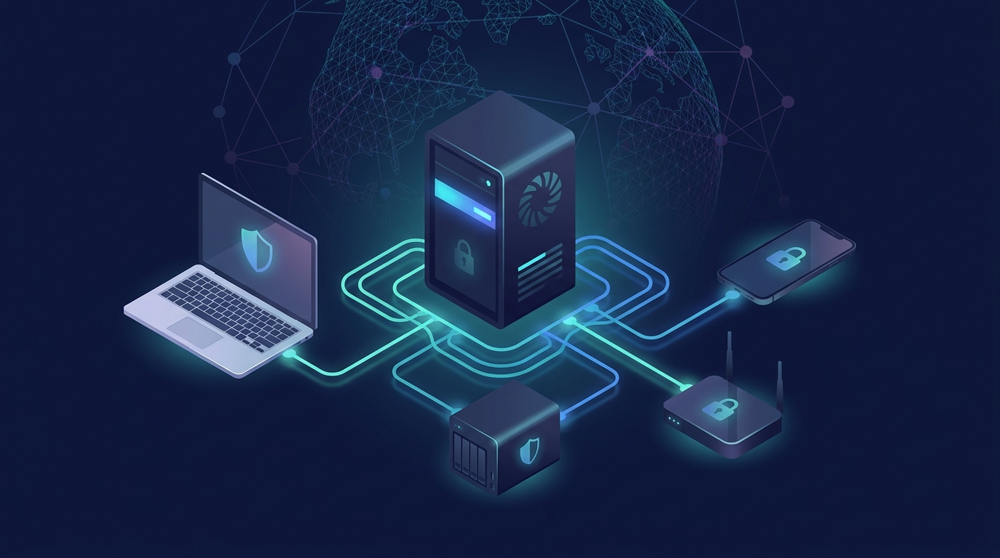
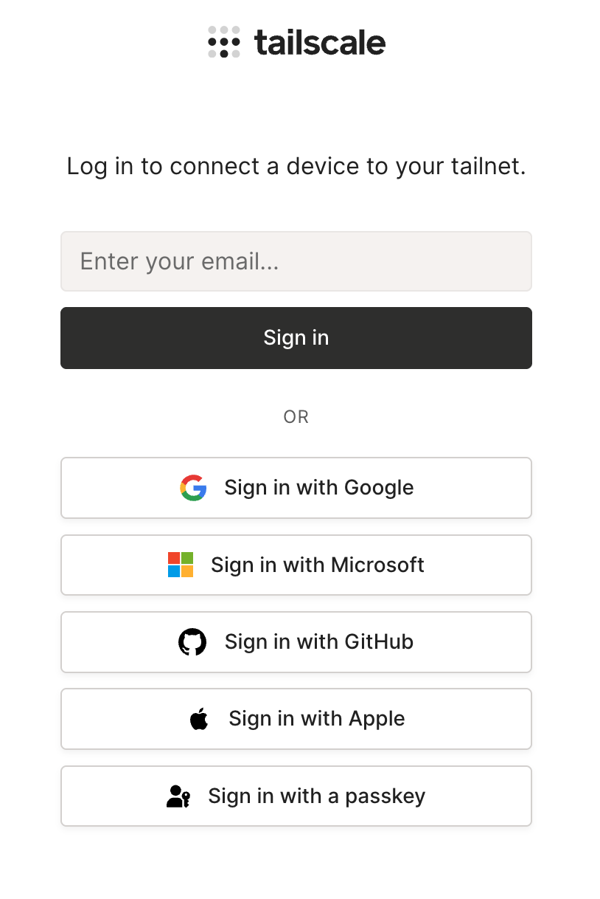
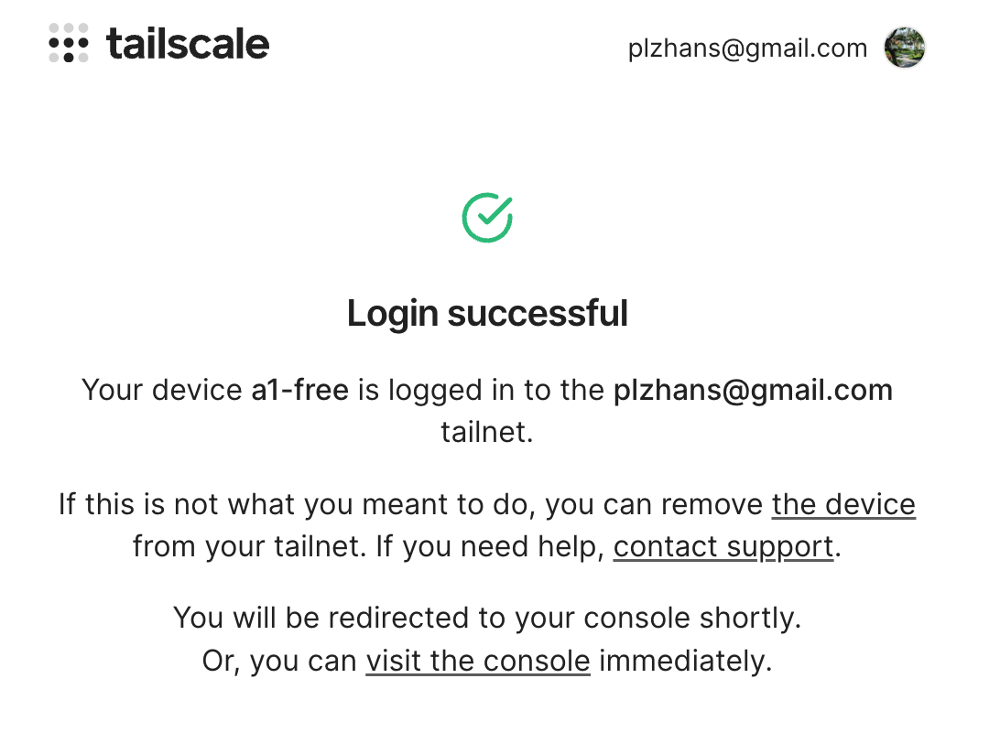
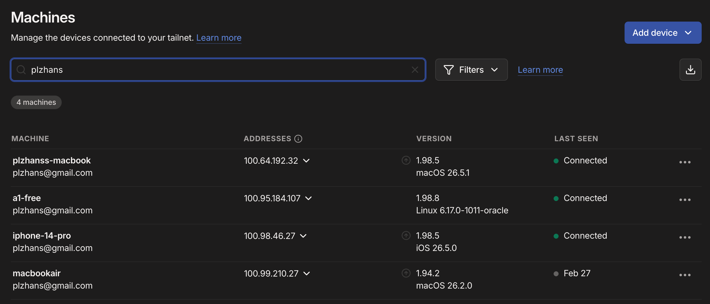

## 概要


Tailscaleは複数のデバイスを1つのプライベートネットワークのようにまとめてくれるVPNサービスです。Linuxサーバー、NAS、ノートPC、スマートフォンが別々の場所にあっても、同じ内部ネットワークにあるかのように接続できます。


一般的なサーバー接続では、外部からサーバーへ入ってくるインバウンドポートを開ける必要があります。この方式はルーターのポートフォワーディング、ファイアウォールの許可、グローバルIPの設定が必要で、設定を誤るとサーバーがインターネットに直接晒される可能性があります。


Tailscaleは逆に、デバイスが外へ出ていくアウトバウンド接続を利用します。そのため、ほとんどの環境で追加のポート開放なしに利用できます。ただし、社内ネットワークやセキュリティ機器でアウトバウンド通信を強く制限している場合は、ファイアウォールのアウトバウンドポリシーの影響を受けることがあります。


仕組みはシンプルです。各デバイスにTailscaleクライアントをインストールし、同じアカウントのtailnetに登録します。登録されたデバイスは固有のtailnet IPを受け取り、可能な場合はデバイス同士が直接P2Pで通信します。直接接続が難しいNATやファイアウォール環境では、Tailscaleの中継サーバーであるDERPを経由してリレー方式で通信します。


また、Tailscaleはデバイス名ベースのドメインを提供します。


nginxのリバースプロキシのように、`https://{device}.{tailnet}.ts.net` 形式のアドレスで内部サービスに接続できます。


Serveモードはtailnet内からのみアクセス可能なプロキシを提供し、Funnelモードは必要なサービスをインターネットに公開する際に使用します。


## インストール


### インストールスクリプトの使用


```bash
curl -fsSL https://tailscale.com/install.sh | sudo sh
```


### サービスの起動


`enable` で有効化し、`--now` ですぐに起動します


```bash
sudo systemctl enable --now tailscaled
```


## 実行


### デバイスの登録


現在のマシンを指定したアカウントのTailscaleネットワークに接続します


例）https://login.tailscale.com/a/xxxxxxxxxxxxx


```bash
sudo tailscale up

# Result
# To authenticate, visit:
# 
#         https://login.tailscale.com/a/xxxxxxxxxxxxx
```


### アカウント認証


Tailscaleアカウントにログインします





### デバイスの接続


Connectボタンをクリックしてサービスに接続します





### デバイス登録完了


デバイスは登録されましたが、`--accept-routes` オプションがfalseになっています。これはピア間のルーティング接続が行われていないことを意味します


```bash
# Result
# Success.
# Some peers are advertising routes but --accept-routes is false
```


状態の確認


```bash
ubuntu@a1-free:~$ tailscale status

# result
# xx.xx.184.107  a1-free           plzhans@        linux    -                            
# xx.xx.46.27    iphone-14-pro     plzhans@        iOS      -                                  
# xx.xx.192.32   plzhanss-macbook  plzhans@        macOS    -                           
# xx.xx.23.68    wee-home          tagged-devices  linux    -                            

# Health check:
#     - Some peers are advertising routes but --accept-routes is false
```


## VPN通信


大きく分けて3つの方法があります。

1. tailnet内部IPを使用する
2. accept-routesによるルーティングでVPNデバイスノード間を通信する
3. serveモードでVPNデバイスノード間を通信する
4. funnelモードでインターネット上の誰でも接続可能にする(ただし、HTTP / HTTPSのみ可能)

## VPN: tailnet IP方式


tailnetに接続すると、基本的にtailnet専用のプライベートIPが割り当てられます


基本インストール時に自動でインストールされます

- tuneモードを利用するため、内部にtailscale0仮想ルーターが作成されていると想定します




## VPN: accept-routes方式


Tailscaleのインフラを使わずに内部通信を行うため、トラフィックに制限がありません


### Tailscaleの設定

1. コンソールに移動: [https://login.tailscale.com/admin](https://login.tailscale.com/admin)
2. Subnetを確認する


### マシンの設定

1. tailscaleのピアルーティングを許可する

これ以降、Tailscale管理画面からルーティング情報を取得して同期します


```bash
tailscale set --accept-routes=true
```

1. ルーティングを確認する

NASのプライベートIPが192.168.35.xの場合


```bash
ip route show table all | grep 192.168.35

# Result
# 192.168.35.0/24 dev tailscale0 table 52
```

1. 他のデバイスとの接続を確認する

tailscaleはP2P方式を使用するため、デバイス間ではインバウンドポリシーではなくアウトバウンドポリシーの影響を受けます。


通常はホールパンチングを試み、失敗するとリレーに切り替わります。


```bash
nc -vz 192.168.35.3 1022

# Result
# Connection to 192.168.35.3 1022 port [tcp/*] succeeded!
```


## VPN: serveモード


{デバイス名}.tailnet.ts.net でアクセス可能です


Tailscaleのサーバーを使用するため、トラフィック制限があります


参考: [https://tailscale.com/docs/reference/tailscale-cli/serve](https://tailscale.com/docs/reference/tailscale-cli/serve)


```bash
# Client -> xxxxx.tailnet.ts.net:443 -> xxxxx:3000
sudo tailscale serve --https=443 / http://127.0.0.1:3000

# Client -> xxxxx.tailnet.ts.net:80 -> xxxxx:3000
sudo tailscale serve --http=80 / http://127.0.0.1:3000

# Client -> xxxxx.tailnet.ts.net:1111 -> xxxxx:2222
sudo tailscale serve --tcp=1111 tcp://127.0.0.1:2222
```


## VPN: funnelモード


https://{デバイス名}.tailnet.ts.net でアクセス可能です


Tailscaleのサーバーを使用するため、トラフィック制限があります


参考: [https://tailscale.com/docs/reference/tailscale-cli/funnel](https://tailscale.com/docs/reference/tailscale-cli/funnel)


```bash
# Client -> xxxxx.tailnet.ts.net:443 -> xxxxx:3000
sudo tailscale funnel 3000

# Result
# Available on the internet:
# https://xxxxx.<tailnet>.ts.net
# |-- / proxy http://127.0.0.1:3000
```


## 参考事項


### synology DSMに内蔵されたパッケージのtailscaleを使用する場合


執筆時点(2006.07.03)では、tailnet内蔵パッケージでtuneサーバーが有効化されません


解決策: 強制的に有効化します


```bash
# tuneを有効化
sudo /var/packages/Tailscale/target/bin/tailscale configure-host

# 再起動
sudo synosystemctl restart pkgctl-Tailscale.service
```


再起動やアップデートで設定が消える可能性があるため、DSMのタスクスケジューラに登録します

- コントロールパネル → タスクスケジューラ → 作成 → トリガーされたタスク → ユーザー定義スクリプト
    - ユーザー: root
    - イベント: 起動時
    - ユーザー定義スクリプト

        ```bash
        /var/packages/Tailscale/target/bin/tailscale configure-host
        synosystemctl restart pkgctl-Tailscale.service
        ```


## 関連記事

- [WireGuardのインストールとクライアント接続の設定方法](../116-wireguard-install-client-setup/)
- [wg-easy WireGuardのMASQUERADE例外設定でOpenVPNクライアントIPを維持する方法](../98-wg-easy-wireguard-masquerade-exclude-openvpn-client-ip/)
