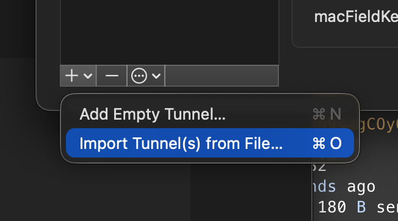

## Overview


WireGuard is a tool that lets you configure a peer-to-peer VPN with simple setup and lightweight performance.


This article covers the entire flow of installing WireGuard on a Linux server, configuring the server key, firewall, and service, and then connecting from a Mac client.


It goes through server key generation, wg0 configuration, opening UDP port 51820, client Peer registration, and connection verification in order, so you can follow the same steps to set it up.


## Server Installation


Since it runs as a system service, proceed as root.


### Basic Installation


```bash
apt install wireguard
```


Verify installation


```bash
wg --version
```


### Generate Server Key


```bash
mkdir -p /etc/wireguard
wg genkey | tee /etc/wireguard/server.key | wg pubkey | tee /etc/wireguard/server.pub

# Set permissions
chmod 600 /etc/wireguard/server.key
```


### Configuration


Create the configuration file in advance


```bash
touch /etc/wireguard/wg0.conf
chmod 600 /etc/wireguard/wg0.conf
```


Set up the interface in the configuration file

- Register the server key
- If SaveConfig is enabled, editing this file and then stopping the server will cause the server state to overwrite it
- If you use SaveConfig mode, you should control it via `wg set` etc.

```bash
# /etc/wireguard/wg0.conf
[Interface]
Address = 10.200.0.1/24
ListenPort = 51820
PrivateKey = {server key contents}
SaveConfig = false
```


### Inbound Configuration (Firewall Setup)


Even though it's peer-to-peer, the UDP server port must be open for the initial handshake.


Additionally, if you use iptables, you also need to open the port.


```bash
iptables -I INPUT 1 -p udp --dport 51820 -j ACCEPT

# ubuntu 24
# netfilter-persistent save

# Result
# run-parts: executing /usr/share/netfilter-persistent/plugins.d/15-ip4tables save
# run-parts: executing /usr/share/netfilter-persistent/plugins.d/25-ip6tables save
```


## Start the Server


Register and start the service


```bash
systemctl enable wg-quick@wg0
systemctl start wg-quick@wg0
```


Check wg


```bash
wg

# Result
# interface: wg0
#  public key: Y9oH7jnQVVILuRnhekWDRh9s7gCOyOf2HerAfS5Iymw=
#  private key: (hidden)
```


Check the interface


```bash
ip addr show wg0

# Result
# 3: wg0: <POINTOPOINT,NOARP,UP,LOWER_UP> mtu 8920 qdisc noqueue state UNKNOWN group default qlen 1000
#     link/none 
#     inet 10.200.0.1/24 scope global wg0
#       valid_lft forever preferred_lft forever
```


## Client Installation


### Generate the User Client Key (local client work)

- The user's private key can be generated on the server, but it must not be left on the server afterward
- The server only needs to know the public key text
- Delete the generated private key after moving it to the client

If installing locally on a Mac, you'll need to install wg if it isn't already present.


```bash
brew install wireguard-tools
```


### Generate Key


```bash
# Create the directory and move into it
mkdir -p ~/.wireguard
cd ~/.wireguard

# Generate key: wg genkey | tee {KeyName}.key | wg pubkey > {KeyName}.pub
wg genkey | tee user.key | wg pubkey > user.pub
```


### Important! Register the User Key on the Server


Register the peer information in the wg0.conf file

- Multiple Peers can be configured
- Requests sent to AllowedIPs are forwarded to that Peer

```bash
# /etc/wireguard/wg0.conf append

# plzhans
[Peer]
PublicKey = {public key contents}
AllowedIPs = 10.200.0.2/32
```


Restart the server


```bash
systemctl restart wg-quick@wg0
```


## Client-Server Connection


Understand this as a characteristic of peer-to-peer communication, and simply reverse the server configuration.


### Configuring the WireGuard Client


Verify installation


```bash
wg --version
wg-quick --version
```


### User Client Connection (local client work)

- Endpoint: External public ip
- PersistentKeepalive: Keep alive time

```bash
# ~/.wireguard/xx-server.conf

[Interface]
PrivateKey = {user private key contents}
Address = 10.200.0.2/24

[Peer]
PublicKey = {server key contents}
Endpoint = {server public IP}:51820
AllowedIPs = 10.200.0.1/32
PersistentKeepalive = 25
```


### Run the Client


```bash
sudo wg-quick up ~/.wireguard/xx-server.conf

# stop
sudo wg-quick down ~/.wireguard/xx-server.conf
```


### Check Client Status

- If this line appears, the connection is finally established: latest handshake: 5 seconds ago

```bash
wg

# Result
# interface: utun12
#   public key: b69QMnldUd60JLXEUc4j8QzKI/1su1h4e6scx/YgrHE=
#   private key: (hidden)
#   listening port: 64874

# peer: Y9oH7jnQVVILuRnhekWDRh9s7gCOyOf2HerAfS5Iymw=
#   endpoint: 161.33.140.98:51820
#   allowed ips: 10.200.0.1/32
#   latest handshake: 5 seconds ago
#   transfer: 92 B received, 180 B sent
#   persistent keepalive: every 25 seconds
```


### When Using a Client GUI Tool


Import the client conf file you created.


import





Verify the registration


Verify the connection


## Verify Access to the Private Server


### Verify SSH Access via VPN IP


```bash
nc -vz 10.200.0.1 22
Connection to 10.200.0.1 port 22 [tcp/ssh] succeeded!
```


## IP Routing


Now you need to set up access to the internal network from the local client via the VPN server (using MASQUERADE).


Assume the following:

- Server's private network: 10.200.0.0/24
- Server's network interface: enp0s6

```bash
# /etc/wireguard/wg0.conf append
[Interface]
...

# IP FORWARD
PostUp = sysctl -w net.ipv4.ip_forward=1
PostUp = iptables -t nat -A POSTROUTING -s 10.200.0.0/24 -o enp0s6 -j MASQUERADE
PostUp = iptables -I FORWARD 1 -i %i -j ACCEPT
PostUp = iptables -I FORWARD 1 -o %i -j ACCEPT

PostDown = iptables -t nat -D POSTROUTING -s 10.200.0.0/24 -o enp0s6 -j MASQUERADE
PostDown = iptables -D FORWARD -i %i -j ACCEPT
PostDown = iptables -D FORWARD -o %i -j ACCEPT
```


## Conclusion


Once you've finished everything from server installation to client connection verification, you can access internal services such as SSH via the VPN IP.


When adding a Peer, you only need to register the public key and AllowedIPs on the server, and keep the private key only on the client.


If you use a GUI client, you can achieve the same connection simply by importing the conf file you created.


The SaveConfig option and the firewall's UDP port are common sources of mistakes during operation, so it's a good idea to double-check them before configuring.

## References

- [WireGuard official site](https://www.wireguard.com/)
- [WireGuard Quick Start (official docs)](https://www.wireguard.com/quickstart/)

## Related Posts

- [Installing Tailscale on Linux - Building a Secure Remote VPN](../111-tailscale-linux-install-secure-remote-vpn/)
- [Keeping the OpenVPN Client IP with wg-easy WireGuard MASQUERADE Exclusion Settings](../98-wg-easy-wireguard-masquerade-exclude-openvpn-client-ip/)
