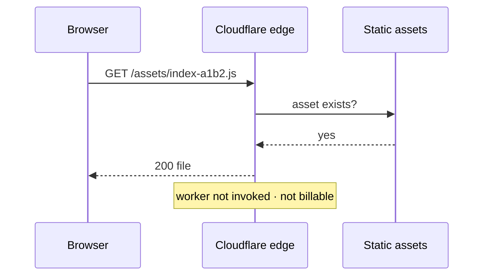
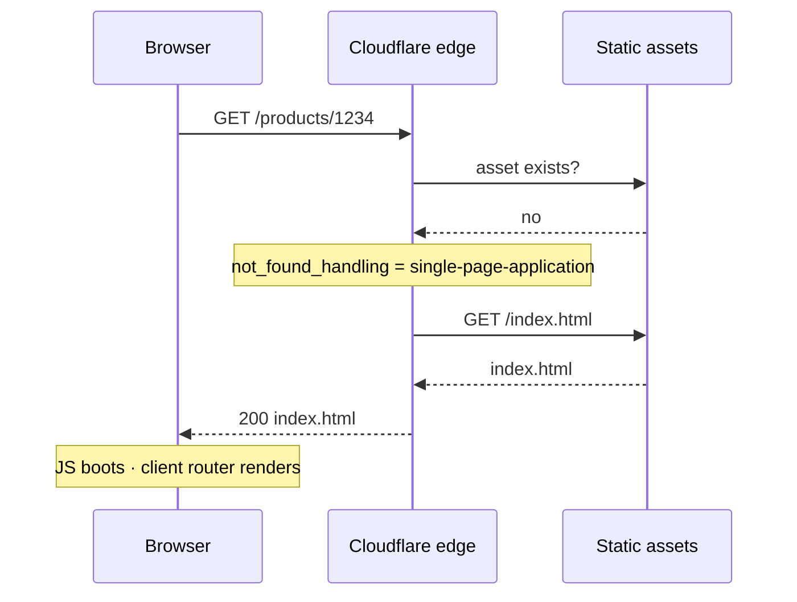
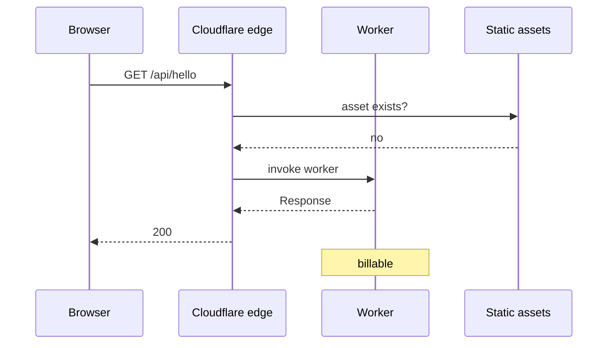
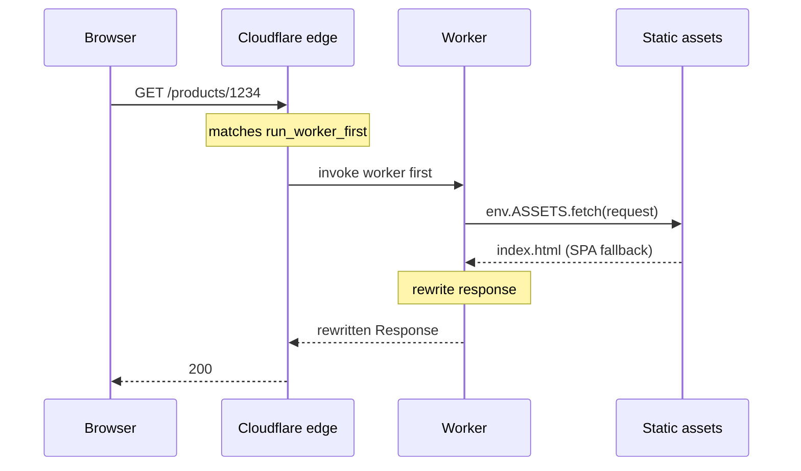
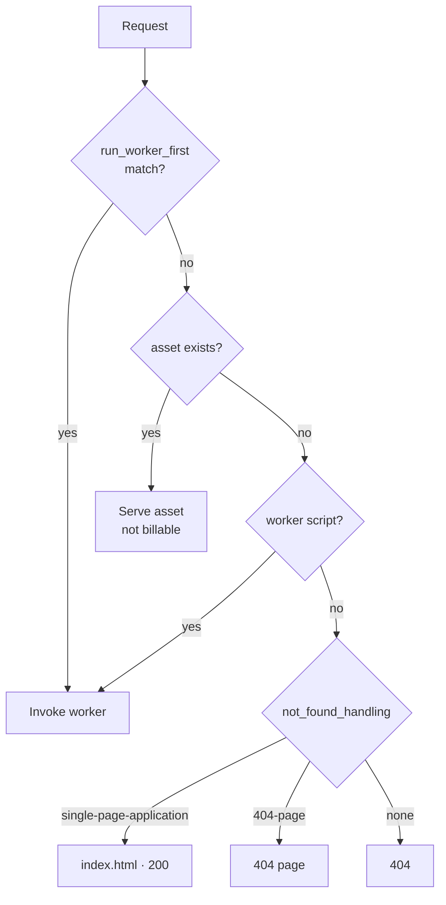

## Overview

> This post is part of the [Cloudflare Workers Static Site Guide - From Deployment to SEO](../124-cloudflare-workers-static-site-guide/) series.

One way to put a static site on Cloudflare is **Workers Static Assets<strong>. Upload your build output (`dist/`) and it is served from edges worldwide, and if you need it you can layer </strong>a bit of code in front of it.**


It's a way to solve the "I want to tweak the response a little" requirement that comes up while you're using it as static hosting — without standing up a new server.


### What this post covers

- The structure of Workers Static Assets — assets and Worker code deploy as a single unit
- **The order in which a request flows** — when the Worker runs and when it doesn't (sequence diagrams)
- Where the billing happens, and the free plan's limits

### Follow-up posts


This post covers <strong>structure and deployment</strong>. The rest lives elsewhere.

- [How to Use wrangler - Local Development and Deployment for Cloudflare Workers](../126-cloudflare-workers-wrangler-dev-deploy/) — install · type setup · `wrangler dev` · deployment
- [How to Set Up Caching in Cloudflare Workers - Edge Cache and Tiered Cache](../127-cloudflare-workers-cache-tiered-cache/) — edge cache · Tiered Cache
- [How to Improve React SPA SEO - From Meta Tags to SSR with Cloudflare Workers](../128-react-spa-seo-cloudflare-workers-ssr/) — meta injection · server rendering

Other bindings such as KV, R2, and D1, plus Durable Objects and Cron Triggers, are out of scope.


### Prerequisites


Beyond having a Cloudflare account and being able to build a static site (`npm run build` → `dist/`), no prior knowledge is required.


---


## What is Workers Static Assets


In one sentence, it's <strong>deploying "a pile of static files + (optionally) Worker code" as a single unit</strong>.


```plain text
my-worker
├─ static assets   dist/**        HTML · JS · CSS · images
└─ worker code     src/worker.ts  optional
```


If you don't include Worker code, it's just static hosting. If you do, you can slot code in before or after the request reaches the assets.

> **How is this different from Pages**  
> Cloudflare Pages is also static hosting. But Cloudflare has been steering new static hosting toward Workers, so depending on your account the dashboard may not even show a path to create a Pages project. If you're starting fresh, Workers Static Assets is the safer bet.

### Configuration file


Everything is defined in a single `wrangler.jsonc`. The full set of available keys is in the [Configuration documentation](https://developers.cloudflare.com/workers/wrangler/configuration/).


```json
{
  "name": "my-site",
  "compatibility_date": "2026-09-08",

  // Optional. Omit for pure static hosting.
  "main": "./src/worker.ts",

  "assets": {
    // Name of env.ASSETS inside the worker
    "binding": "ASSETS",
    // Overridable with --assets
    "directory": "./dist",
    "not_found_handling": "single-page-application"
  }
}
```


**What is `compatibility_date`**


It's the [reference date for runtime behavior](https://developers.cloudflare.com/workers/configuration/compatibility-dates/). Your Worker is pinned to the behavior as of that date — even if Cloudflare changes the runtime, this Worker keeps running the same way.


Put differently, <strong>bumping the date is how you declare "I'm accepting the new behavior."</strong> It should not flip to today's date automatically on every deploy. If redeploying the same code alone changes behavior, a rollback stops being a rollback.


When you do bump it, a human does it deliberately: change the date → verify locally → deploy.


---


## How a request flows


This is the heart of this post. You need to know <strong>when the Worker runs and when it doesn't</strong> to make sense of both the billing and the behavior.


### The basics — no Worker code





Simple. If the file exists, it's served.


### For an SPA — map missing paths to index.html


In an SPA, a path like `/products/1234` has no actual file behind it, because the browser renders it with JS. Left alone, that's a 404.


`not_found_handling: "single-page-application"` solves this.





The important part is that `index.html` is served **with a 200, not a 404**. If you serve it as a 404, search engines won't index it.


### Once you add Worker code


The basic rule is **"if the asset exists, the Worker doesn't run."** The Worker executes only when there's no asset.





But this basic rule has a <strong>trap</strong>. Even if you want the Worker to run on an SPA path like `/products/1234`, asset routing handles it as `index.html` first, so the Worker never runs. And `/` never goes through the Worker in the first place, because `index.html` actually exists.


### `run_worker_first` — run the Worker first


You can specify that the Worker should run **before the assets** on certain paths.


```json
{
  "assets": {
    "binding": "ASSETS",
    "not_found_handling": "single-page-application",
    "run_worker_first": ["/", "/products/*"]
  }
}
```





In this setup the Worker **doesn't serve the assets in their place — it receives them, modifies them, and sends them out.** [`env.ASSETS.fetch(request)`](https://developers.cloudflare.com/workers/static-assets/binding/) is that channel.


### The full decision order


Organizing the order described in the [SPA routing documentation](https://developers.cloudflare.com/workers/static-assets/routing/single-page-application/) gives this.





---


## Where does billing happen


The wording in [Billing and limitations](https://developers.cloudflare.com/workers/static-assets/billing-and-limitations/) is clear.

> Requests are only billable **if a Worker script is invoked**.

In other words, **static asset requests themselves are not billed.** No matter how much JS, CSS, and imagery gets downloaded, it doesn't count toward your request total.


What's billed is <strong>only requests where the Worker ran</strong>. The free plan gives you 100,000 requests a day, and only Worker invocations count against it.


So casting `run_worker_first` too wide translates directly into cost.


```json
// Bad: even /assets/*.js goes through the worker, and becomes billable.
"run_worker_first": true

// Good: HTML routes only.
"run_worker_first": ["/", "/products/*"]
```


It's worth knowing the free plan's other limits too ([Limits](https://developers.cloudflare.com/workers/platform/limits/) · [Pricing](https://developers.cloudflare.com/workers/platform/pricing/)).


|              | Free              | Paid (from $5/mo)   |
| ------------ | ----------------- | ------------------- |
| Requests     | 100K/day          | 10M/month included  |
| CPU time     | **10ms/request**  | 30s by default      |
| Subrequests  | 50/request        | 10,000/request      |
| Memory       | 128MB             | 128MB               |


**CPU 10ms** is the one you hit most often. But as the name says, it's <strong>the time the CPU actually spent</strong>, not the time the response took.

> **CPU time measures how long the CPU spends executing your Worker code.** Waiting on network requests (such as `fetch()` calls, KV reads, or database queries) **does not count toward CPU time.**  
>   
> — [Cloudflare Workers · Limits · CPU time](https://developers.cloudflare.com/workers/platform/limits/#cpu-time)

That means time spent waiting on the origin with `await fetch(...)` doesn't count against the limit. HTTP requests also have no separate duration limit, so an origin taking 300ms isn't a problem in itself.


A Worker that just fixes a header or slots in a tag barely uses any CPU. It only gets tight when computation is involved, as with server rendering. If you're curious about the actual numbers, don't guess — check [Monitoring CPU usage](https://developers.cloudflare.com/workers/platform/limits/#monitoring-cpu-usage): the invocation log in Workers Logs prints CPU time and wall time side by side.


---


## Summary

- **Workers Static Assets** deploys a pile of static files and Worker code as a single unit.
- The basic rule is **"if the asset exists, the Worker doesn't run."** To run the Worker on an asset path, specify it in `run_worker_first`.
- **Static asset requests are not billed.** Only requests where the Worker ran are counted. So keeping `run_worker_first` narrow is, directly, cost control.
- **CPU 10ms** is CPU time spent, not response time. Waiting on APIs doesn't count.

### Next posts

- [How to Use wrangler - Local Development and Deployment for Cloudflare Workers](../126-cloudflare-workers-wrangler-dev-deploy/) — how to run it locally and ship it
- [How to Set Up Caching in Cloudflare Workers - Edge Cache and Tiered Cache](../127-cloudflare-workers-cache-tiered-cache/) — once you start calling external APIs
- [How to Improve React SPA SEO - From Meta Tags to SSR with Cloudflare Workers](../128-react-spa-seo-cloudflare-workers-ssr/) — from meta injection to server rendering

### References


**Static Assets**

- [Static Assets overview](https://developers.cloudflare.com/workers/static-assets/)
- [SPA routing](https://developers.cloudflare.com/workers/static-assets/routing/single-page-application/) — request decision order
- [Assets binding](https://developers.cloudflare.com/workers/static-assets/binding/) — `env.ASSETS`
- [Billing and limitations](https://developers.cloudflare.com/workers/static-assets/billing-and-limitations/) — what gets billed

**Configuration**

- [Wrangler configuration](https://developers.cloudflare.com/workers/wrangler/configuration/) — the full set of `wrangler.jsonc` keys
- [Compatibility dates](https://developers.cloudflare.com/workers/configuration/compatibility-dates/)

**Limits**

- [Limits](https://developers.cloudflare.com/workers/platform/limits/) · [Pricing](https://developers.cloudflare.com/workers/platform/pricing/)
