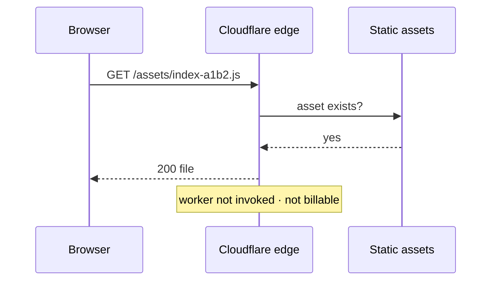
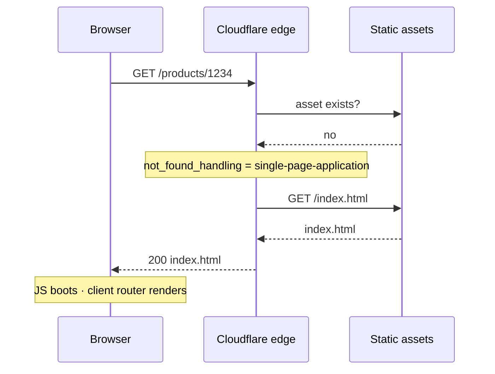
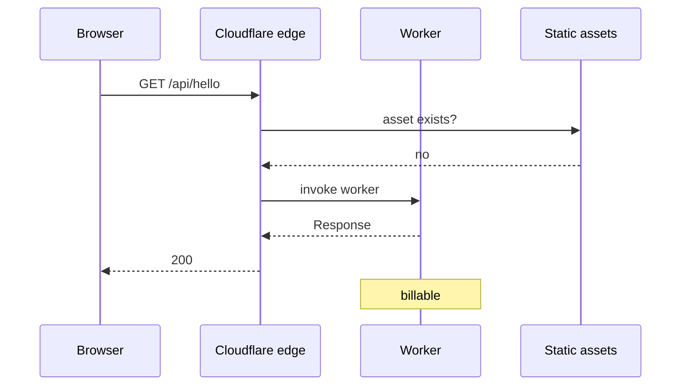
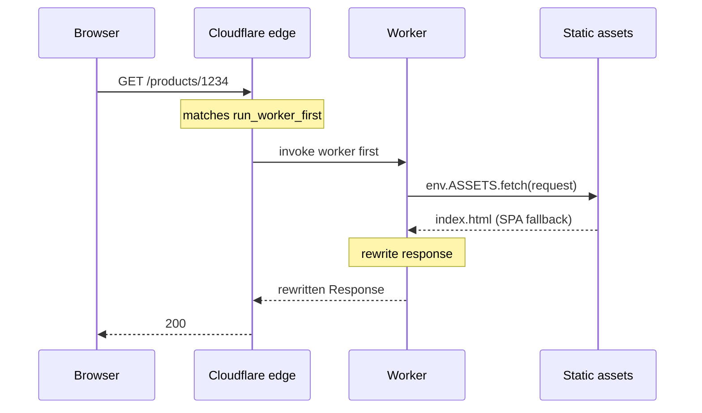
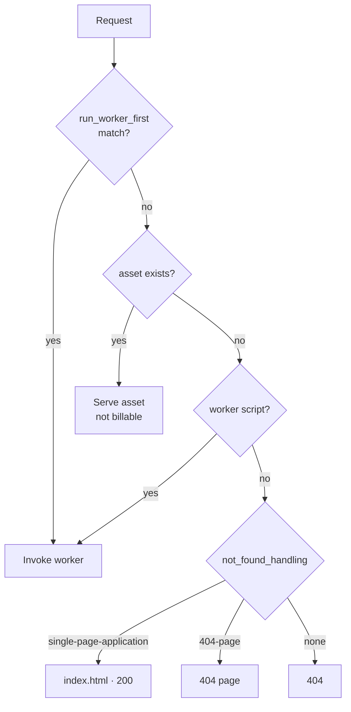

## 概要

> この記事は [Cloudflare Workers 静的サイトガイド - デプロイからSEOまで](../124-cloudflare-workers-static-site-guide/) シリーズの一部です。

静的サイトをCloudflareに載せる方法として **Workers Static Assets<strong> があります。ビルド成果物（`dist/`）をアップロードすると全世界のエッジでサービングされ、必要なら その前に</strong>コードを一枚重ねることができます。**


静的ホスティングとして使っているうちに「レスポンスを少し直したい」という要求が生まれたとき、サーバーを新しく立てずに解決できる道です。


### この記事で扱うこと

- Workers Static Assetsの構造 — アセットとWorkerコードが一単位でデプロイされる
- **リクエストがどの順序で流れるのか** — いつWorkerが動き、いつ動かないのか（シーケンス図）
- 課金がどこで発生するのかと無料プランの制限

### 続きの記事


この記事は<strong>構造とデプロイ</strong>を扱います。残りは別にあります。

- [wrangler 使い方 - Cloudflare Workers のローカル開発とデプロイ](../126-cloudflare-workers-wrangler-dev-deploy/) — インストール · 型設定 · `wrangler dev` · デプロイ
- [Cloudflare Workers キャッシュ設定方法 - エッジキャッシュとTiered Cache](../127-cloudflare-workers-cache-tiered-cache/) — エッジキャッシュ · Tiered Cache
- [React SPA SEO 改善方法 - Cloudflare WorkersでメタタグからSSRまで](../128-react-spa-seo-cloudflare-workers-ssr/) — メタタグの注入 · サーバーレンダリング

KV・R2・D1のような他のバインディング、Durable Objects、Cron Triggersは範囲外です。


### 前提


Cloudflareのアカウントがあり、静的サイトをビルドできること（`npm run build` → `dist/`）以外に必要な事前知識はありません。


---


## Workers Static Assets とは


一文で言うと<strong>「静的ファイルの束 +（任意の）Workerコード」を一単位でデプロイすること</strong>です。


```plain text
my-worker
├─ static assets   dist/**        HTML · JS · CSS · images
└─ worker code     src/worker.ts  optional
```


Workerコードを入れなければ、ただの静的ホスティングです。入れれば、リクエストがアセットに届く前または後にコードを挟み込めます。

> **Pages と何が違うのか**  
> Cloudflare Pagesも静的ホスティングです。ただしCloudflareが新規の静的ホスティングをWorkers側に寄せているため、アカウントによってはダッシュボードにPages作成の導線がまったく表示されないこともあります。新しく始めるならWorkers Static Assetsの方が無難です。

### 設定ファイル


`wrangler.jsonc` 一つで定義します。使えるキーは [Configuration ドキュメント](https://developers.cloudflare.com/workers/wrangler/configuration/) にすべてあります。


```json
{
  "name": "my-site",
  "compatibility_date": "2026-09-08",

  // Optional. Omit for pure static hosting.
  "main": "./src/worker.ts",

  "assets": {
    // Name of env.ASSETS inside the worker
    "binding": "ASSETS",
    // Overridable with --assets
    "directory": "./dist",
    "not_found_handling": "single-page-application"
  }
}
```


**`compatibility_date` とは何か**


**ランタイム動作の基準日**（[ドキュメント](https://developers.cloudflare.com/workers/configuration/compatibility-dates/)）です。この日付の動作に固定されます — CloudflareがランタイムをアップデートしてもこのWorkerはそのまま動きます。


言い換えると、<strong>日付を上げることが「新しい動作を受け入れる」という意思表示</strong>です。デプロイのたびに今日の日付へ自動的に変わってはいけません。同じコードを再デプロイするだけで動作が変わってしまうと、ロールバックがロールバックでなくなります。


上げるときは、日付を直す → ローカルで確認する → デプロイする、という順序で人が意図して上げます。


---


## リクエストはどう流れるのか


ここがこの記事の核心です。<strong>いつWorkerが動き、いつ動かないのか</strong>を知ってはじめて、課金も動作も理解できます。


### 基本 — Workerコードがないとき





単純です。ファイルがあれば返します。


### SPAなら — 存在しないパスをindex.htmlへ


SPAは `/products/1234` のようなパスに実際のファイルがありません。ブラウザがJSで描画するからです。そのままにしておくと404です。


`not_found_handling: "single-page-application"` がこれを解決します。





**404ではなく200で** `index.html` を返すという点が重要です。404で返すと検索エンジンがインデックスしません。


### Workerコードを重ねると


基本ルールは**「アセットがあればWorkerは動かない」**です。Workerはアセットがないときだけ実行されます。





ところがこの基本ルールには<strong>罠</strong>があります。`/products/1234` のようなSPAパスでWorkerを動かしたくても、アセットルーティングが先に `index.html` として処理してしまうためWorkerが動きません。そして `/` は `index.html` が実際に存在するので、そもそもWorkerを通りません。


### `run_worker_first` — Workerを先に通す


特定のパスで**アセットより先に**Workerを実行するよう指定できます。


```json
{
  "assets": {
    "binding": "ASSETS",
    "not_found_handling": "single-page-application",
    "run_worker_first": ["/", "/products/*"]
  }
}
```





この構造でWorkerは**アセットを代わりにサービングするのではなく、受け取って直して送り出します。** [`env.ASSETS.fetch(request)`](https://developers.cloudflare.com/workers/static-assets/binding/) がその通路です。


### 全体の判断順序


[SPAルーティングのドキュメント](https://developers.cloudflare.com/workers/static-assets/routing/single-page-application/) に書かれた順序を整理するとこうなります。





---


## 課金はどこで発生するのか


[Billing and limitations](https://developers.cloudflare.com/workers/static-assets/billing-and-limitations/) の表現が明確です。

> Requests are only billable **if a Worker script is invoked**.

つまり**静的アセットのリクエスト自体は課金されません。** JS・CSS・画像をいくらダウンロードされてもリクエスト数にカウントされません。


課金されるのは<strong>Workerが実行されたリクエスト</strong>だけです。無料プランは1日10万リクエストで、ここにカウントされるのもWorkerが動いたものだけです。


そのため `run_worker_first` を広く取ると、そのままコストになります。


```json
// Bad: even /assets/*.js goes through the worker, and becomes billable.
"run_worker_first": true

// Good: HTML routes only.
"run_worker_first": ["/", "/products/*"]
```


無料プランの他の制限も知っておくとよいです（[Limits](https://developers.cloudflare.com/workers/platform/limits/) · [Pricing](https://developers.cloudflare.com/workers/platform/pricing/)）。


|            | 無料              | 有料（$5/月〜）      |
| ---------- | --------------- | -------------- |
| リクエスト      | 10万/日           | 1千万/月を含む       |
| CPU時間      | **10ms/リクエスト**  | デフォルト30秒       |
| サブリクエスト    | 50/リクエスト        | 10,000/リクエスト   |
| メモリ        | 128MB           | 128MB          |


**CPU 10ms** が最もよく引っかかります。ただし名前の通り<strong>CPUを実際に使った時間</strong>であって、レスポンスにかかった時間ではありません。

> **CPU time measures how long the CPU spends executing your Worker code.** Waiting on network requests (such as `fetch()` calls, KV reads, or database queries) **does not count toward CPU time.**  
>   
> — [Cloudflare Workers · Limits · CPU time](https://developers.cloudflare.com/workers/platform/limits/#cpu-time)

`await fetch(...)` でオリジンを待つ時間は上限にカウントされない、という意味です。HTTPリクエストにはduration制限も別途ないので、オリジンが300msかかってもそれ自体は問題になりません。


ヘッダーを直したりタグを挟み込んだりする程度のWorkerなら、CPUはほとんど使いません。サーバーレンダリングのように計算が入るときだけ際どくなります。実際の値が気になるなら推測せず [Monitoring CPU usage](https://developers.cloudflare.com/workers/platform/limits/#monitoring-cpu-usage) を見ましょう — Workers Logsのinvocation logにCPU timeとwall timeが並んで記録されます。


---


## まとめ

- **Workers Static Assets** は静的ファイルの束とWorkerコードを一単位でデプロイするものです。
- 基本ルールは**「アセットがあればWorkerは動かない」**。アセットのパスでWorkerを通したいなら `run_worker_first` で指定します。
- **静的アセットのリクエストは課金されません。** Workerが実行されたリクエストだけがカウントされます。そのため `run_worker_first` を狭く取ることがそのままコストになります。
- **CPU 10ms** はレスポンス時間ではなくCPUを使った時間です。APIの待ち時間はカウントされません。

### 次の記事

- [wrangler 使い方 - Cloudflare Workers のローカル開発とデプロイ](../126-cloudflare-workers-wrangler-dev-deploy/) — ローカルで立ち上げてデプロイする方法
- [Cloudflare Workers キャッシュ設定方法 - エッジキャッシュとTiered Cache](../127-cloudflare-workers-cache-tiered-cache/) — 外部APIを呼び始めたなら
- [React SPA SEO 改善方法 - Cloudflare WorkersでメタタグからSSRまで](../128-react-spa-seo-cloudflare-workers-ssr/) — メタタグの注入からサーバーレンダリングまで

### 参考


**Static Assets**

- [Static Assets 概要](https://developers.cloudflare.com/workers/static-assets/)
- [SPAルーティング](https://developers.cloudflare.com/workers/static-assets/routing/single-page-application/) — リクエストの判断順序
- [Assetsバインディング](https://developers.cloudflare.com/workers/static-assets/binding/) — `env.ASSETS`
- [Billing and limitations](https://developers.cloudflare.com/workers/static-assets/billing-and-limitations/) — 何が課金されるのか

**設定**

- [Wrangler configuration](https://developers.cloudflare.com/workers/wrangler/configuration/) — `wrangler.jsonc` のキー全体
- [Compatibility dates](https://developers.cloudflare.com/workers/configuration/compatibility-dates/)

**制限**

- [Limits](https://developers.cloudflare.com/workers/platform/limits/) · [Pricing](https://developers.cloudflare.com/workers/platform/pricing/)
