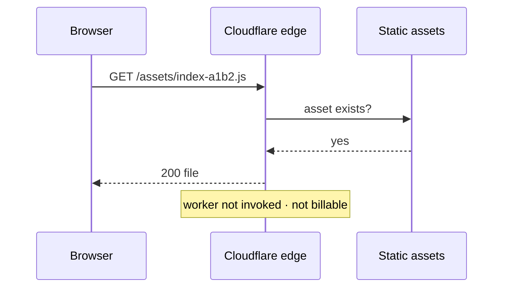
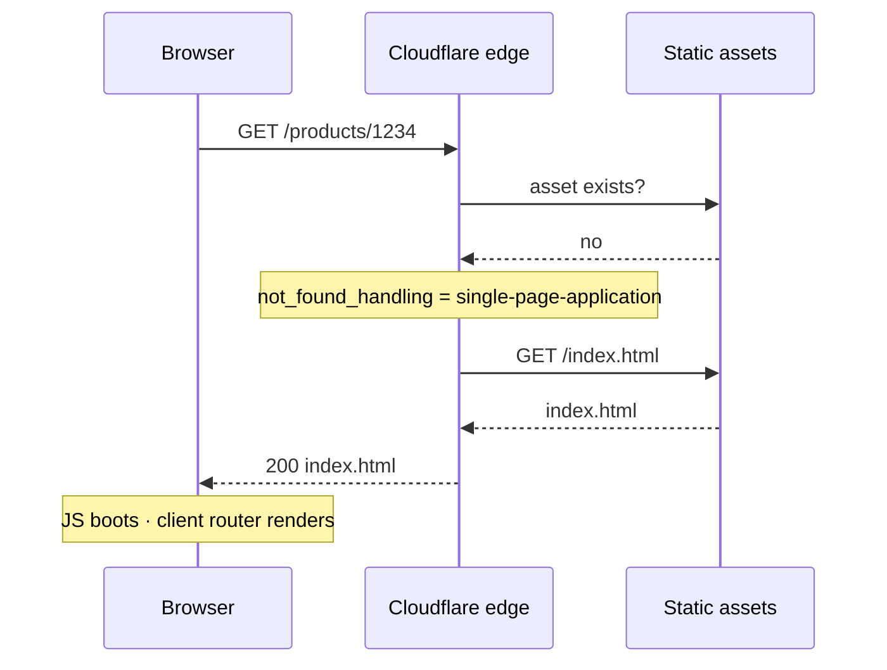
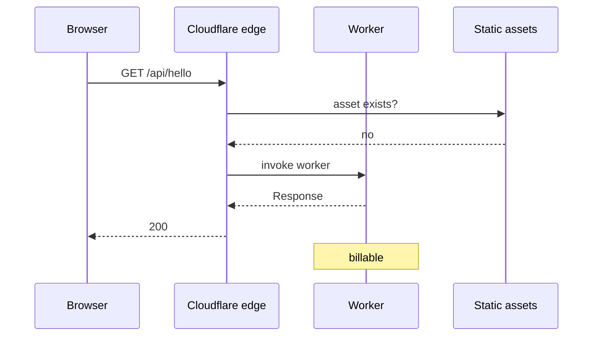
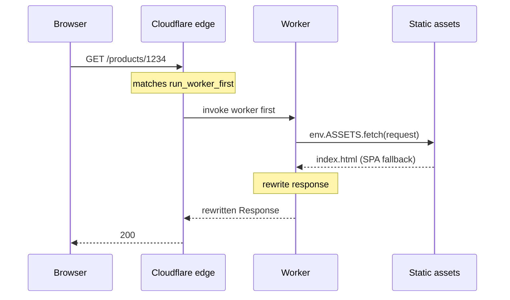
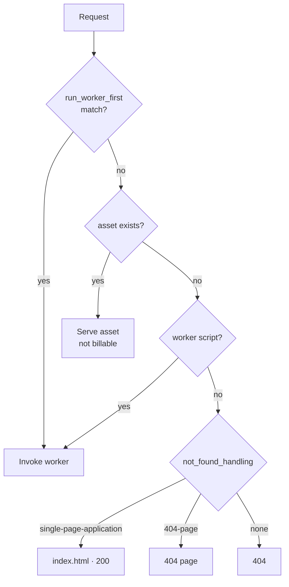

## 개요

> 이 글은 [Cloudflare Workers 정적 사이트 가이드 - 배포부터 SEO까지](../124-cloudflare-workers-static-site-guide/) 시리즈의 일부다.

정적 사이트를 Cloudflare 에 올리는 방법으로 **Workers Static Assets<strong> 가 있다. 빌드 산출물(`dist/`)을 올리면 전 세계 엣지에서 서빙되고 필요하면 그 앞에 </strong>코드를 한 겹 얹을 수 있다.**


정적 호스팅으로 쓰다가 "응답을 조금 고치고 싶다"는 요구가 생겼을 때 서버를 새로 세우지 않고 해결할 수 있는 길이다.


### 이 글에서 다루는 것

- Workers Static Assets 의 구조 — 자산과 워커 코드가 한 단위로 배포된다
- **요청이 어떤 순서로 흐르는지** — 언제 워커가 돌고 언제 안 도는지 (시퀀스 다이어그램)
- 과금이 어디서 발생하는지와 무료 플랜의 제한

### 이어지는 글


이 글은 <strong>구조와 배포</strong>를 다룬다. 나머지는 따로 있다.

- [wrangler 사용법 - Cloudflare Workers 로컬 개발과 배포](../126-cloudflare-workers-wrangler-dev-deploy/) — 설치 · 타입 설정 · `wrangler dev` · 배포
- [Cloudflare Workers 캐시 설정 방법 - 엣지 캐시와 Tiered Cache](../127-cloudflare-workers-cache-tiered-cache/) — 엣지 캐시 · Tiered Cache
- [React SPA SEO 개선 방법 - Cloudflare Workers로 메타 태그부터 SSR까지](../128-react-spa-seo-cloudflare-workers-ssr/) — 메타 주입 · 서버 렌더링

KV·R2·D1 같은 다른 바인딩, Durable Objects, Cron Triggers 는 범위 밖이다.


### 전제


Cloudflare 계정이 있고 정적 사이트를 빌드할 수 있다는 것(`npm run build` → `dist/`) 외에 필요한 사전 지식은 없다.


---


## Workers Static Assets 란


한 문장으로 <strong>"정적 파일 더미 + (선택) 워커 코드"를 한 단위로 배포하는 것</strong>이다.


```plain text
my-worker
├─ 정적 자산   dist/**        HTML · JS · CSS · 이미지
└─ 워커 코드   src/worker.ts  없어도 된다
```


워커 코드를 안 넣으면 그냥 정적 호스팅이다. 넣으면 요청이 자산에 닿기 전이나 후에 코드를 끼워 넣을 수 있다.

> **Pages 와 무엇이 다른가**  
> Cloudflare Pages 도 정적 호스팅이다. 다만 Cloudflare 가 신규 정적 호스팅을 Workers 쪽으로 몰고 있어서 계정에 따라 대시보드에 Pages 생성 경로가 아예 안 뜨기도 한다. 새로 시작한다면 Workers Static Assets 쪽이 무난하다.

### 설정 파일


`wrangler.jsonc` 하나로 정의한다. 쓸 수 있는 키는 [Configuration 문서](https://developers.cloudflare.com/workers/wrangler/configuration/)에 전부 있다.


```json
{
  "name": "my-site",
  "compatibility_date": "2026-09-08",

  // Optional. Omit for pure static hosting.
  "main": "./src/worker.ts",

  "assets": {
    // Name of env.ASSETS inside the worker
    "binding": "ASSETS",
    // Overridable with --assets
    "directory": "./dist",
    "not_found_handling": "single-page-application"
  }
}
```


**`compatibility_date` 가 뭔가**


**런타임 동작의 기준일**([문서](https://developers.cloudflare.com/workers/configuration/compatibility-dates/))이다. 이 날짜의 동작으로 고정된다 — Cloudflare 가 런타임을 고쳐도 이 워커는 그대로 돈다.


바꿔 말하면 <strong>날짜를 올리는 것이 "새 동작을 받아들이겠다"는 의사표시</strong>다. 배포할 때마다 오늘 날짜로 자동으로 바뀌면 안 된다. 같은 코드를 다시 배포하는 것만으로 동작이 달라지면 롤백이 롤백이 아니게 된다.


올릴 때는 날짜를 고치고 → 로컬에서 확인하고 → 배포하는 순서로 사람이 의도해서 올린다.


---


## 요청이 어떻게 흐르는가


여기가 이 글의 핵심이다. <strong>언제 워커가 돌고 언제 안 도는지</strong>를 알아야 과금도 동작도 이해된다.


### 기본 — 워커 코드가 없을 때





단순하다. 파일이 있으면 준다.


### SPA 라면 — 없는 경로를 index.html 로


SPA 는 `/products/1234` 같은 경로에 실제 파일이 없다. 브라우저가 JS 로 그리기 때문이다. 그대로 두면 404 다.


`not_found_handling: "single-page-application"` 이 이걸 해결한다.





**404 가 아니라 200 으로** `index.html` 을 준다는 점이 중요하다. 404 로 주면 검색엔진이 색인하지 않는다.


### 워커 코드를 얹으면


기본 규칙은 **"자산이 있으면 워커는 안 돈다"** 이다. 워커는 자산이 없을 때만 실행된다.





그런데 이 기본 규칙에는 <strong>함정</strong>이 있다. `/products/1234` 처럼 SPA 경로에서 워커를 돌리고 싶어도 자산 라우팅이 먼저 `index.html` 로 처리해 버려 워커가 안 돈다. 그리고 `/` 는 `index.html` 이 실제로 존재하므로 애초에 워커를 안 탄다.


### `run_worker_first` — 워커를 먼저 태운다


특정 경로에서 **자산보다 먼저** 워커를 실행하도록 지정할 수 있다.


```json
{
  "assets": {
    "binding": "ASSETS",
    "not_found_handling": "single-page-application",
    "run_worker_first": ["/", "/products/*"]
  }
}
```





이 구조에서 워커는 **자산을 대신 서빙하는 게 아니라 받아서 고쳐 내보낸다.** [`env.ASSETS.fetch(request)`](https://developers.cloudflare.com/workers/static-assets/binding/) 가 그 통로다.


### 전체 판단 순서


[SPA 라우팅 문서](https://developers.cloudflare.com/workers/static-assets/routing/single-page-application/)에 적힌 순서를 정리하면 이렇다.





---


## 과금은 어디서 발생하나


[Billing and limitations](https://developers.cloudflare.com/workers/static-assets/billing-and-limitations/) 의 표현이 명확하다.

> Requests are only billable **if a Worker script is invoked**.

즉 **정적 자산 요청 자체는 과금되지 않는다.** JS·CSS·이미지를 아무리 받아 가도 요청 수에 안 잡힌다.


과금되는 건 <strong>워커가 실행된 요청</strong>뿐이다. 무료 플랜은 하루 10만 요청이고 여기 잡히는 것도 워커가 돈 것만이다.


그래서 `run_worker_first` 를 넓게 잡으면 그대로 비용이 된다.


```json
// Bad: even /assets/*.js goes through the worker, and becomes billable.
"run_worker_first": true

// Good: HTML routes only.
"run_worker_first": ["/", "/products/*"]
```


무료 플랜의 다른 제한도 알아 두면 좋다([Limits](https://developers.cloudflare.com/workers/platform/limits/) · [Pricing](https://developers.cloudflare.com/workers/platform/pricing/)).


|        | 무료          | 유료($5/월~) |
| ------ | ----------- | --------- |
| 요청     | 10만/일       | 1천만/월 포함  |
| CPU 시간 | **10ms/요청** | 기본 30초    |
| 서브요청   | 50/요청       | 10,000/요청 |
| 메모리    | 128MB       | 128MB     |


**CPU 10ms** 가 가장 자주 걸린다. 다만 이름 그대로 <strong>CPU 를 실제로 쓴 시간</strong>이지 응답에 걸린 시간이 아니다.

> **CPU time measures how long the CPU spends executing your Worker code.** Waiting on network requests (such as `fetch()` calls, KV reads, or database queries) **does not count toward CPU time.**  
>   
> — [Cloudflare Workers · Limits · CPU time](https://developers.cloudflare.com/workers/platform/limits/#cpu-time)

`await fetch(...)` 로 오리진을 기다리는 시간은 한도에 안 잡힌다는 뜻이다. HTTP 요청에는 duration 제한도 따로 없어서 오리진이 300ms 걸려도 그 자체로는 문제가 되지 않는다.


헤더를 고치거나 태그를 끼워 넣는 정도의 워커라면 CPU 는 거의 안 쓴다. 서버 렌더링처럼 계산이 들어갈 때만 아슬아슬해진다. 실제 값이 궁금하면 추측하지 말고 [Monitoring CPU usage](https://developers.cloudflare.com/workers/platform/limits/#monitoring-cpu-usage) 를 보자 — Workers Logs 의 invocation log 에 CPU time 과 wall time 이 나란히 찍힌다.


---


## 정리

- **Workers Static Assets** 는 정적 파일 더미와 워커 코드를 한 단위로 배포하는 것이다.
- 기본 규칙은 **"자산이 있으면 워커는 안 돈다"**. 자산 경로에서 워커를 태우려면 `run_worker_first` 로 지정한다.
- **정적 자산 요청은 과금되지 않는다.** 워커가 실행된 요청만 잡힌다. 그래서 `run_worker_first` 를 좁게 잡는 것이 그대로 비용이다.
- **CPU 10ms** 는 응답 시간이 아니라 CPU 를 쓴 시간이다. API 대기는 안 잡힌다.

### 다음 글

- [wrangler 사용법 - Cloudflare Workers 로컬 개발과 배포](../126-cloudflare-workers-wrangler-dev-deploy/) — 로컬에서 띄우고 올리는 법
- [Cloudflare Workers 캐시 설정 방법 - 엣지 캐시와 Tiered Cache](../127-cloudflare-workers-cache-tiered-cache/) — 외부 API 를 부르기 시작했다면
- [React SPA SEO 개선 방법 - Cloudflare Workers로 메타 태그부터 SSR까지](../128-react-spa-seo-cloudflare-workers-ssr/) — 메타 주입부터 서버 렌더링까지

### 참고


**Static Assets**

- [Static Assets 개요](https://developers.cloudflare.com/workers/static-assets/)
- [SPA 라우팅](https://developers.cloudflare.com/workers/static-assets/routing/single-page-application/) — 요청 판단 순서
- [Assets 바인딩](https://developers.cloudflare.com/workers/static-assets/binding/) — `env.ASSETS`
- [Billing and limitations](https://developers.cloudflare.com/workers/static-assets/billing-and-limitations/) — 무엇이 과금되는가

**설정**

- [Wrangler configuration](https://developers.cloudflare.com/workers/wrangler/configuration/) — `wrangler.jsonc` 키 전체
- [Compatibility dates](https://developers.cloudflare.com/workers/configuration/compatibility-dates/)

**제한**

- [Limits](https://developers.cloudflare.com/workers/platform/limits/) · [Pricing](https://developers.cloudflare.com/workers/platform/pricing/)
