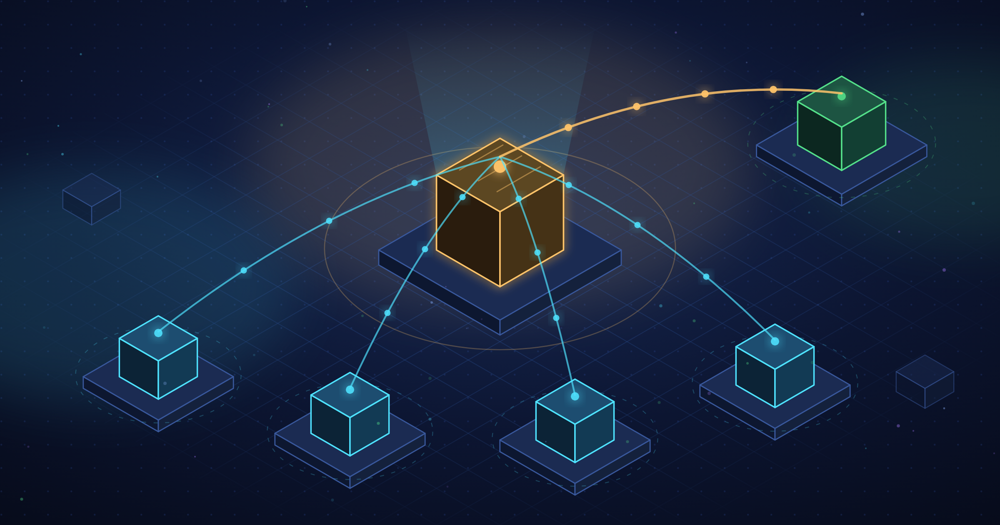

## Overview

> This post is part of the [Cloudflare Workers Static Site Guide - From Deployment to SEO](../124-cloudflare-workers-static-site-guide/) series.

Once a Worker starts calling an external API, you soon need a cache. Without one, **origin load grows in proportion to page views.**


Setting it up takes a single line, but after that come a few traps you will definitely hit if you don't know about them. In particular, the fact that <strong>the edge cache is not shared worldwide</strong> is obvious once you know it, but without that knowledge you will waste a lot of time wondering "why isn't the cache hitting?"


### What this post covers

- The two ways to cache — the `cf` option on `fetch()` and the Cache API
- The fact that the edge cache is <strong>separate per data center</strong>, and how to deal with it
- How to reduce origin requests with Tiered Cache, and why `cache.put()` doesn't work with it
- The cache key problem when the same URL returns different responses depending on headers

### What it doesn't cover


The structure and deployment of Workers Static Assets is in [Cloudflare Workers Static Site Hosting - Request Flow and Billing](../125-cloudflare-workers-static-assets-routing-billing/), and local development is in [How to Use wrangler - Local Development and Deployment for Cloudflare Workers](../126-cloudflare-workers-wrangler-dev-deploy/).


Storage such as KV, R2, and D1 is out of scope. This post covers <strong>HTTP response caching</strong> only.


---


## Two ways to cache


**① The `cf` option on `fetch()`** — hands the response over to the Cloudflare edge cache ([Request documentation](https://developers.cloudflare.com/workers/runtime-apis/request/)).


```typescript
await fetch(url, {
  cf: { cacheTtl: 3600, cacheEverything: true },
});
```


**②** [**Cache API**](https://developers.cloudflare.com/workers/runtime-apis/cache/) — you put and get entries yourself.


```typescript
const cache = caches.default;
const hit = await cache.match(key);
if (hit) return hit;
// ...
ctx.waitUntil(cache.put(key, response.clone()));
```


## Three things you need to know


**The edge cache is separate per data center.** Straight from the docs.

> The contents of the cache **do not replicate outside of the originating data center.**  
>   
> — [Cache API](https://developers.cloudflare.com/workers/runtime-apis/cache/)

Tokyo doesn't know what Seoul cached. When you serve traffic coming in from all over the world, the same URL hits the origin as many times as you have data centers.


[**Tiered Cache<strong>](https://developers.cloudflare.com/cache/how-to/tiered-cache/) </strong>reduces that.<strong> When a lower data center misses, it asks an </strong>upper data center** first instead of the origin. It's free on every plan. One caveat: **entries stored with `cache.put()` are not eligible for Tiered Cache** — which is why approach ① is the better default.


**The cache key is the URL.** If the same URL returns different responses depending on request headers (`Accept-Language` and the like), leaving it as is means whoever fills the cache first serves everyone. You can change the key with `cf.cacheKey`, but that is <strong>Enterprise only</strong>, so on lower plans you have to put the distinguishing value in the URL query.


---


## Summary

- If your Worker calls an external API, **caching is not optional.** Without it, the origin takes as many hits as you have page views.
- There are two ways to do it. **Prefer `cf.cacheTtl` as your default** — entries stored with `cache.put()` can't ride Tiered Cache.
- The edge cache is <strong>separate per data center</strong>. If you serve worldwide traffic, turn on [Tiered Cache](https://developers.cloudflare.com/cache/how-to/tiered-cache/). It's free on every plan.
- If the same URL returns different responses depending on headers, **you have to put the distinguishing value in the URL.** `cf.cacheKey` is Enterprise only.

### References

- [Cache API](https://developers.cloudflare.com/workers/runtime-apis/cache/)
- [Request `cf` options](https://developers.cloudflare.com/workers/runtime-apis/request/) — `cacheTtl` · `cacheEverything` · `cacheKey`
- [Tiered Cache](https://developers.cloudflare.com/cache/how-to/tiered-cache/)
- [Cloudflare Workers Static Site Hosting - Request Flow and Billing](../125-cloudflare-workers-static-assets-routing-billing/)
