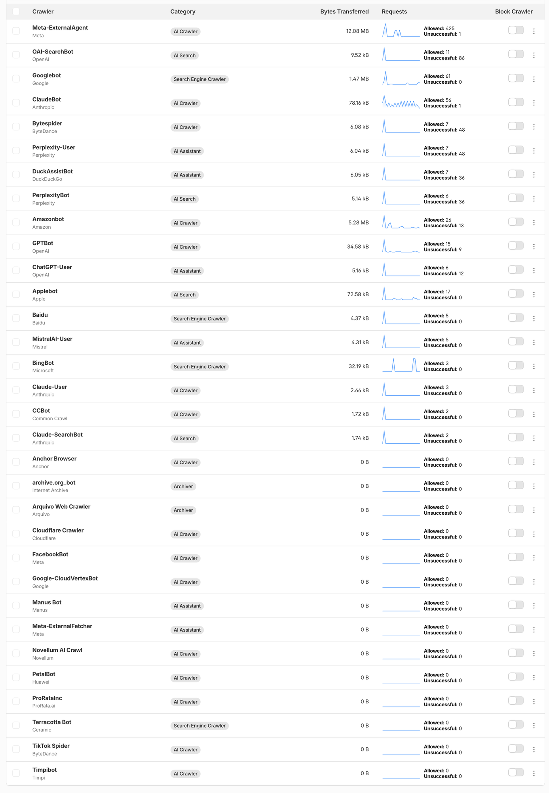

## 概要

robots.txt は意思表示までです。守る意思があるボットにしか通じません。実際に止めるには、リクエストがオリジンに届く前に断ち切る必要があります。

Cloudflare はその二つをダッシュボードのトグルにして用意しています。robots.txt を代わりに書いてくれる機能と、エッジで実際にブロックする機能、そして誰がどれだけ取っていったかを見せてくれる機能です。

この記事ではその機能群を整理します。robots.txt 自体の文法と、AI によって増えた項目については別の記事にまとめています。

### 先に読むとよい記事

robots.txt で AI エージェントにどんな指針を出せるのかは、下の記事にあります。用途ごとに分かれたボット名と、Google-Extended のような用途スイッチ、そして Content-Signal の文法を扱っています。

- [robots.txt で AI クローラーを制御する - 検索・学習・エージェントを分けて許可する方法](../131-robots-txt-ai-crawler-content-signals/) — robots.txt の文法と AI によって増えた項目

## Cloudflare がやっていること

Cloudflare がやっていることを一行で要約するとこうなります。**robots.txt はお願いであり、エッジ設定は執行です。**ダッシュボードのトグル数個にまとめられています。

### Managed robots.txt

Cloudflare が `/robots.txt` に Content Signals ブロックを<strong>代わりに付けてくれます</strong>（[ドキュメント](https://developers.cloudflare.com/bots/additional-configurations/managed-robots-txt/)）。

デフォルトは `search=yes, ai-input=yes, ai-train=no`

（検索は開け、学習は閉じる側です。）

オリジンにすでに robots.txt がある場合は消さずにそこへマージされます。自分で管理したい場合はこれをオフにして、自分のファイルに `Content-Signal` の行を書けば済みます。

### Block AI bots

トグル一つで、知られている AI ボットを<strong>エッジで実際にブロック</strong>します（[ドキュメント](https://developers.cloudflare.com/bots/additional-configurations/block-ai-bots/)）。全プランで無料です。

前のものとは性格がまったく違う、という点が重要です。robots.txt は守る意思があるボットにしか通じませんが、こちらは<strong>robots.txt を無視するボットにも通じます</strong>。リクエスト自体がオリジンに届きません。

### AI Crawl Control

どの AI ボットが、いつ、何を、どれだけ取っていったかを見せてくれます。ボット単位で許可・ブロックを決めることもできます。

リストを一度開いてみると規模の感覚がつかめます。このブログを基準にしても<strong>三十個ほどが引っかかります</strong>。そして Cloudflare はそれをただ並べるのではなく、<strong>性格ごとに分類しています</strong>。

- **Search Engine Crawler** — Googlebot、BingBot、Baidu。伝統的な検索クローラー
- **AI Search** — OAI-SearchBot、PerplexityBot、Claude-SearchBot、Applebot。AI 検索インデックス用
- **AI Assistant** — ChatGPT-User、Perplexity-User、MistralAI-User、DuckAssistBot。ユーザーが尋ねたその瞬間に入ってくる側
- **AI Crawler** — GPTBot、ClaudeBot、CCBot、Meta-ExternalAgent、Bytespider。大量収集
- **Archiver** — `archive.org_bot` のような保存用

先に述べた<strong>用途の軸がそのまま UI になったもの</strong>です。robots.txt に `Content-Signal` で書く search・ai-input・ai-train が、ここではカテゴリとして現れます。

実際の数字を見ると予想と違うものもあります。このブログで最も多く取っていったのは検索エンジンではなく `Meta-ExternalAgent` でした。425 リクエストで 12 MB を取っていきました。同じ期間に `Googlebot` は 61 リクエストです。漠然と「検索ボットが大半だろう」と思っていたなら、一度確認してみる価値のある値です。

ですから順序としてはこれが先です。<strong>ログを先に見てからポリシーを決めるほう</strong>がよいです。漠然と全部ふさいでしまうと、検索の流入経路まで一緒に閉じてしまうことがあります。

### Pay per crawl

[Content Independence Day](https://blog.cloudflare.com/content-independence-day-no-ai-crawl-without-compensation/) で出された実験です。クローラーのリクエストに `402 Payment Required` で答え、<strong>リクエストごとに価格をつけます</strong>。許可かブロックかという二分法に「お金を払えば許可」という選択肢をもう一つ乗せる試みです。まだベータです。

同じ発表で Cloudflare は<strong>新規ドメインの AI クローラーブロックをデフォルト</strong>に切り替えました。加入時に開けるかどうかを尋ねます。何もしなければ閉じた状態です。デフォルトが「開」から「閉」へ反転したこと自体が、この分野の空気を示しています。

## まとめ

- robots.txt は意思表示であり、エッジ設定は執行です。性格が違うので一緒に使う必要があります。
- Managed robots.txt で意思を示し、Block AI bots で執行し、AI Crawl Control で確認する組み合わせが基本形です。
- 順序は観測が先です。ログを見てからポリシーを決めるほうがよいです。漠然と全部ふさぐと検索の流入経路まで閉じてしまいます。
- Pay per crawl は許可かブロックかという二分法に選択肢をもう一つ乗せる試みです。まだベータです。

### 参考

- [Cloudflare — Managed robots.txt](https://developers.cloudflare.com/bots/additional-configurations/managed-robots-txt/)
- [Cloudflare — Block AI bots](https://developers.cloudflare.com/bots/additional-configurations/block-ai-bots/)
- [Cloudflare ブログ — Content Independence Day](https://blog.cloudflare.com/content-independence-day-no-ai-crawl-without-compensation/)
- [robots.txt で AI クローラーを制御する - 検索・学習・エージェントを分けて許可する方法](../131-robots-txt-ai-crawler-content-signals/) — robots.txt の文法と AI によって増えた項目
